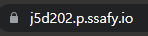

# nginx, SSL(letsencrypt)의 설치 및 설정

## nginx 설치 및 설정

### nginx 설치

`sudo apt-get install nginx`

### nginx 서버 블록 설정

nginx 설정 파일 수정

`sudo vi /etc/nginx/nginx.conf`

`http {}` 블록 안에 아래의 구문 추가

```nginx
include /etc/nginx/sites-enabled/*.conf; // sites-enabled 디렉토리에서 서버 블록을 찾도록 지시
server_names_hash_bucket_size 64; // 도메인이름 분석하는데 할당되는 메모리 양
```

### 서버 블록 파일 만들기

`sudo vi /etc/nginx/sites-available/j5d202.p.ssafy.io.conf`

```nginx
server {
    server_name j5d202.p.ssafy.io www.j5d202.p.ssafy.io;

    root /home/ubuntu/dist;
    index index.html;
    location / {
        try_files $uri $uri/ /index.html;
    }

    location /account {
        proxy_pass https://localhost:8080;
        proxy_redirect off;
        charset utf-8;

        proxy_set_header   X-Real-IP $remote_addr;
        proxy_set_header   X-Forwarded-For $proxy_add_x_forwarded_for;
        proxy_set_header   X-Forwarded_proto $scheme;
        proxy_set_header   X-NginX-Proxy true;
    }
    location /accounts {
        proxy_pass https://localhost:8080;
        proxy_redirect off;
        charset utf-8;

        proxy_set_header   X-Real-IP $remote_addr;
        proxy_set_header   X-Forwarded-For $proxy_add_x_forwarded_for;
        proxy_set_header   X-Forwarded_proto $scheme;
        proxy_set_header   X-NginX-Proxy true;
    }
}
server {
    listen 80;
    listen [::]:80;

    server_name j5d202.p.ssafy.io www.j5d202.p.ssafy.io;
    return 301 https://$server_name$request_uri;

    index index.html index.htm;
}

```

### 서버 블록 파일 활성화

이제 서버 블록 파일을 만들었으니 nginx가 방문자에게 파일을 제공할 수 있도록 활성화합니다.

이를 위해 `sites-enabled` 디렉토리에 각 서버 블록에 대한 심볼릭 링크를 생성합니다.

`sudo ln -s /etc/nginx/sites-available/j5d202.p.ssafy.io.conf /etc/nginx/sites-enabled/j5d202.p.ssafy.io.conf `

### nginx 관련 명령어

```shell
$ sudo apt install nginx
$ sudo systemctl start nginx
$ sudo systemctl stop nginx # nginx 서비스 중단
$ sudo systemctl reload nginx # nginx 설정 리로드
$ sudo nginx -t # nginx 설정 체크 (test)
```

## SSL 설치 및 설정

letsencrypt 설치

`sudo apt-get install letsencrypt`

nginx 중지 (도커로 띄워놓지 않은 상태입니다)

`sudo systemctl stop nginx`

인증서 발급

`sudo letsencrypt certonly --standalone -d j5d202.p.ssafy.io`

- 정상적으로 발급되었을 경우 /etc/letsencrypt/live/{도메인 네임}에 키 값을 얻을 수 있습니다.

SSL 옮기기

```shell
$ sudo cp /etc/letsencrypt/live/j5d202.p.ssafy.io/fullchain.pem <볼륨 매핑(컨테이너)에 사용될 폴더>
$ sudo cp /etc/letsencrypt/live/j5d202.p.ssafy.io/privkey.pem <볼륨 매핑에 사용될 폴더>
```

nginx conf 수정

```nginx
server {
        listen 443 ssl;
        listen [::]:443 ssl;

        server_name j5d202.p.ssafy.io www.j5d202.p.ssafy.io;

        ssl_certificate <컨테이너에서 사용할 폴더 path>/fullchain.pem
        ssl_certificate_key <컨테이너에서 사용할 폴더 path>/privkey.pem

        root /home/ubuntu/dist;
        index index.html;

        location / {
                try_files $uri $uri/ /index.html;
        }

        location /account {
                proxy_pass https://localhost:8080;
                proxy_redirect off;
                charset utf-8;

                proxy_set_header   X-Real-IP $remote_addr;
                proxy_set_header   X-Forwarded-For $proxy_add_x_forwarded_for;
                proxy_set_header   X-Forwarded_proto $scheme;
                proxy_set_header   X-NginX-Proxy true;
        }
        location /accounts {
                proxy_pass https://localhost:8080;
                proxy_redirect off;
                charset utf-8;

                proxy_set_header   X-Real-IP $remote_addr;
                proxy_set_header   X-Forwarded-For $proxy_add_x_forwarded_for;
                proxy_set_header   X-Forwarded_proto $scheme;
                proxy_set_header   X-NginX-Proxy true;
        }
}
server {
        listen 80;
        listen [::]:80;

        server_name j5d202.p.ssafy.io www.j5d202.p.ssafy.io;
        return 301 https://$server_name$request_uri;

        index index.html index.htm;
}
```

nginx 시작

`sudo systemctl start nginx`

### HTTPS 연결 성공



## References

- [how-to-set-up-nginx-server-blocks](https://www.digitalocean.com/community/tutorials/how-to-set-up-nginx-server-blocks-on-centos-7#step-three-%E2%80%94-create-new-server-block-files)
