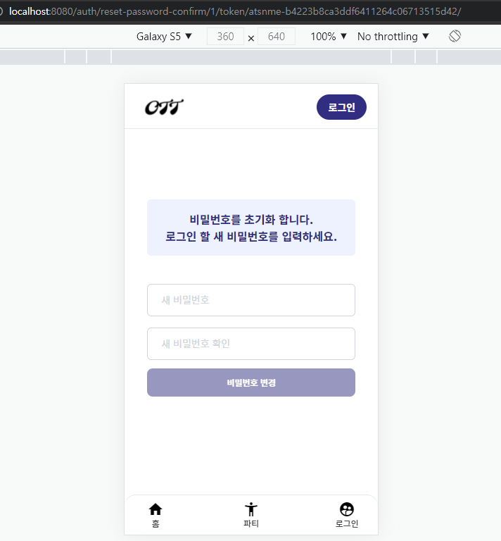

## Vue + Django dj-rest-auth (PasswordResetView, PasswordResetConfirmView)를 사용한 비밀번호 초기화 기능 구현과 문제 해결

## 구현한 기능

- 비밀번호를 잊어버린 사용자가 비밀번호 초기화 메일 발송


- 받은 메일을 통해 새 비밀번호 설정 페이지(Vue.JS)로 접속
  - Django에서 redirect 해주면 uid, token data를 받아서 Vue 동적 라우팅




- 새로운 비밀번호로 변경
  

## 문제해결

### 1. 비밀번호 초기화 메일 발송 실패

`urls.py` 파일에 비밀번호 초기화를 위한 path를 추가합니다.

```python
path('password/reset/', PasswordResetView.as_view(), name='password_reset'),
```

그리고 메일을 발송해 보려고 하니 에러가 발생하네요.

`django.urls.exceptions.NoReverseMatch: Reverse for 'password_reset_confirm' not found. 'password_reset_confirm' is not a valid view function or pattern name.`

에러 메시지를 보니 password_reset_confirm이 필요한 것 같습니다.

새 패스워드를 입력하는 페이지로 `redirect`하기 위한 path와,

```python
path('password/reset/confirm/uid=<int:uid>&token=<str:token>/', passwordResetRedirect, name='password_reset_redirect'),
```

새 패스워드를 입력받아 DB에 반영하는 기능을 위한 path를 추가합니다.

```python
path('password/reset/confirm/', PasswordResetConfirmView.as_view(), name='password_reset_confirm'),
```

### 2. NoReverseMatch: 500 Error


이번에는 500 에러가 납니다. 백엔드 코드가 잘못되었네요.

`django.urls.exceptions.NoReverseMatch: Reverse for 'password_reset_confirm' with arguments '('1', 'atspiv-ef80120e759475ff5b718620f8c7c439')' not found. 1 pattern(s) tried: ['account/password/reset/confirm/$']`

password_reset_confirm에 잘못된 부분이 있는 것 같습니다. 여기서 좀 헤맸습니다. 그러다가 `1 pattern(s) tried: ['account/password/reset/confirm/$']`를 보고 생각했습니다. 

> 리다이렉트를 위해 추가해 둔 path의 name이 잘못 된 것일까? 그럼 name을 바꿔 보자.

### 3. name 변경

name을 password_reset_confirm으로 바꾸어 줍니다.

```python
# urls.py 변경
path('password/reset/', PasswordResetView.as_view(), name='password_reset'),
path('password/reset/confirm/uid=<int:uid>&token=<str:token>/', passwordResetRedirect, name='password_reset_confirm'),
path('password/reset/confirm/', PasswordResetConfirmView.as_view(), name='password_reset_confirm'),
```

name이 겹치지만, 한번 이메일 전송을 눌러 보겠습니다.


성공입니다. 비밀번호를 바꾸어 보겠습니다.


잘 변경이 됩니다. 로그인해서 제대로 변경이 되었는지 확인해 보겠습니다.


### 4.최종: 중복된 name을 적절하게 변경

name이 중복된 것이 마음에 들지 않습니다. rest framework에 해당하는 path는 name을 바꾸어 주겠습니다.

```python
# urls.py
path('password/reset/', PasswordResetView.as_view(), name='rest_password_reset'),
path('password/reset/confirm/uid=<int:uid>&token=<str:token>/', passwordResetRedirect, name='password_reset_confirm'),
path('password/reset/confirm/', PasswordResetConfirmView.as_view(), name='rest_password_reset_confirm'),
```


## 결론

직접 구현해서 auth 로직을 구현해 왔던 입장에서 처음 경험해 본 Django의 RestFramework는 역시 강력합니다.

하지만 정해진 사용방법을 따르지 않으면 에러를 뱉어낸다는 점에서 역시 프레임워크의 사용에는 신중해야겠다는 생각이 듭니다. 직접 구현하지 않았기에 에러가 왜 발생하는지 직관적으로 파악할 수 없고, 이번 문제의 경우 Docs가 아래와 같이 간단한 파라미터만 나와 있어서 해결하기가 더욱 어려웠습니다.


프레임워크를 사용하면서 문제가 생기면 결국 꼼꼼한 디버깅이 답이네요. :sweat:

## Reference

- https://dj-rest-auth.readthedocs.io/en/latest/index.html
