# [Vue + Django] DRF로 소셜 로그인 구현 중 삽질의 기록😵

OAuth2 로그인은 여러 가지 방식으로 가능합니다.

이번에는 백 개발자 분들이 `dj-rest-auth` 라이브러리를 사용했기에, DRF로 소셜 로그인을 구현해 보면서 기록한 내용을 정리해 보겠습니다.

[DRF 로 소셜 로그인 구현하기](https://medium.com/chanjongs-programming-diary/django-rest-framework%EB%A1%9C-%EC%86%8C%EC%85%9C-%EB%A1%9C%EA%B7%B8%EC%9D%B8-api-%EA%B5%AC%ED%98%84%ED%95%B4%EB%B3%B4%EA%B8%B0-google-kakao-github-2ccc4d49a781)를 참고했습니다. 따라하면서 직접 적용해보니 안 되는 부분이 있어서 해결하기 위해 삽질을 꽤 했습니다. 혹시 같은 링크로 에러가 나신 분은 이 글을 한번 읽어 보셔도 좋을 것 같습니다.

우선 아래의 사진을 보고 시작하는 것이 도움이 됩니다.

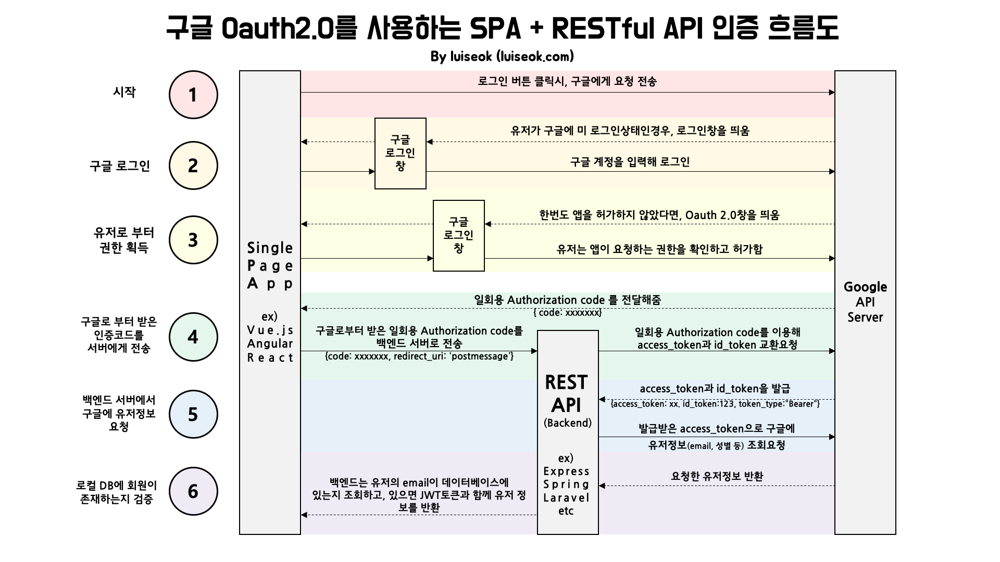

# Google

## Client id, Secret key 등록

각 플랫폼별로 발급받은 키와 id를 등록해 줘야 합니다.

먼저 sites 메뉴에서 도메인 이름을 localhost로 바꿔줍니다.

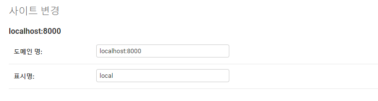

admin 페이지에서 로그인을 위한 소셜 어플리케이션 값을 넣었습니다.

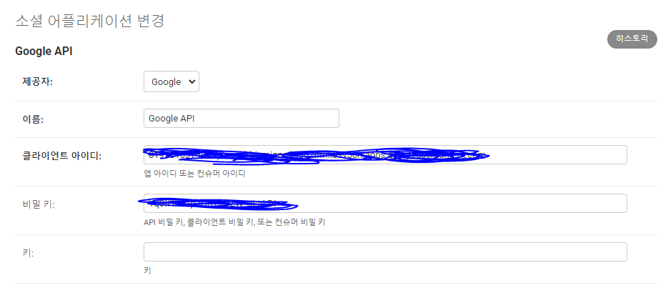

## Code값을 받기 위한 Google OAuth 연동

인증 파라미터들을 세팅한 후 구글 서버로 리다이렉트해야 합니다.

먼저 구글 아이콘을 클릭했을 때, 구글 인증 서버로 리다이렉트하기 위한 함수를 생성합니다.

```python
# views.py
def google_login(request):
    scope = 'https://googleapis.com/auth/userinfo.email'
    client_id = getattr(settings, 'SOCIAL_AUTH_GOOGLE_CLIENT_ID')
    return redirect(f'https://accounts.google.com/o/oauth2/v2/auth?scope={scope}&client_id={client_id}&response_type=code&redirect_uri={GOOGLE_CALLBACK_URI}&state={state}')
```

구글 로그인 창이 뜨고, 로그인을 진행하면 Callback URI로 Code 값이 들어가게 됩니다.

Vue에서는 get 방식의 axios로 연결해 보았습니다.

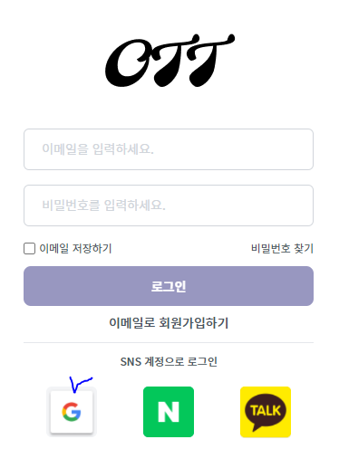

그럼 구글 로그인을 클릭해 보겠습니다. 과연?

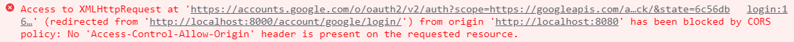

앗, 직접 리다이렉트된 장고 뿐만 아니라, 진짜 origin 요청이 실행된 8080 포트때문에 CORS에 걸렸네요.

다른 사이트의 경우를 생각해 보면, 그냥 창을 이동하는 방식이 맞는 것 같습니다. `location.href`를 사용해 보겠습니다.

```javascript
const link = `http://localhost:8000/account/${platform}/login`
location.href = link
```

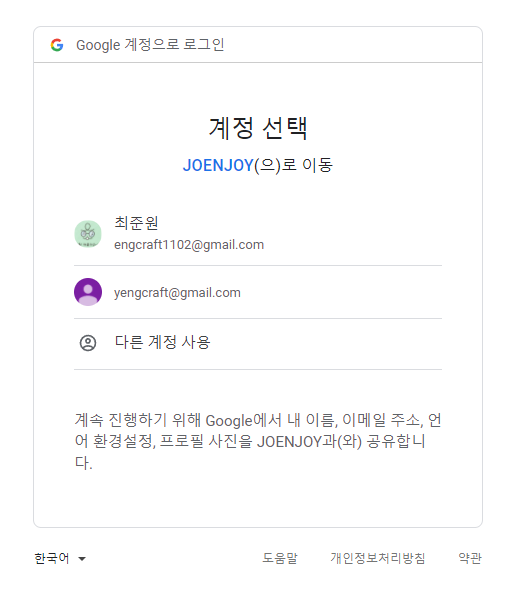

굳.

그럼 이제 계정을 선택하고 코드를 받아서 구글에 Access Token을 요청하러 가봅시다.

## Code로 Google에 Access Token 요청

구글 로그인을 올바르게 실행했다면, callback URI로 GET 방식의 request 값이 들어갑니다. 값을 찍어보니 아래와 같습니다...

`<WSGIRequest: GET '/account/google/callback/?state=d98c3a4582e30badb36fb2a7eb11c576d4923be893b3b2a3095604259bbc750d&code=4%2F0AX4XfWgRnaC6gFt3X88kTsi2gj_PSSsoW65IqvsCMpw7sWSCDJvh_dwMqplB4mYSTU-Dgg&scope=email+https%3A%2F%2Fwww.googleapis.com%2Fauth%2Fuserinfo.email+openid&authuser=0&prompt=consent'>`

잘 찍히고 있습니다. 저는 이 중에서 `code`를 사용할 것입니다.

```python
"""
Request Access Token
"""
token_res = requests.post(f'https://oauth2.googleapis.com/token?client_id={client_id}&client_secret={client_secret}&code={code}&grant_type=authorization_code&redirect_uri={GOOGLE_CALLBACK_URI}&state={state}')
token_json = token_res.json()
error = token_json.get('error')
if error:
    raise JSONDecodeError(error)
access_token = token_json.get('access_token')
```


## Access Token으로 Email 값을 Google에게 요청

```python
"""
Email Request
"""
email_res = requests.get(f"https://www.googleapis.com/oauth2/v1/tokeninfo?access_token={access_token}")
if email_res.status_code != 200:
return JsonResponse({'Google Callback Error': 'Invalid email'}, status=status.HTTP_400_BAD_REQUEST)
    email_res_json = email_res.json()
    email = email_res_json.get('email')
```

## Email로 회원가입, 로그인 (am 00:00 ~ 4:00 삽질) 🤬

```python
"""
    Signup or Signin Request
    """
    try:
        user = User.objects.get(email=email)
        # 기존에 가입된 유저의 provider가 google이 맞다면 로그인, 아니면 에러
        social_user = SocialAccount.objects.get(user=user)
        # SNS 로그인 유저가 아닌 경우
        if social_user is None:
            return JsonResponse({'Google_Callback_Error': 'email exists but not social user'}, status=status.HTTP_400_BAD_REQUEST)
        # 다른 SNS로 가입된 유저
        if social_user.provider != 'google':
            return JsonResponse({'Google_Callback_Error': 'no matching social type'}, status=status.HTTP_400_BAD_REQUEST)
        # Google로 가입된 유저
        data = {'access_token': access_token, 'code': code}
        accept = requests.post(
            f"{BASE_URL}/account/google/login/finish/", data=data)
        accept_status = accept.status_code
        if accept_status != 200:
            return JsonResponse({'Google_Callback_Error': 'failed to signin'}, status=accept_status)
        accept_json = accept.json()
        return JsonResponse(accept_json)
    except User.DoesNotExist:
        # 기존에 가입되지 않았던 유저라면 새로 가입
        data = {'access_token': access_token, 'code': code}
        accept = requests.post(
            f"{BASE_URL}/account/google/login/finish/", data=data)
        accept_status = accept.status_code
        if accept_status != 200:
            return JsonResponse({'Google_Callback_Error': 'failed to signup'}, status=accept_status)
        accept_json = accept.json()
        return JsonResponse(accept_json)
```

순조롭던 작업 진행 중, 문제가 생겼습니다.

`social_user = SocialAccount.objects.get(user=user)` , 즉 `# SNS 로그인 유저가 아닌 경우` 의 예외처리가 제대로 되지 않는 것입니다. 이는 아래와 같은 에러로 이어집니다.

`allauth.socialaccount.models.SocialAccount.DoesNotExist: SocialAccount matching query does not exist.`

이 문제는 아래의 어려웠던 문제를 해결하자 자연스럽게 없어졌습니다.

어려웠던 문제는 아래와 같습니다. 로그인을 하려고 하는데 에러가 뜨는 것입니다...

`"POST /account/google/login/finish/ HTTP/1.1" 400 73Bad Request: /account/google/callback/`

`django.allauth`의 깃허브 코드를 직접 봐도 FK로 user 객체를 쓰는 것이 맞는데 뭐가 문제일까요? 아마 넘기는 데이터, 혹은 링크를 잘못 설정해 뒀을 것이라고 예상됩니다.

그래서 응답받은 json 데이터를 보니 `{'detail': 'JSON parse error - Expecting value: line 1 column 1 (char 0)'}` 라고 합니다. request로 제대로 된 JSON데이터가 넘어가지 않고 있는 것 같습니다.

흠... DRF의 GoogleLoginView를 볼까요.

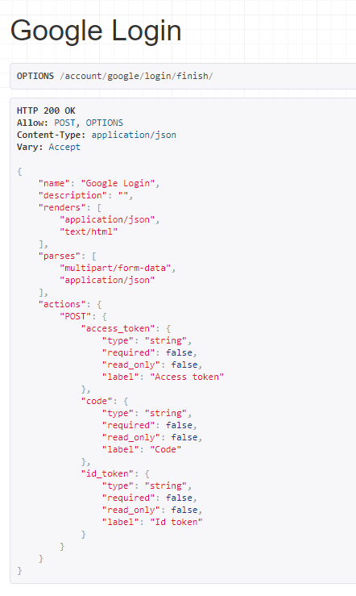

??? 필요한 파라미터가 하나 더 있었습니다. `id_token`이네요. 이 데이터는 어디 있었는고 하니, code로 요청한 맨 처음의 `token_res`에 있었네요. 직접 몸으로 구르지 않으면 몰랐을 것입니다.

```json
{'access_token': 'ya29.a0ARrdaM-HhLER-TLA1oCkLMx2a-g-Aky38aEUSgXcvSvUp9UGbzzCTOBtsNEXzKNKSdyVbdDr1VPROyrh7u72h7nvlVHtKW9VhpOVHfdRYksAACPjVPfkRmu_x9KPHk65ZWS1ybxi8XeZWG825a_gbfMVbTCf', 'expires_in': 3599, 'scope': 'https://www.googleapis.com/auth/userinfo.email openid https://www.googleapis.com/auth/userinfo.profile', 'token_type': 'Bearer', 'id_token': 'eyJhbGciOiJSUzI1NiIsImtpZCI6IjhkOTI5YzYzZmYxMDgyYmJiOGM5OWY5OTRmYTNmZjRhZGFkYTJkMTEiLCJ0eXAiOiJKV1QifQ.eyJpc3MiOiJodHRwczovL2FjY291bnRzLmdvb2dsZS5jb20iLCJhenAiOiI4MTk3MDEwMzc5OTgtcTJhc2NvbHJianNtaXFucTV0ajNxN2lmbWswc3Y1b2guYXBwcy5nb29nbGV1c2VyY29udGVudC5jb20iLCJhdWQiOiI4MTk3MDEwMzc5OTgtcTJhc2NvbHJianNtaXFucTV0ajNxN2lmbWswc3Y1b2guYXBwcy5nb29nbGV1c2VyY29udGVudC5jb20iLCJzdWIiOiIxMTI1NzMwNzY0Mzc1MDM4MjYxMjEiLCJlbWFpbCI6InllbmdjcmFmdEBnbWFpbC5jb20iLCJlbWFpbF92ZXJpZmllZCI6dHJ1ZSwiYXRfaGFzaCI6InR3bjZ1MlpPdVFZdjU2U1JnY2I2YVEiLCJuYW1lIjoi6rWs66-4XzLrsJhf7LWc7KSA7JuQIiwicGljdHVyZSI6Imh0dHBzOi8vbGgzLmdvb2dsZXVzZXJjb250ZW50LmNvbS9hL0FBVFhBSnc4VjJJa2xRMzlwVWU3N1NKVkZ6YlhwNFl2bzB6M25pSldJRVpBPXM5Ni1jIiwiZ2l2ZW5fbmFtZSI6Iuq1rOuvuF8y67CYX-y1nOykgOybkCIsImxvY2FsZSI6ImtvIiwiaWF0IjoxNjMzMTk5NjUyLCJleHAiOjE2MzMyMDMyNTJ9.JDG6hDlGwSdZc9MAvTLNlMe2QUYcrnR3Ys8xb6EsJX2VuK2Tw6-LIHmGUs5BLKuUb4jUWAZovDWoVRAk8ddCs3LpBwdUxGwKMgQVCN1hnulMjKtDEl1_Y4uqhmRfWd25Q3wKanB-wf3Wg4uwImmxJ93RGN_kxn7KPW8-0jiSb3saKGdP-rjYS2vUFeJoyUN7DFxqwMlwFWGzHrttYIXS4kA3c0q5IfEk_acA_NMa5_mY2-x8w7fKaD9qBKhNfEtqD6e4sNYcGKNnWMoJtNoeGh8lcN_tXjWCgqMjDw7kgP22zFyf8QqZnEcdWL3nzIqgv1kIilxZ1pJBnuXUDxcN7Q'}
```

그럼 `id_token`까지 포함해서 한번 시도해 보겠습니다.

안됩니다.

아니 대체 왜 안되지? DRF에서 해보겠습니다.

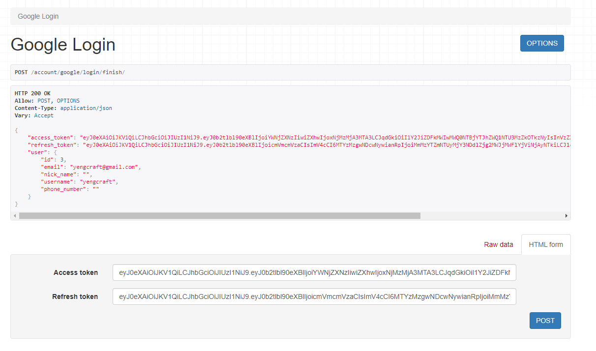

????????? 여기서는 로그인이 됩니다.

그렇다면? 답은 DRF에서 원하는 형태로 데이터를 보내지 않는 것이 실패의 원인일 것으로 예상됩니다!!

### 415 문제의 해결

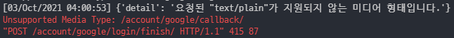

그럼 먼저 이 문제를 해결합니다. 적절한 헤더 `headers={'Content-Type': 'application/json'}`를 추가해 줍니다.

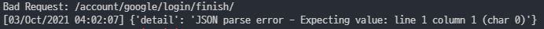

`data=data`로만 해서 위와 같은 문제가 났으니, json 데이터로 변환하여 `data=json.dumps(data)` 넘겨 보겠습니다.

### 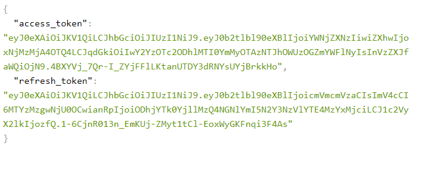

홀리 싯...! 해결했습니다!! 🥳

이제 토큰들이 담긴 JSONResponse를 인자로 해서, Vue의 메인 페이지로 넘겨 주면 되겠습니다.

## OAuth Flow에 따라 전체 코드 변경

여기서 다시 코드를 변경하기로 했습니다. Front에서 Axios 요청을 하면 장고에서 처리한 뒤 response를 보내고, 프론트는 그것을 받기만 해야 되는데, 현재의 코드의 흐름은 아래와 같습니다.

1.  `Vue.js`에서 `django`를 이용해 구글 로그인 창 띄우기
2. 구글 로그인 창에서 로그인하고, 받은 Code를 백에서 그대로 쭉 처리해서 Token까지 받아버림
3. 따라서 Vue.JS의 페이지에서 Axios로 처리할 수가 없음. response를 담아 redirect 해야 하는데, 이 방법이 맞는 건지 모르겠음

그래서 OAuth의 플로우를 검색해 보니 맨 위의 이미지가 나왔습니다.

따라서 맨 위의 이미지와 같이 Vue.JS에서 구글 로그인 창을 띄울 수 있도록 구글 콘솔에 콜백 URI로 Vue의 포트를 추가해 주겠습니다. 즉, 콜백 이전의 작업은 모두 프론트 단으로 빼내겠습니다. 임시 인증 Code를 받는 것 까지 모두 프론트에서 수행하도록 변경하였습니다.

### 프론트에서 로그인하는 부분 처리

임시 코드 `Authorization code`와 함께, `redirect_uri`를 넘겨 줘야 합니다.

로그인을 프론트에서 수행했기 때문에 이제 OAuth 로그인에 사용하는 `callback uri`는 프론트의 포트를 적용해야 합니다.

```typescript
export const oauthLogin = async (
  platform: string,
  code: string
): Promise<AuthResponseData> => {
  const params = new URLSearchParams()
  params.append('code', code)
  const res = await http.post(`account/${platform}/callback/`, params)
  return keysToCamel(res.data)
}
```


# Kakao

기본적인 흐름은 동일합니다.

하지만 카카오 Developer 사이트의 `카카오 로그인 > 동의항목 > 개인정보` 란에서 필요한 개인정보를 사용하기로 체크해 줘야 합니다.

아무런 개인정보 설정 없이 카카오 로그인을 실행했을 때의 화면입니다.

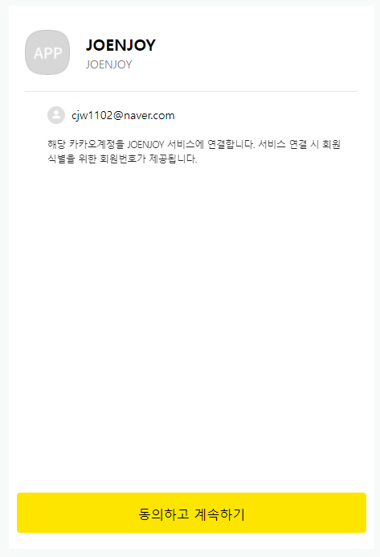

GET 방식으로 사용자 정보를 요청해서 받을 수 있는 것은 id와 연결 시간 뿐입니다.

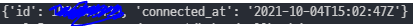

하지만 제 프로젝트에 필요한 것은 조금 더 상세한 정보입니다.


프로필에서 필요한 정보는 `kakao_account`인데, 어떻게 받아야 할지 찾아보겠습니다.

개인정보에 닉네임과 프로필 사진을 동의하도록 해 봤습니다.

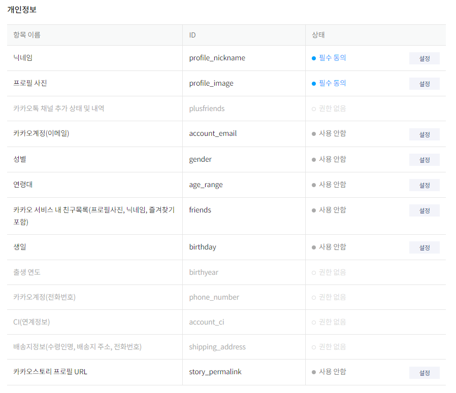

로그인 버튼을 눌러보겠습니다.

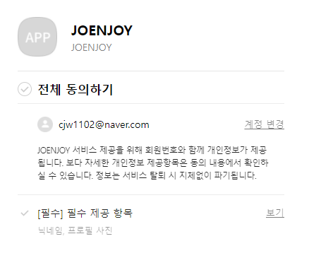

동의할 항목이 생겼네요.

그럼 로그인 요청을 보내고, 프로필 정보를 받아 보겠습니다.

```json
{
    'id': 1111111111,
    'connected_at': '2021-10-04T15:02:47Z',
    'properties': {
        'nickname': '준원',
        'profile_image': '~~.jpg',
        'thumbnail_image': '~~.jpg'},
    'kakao_account': {
        'profile_nickname_needs_agreement': False,
        'profile_image_needs_agreement': False,
        'profile': {
            'nickname': '준원',
            'thumbnail_image_url': '~~.jpg',
            'profile_image_url': '~~.jpg',
            'is_default_image': False}
    }
}
```

아하! `kakao_account`에는 제공에 동의한 정보가 담기는 것이네요!

제 어플리케이션에 로그인하기 위해 필요한 정보는 추가로 email이 있으니, email을 추가로 요청하겠습니다.

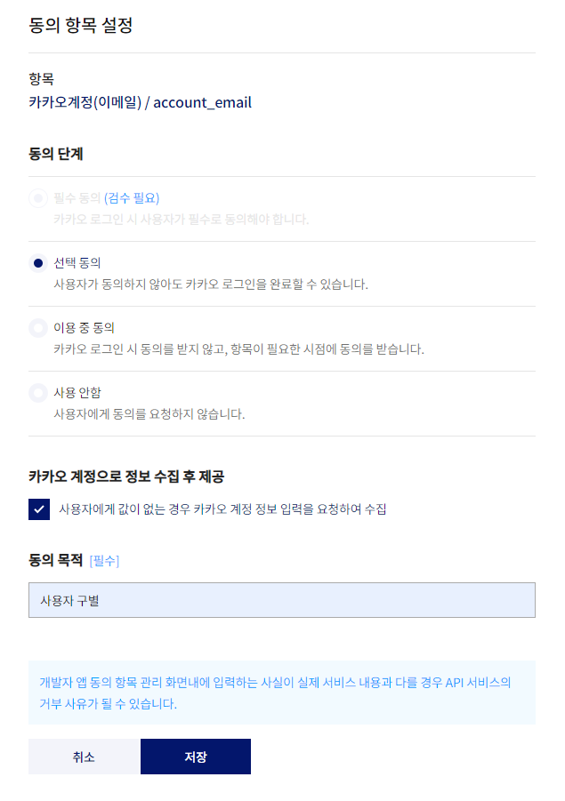

아쉽게도 이메일의 경우에는 `비즈니스 설정`이 완료된, 실제 서비스일 때에만 필수로 지정할 수 있습니다. 따라서 카카오 계정으로 정보 수집 후 제공까지 체크를 해줍니다. 이 때의 profile 값은 아래와 같습니다.

```json
{
    'id': 1111111111,
    'connected_at': '2021-10-04T15:02:47Z',
    'properties': {
        'nickname': '준원',
        'profile_image': '~~.jpg',
        'thumbnail_image': '~~.jpg'},
    'kakao_account': {
        'profile_nickname_needs_agreement': False,
        'profile_image_needs_agreement': False,
        'profile':
        {
            'nickname': '준원',
            'thumbnail_image_url': '~~.jpg',
            'profile_image_url': '~~.jpg',
            'is_default_image': False,
            'has_email': True,
            'email_needs_agreement': True
        }
    }
}
```

`has_email`, `email_needs_agreement`라는 항목이 새로 생겼지만 실제 email 값은 받아오지 못하고 있습니다.

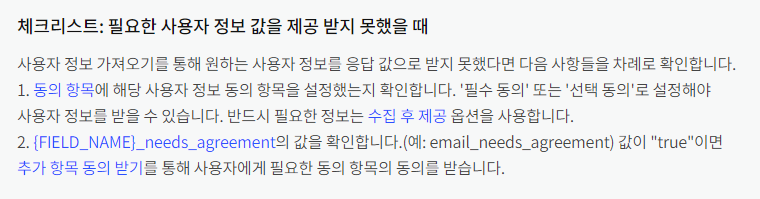

필요한 경우 추가 항목 동의 받기를 통해 가져올 수 있겠습니다.

제 프로젝트는 비즈니스 앱이 아니기 때문에 이메일을 꼭 선택해야지만 제대로 된 회원가입/로그인이 가능합니다. 때문에 초기 가입 시 이메일 정보 제공의 동의를 강제해야 하므로, 비즈니스 신청을 해야 합니다.

## 정리

중구난방으로 해결 방안만 적느라 깔끔하지 못해서 아쉬운 글입니다. django의 라이브러리를 쓰는 상황이고 밀린 작업이 많아 급하게 정리하면서 올리지만, 다음에는 조금 더 깔끔한 로직을 직접 구현해서 사용하고 깔끔하게 정리한 새로운 글을 업로드 해 보겠습니다.

## References

[DRF 로 소셜 로그인 구현하기](https://medium.com/chanjongs-programming-diary/django-rest-framework%EB%A1%9C-%EC%86%8C%EC%85%9C-%EB%A1%9C%EA%B7%B8%EC%9D%B8-api-%EA%B5%AC%ED%98%84%ED%95%B4%EB%B3%B4%EA%B8%B0-google-kakao-github-2ccc4d49a781)

https://developers.google.com/identity/protocols/oauth2/web-server#httprest_1

[How to POST JSON data with Python Requests?](https://stackoverflow.com/questions/9733638/how-to-post-json-data-with-python-requests)

[Add Login Using the Auth Code Flow](https://auth0.com/docs/login/authentication/add-login-auth-code-flow)

https://auth0.com/docs/quickstart/spa/vuejs/01-login

https://developers.kakao.com/

