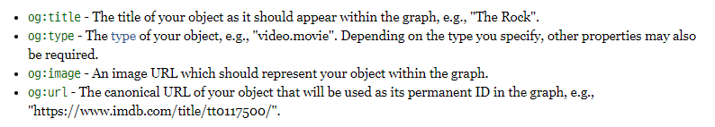

## 용어정리
- 소셜 그래프(Social Graph)
  - 소셜 네트워크를 표현하기 위해 사용되는 구조
  
    

## Open Graph Protocol

```
오픈 그래프 프로토콜은 어떤 웹 페이지도 소셜 그래프에서 풍부한 정보를 가진 객체로 거듭나게 할 수 있습니다. 
예를 들어, 페이스북에서 og는 웹 페이지를 다른 어떠한 객체들과도 같은 기능을 갖도록 하기 위해서 사용됩니다.
```

오픈그래프는 어떤 HTML 문서의 메타정보를 쉽게 표시하기 위해서 메타정보에 해당하는 제목, 설명, 문서의 타입, 대표 URL 등 다양한 요소들에 대해서 사람들이 통일해서 쓸 수 있도록 정의해놓은 프로토콜이며 페이스북에 의해 기존의 다양한 메타데이터 표기 방법을 참조하여 만들어졌다.

현재는 그 창시자인 페이스북은 물론이고 네이버 블로그, 카카오톡 등에서도 널리 사용된다.


## 구성



기본적인 메타 데이터로는 제목, 설명, 대표 이미지, 표준 링크가 있다.

여기서 canonical URL은 같은 콘텐츠를 가리키는 여러 개의 url을 대표하는 하나의 url을 말한다. 이는 현실에 있는 객체들을 가상의 그래프 기반 DB로 표현하려는 Facebook의 거대한 계획에서 중요한 요소이기 때문이다. 하나의 대상은 원칙적으로 단 하나의 링크로만 참조되어야 한다.


## 결론

카카오톡이나 블로그 등지에 글을 쓸 때, 링크를 올릴 경우 이미지가 함께 업로드되는 것을 본 적이 있을 것이다. 이는 HTML head에 위치한 Open Graph 메타 데이터를 크롤러가 긁어 와서 미리보기 화면을 생성해주기 때문에 가능한 일이다.

기존에 오픈그래프를 통한 미리보기를 제공하지 않던 서비스들이 대거 지원하기 시작하면서 og는 점점 중요해지고 있다.

`특히, 설치링크라면 사소한 문구 하나로 설치율의 증감을 초래할 수 있다.`
