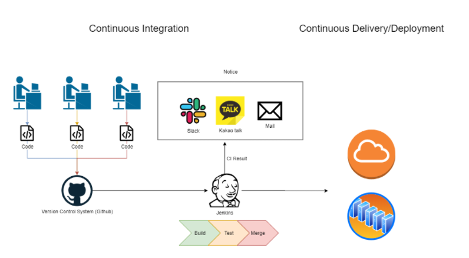

# CICD

## CI (Continuous Integration)

여러 개발자가 작성하거나 수정한 소스를 지속적으로 통합하고 테스트하는 것을 뜻한다.




### CI의 흐름

1. 개발자는 자신이 개발한 소프트웨어의 소스코드를 공통된 버전 관리시스템 (Github 등)에 저장한다.
2. 소스코드상에 변동이 생기면 버전 관리 시스템에서는 CI 툴(Jenkins)로 소스코드 변경을 알린다.
3. CI툴에서는 변경된 소스코드를 대상으로 Build, Test, Merge를 진행한다. 이 과정들이 완료되면 슬랙, 카카오톡, 메일 등을 통해 통합 결과를 알린다.

### CI 툴

Jenkins를 가장 많이 사용한다. CI와 CD를 모두 구현할 수 있으며 사용할 수 있는 여러 플러그인들이 있다. 단지 CI 전용 서버를 따로 구축해야 한다는 부담은 있다.

최근에 나온 Github Action에서는 따로 CI서버를 구축할 필요 없이 CI를 구현하게 해주고 있다. 아래와 같은 파일을 만드는 것으로 CI 전략 설정이 가능하다.

```yaml
# 내 깃허브 vue-devops 실습에 있는 파일
# workflow/deploy.yml
# This is a basic workflow to help you get started with Actions

name: Deployment

# Controls when the workflow will run
on:
  # Triggers the workflow on push or pull request events but only for the master branch
  push:
    branches: [ master ]
  pull_request:
    branches: [ master ]

  # Allows you to run this workflow manually from the Actions tab
  workflow_dispatch:

# A workflow run is made up of one or more jobs that can run sequentially or in parallel
jobs:
  # This workflow contains a single job called "build"
  deploy:
    # The type of runner that the job will run on
    runs-on: ubuntu-latest

    # Steps represent a sequence of tasks that will be executed as part of the job
    steps:
      # Checks-out your repository under $GITHUB_WORKSPACE, so your job can access it
      - name: Checkout source code
        uses: actions/checkout@master

      # Runs a single command using the runners shell
      - name: Set up Node.js
        uses: actions/setup-node@master
        with:
          node-version: 14.x

      - name: Install dependencies
        run: npm install

      - name: Test unit
        run: npm run test:unit

      - name: Build page
        run: npm run build
        env:
          NODE_ENV: production

      - name: Deploy to gh-pages
        uses: peaceiris/actions-gh-pages@v3
        with:
          github_token: ${{ secrets.GITHUB_TOKEN }}
          publish_dir: ./dist
```

### CI의 장점

하나의 SW에 대해 수많은 개발자들이 동시에 개발을 진행하고 이 소스코드를 정기적으로 통합하는 회사라면 소스코드의 병합(merge)는 상당히 까다로울 것이다. CI를 적용한다면 지속적으로 코드를 병합하고 테스트를 진행한다. 테스트 후 코드의 충돌, 테스트의 실패 등이 발생하면 즉각적으로 알림을 전송한다. 이 과정을 통해 아래의 장점을 얻을 수 잇다.

- 개발의 편의성 증가
- 변경된 코드에 대한 즉각적 피드백과 검증 가능
- 소스코드의 통합과 검증에 들어가는 시간 단축

## CD (Continuous Delivery/Deployment)

개발, 통합, 배포, 릴리즈, 테스트를 자동화하여 지속적으로 배포하는 것을 뜻한다.

### CD의 흐름

CI를 통해 검증된 소스코드를 지속적으로 배포하기에, CI가 우선적으로 진행되어야 한다.

1. CI를 통해 소스코드 검증
2. 검증된 소프트웨어를 실제 프로덕션 환경으로 배포

### CD의 장점

- CD의 장점은 실제 배포할 앱의 서버가 여러 대일 때, 배포할 작업물이 여러 개일 때 나타난다. 수작업으로 여러 작업물을 여러 서버에 배포할 때 발생하기 쉬운 실수를 방지할 수 있다.
- `원클릭으로 빌드, 테스트, 배포 자동화(ㅋㅋ)`를 진행할 수 있다. 즉 소스코드 변경부터 배포까지의 작업을 자동화할 수 있기 때문에 수작업으로 할 때의 불편함을 줄일 수 있다.
- 개발자는 개발만 하면 된다.

## NETFLIX_TINDER로 해보기

