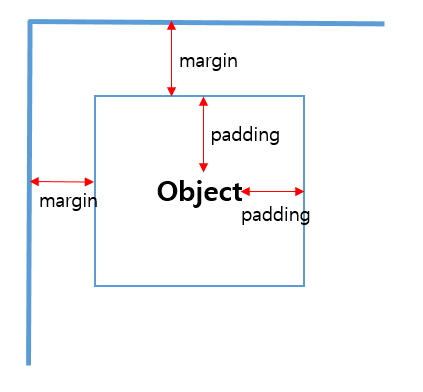
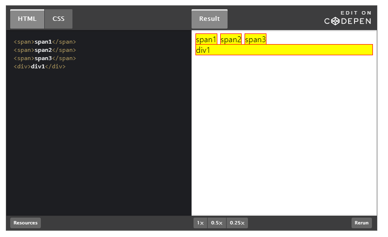
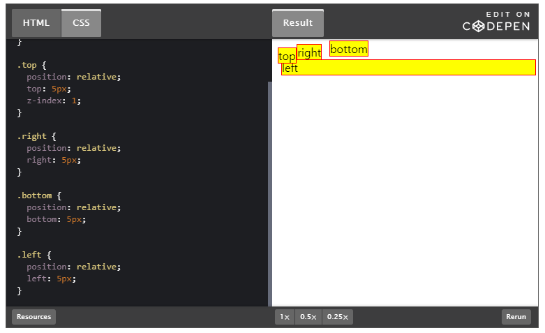
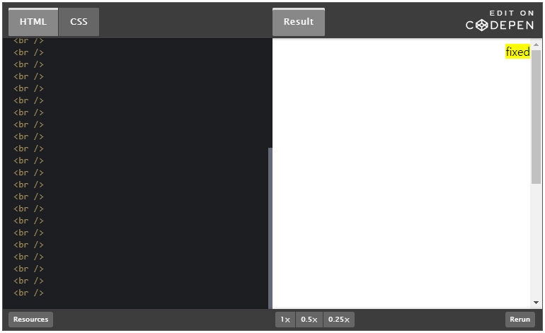
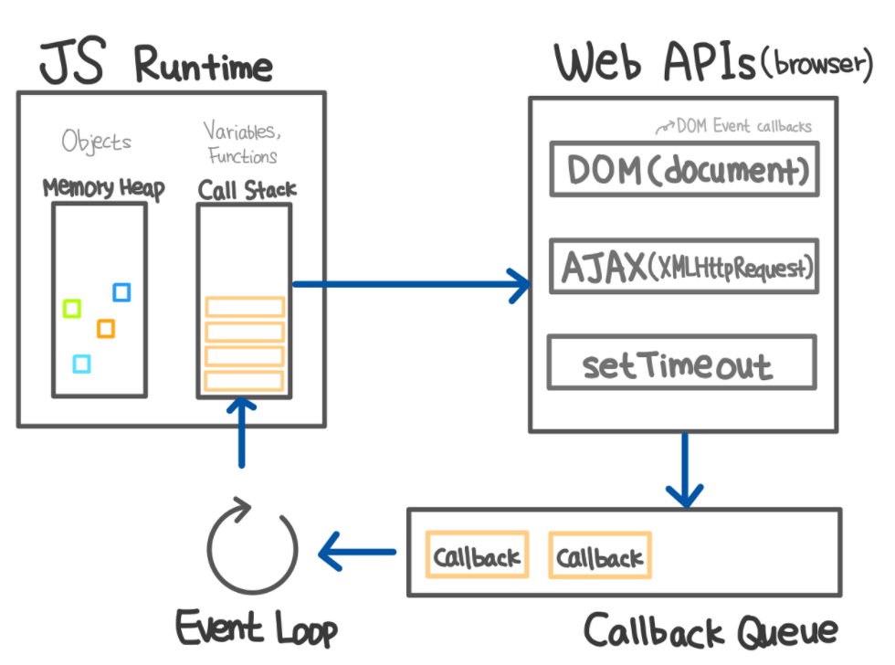

# 프론트엔드 기술면접 질문

[toc]

# :star::star::star::star::star:

## 브라우저 렌더링 원리

- 브라우저 주소창에 www.google.com 입력 
- 브라우저(클라이언트)가 서버에게 요청하고  
- DNS가 연결해줄 곳을 찾음
  - 맨처음엔 Local DNS에게 구글이라는 호스트에 대한 IP 주소를 질의하여 Local DNS에 없으면 Root DNS 정보를 받는다.
  - Root DNS : 인터넷의 도메인 네임 시스템의 루트 존. 루트 존의 레코드의 요청에 직접 응답하고 적절한 최상위 도메인에 대해 권한 있는 네임 서버 목록을 반환한다.
  - Root DNS 서버로부터 .com 도메인을 관리하는 TLD 이름 서버 정보를 전달받음
  - TLD에 구글 호스트 질의, DNS 정보 전달
  - google.com을 관리하는 서버에 구글 호스트네임에 대한 IP 주소 질의
  - Local DNS 서버에 IP 주소 응답
  - Local DNS는 www.google.com에 대한 IP 주소를 캐싱하고 IP 주소 전달
- 주소 앞에 https가 붙어있으면 https 프로토콜로 통신하고 아님 말고 
- 서버의 대부분이 index.html로 되어 있어 서버에서 이 파일을 클라이언트로 보냄 
- 브라우저는 텍스트로 이뤄진 index.html 파싱 시작 
- 한줄한줄 읽으면서 DOM 트리 만들기 
- link에서 css 요청 발생하면 요청과 응답과정을 거치고 CSS 파싱하여 CSSOM트리 구성
- CSS 파싱 끝나면 중단된 DOM 이어하기
- 완성된 DOM과 CSSOM 합쳐 Render Tree 만들기
- 중간에 script 태그 만나면 js코드를 파싱하고 실행하기 위해 파싱 중단
  - 제어권한을 자바스크립트 엔진에 넘기고 js 코드 또는 파일을 로드해서 파싱하고 실행

## 호이스팅에 대해서 설명해 보세요.

모든 선언을 가장 위로 끌어올린다.

변수의 범위가 전역 범위인지 함수 범위인지에 따라 다르게 동작될 수 있다

- 전역 범위 (Global Scope)
  - 전역 범위에서는 스크립트 최상단으로 끌어올려진다.
- 함수 범위 (Function Scope)
  - 함수 범위에서는 해당 함수 최상단으로 끌어 올려진다.

최상단으로 끌어 올려지는건 변수의 `선언`과 `할당 내용`중 `선언`뿐이다!

### 변수 호이스팅

```js
console.log(hoisting); //undefined
var hoisting = "success";
console.log(hoisting); // 'success'
```

### 함수 호이스팅

```js
a();

//함수 표현식
var a = function() {
  console.log("a is not a function"); // VM49:1 Uncaught TypeError: a is not a function
};
```

```js
console.log(sum(2,3));
console.log(name);
console.log(age);

function sum(x,y) {
  return x + y;
}

const name = 'hoo00nn';

var age = 25;
```

함수 선언문의 경우 사용이 가능하다.

### 결론

undefiled나 reference error와 같이 호이스팅의 사이드 이펙트를 피하기 위해서는 항상 변수를 스코프 최상단에서 선언하고, 선언과 함께 초기화해야 한다.

## 클로저는 무엇인가요? 원리와 왜 사용하는지 설명해 주세요

외부 변수를 기억하고 이 외부 변수에 접근할 수 있는 함수를 의미한다. 

자바스크립트의 함수는 숨김 프로퍼티인 [[Environment]]를 이용해 자신이 어디서 만들어졌는지 기억한다. 함수 본문에선 [[Environment]]를 이용해 외부 변수에 접근한다. 즉, 자바스크립트의 코드는 new Function을 제외하고 클로저이다.

### 사용하는 이유?

- 현재 상태를 기억하고 변경된 최신 상태를 유지하기 위해
- 전역 변수의 사용을 억제하기 위해
- 정보를 은닉하기 위해

## CSS에서 margin과 padding에 대해서 설명해 주세요



여백을 주는 의미에서는 같다.

Margin은 객체와 화면 사이의 여백 (외부 여백)을 말하며 Padding은 Object 내의 내부 여백을 의미한다.

### position을 어떻게 사용하는지 알려주세요.

- static (default)
- 
- relative
- static이었을 때의 위치를 기준으로 자리를 잡는다.
- 
- z-index라는 속성을 통해 누가 더 위로 올라가는지 결정 가능
- absolute
- 
- relative가 static인 상태를 기준으로 주어진 픽셀만큼 움직였다면, absolute는 static 속성을 가지고 있지 않은 부모를 기준으로 움직인다. 부모 중에 없다면 body 태그가 기준이 된다.
- fixed
- 
- 포지션이 fixed로 설정되어 특정 위치에 고정되어 있다.

## GET, POST가 어떻게 다르게 쓰는지 말씀해 주세요

GET은 정보를 요청할 때, 즉 읽을 때 주로 사용되는 메서드이다.

POST는 정보를 생성, 수정할 때, 즉 DB를 조작할 때 사용된다.

## PUT과 POST의 차이는?

POST는 생성, PUT은 수정으로 들어가나? 흠, 뭔가 애매하다.

- POST
  - 리소스의 생성을 담당한다. 요청 시마다, 새로운 리소스가 생성된다.
  - POST 메서드로 a 생성 요청을 두 번 보내면 id가 1과 2인 a가 생긴다.
- PUT
  - 리소스의 생성과 수정을 담당한다.
  - 요청 시 마다 같은 리소스를 반환한다.
- PUT은 멱등하고, POST는 멱등하지 않다.

## PATCH는?

PATCH는 수정만 담당하며 리소스의 일부분만 수정할 때 사용하고, PUT은 리소스의 모든 속성을 수정하기 위해 사용한다.

## 자바스크립트의 배열이 실제 자료구조 배열이 아닌데 그 이유는?

자바스크립트의 배열은 실제 자료구조의 배열과 다르게 HashMap으로 구현되어 있다. 링크드리스트로 구현되어 있기 때문에 값을 찾기 위해서는 탐색해나가면서 값을 찾는 불상사가 발생한다. 이를 해결하기 위해서 타이핑된배열(int8Array, Float32Array )등이  추가되고 있다.

## 이벤트 루프에 대해서 설명, 동시성 모델에 대해 설명

자바스크립트는 싱글 스레드 기반 언어이다. 함수를 실행하면 함수 호출이 스택에 순차적으로 쌓이고 스택의 맨 위에서부터 한번에 하나의 함수만 처리 가능하다.

하지만 자바스크립트는 이벤트 루프라는 것을 통해 동시성을 지원한다.

이벤트 루프는 콜 스택에서 실행 중인게 있는지 확인하고, event queue에 작업이 있는지 확인해서 콜스택이 비어있다면 이벤트 큐 내의 작업이 콜스택으로 이동되어서 실행된다.

## 프로토타입이란?

자바스크립트는 프로토타입을 기반으로 상속을 구현하여 불필요한 중복을 제거한다.

즉, 생성자 함수가 생성할 모든 인스턴스가 공통적으로 사용할 프로퍼티는 메소드를 프로토타입에 미리 구현해 놓음으로써 부모 객체의 메서드를 상속받아 사용할 수 있다. 클래스구만.


# :star::star::star::star:

## this의 용법 아는대로 설명해 주세요

실행 주체를 가리킵니다. 일반적으로 자바스크립트의 함수는 호출될 때, 매개변수 이외에 arguments 객체와 this를 암묵적으로 전달받습니다. 그래서 일반적으로 아래와 같이 하면 window가 반환되는데요. (strict 모드일 경우는 undefined)

```js
function ex() {
    console.log(arguments)
    console.log(this)
    return 3
}
```


## 브라우저 저장소에 대해서 차이점을 설명해 주세요 (LocalStorage, SessionStorage, Cookie)

모두 클라이언트 사이드인 브라우저에 정보를 저장한다는 공통점이 있습니다. 분류하자면 웹 스토리지인 로컬스토리지와 세션스토리지, 그리고 쿠키로 나뉘어 집니다.

웹 스토리지란 HTML 5부터 제공하는 기능으로, 해당 도메인과 관련된 데이터를 클라이언트 웹 브라우저에 저장할 수 있는 기능입니다. 키/값 쌍으로 데이터를 저장하고, 키를 기반으로 데이터를 조회합니다. 영구저장소와 임시저장소를 따로 두어 데이터의 지속성에 따라 분류해서 사용이 가능합니다.

웹 스토리지는 영구 데이터 저장이 가능합니다. 쿠키는 만료일자를 지정하게 되어 언젠가 제거됩니다. 만료일자를 지정하지 않으면 세션 쿠키가 됩니다.

쿠키는 보통 세션 쿠키로 사용한다. 차이점은, 세션 쿠키는 매번 서버로 전송됩니다. 웹 스토리지는 그렇지 않습니다. 이는 네트워크 트래픽 비용을 줄여줍니다.

웹 스토리지는 단순 문자열을 넘어 구조화된 객체를 저장할 수 있습니다.


## Restful API에 대해서 아는대로 설명해 주세요 (GET, PUT, POST, PATCH, OPTION, DELETE)

- GET은 요청받은 정보를 검색해서 응답합니다.
- HEAD는 GET과 동일하지만 응답에 BODY가 없고 응답코드와 HEAD만 응답합니다. 웹서버 정보확인, 버전확인, 최종 수정일자 확인등의 용도에 사용됩니다. 이런 경우에는 body까지 받아올 필요가 없으니까.
- POST는 CREATE입니다. 새로 작성된 리소스인 경우 헤더에 uri를 포함해야 합니다.
- PUT은 UPDATE 입니다. 내용 갱신을 위주로 uri를 보내지 않아도 됩니다. 클라이언트 측은 요청된 URI를 그대로 사용하는 것으로 간주합니다.
- PATCH는 PUT과 동일하지만, 해당 자원의 전체를 갱신하는 put과 달리 해당 자원의 일부만 교환합니다.
- DELETE: 요청된 자원을 삭제하기를 요청합니다. 안전성 문제로 대부분의 서버에서 비활성
- OPTION 메서드는 프리플라이트 요청에 사용된다. 다른 출처(다른 도메인)의 리소스에 접근이 가능한지 확인작업을 날리는 것. 웹서버에서 지원되는 메소드의 종류를 확인할 경우에 사용

## JavaScript는 어떤 언어인가요? -> 싱글 스레드 언어



### 하지만 실제 사용시에는 멀티스레드처럼 사용하는데 어떻게 사용하나요?

비동기 작업을 Web API로 넘겨서 처리한 이후, 콜백 큐에 넣어 두고 이벤트 루프를 돌리면서 콜스택이 비는 순간 넣어서 처리하기 때문.

### 비동기적으로 실행이 되는 것을 동기적으로 코딩하는 방법이 있나요?

callback

promise

async, await

## Event Loop에 대해서 알고 있으신가요?

자바스크립트에서 비동기 작업을 위해서는 작업을 웹 API에 넘기고, 대신 처리한 뒤, 콜백 큐에 넣어 둡니다. 이벤트 루프는 계속 돌면서 콜 스택이 비어있는지 체크하고 비는 순간 작업을 콜 스택에 넣어줍니다.

## 이벤트 버블링에 대해서 말씀해 주세요.

### 이벤트 버블링은 기본적으로 child -> parent인데 반대로 구현하는 법은?

### 이벤트 버블링을 막기위한 방법은?

### 이벤트 버블링을 잘 활용하면 어떻게 사용할 수 있을까?

### 타입스크립트에 대해서 사용해 본 적이 있나요?

### 실행문맥에 대해서 설명해 주세요.

## 단방향, 양방향 바인딩의 차이는?

한 쪽으로만 흐르는 단방향은 적절한 Event를 통해서만 코드 속 변수에 데이터 값을 넣을 수 있지만, vue나 angular는 v-model 같은걸 사용해서 양방향 데이터 바인딩이 가능하다.

### 양방향 데이터 바인딩

장점: 코드의 사용면에서 코드량을 크게 줄여줌

단점: 변화에 따라 DOM 객체 전체를 렌더링해주거나 데이터를 바꿔주므로, 성능이 감소되는 경우가 있음

### 단방향 데이터 바인딩

장점: 데이터 변화에 따른 성능 저하 없이 DOM 객체 갱신 가능

단점: 변화를 감지, 업데이트하는 코드를 매번 작성해야 한다.

## 로그인 페이지는 어떻게 구현할 것인가?

## 화면이 뜨지 않을 때 어떻게 해결할 것인가?

### 보통 프론트엔드 작업에서 효율성을 하려면 네트워크 문제가 크다.

개발자 도구에서 네트워크 탭을 눌러 보고 에러가 나는지 본다.

장고도 함께 작업했기 때문에, 클라이언트 요청에 대한 HTTP status를 반환하도록 해 놨기 때문에 서버의 응답도 확인했습니다.

# :star::star::star:

## HTML이 렌더링 중에 JavaScript가 실행되면 렌더링이 멈추는데 그 이유는 무엇인가

## 현재 JavaScript 프레임워크를 사용하는 것과 그 선택을 한 이유

### 프로젝트를 진행할 때 어떤 JS 프레임워크를 선택할 것인가? 그 이유는?

### 최근 사용되는 JavaScript 프레임워크에 대해 차이점과 장단점? 언제 어떻게 사용해야 할까?

## SPA와 서버사이드 렌더링의 차이점은 무엇인가요?

## require와 import의 차이점

## SASS, SCSS를 사용해 본 적이 있나요? 기존 CSS와 비교할 때 어떤 면이 더 좋은가요?

## JavaScript 성능 최적화를 위해 어떤 것을 적용해 보았나요?

## Vue & React

### Vue와 React의 차이는?

React는 JSX라는 파일을 HTML 대신에 사용한다. 그리고 React JSX file을 위한 w3c validator는 존재하지 않는다. 왜냐하면 HTML이 아니기 때문이다. 그리고 MVC 프레임워크에 사용자 인터페이스를 통합하는 방법에 대한 깊은 지식이 필요하다.

반면 Vue는 전체 시스템에 부정적인 영향 없이 기존의 인프라와 쉽게 통합할 수 있다. 그리고 크기가 작다. 러닝 커브가 빠르다. 문서가 자세하다.

Vue는 거대한 프로젝트에 합치기에는 아직 사용 층이 크지 않아서 이슈가 부족하다. 하지만 계속 로드맵이 나오고 업데이트도 빠르기 때문에 가능성이 있다고 생각한다.


### vue 혹은 react를 사용해보셨다면 상태관리는 어떻게 구현하셨나요?

vuex를 사용해서 구현했다. states, getter, mutation, action 등을 사용했으며 state와 getter의 구분으로는 데이터 자체가 필요할 때에는 state, 제목만 뽑아서 사용할 경우 등에는 getter를 사용했다.

### 라이프 사이클을 가볍게 설명해주세요

### vue에서 양방향 데이터 바인딩이 일어나는 원리에 대해서 말씀해주세요

### vue에서 computed와 watch의 차이

템플릿 리터럴에 너무 많은 연산을 넣으면 더러워진다. 따라서 computed 속성을 통해 연산해야 한다. computed 속성 대신 메소드와 같은 함수를 정의할 수도 있다. 최종 결과에 대한 접근 방식은 서로 동이랗다. 차이점은 computed 속성은 종속 대상을 따라 저장(캐싱)된다는 것. computed 속성은 해당 속성이 종속된 대상이 변경될 때까지만 함수를 실행한다. 즉, data가 변경되지 않는 한 computed 속성을 여러 번 요청해도 계산을 다시 하지 않고 계산되어 있던 결과를 즉시 반환한다.

#### watch vs computed

인스턴스의 데이터 변경을 관찰하고 이에 반응하는 보다 일반적인 `watch` 속성이 있다. 하지만 명령적인 `watch` 콜백보다 computed 속성을 사용하는 것이 더 좋다. watch는 감시할 데이터를 지정하고 그 데이터가 바뀌면 이런 함수를 실행하라는 `명령형 프로그래밍` 방식이고 computed 속성은 계산해야 하는 목표 데이터를 정의하는 방식으로 `선언형 프로그래밍`이기 때문이다.

즉, computed가 더 코드 반복이 적고 깔끔하다.

watch는 그럼 언제 쓰냐? 데이터 변경에 대한 응답으로 비동기식 또는 시간이 많이 소요되는 조작을 수행하려는 경우에 가장 유용하다.

tinder는 무작위로 DB에서 영화 데이터를 받아 와서 poster path로 카드 이미지를 만든 뒤, 그것을 카드 덱에 넣는 방식이었다. 사용자가 카드를 넘기는 것에 따라 남은 장수가 3장이라면 불러온 영화 데이터를 적절히 갈아 끼워 넣는 slot 방식. 그런데 computed만 사용하니 처리해야 할 작업이 너무 많아서 데이터를 처리하기 전에 HTML이 렌더링 되어 버리는 문제가 있었다. 그래서 watch를 사용해서 초기 작업이 모두 끝난 뒤에야 렌더링 되도록 하였다.

## 무작위 데이터에 대해서 테스트는 어떻게 하시나요?

## ES6에서 Arrow 함수를 언제, 왜 쓰나요?

함수 표현식에서나 콜백 함수를 간결하게 표현하기 위해서 사용합니다. 하지만 메소드, 프로토타입, 생성자 함수에는 쓰지 않는 것이 좋습니다. 화살표 함수는 prototype 프로퍼티를 가지고 있지 않기 때문에  아래와 같이 해봤자 undefined만 뜨게 된다.

```js
Object.prototype.sayHi = () => console.log(`Hi ${this.name}`);
```

특히 메소드에서는 this가 메소드를 소유한 객체를 가리키지 않고 상위 컨텍스트인 window를 가리키기 때문에 , 이렇게 쓰기보다는

```js
const person = {
  name: 'Lee',
  sayHi: () => console.log(`Hi ${this.name}`)
};

person.sayHi(); // Hi undefined
```

ES6의 축약 메소드 표현인 이것처럼 쓰는 게 좋다.

```js
const person = {
    name: 'Lee',
    sayHi() {
        ...
    }
}
```

addEventListener에서도 콜백 함수를 화살표 함수를 정의하면 window 객체를 가리켜 버린다. 일반 함수로 정의해야 이벤트 리스너에 바인딩된 요소 (currentTarget)를 가리키게 된다.

## var let const 차이점

var는 재할당, 재선언 가능

let은 재할당 가능, let const 둘다 재선언 불가

var 함수형 스코프 let const 블록 스코프

## CORS를 대처하는 방법과 우회하는 방법

CORS를 대처하기 위해서는 헤더에 Access-Control-Allow-Origin 헤더를 세팅해 주거나, 프론트용 프록시 서버를 설정하는 방법이 있다. 보통 헤더에 담아서 보낸다.

## MVVM 모델에 대해서 설명해 주세요.

# :star::star:

## CSS에는 Box-model 이라는 것이 있다. 이때 width의 값을 차지하는 크기는?

## 이진트리에 대해서 설명. 적용해봤냐?

## git을 사용해본적이 있나요? 사용했다면 어떻게?

프로젝트 진행에 git flow를 적용했습니다. develop, feature 브랜치로 

## HTTP 0.9/1.0의 차이를 말씀해 주세요

## 멀티 스레드/멀티 프로세스의 차이를 아시나요

멀티 프로세스는 하나의 운영체제 안에서 여러 개의 프로그램이 실행되는 것,

멀티 스레딩은 하나의 프로세스가 여러 작업을 여러 스레드를 사용하여 동시에 처리하는 것

## 대표적인 정렬의 시간 복잡도와 대략적인 로직을 설명해 보세요.

### 정렬을 자바스크립트로 구현해 보세요.

### Babel이란?

최신 사양의 JS 코드를 구형 브라우저에서도 동작하는 ES5 코드로 변환하는 트랜스파일러이다.

### Webpack이란?

의존 관계에 있는 모듈들을 하나의 자바스크립트 파일로 번들링하는 모듈 번들라. 다수의 자바스크립트 파일을 하나의 파일로 번들링하므로 html 파일에서 script 태그로 다수의 자바스크립트 파일을 로드해야 하는 번거로움도 사라진다.

# :star:

## 협업에 대해서 어떻게 생각하시나요

## 스켈레톤 UI에 대해서 적용해본 적이 있나요

실제 콘텐츠가 들어가게 될 자리를 잠시 대신할 빈 껍데기다.

## 지원자님이 시간이 있다면 Frontend 향상을 위해 어떤 노력을 할 것인가요?

## 프론트엔드 주제를 가지고 발표를 해야 한다면 바로 가능한게 있을까요?

### JavaScript 문자열 뒤집기

script: 문자열을 배열로 반환. 파이썬과 같다

```js
var nameReverse = name.split("").reverse().join("");
```

