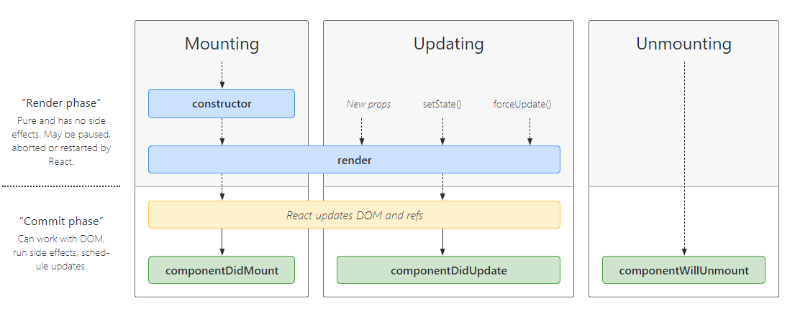
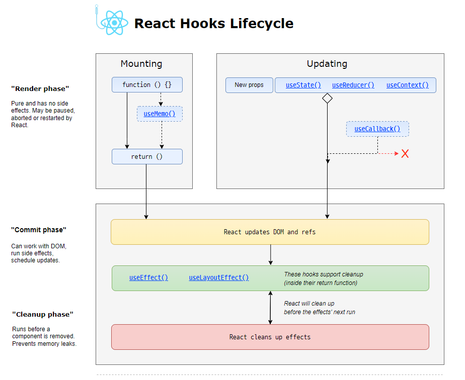
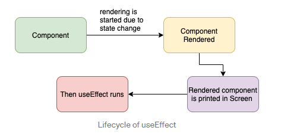
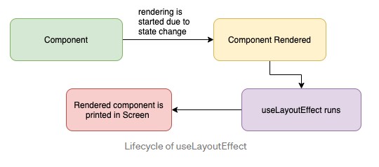

## CS

- 브라우저 주소창에 www.google.com을 입력하면 어떤 일이 일어나나요?

  

  - 브라우저가 URL을 파싱
    - Protocol
    - domain
    - port
    - path
    - parameter
  - DNS에서 IP 주소를 가져온다.
    - 맨 처음 ISP 서버에서 캐시 데이터가 없으면 루트 DNS 서버에게 요청
    - 루트 서버는 요청한 URL에 맞는 `TLD Top Level Domain name server` 로 안내 (.com)
    - ISP 서버는 그 다음 도메인(example)을 요청
    - 또 그 다음을 요청하면 `IP = 1.1.1.1` 의 형태로 도메인을 리턴, 동시에 ISP 서버는 해당 정보를 캐시로 기록해 둠
    - TCP 커넥션 시작 (3 way handshaking). connection
    - HTTPS는 TLS handshake 추가
    - HTTP Request를 보내면, 그에 맞는 Response를 받고 렌더링 시작

- DNS에 대해 설명해주세요.

  - Domain Name System
  - 사람이 읽기 편한 Domain을 기계가 읽을 수 있는 IP 주소로 변환하는 것

- DOM이란 무엇인가요?

  - Document Object Model
  - HTML/XML 문서에 접근하기 위한 인터페이스

- 3 way handshaking

  - 클라이언트와 서버 간의 통신을 위한 연결 과정
  - 클라이언트가 SYN(a) 패킷을 송신. 
  - 서버는 그걸 받고, SYN(b), ACK(a+1) 패킷 송신
  - 클라이언트는 ACK(b+1) 송신

- 4 way handshaking

  - 연결을 종료하는 과정
  - 클라이언트는 FIN 플래그 전송
  - 서버는 ACK 전성, 데이터를 모두 보낼 떄까지 Time out
  - 데이터를 모두 보내면 FIN 플래그 전송
  - 클라이언트는 ACK 전송
  - 클라이언트의 상태가 FIn-WAIT - TIME-WAIT로 바뀜
    - Server에서 FIN을 전송하기 전에 전송한 패킷이 라우팅 지연이나 패킷 유실로 인해 데이터 유실이 일어날 수 있다. 이런 상황을 대비해서 클라이언트는 일정 시간 동안 세션을 남겨두고 잉여 패킷을 기다린다.

- HTTP에 대한 기초적인 이해 (Req, Res, HTTP Status Code)

  - Hyper Text Transfer Protocol
  - 인터넷에서 데이터를 주고받을 수 있는 프로토콜(규칙)

- HTTPS에 대한 기초적인 이해

- 웹 서버란?

  - 정적 컨텐츠 제공 혹은 동적 컨텐츠 제공을 위한 요청 전달
  - Apache, Nginx 등

- Web Application Server란?

  - DB 조회 및 다양한 로직 처리에 따른 동적인 컨텐츠를 제공
  - Tomcat, JBoss

- CDN이란?

  - Content Delivery Network | Content Distribution Network
  - 지리적 제약 없이 전 세계에 빠르게 콘텐츠를 전송. 서버와 사용자 사이의 `물리적인 거리`를 줄인다.

- 객체지향 프로그래밍이란 무엇인가요?

- 프로세스와 스레드에 대해 설명

  - 프로세스는 실행 중인 프로그램. 스레드는 복잡한 프로그램을 실행하기 위한 더 작은 실행 단위. 프로세스 안에 스레드가 포함된다.
  - 스레드는 Code, Data, Heap을 공유한다. 그래서 컨텍스트 스위칭의 비용이 적지만, 오류가 날 경우 스레드 전체에 퍼질 가능성이 높다.

- stack과 queue에 대해 설명

  - Stack
    - FILO. 먼저 넣은 것이 나중에 빠진다.
  - Queue
    - FIFO. 먼저 넣은 것이 먼저 빠진다.

- list와 map에 대해 설명

  - list
    - List는 Memory 안의 특정한 동일 공간에 뭉텅이로 저장. 내부 구현이 배열로 되어 있기 때문.
    - 따라서 저장 공간만 있다면 저장 속도는 빠르다
  - map
    - 뭉텅이로 저장하는 것이 아니라 아이템을 저장할 때마다 빈공간을 찾아 저장.
    - key와 value를 사용. 단순히 포지션이라기 보다는 Key값이 필요할 때 map을 사용

- linked list와 hash에 대해 설명

  - linked list
  - hash

- sorting algorithms

  - stable한 정렬이란?
    - 중복 데이터가 있을 경우 데이터의 위치를 교환하지 않는 정렬
    - Bubble, Insertion
  - unstable 정렬?
    - Selection

- 가장 즐겨 쓰는 정렬 알고리즘은?

- RESTful API란?

  - 클라이언트와 서버가 통신하는 것의 컨벤션이라고 생각합니다. 혼자서만 개발한다면, 뭐 /kakaobrain을 붙인 경우에 모든 학생 리스트를 응답으로 받아오는 endpoint도 정할 수야 있죠. 그런데 다른 사람이 보면, 아니 도저히 알아볼수가 없다는 것이 문제입니다. REST하게 API를 짜면, HTTP 메서드와 URL만 봐도 대충 어떤 요청일지 예상이 가도록 직관적으로 구성합니다.

- Docker 컨테이너에 대한 기초적인 이해

- HTML과 웹 표준에 대해

- 호스팅 서버에 대한 기초적인 이해

- 브라우저별 특성

- 웹 표준은 무엇이며 왜 준수해야 하나요?

- 웹 접근성은 무엇이며 개선을 위해서는 어떻게 해야할까요?

- DOM Event에 대해서 이해하고 있나요?


## JavaScript

- 자바스크립트의 언어적 특성

  - 객체 기반의 스크립트 언어.
  - Mocha - LiveScript - JavaScript
  - 동적이며, 타입을 명시할 필요가 없는 인터프리터 언어
  - 객체 지향형 프로그래밍과 함수형 프로그래밍 모두 표현 가능
  - 컴파일 언어와 다르게, 소스코드를 바로 실행할 수 잇음. JS는 브라우저의 JS 인터프리터가 직접 해석하여 바로 실행해 준다.

- 변수란 무엇인가요?

  - let

- var, let, const 차이

  - var: ES6 이전에 사용되던 변수 선언
  - let: 재할당 가능, 재선언 불가
  - const: 둘다 불가. 말그대로 constant

- hoisting은 무엇인가요?

  - 모든 선언을 가장 위로 끌어올리는 것
  - 전역 범위의 경우 스크립트 최상단, 함수 범위에서는 해당 함수의 최상단
  - 함수 선언식의 경우, 

- 콜백 지옥 해결 방법

  - depth가 너무 깊어진다.
  - async, await, promise를 사용하자.

- Fetch API의 특성

  ### GET

  `fetch(url, options).then((response)).catch((error))`

  ### POST, PUT, DELETE

  ```js
  fetch(url, {
      method: "POST",
      header: {
          'Content-Type': 'application/json'
      }
  })
  ```

- Promise와 Callback의 차이

- async, await 사용 방법

- Promise와 async, await 차이

- 함수 선언형과 함수 표현식의 차이

- 이벤트 버블링

- 이벤트 캡처링

- 클로저closure 에 대한 설명

  - 함수와 해당 함수가 선언된 환경의 조합
  - 이로 인해 자바스크립트의 함수는 외부 변수를 기억하고, 접근할 수 있다. 렉시컬 환경이 사라지지 않았기 때문이다.
  - 중첩 함수 중,
    - 상위 스코프의 식별자를 참조하고 있고
    - 본인의 외부 함수보다 더 오래 살아있다면
    - 이 함수는 클로져

- 렉시컬 환경에 대해 설명

- 실행 컨텍스트에 대해 설명

- 자바스크립트의 원시 타입(Primitive Data Type)은 몇가지이며, 전부 말하라

  - undefined, null, boolean, number, string, symbol, object

  - 원시 값은 불변하다.

    ```js
    // string
    let bar = 'bar'
    console.log(bar) // bar
    bar.toUpperCase()
    console.log(bar) // bar
    
    // number
    let foo = 5
    function addTwo(num) {
    	num += 2
    }
    
    const addTwo_v2 = num => num += 2
    
    console.log(foo)
    addTwo(foo)
    console.log(foo)
    addTwo_v2(foo)
    console.log(foo)
    ```

  - 이렇게 되는 이유? 

    - 함수를 실행하기 전에, JS는 원래 전달된 인수(원시 값)을 복사해서 로컬 복사본을 생성한다. 이러한 복사본은 함수의 스코프 내에서만 존재하며, 함수 정의 내에 지정한 식별자를 통해 접근 가능하다.
    - 그 후 함수의 구문들이 실행된다.
    - 첫 번째 함수에 로컬 num 인수가 생성되고, 두 번째 함수도 마찬가지다.
    - 이 경우, 외부 변수인 `foo`에는 어떤 방법으로든 접근할 수 없다. 이는 자스의 `lexical scope`와 결과 변수 섀도잉 때문이다.

  - 결과적으로, 함수들 내부의 모든 변경은 그 복사본으로 작업했기 때문에, 원본 `foo`에 전혀 영향을 주지 않았다.

- 자바스크립트의 Number Type은 다른 언어와의 차이점? 왜 하나만 존재하나요?

  - 어떤 숫자든 변수, 상수에 할당하면 자동으로 number type이 된다.
  - 1/0 => Infinity
  - -1/0 => -Infinity
  - 'not a number' / 2 => NaN
  - JavaScript의 number는 `-2**53 ~ 2**53`까지 지원된다.
    - 그런데 숫자 끝에 n을 붙이거나 BigInt()를 호출하면 `bigint`가 지원된다. 아직까지는 흔치 않음

- 자바스크립트의 타입 컨버팅에 대해 설명

- 자바스크립트가 유동적인 언어인 이유?

  - Dynamic typed language

  - 자바스크립트는 선언할 때 어떤 타입인지 설정하지 않고, 런타임 때(프로그램이 동작할 때) 할당된 값에 따라서 타입이 변경될 수 있다.

    - 빠르게 프로토타입할 때에는 좋은 언어이지만, 다수의 엔지니어가 협업할 때에는 문제가 생길 여지가 크다.

    ```js
    let text = 'hello'
    console.log(text) // hello
    text = '7' + 5
    console.log(text, typeof text) // 75, string
    text = '8' / '2'
    console.log(text, typeof text) // 4, number
    ```

    - 이래서 `TypeScript`가 나오게 되었다.

- Prototype에 대해

  - 유전자.
  - Prototype은 

- 깊은 복사와 얕은 복사

  - 객체가 nested하게 있을 경우, 원시값은 값을 복사할 때 다른 메모리에 할당하기 때문에 원래의 값과 복사된 값이 서로에게 영향을 미치지 않는다.
  - 그러나 참조값 (Object, Symbol)의 경우, 변수가 객체의 주소를 가리키는 값이기 때문에 복사된 값이 같은 값을 가리키게 된다.
    - 얕은 복사: 객체를 복사할 때 원본 객체를 참조하는 경우
    - 깊은 복사: 객체 안에 객체가 있어도 원본과의 참조가 완전히 끊어진 객체
      - 재귀함수 복사
      - JSON.stringfy() 로 복사
      - `lodash`라이브러리 사용, `_.cleanDeep()`

- 불변성을 유지하려면?

  - `Boolean, Number, String, null, undefined, Symbol은 immutable`, `Object는 mutable`하다

    - 불변성을 지키면서 복사하기 위해서는, 우선 1depth까지는 spread 문법으로도 가능하다. `{...obj}`

  - `immer` 라이브러리를 사용하면 간단하게 불변성을 유지할 수 있다.

    ```js
    import produce from 'immer'
    const obj = {
        name: 'obj1',
        nest: {
            name: 'nest1'
        }
    }
    
    const copy_obj = produce(obj, (draft) => {
        draft.name = 'obj2'
        draft.nest.name = 'nest2'
    })
    ```

- this에 대해 설명

  - 자바스크립트에서 this는 `자기 자신`이라는 말이 참 모호하다. JS의 함수는 일급 객체이다.
  - 암시적 바인딩을 하면 참 어려워진다.

  ```js
  const obj = {
      name: 'obj',
      getName() {
          return this.name;
      }
  }
  
  function showValue(callback) {
      console.log(callback());
  }
  
  showValue(obj.getName); //undefined
  ```

  - 그래서 명시적 바인딩이 있다. call, apply, bind를 통해 명시적으로 this를 바인딩 할 수 잇다.
  - call(context, arg1, arg2)
    - call 같은 경우 인수를 하나하나 넣고
  - apply(context, args)
    - 배열 형태로 넣는다.
  - bind(context, args, arg2 ...)

- JavaScript 엔진은 어떻게 동작하나요?

- 디바운싱 debouncing

  - 쿼리를 입력마다 날리면 손해가 크다. 따라서 input 이벤트에 setTimeout으로 일정 ms 이상 입력이 없을 때 입력이 끝난 것으로 친다.

  ```js
  let timer
  if (timer) {
      cleartimeout(timer)
  }
  timer = setTimeout(() => {
  	// ajax 요청
  }, 200)
  ```

- 쓰로틀링 throttling

  - 스크롤을 올리거나 내릴 때 보통 사용
  - 마지막 함수가 호출된 후 일정 시간이 지나기 전에 다시 호출되지 않도록 하는 것

  ```js
  let timer
  if (!timer) {
      timer = setTimeout(() => {
          timer = null;
          // ajax 요청
      }, 200)
  }
  ```

- 함수형 프로그래밍

  - 객체지향 프로그래밍과는 다르다. 함수형 프로그래밍의 원칙은 아래와 같다.
    - 입출력이 순수해야 한다. (순수함수)
    - 부작용(부산물)이 없어야 한다.
    - 함수와 데이터를 중점으로 생각한다.

  

## React

- Virtual DOM 작동 원리
  - Virtual DOM은 쉽게 말해 DOM의 복사본입니다. real DOM과 같은 속성(class 등)을 가지지만, 같은 힘(getElementById 등)은 가지지 않습니다. 즉, 실제 DOM이 갖고 있는 api는 갖고 있지 않습니다.
  - 데이터가 변경되면 전체 UI는 virtual DOM에 렌더링됩니다. 그리고 이전 virtual DOM의 diff만을 Re-render합니다.
- Virtual DOM이 무엇인가요?
  - Virtual DOM은 html 객체에 기반한 자바스크립트 객체라고 할 수 있습니다.
  - 실제 렌더링되지 않습니다. 즉, 연산 비용을 최소화합니다.
  - DOM fragment의 변화를 붂어서 적용한 다음 기존 DOM에 던져 주는 과정입니다.
  - Virtual DOM이 항상 DOM보다 빠른가?
    - ㄴㄴ. 인터랙션이 없는 페이지라면 일반 DOM의 성능이 더 좋을 수도 있다.
- React를 사용하는 이유는?
  - 모든 React DOM Object는 그에 대응하는 Virtual DOM 엘리먼트가 존재한다. 데이터가 업데이트되면 그 바뀐 데이터를 바탕으로 `React.createElement()`를 통해 `JSX element`를 업데이트합니다. 그러면 React는 Virtual DOM의 snapshot을 비교하여 정확히 어떤 부분이 바뀌었는지 검사합니다. 이것을 `Diffing` 이라 부르고, Virtual DOM의 `재조정`입니다.
  - 즉, 인터랙션이 많은 페이지를 효율적으로 렌더링 할 수 있는 서비스를 쉽게 구현하기 위한 라이브러리라고 할 수 있다.
- 제어 컴포넌트와 비제어 컴포넌트의 차이에 대해
- key props를 사용하는 이유는?
- props와 state의 차이는?
- pure component에 대해
- React Class Component Life Cycle



- React Functional Component Life Cycle



- 클래스형 컴포넌트와 함수형 컴포넌트의 차이

- 리액트에서 JSX 문법이 어떻게 사용되나요?

- 왜 state를 직접 바꾸지 않고 useState를 사용해야 하나요?

- useMemo와 useCallback에 대해
  성능 최적화를 위한 hook인 이 둘에 대해 공부해 보겠습니다.

  ### useMemo

  메모이제이션된 값을 리턴합니다.

  React의 하위 컴포넌트는 상위 컴포넌트에서 받는 값 중, 하나라도 변경되면 전체 prop을 다시 받아옵니다. 간단하면 상관없지만, 복잡한 계산이 필요한 경우 계속해서 선언해야 할 수가 있겠습니다.

  ```js
  const color = getColor(color)
  const movie = getMovie(movie)
  // 여기에 useMemo를 얹겠습니다.
  const color = useMemo(() => getColor(color), [color])
  const movie = useMemo(() => getMovie(movie), [movie])
  ```

  위와 같이 바꾸면 값이 바뀐 prop만 다시 계산하게 됩니다.

  ### useCallback

  메모이제이션 된 콜백(함수)를 반환합니다.

  컴포넌트가 렌더링 될 때마다 변수 뿐만 아니라 함수도 다시 선언됩니다. 하지만 매번 그럴 필요가 있을까요? 첫 마운트 될 때 한 번만 선언하고 재사용하면 되지 않을까요?

  ```js
  const onChange = useCallback((e) => {
      const {name, value} = e.target
      setInputs({
          ...inputs,
          [name]: value
      })
  }, [inputs])
  ```

  `useCallback` 사용 시 주의할 점은, 함수 내에서 사용하는 `state` 혹은 `props`가 있다면 꼭 `deps` 배열 안에 포함시켜야 된다는 것입니다. 만약에 넣지 않으면, 함수 내에서 해당 값들을 참조할 때 가장 최신 값일 거라는 보장이 없습니다.
  뭐 애초에 에러를 띄워 주긴 합니다...

  사실 `useCallback`은 `useMemo` 기반으로 만들어졌습니다. 다만, 함수를 위해서 사용할 때 더욱 편하게 해 준 것 뿐입니다. 이런 식으로도 표현할 수 있습니다.

  ```js
  const onToggle = useMemo(() => () => {
      /* do side effects */
  }, [deps])
  ```

  

- useEffect와 useLayoutEffect에 대해

  ```jsx
  useEffect(() => {
      // do side effects
      return () => /* cleanup */
  }, [dependency array])
  
  useLayoutEffect(() => {
      // do side effects
      return () => /* cleanup */
  }, [dependency array])
  ```

  둘의 차이는 `어느 시점에 호출되는지`에 있습니다.

  ### useEffect

  렌더링된 요소들이 화면에 그려진 후, 비동기적으로 실행됩니다.

  

  ### useLayoutEffect

  렌더링 되고, 화면에 그려지기 전 동기적으로 실행됩니다.

  

  ### 결론

  useLayoutEffect는 동기적으로 실행되고 내부의 코드가 모두 실행된 후 painting 과정을 거치기 때문에, 로직이 복잡할 경우 사용자가 레이아웃을 보는데까지 시간이 오래 걸린다는 단점이 있어, 기본적으로 항상 useEffect만을 사용하는 것이 권장됩니다. 예를 들어,

  - Data fetch
  - event handler
  - state reset

  등의 작업은 useEffect를 사용하되, state의 조건에 따라 첫 painting 시 다르게 렌더링 되어야 할 때에는 re-rendering 되며 화면이 깜빡이기 때문에 useLayoutEffect를 사용합니다. 실시간으로 큰 데이터를 받아서 web에 표현할 경우 useEffect로는 실제 data와의 갭이 발생할 수 있어, data를 동기화 시키면서 사용하는 것이 좋다고 합니다.

- Context API에 대해

- 리액트에서 메모이제이션을 어떤 방식으로 하나요?

- 리액트 관련 패키지 중에 제일 좋다고 생각한 것은 무엇인가요?

- 리액트의 렌더링 성능 향상을 위해 어떻게 해야 하나요?

- React-query에 대해 들어봤나요?

- 굵직한 React 버전 업데이트에 대해 이해하고 있자

## Redux

- Redux를 사용하는 이유?
- Redux의 장단점
- Context API와 Redux의 비교
- Redux-saga란?
- Redux-thunk란?
- Redux-saga, Redux-thunk의 차이
- Generator 문법에 대해

## Frontend

- 브라우저 렌더링 과정을 설명해 주세요.
  - Resource를 받았으니, 이제는 그려낼 차례입니다.
- 브라우저는 어떻게 동작하나요?
- Webpack, Babel, Polyfill에 대해
- CSR과 SSR의 차이
- SPA와 SSR?
- CORS는 무엇인지, 처리해 본 경험
  - Cross Origin Request Sharing
- 웹 표준을 지키면서 개발하시나요?
  - 시맨틱 태그 얘기
- 쿠키와 세션에 대한 설명
- 로그인 처리를 할 때 쿠키와 세션을 어떻게 사용하시나요?
- 이벤트 루프와 task queue에 대해
- bundle 사이즈를 줄이려면?
- network 탭에서 font를 보고, CDN으로 변환했던 기억
- 타입스크립트를 사용하는 이유?
- 크로스 브라우징 경험
- 웹 소켓을 사용해 본 적 있는지?
- 웹사이트 성능 최적화에는 어떤 방법이 있는지?

## HTML, CSS

- Flexbox를 사용해보셨나요?
- Cascading에 관해서 설명해주세요.
- CSS 애니메이션과 JS 애니메이션의 차이에 대해 설명해주세요.
- position 속성에 대해 설명해주세요.

## 기타

- 자기소개
- 지원동기
- 최근 경험했던 기억에 남는 에러
- 요즘 공부하고 있는 것
- 자바스크립트를 공부하면서 가장 인상 깊었던 것
- 어떤 개발자를 사수로?
- 좋은 코드란 어떤 것이라고 생각하나요?
- 어떤 개발자가 되고 싶으신가요?
- 애자일 방법론으로 개발해보신적 있나요?
- 어떤 디자인 패턴을 선호하시나요?
- 협업할 때 어려운 점이 있었나요?
- 프로젝트에서 어떤 업무를 주로 담당했나요?
- 본인의 장단점을 말씀해주세요.
- 개발 기간을 촉박하게 요구하는 경우 어떻게 하시나요?
- 왜 개발자가 되기로 결심하셨나요?
- 개발 능력 향상을 위해 어떤 것을 하고 계신가요?
- 새로운 기술을 습득하기 위해 어떤 방식으로 접근하고 계신가요?
- 버전 관리 시스템은 무엇을 사용해 보셨나요?
- 저희 회사에 궁금한 점이 있으신가요?
