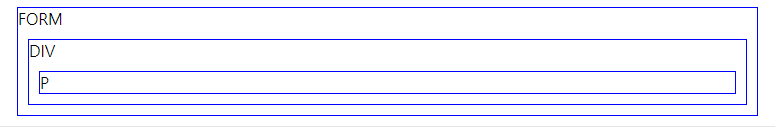
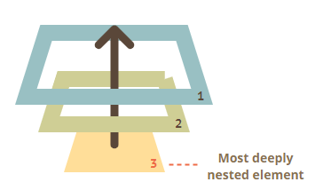

# 버블링, 캡처링

[toc]

아래 핸들러는 div에 할당되어 있지만 em이나 code같은 중첩 태그를 클릭해도 동작한다.

```html
<div onclick="alert('div에 할당한 핸들러!')">
  <em><code>EM</code>을 클릭했는데도 <code>DIV</code>에 할당한 핸들러가 동작합니다.</em>
</div>
```

왜일까?

## Bubbling

버블링의 원리는 간단하다.

**한 요소에 이벤트가 발생하면, 이 요소에 할당된 핸들러가 동작하고, 이어서 부모 요소의 핸들러가 동작한다. 가장 최상단의 조상 요소를 만날 때까지 이 과정이 반복되면서 요소 각각에 할당된 핸들러가 동작한다.**

3개의 요소가 `FORM > DIV > P` 형태로 중첩된 구조를 살펴봅시다. 요소 각각에 핸들러가 할당되어 있다.

```html
<style>
  body * {
    margin: 10px;
    border: 1px solid blue;
  }
</style>

<form onclick="alert('form')">FORM
  <div onclick="alert('div')">DIV
    <p onclick="alert('p')">P</p>
  </div>
</form>
```



가장 안쪽의 p를 클릭하면 순서대로 다음과 같은 일이 벌어진다.

1. p에 할당된 `onclick` 핸들러 동작.
2. 바깥의 div의 핸들러 동작
3. 그 바깥의 form에 할당된 핸들러 동작
4. document 객체를 만날 때까지, 각 요소에 할당된 `onclick` 핸들러가 동작



이런 동작 방식 때문에 p div form 순서로 얼럿 창이 뜨는 것이다.

이런 흐름을 `이벤트 버블링` 이라고 부른다. 가장 깊숙히 있는 요소에서 시작해 부모 요소로 거슬러 올라오는 모습이 거품같기 때문이다.

> '거의' 모든 이벤트는 버블링된다.
>
> 키워드는 '거의'.
>
> `focus` 이벤트와 같이 버블링되지 않는 이벤트도 있다. 몇몇 이벤트를 제외하고 대부분의 이벤트는 버블링됨!

### event.target

부모 요소의 핸들러는 이벤트가 정확히 어디서 발생했는지 등에 대한 자세한 정보를 얻을 수 있다.

이벤트가 발생한 가장 안쪽의 요소는 target 요소라고 불리고, `event.target`을 사용해 접근할 수 있다.

`event.target`과 `this (=event.currentTarget)`는 다음과 같은 차이점이 있다.

- event.target은 실제 이벤트가 시작된 타깃 요소이다. 버블링이 진행되어도 변하지 않는다.
- this는 현재 요소로, 현재 실행 중인 핸들러가 할당된 요소를 참조한다.

```js
// script.js
form.onclick = function(event) {
  event.target.style.backgroundColor = 'yellow';

  // chrome needs some time to paint yellow
  setTimeout(() => {
    alert("target = " + event.target.tagName + ", this=" + this.tagName);
    event.target.style.backgroundColor = ''
  }, 0);
};
```

```html
<!DOCTYPE HTML>
<html>

<head>
  <meta charset="utf-8">
  <link rel="stylesheet" href="example.css">
</head>

<body>
  클릭하면 <code>event.target</code>과 <code>this</code>정보를 볼 수 있습니다.

  <form id="form">FORM
    <div>DIV
      <p>P</p>
    </div>
  </form>

  <script src="script.js"></script>
</body>
</html>
```

p를 클릭하면 p, form

div를 클릭하면 div, form...을 출력한다.

### 버블링 중단하기

이벤트 버블링은 타깃 이벤트에서 시작해서 html 요소를 거쳐 document 객체를 만날 때까지 각 노드에서 모두 발생한다. 몇몇 이벤트는 window 객체까지 거슬러 올라가기도 한다. 이 때도 모든 핸들러가 호출된다.

그런데 핸들러에게 이벤트를 처리하고 난 후 버블링을 중단하도록 명령할 수도 있다.

이벤트 객체의 메서드인 `event.stopPropagation()`을 사용하면 된다.

아래 예시에서 버튼을 클릭해도 body.onclick은 동작하지 않는다.

```html
<body onclick="alert(`버블링은 여기까지 도달하지 못합니다.`)">
  <button onclick="event.stopPropagation()">클릭해 주세요.</button>
</body>
```

stopPropagation은 위쪽으로의 버블링만 막힌다.

버블링을 멈추고, 요소에 할당된 다른 핸들러의 동작도 막으려면 `event.stopImmediatePropagation`을 사용해야 한다.

꼭 필요한 경우를 제외하곤 버블링을 막지 말자!!

## Capturing

표준 DOM 이벤트에서 정의한 이벤트 흐름엔 3가지 단계가 존재한다.

1. 캡처링 단계 - 이벤트가 하위 요소로 전파되는 단계
2. 타깃 단계  - 이벤트가 실제 타깃 요소에 전달되는 단계
3. 버블링 단계 - 이벤트가 상위 요소로 전파되는 단계

테이블 안의 <td>를 클릭하면 어떻게 이벤트가 흐르는지 아래 그림을 보고 이해해 봅시다.


td를 클릭하면 이벤트가 최상위 조상에서 시작해 아래로 전파되고 (캡처링), 이벤트가 타깃 요소에 도착해 실행된 후(타깃 단계), 다시 위로 전파된다(버블링). 이런 과정을 통해 요소에 할당된 이벤트 핸들러가 호출된다.

캡처링 단계를 이용해야 하는 경우는 흔치 않기 때문에, 거의 쓸 일은 없을 것이다.

`on<event>` 프로퍼티나 HTML 속성, `addEventListener(event, handler)`를 이용해 할당된 핸들러는 캡처링에 대해 전혀 알 수 없다. 이 핸들러들은 두 번째 혹은 세 번째 단계의 이벤트 흐름(타깃 단계와 버블링 단계)에서만 동작한다.

캡처링 단계에서 이벤트를 잡아내려면 `addEventListener`의 `capture` 옵션을 true로 설정해둬야 한다.

```html
elem.addEventListener(..., {capture: true})
// 아니면, 아래 같이 {capture: true} 대신, true를 써줘도 됩니다.
elem.addEventListener(..., true)
```

capture 옵션은 두 가지 값을 가질 수 있다.

- false이면 (default 값) 핸들러는 버블링 단계에서 동작한다.
- true면 핸들러는 캡처링 단계에서 동작한다.

공식적으로는 총 3개의 이벤트 흐름이 있지만, 이벤트가 실제 타깃 요소에 전달되는 단계인 '타깃 단계(두 번째 단계)'는 별도로 처리되지 않는다. 캡처링과 버블링 단계의 핸들러는 타깃 단계에서 트리거된다.

```html
<style>
  body * {
    margin: 10px;
    border: 1px solid blue;
  }
</style>

<form>FORM
  <div>DIV
    <p>P</p>
  </div>
</form>

<script>
  for(let elem of document.querySelectorAll('*')) {
    elem.addEventListener("click", e => alert(`캡쳐링: ${elem.tagName}`), true);
    elem.addEventListener("click", e => alert(`버블링: ${elem.tagName}`));
  }
</script>
```

위 예시를 통해 맨 위에서부터 시작해 아래를 찍고 다시 올라가는 흐름을 볼 수 있다.

## 요약

이벤트가 발생하면 이벤트가 발생한 가장 안쪽 요소가 타깃 요소 `event.target`가 된다.

- 이벤트는 document에서 시작해 DOM 트리를 따라 `event.target`까지 내려간다. 이벤트는 트리를 따라 내려가면서 `addEventListener(..., true)`로 할당된 핸들러를 동작시킨다. `addEventListener(..., true)`의 true는 `{capture: true}`의 축약형이다.
- 이후 타깃 요소에 설정된 핸들러 동작
- 이후엔 이벤트가 `event.target`부터 시작해서 다시 최상위 노드까지 전달되면서 각 요소에 `on<event>`로 할당한 핸들러와 `addEventListener`로 할당한 핸들러를 동작시킨다. `addEventListener`로 할당한 핸들러 중, 세 번째 인수가 없거나 `false`, `{capture: false}`인 핸들러만 호출된다.

각 핸들러는 아래와 같은 `event` 객체의 프로퍼티에 접근할 수 있다.

- `event.target` : 이벤트가 발생한 가장 안쪽의 요소
- `event.currentTarget == this` : 이벤트를 핸들링 하는 현재 요소 (핸들러가 실제 할당된 요소)
- `event.eventPhase` : 현재 이벤트 흐름 단계 (캡처링 1, 타깃 2, 버블링 3)

캡처링 단계는 거의 쓰이지 않고, 버블링이 주로 쓰인다. 이렇게 된 데에는 논리적 배경이 있다.

현실에서 사고가 발생하면 지역 경찰이 먼저 조사한다. 그 지역에 대해 가장 잘 아는 기관은 지역 경찰이기 때문이다. 추가 조사가 필요하다면 그 이후에 상위 기관이 사건을 넘겨받는다.

이벤트 핸들러도 이와 같다. 특정 요소에 할당된 핸들러는 그 요소에 대한 자세한 사항과 무슨 일을 해야 할지 가장 잘 알고 있다.

버블링과 캡처링은 이벤트 위임(event delegation)의 토대가 된다. 이벤트 위임은 강력한 이벤트 핸들링 패턴이다.

