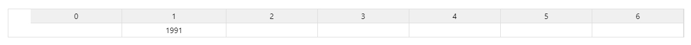
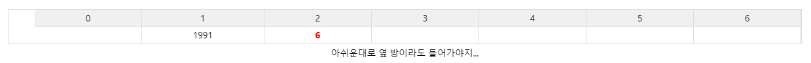
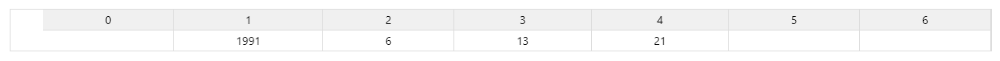
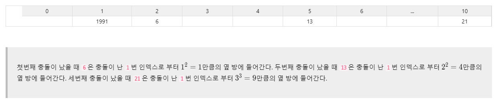
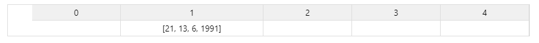
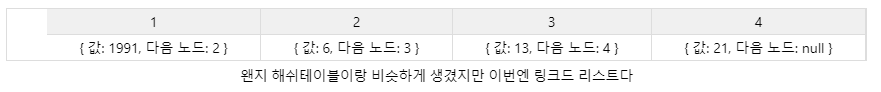
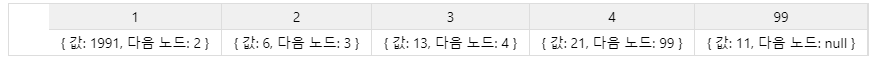
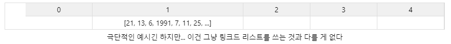

# JavaScript와 함께 해시 테이블을 파헤쳐보자

[TOC]

## 해시 테이블이 뭔가요?

해시 테이블은 특정 값을 입력받으면 그 값을 해시 함수에 통과시켜 나온 인덱스에 저장하는 자료구조입니다. 보통 배열을 사용해서 구현하는 경우가 많습니다. 일단 해시가 뭔지 설명하기 전에 `해시 테이블`이라는 개념이 어디서부터 출발한 것인지 알아봅시다.

### 직접 주소 테이블 (Direct Address Table)

해시 테이블의 아이디어는 직접 주소 테이블이라는 자료구조에서부터 출발합니다. 직접 주소 테이블은 입력받은 value가 곧 key가 되는 데이터 매핑 방식입니다.

```javascript
class DirectAddressTable {
    constructor () {
        this.table = [];
    }
    
    setValue (value = -1) {
        this.table[value] = value;
    }
    
    getValue (value = -1) {
        return this.table[value];
    }
    
    getTable () {
        return this.table;
    }
}

const myTable = new DirectAddressTable();
myTable.setValue(3);
myTable.setValue(10);
myTable.setValue(90);

console.log(myTable.getTable());
```

이렇게 직접 주소 테이블을 사용할 때는 들어오는 값이 뭔지 알면 이 값이 저장된 인덱스도 함게 알 수 있기에 저장된 데이터에 바로 접근해서 값을 가져올 수 있다.

시간복잡도는 O(1)이다.

하지만 공간의 효율성이 똥이다. 1이랑 100000을 넣는다면? 그만큼 빈 공간이 너무 아깝지요. 즉, 직접 주소 테이블이 큰 힘을 발휘할 수 있는 순간은 `1, 2, 3`과 같이 연속적인 값을 저장하거나 혹은 값들의 범위 차이가 크지 않은 데이터일 경우입니다.

## 직접 주소 테이블의 단점을 해시 함수로 보완하자!

이 단점을 보완한게 바로 해시 테이블입니다.

해시 테이블은 직접 주소 테이블처럼 값을 키로 사용하는 것이 아니라 `해시 함수(Hash Function)`에 한번 통과시켜서 사용합니다. 해시 함수는 임의의 길이를 가지는 임의의 데이터를 고정된 길이의 데이터로 매핑하는 함수입니다. 이때 이 함수가 뱉어내는 결과물을 해시라고 부릅니다.

간단한 해시 함수를 만들어봅시다.

```js
function hashFunction (key) {
    return key % 10;
}
console.log(hashFunction(102948)); // 8
console.log(hashFunction(191919191)); // 1
console.log(hashFunction(13)); // 3
console.log(hashFunction(997)); // 7
```

허접하지만 `해싱`이라는 본연의 역할에 충실한 함수입니다. 위의 결과 중 주요한 것은 이것입니다.

> 어떤 값이 들어오든 0~9 사이의 값이 반환된다!

즉, 고정된 테이블의 길이를 정해둘 수 있고 그 안에만 데이터를 저장할 수 있게 된 것입니다. 해시 함수의 이러한 성질을 이용해서 아주 간단한 해시테이블을 작성해 봅시다.

```js
const size = 5;
const table = new Array(size);

function hash (key) {
    return key % size;
}

table[hash(1991)] = 1991;
table[hash(1992)] = 1992;
table[hash(1234)] = 1234;

console.log(table) // [empty, 1991, 1992, empty, 1234]
```

# 해시의 충돌 (collision)

이렇게 해피 엔딩? ㄴㄴ. 그렇다면 같은 키일 경우에 값을 어떻게 넣을까요?

걱정ㄴㄴ... 애초에 해시 테이블은 담고자 하는 데이터의 개수보다 테이블의 크기를 작게 하고 싶다는 의지에서 나온 자료구조라서 충돌을 해결할 수 있는 방법 또한 같이 고안되었습니다.

## 충돌 해결하기

이처럼 해시 테이블에는 해시의 충돌이라는 단점이 있기 때문에 해시 테이블을 운용할 때 가장 중요한 것은 해시 함수가 얼마나 값을 균일하게 퍼트릴 수 있느냐입니다. 어떤 값을 넣어도 같은 인덱스가 나온다면 좋은 해시 함수가 아니라는 것이죠.

그러나 해시 함수를 아무리 잘 짜더라도 근본적으로 충돌을 완전히 방지한다는 것은 힘든 일입니다. 그렇기 때문에 어느 정도는 충돌을 감안하되 최소화하기 위해 해시 함수의 알고리즘을 개발하거나, 혹은 충돌이 발생하더라도 우회해서 해결할 수 있는 방법을 사용합니다.

### 개방 주소법 (Open Address)

`개방 주소법`은 해시 충돌이 발생하면 테이블 내의 새로운 주소를 `탐사 (Probe)`한 후, 비어있는 곳에 충돌된 데이터를 입력하는 방식입니다. 해시 함수로 얻은 인덱스가 아니라 다른 인덱스를 허용한다는 의미로 `개방 주소`라고 합니다.

개방 주소법은 탐사방법에 따라 4가지로 나뉘어 집니다.

#### 선형 탐사법 (Linear Probing)

`선형 탐사법(Linear Probing)`은 말 그대로 순차적으로 탐사하는 방법이다. 위에서 해시 충돌의 예로 들었던 1991과 6의 상황을 한번 예시로 알아봅시다.



처음에 1991을 해시 함수에 통과 시킨 후 해시 테이블에 넣었을 때에는 테이블의 1번 인덱스에 위치했을 것이다. 그 이후 6은 또 1이다. 하지만 이미 1번에는 1991이 들어가 있기 때문에 6은 더 이상 해시 테이블에 들어갈 자리가 없게 되었다. 충돌이 발생한 것이다!!

선형 탐사법은 이렇게 충돌이 났을 때 정해진 n칸만큼의 옆 방을 주는 방법이다. 만약에 n=1이라면 2번 인덱스를, n=3이라면 4번 인덱스에 6을 저장할 것이다.



이런 식으로 순차적으로 옆 방을 주는게 선형 탐사법이다. 만약 여기서 또 충돌이 발생한다면 이번에는 그 값을 3번 인덱스에 저장할 것이다. 이런 방식으로 빈 공간이 나타날 때까지 순차적으로 탐사한다. 만약 여기서 또 충돌이 발생한다면 이번에는 그 값을 3번 인덱스에 저장할 것이다. 이런 방식으로 빈 공간이 나타날 때까지 순차적으로 탐사한다.

선형 탐사법의 단점은 특정 해시 값에 몰리는 `일차 군집화 (Primary Clustering)`에 취약하다는 것이다.



몰려 있으면 계속 충돌된다. 악순환의 반복으로, 데이터가 연속되게 저장되기 때문에 나중가면 데이터가 밀집된 거대한 덩어리가 된다. 그럼 해시로 어떤 값이 나든 그 덩어리와 충돌할 확률이 올라가고, 또 충돌하고... 이렇게 일차 군집화 현상이 발생한다.

#### 제곱 탐사법 (Quadratic Probing)

제곱 탐사법은 선형 탐사법과 동일하지만 탐사하는 폭이 고정폭이 아닌 제곱으로 늘어난다는 것이 다르다.

첫번째 충돌이 발생했을 때는 충돌난 지점으로부터 1^2만큼, 두번째는 2^2, 세번째는 3^3.



이렇게 제곱 탐사법을 사용하면 충돌이 발생할 확률이 줄어든다.

그래도 결국 해시로 1이 나오면 계속 충돌나는 것은 피할 수 없다. 이 현상을 `이차 군집화(Secondary Clustering)`이라 부른다.

더 개선할 방법은?

#### 이중해싱 (Double Hashing)

그래서 나온 방법이 이중해싱이다. 말 그대로 해시 함수를 이중으로 사용하는 것이다.

하나는 기존과 마찬가지로 `최초 해시를 얻을 때 사용`하고, 다른 하나는 `충돌이 났을 경우 탐사 이동폭을 얻기 위해 사용`한다. 이렇게 하면 최초 해시로 같은 값이 나오더라도 다시 다른 해시 함수를 거치면서 다른 탐사 이동폭이 나올 확률이 높다.

```js
const size = 23; // 테이블 사이즈가 소수여야 효과가 좋다.
const table = [];

const getSaveHash = value => value % size;

// 스텝 해시에 사용되는 수는 테이블 사이즈보다 약간 작은 소수를 사용한다.
const getStepHash = value => 17 - (value % 17);

const setValue = value => {
    let index = getSaveHash(value)
    let isUsed = table[index]
    while (true) {
        // 해당 인덱스가 쓰여지지 않았을 경우
        if (!isUsed) {
            table[index] = value;
            console.log(`${index}번 인덱스에 ${value} 저장!`)
            return
        }
        else if (table.length >= size){
            console.log(`꽉찼습니다.`)
            return
        }
        else {
            console.log(`${index} 번 인덱스에 ${value} 저장하려 했으나 충돌! ㅜㅜ`)
            index += getStepHash(value)
            index = index > size ? index - size : index
            isUsed = table[index] // 여기는 비었나~?
        }
    }
}
```

테스트 해보자.

```js
console.log(setValue(1991));
console.log(setValue(6));
console.log(setValue(13));
console.log(setValue(21));

13번 인덱스에 1991 저장!
6번 인덱스에 6 저장!
13 번 인덱스에 13 저장하려 했으나 충돌! ㅜㅜ
17번 인덱스에 13 저장!
21번 인덱스에 21 저장!
```

좋은 방법이다.

### 분리 연결법 (Separate Chaining)

분리 연결법은 개방 주소법과 약간 다르다.

분리 연결법은 해쉬 테이블의 버킷에 하나의 값이 아니라 `Linked List`나 `Tree`를 사용한다. 사실 트리를 쓰던 링크드 리스트를 쓰던 개념은 동일하지만 링크드 리스트로 설명하겠다.

위에서 계속 진행했던 예시를 분리 연결법으로 하면 이렇게 된다.



딕셔너리가 생각나는 부분이다. 그런데 자세히 보면 넣은 순서대로 되어 있지 않고, appendLeft로 큐처럼 삽입되었다. 이는 데이터를 삽입할 때 조금이라도 수행 시간을 줄이기 위해서다.

설명해 보자면,



만약 이번에 추가할 것이 11이라고 해보자. 일단 메모리 주소가 99인 곳이 남길래 여기에 `값: 11, 다음 노드:null`을 저장했다. 그 후 이 새로운 노드를 리스트에 붙여야 하니까 해당 리스트의 마지막 노드인 메모리 4에 저장된 노드까지 찾아간다.

그 다음에 메모리 4에 저장된 값을 `{값: 21, 다음 노드: 99}`로 바꿔주면 끝!



문제는 새 노드를 붙이기 위해 노드 4를 찾는 과정이다. 먼저 헤드인 1부터 2 확인, 3확인...

이렇기 때문에, 뒤집으면 데이터 삽입이 한결 쉬워짐을 알 수 있다. 꼬리가 맨 앞으로 오니까. 그래서 해시 테이블에 저장할 때도 리스트의 꼬리로 데이터를 붙이기보다는 머리에 붙이는 방법을 보통 많이 사용한다.

대신 이렇게 분리 연결법을 사용하려면 해시 함수의 역할이 굉장히 중요하다. 결국 균일하지 못한 해시를 사용한다면 이렇게 되기 때문이다.



결국 내가 찾고자 하는 값이 리스트의 맨 마지막에 있다면 처음부터 끝까지 탐색해야 하기 때문에 O(n)의 시간복잡도를 갖게 된다. 그래서 해시 함수의 역할이 중요한 것이다.

## 테이블 크기 재할당 (Resizing)

해시 테이블은 고정적인 공간을 할당해서 많은 데이터를 담기 위한 자료구조인 만큼 언젠가 넘치기 마련이다.

개방 주소법을 사용하는 경우에는 풀방이 되는 경우가 있을 것이고, 분리 연결법의 경우에는 각 버킷에 저장된 리스트가 점점 더 길어져서 리스트를 탐색하는 리소스가 너무 커지는 상황이 발생할 것이다.

그렇기 때문에 해시 테이블은 어느 정도 비워져 있는 것이 성능 상 더 좋으며, 해시 테이블을 운용할 때는 어느 정도 데이터가 차면 테이블의 크기를 늘려줘야 한다.

이건 특별한 알고리즘이라기보다는 그냥 기존 크기의 두 배 정도로 새로운 테이블을 선언해서 기존 테이블의 데이터를 그대로 옮겨 담는 방법을 사용한다. `분리 연결법`을 이용한 해시 테이블일 경우 `재해싱(Rehashing)`을 통해 리스트를 분할하기도 한다.