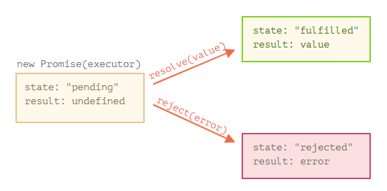
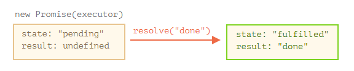
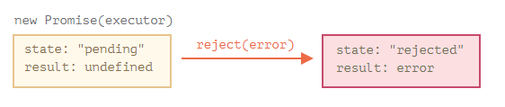
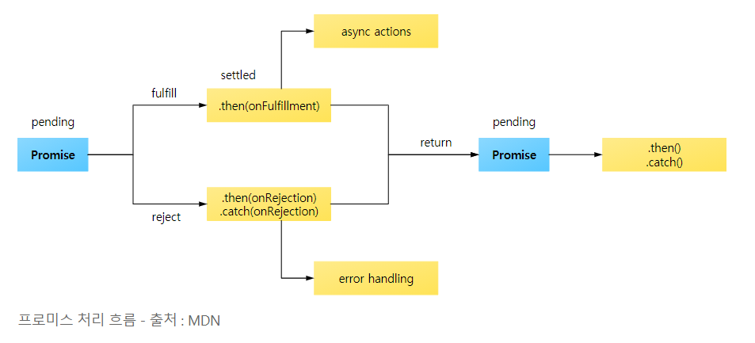
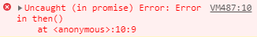

# Promise가 뭔가요?

[toc]

> A promise is an object that may produce a single value some time in the future

프로미스는 자바스크립트 비동기 처리에 사용되는 **객체**이다. 여기서 비동기 처리란 '특정 코드의 실행이 완료될 때까지 기다리지 않고 다음 코드를 먼저 수행하는 JS의 특성'을 의미한다.

## Promise가 왜 필요한데요?

앞서 공부한 비동기 문제를 해결하기 위해 필요하다. 콜백 함수를 사용해서 잘 짤 수도 있지만, 자칫하면 콜백 지옥에 빠지거나 지나치게 파편화되어 보일 수 있다.

본인을 아주 유명한 가수라고 가정해 보자. 그리고 팬들이 밤낮없이 앨범 언제나오냐구 묻는다. 그래서 당신은 앨범이 출시되면 팬들에게 자동으로 카톡을 보내도록 해서 귀찮음을 덜게 된다. 구독 플친을 만들어 두고, 소식을 바로바로 받을 수 있도록.

1. 제작 코드는 원격에서 스크립트를 불러 오는 등 시간이 걸리는 일을 처리한다. 위 비유에선 가수의 앨범 작업에 해당한다.
2. 소비 코드는 제작 코드의 결과를 기다렸다가 이를 소비한다. 이때 소비 주체(함수)는 여럿이 될 수 있다. 위 비유에서 소비 코드는 팬이다.
3. 프로미스는 제작 코드와 소비 코드를 연결해주는 특별한 JS 객체이다. 위 비유에서 프로미스는 구독 플친이다. 프로미스는 시간이 얼마나 걸리든 상관없이 약속한 결과를 만들어내는 제작 코드가 준비되었을 때, 모든 소비 코드가 결과를 사용할 수 있도록 해준다.

프로미스 객체는 아래와 같은 문법으로 만들 수 있다.

```js
let promise = new Promise(function(resolve, reject) {
    // executor (제작 코드, 가수)
})
```

`new Promise`에 전달되는 함수는 executor(실행자, 실행 함수)라 부른다. executor는 프로미스 객체가 만들어질 때 자동으로 실행되는데, 결과를 최종적으로 만들어내는 제작 코드를 포함한다. 위 비유에서 '가수'가 바로 executor이다.

executor의 인수 `resolve`와 `reject`는 JS에서 자체 제공하는 콜백이다. 개발자는 신경쓸 필요 없이 실행자만 작성하면 된다. 대신 결과를 얻으면 콜백 중 하나를 반드시 호출해야 한다.

- `resolve` : 일이 성공적으로 끝난 경우 그 결과를 나타내는 `value`와 함께 호출
- `reject` : 에러 발생시 에러 객체를 나타내는 `error`와 함께 호출

요약하면 다음과 같다. 실행자는 자동으로 실행되는데 여기서 원하는 일이 처리된다. 처리가 끝나면 실행자는 처리 성공 여부에 따라 resolve, reject 중 하나를 호출한다.

한편 `new Promise` 생성자가 반환하는 promise 객체는 다음과 같은 내부 프로퍼티를 갖는다.

- `state` : 처음엔 `pending` (보류)이었다가 resolve가 호출되면 `fulfilled`, reject가 호출되면 `rejected`로 바뀐다.
- `result` : 처음엔 `undefined`. resolve가 호출되면 `value`로, reject(error)가 호출되면 `error`로 변한다.

따라서 실행자는 아래 그림과 같이 promise의 상태를 둘 중 하나로 변화시킨다.



그럼 간단한 프로미스 예시를 알아보자.

```js
let promise = new Promise(function(resolve, reject) {
    setTimeout(() => resolve('done'), 1000);
})
```

위 예시를 통해 두 가지를 알 수 있다.

1. 실행자는 프로미스 객체에 의해 자동으로 그리고 즉각적으로 호출된다.
2. 실행자는 인자로 `resolve`와 `reject` 함수를 받는다. 이 함수들은 JS 엔진이 미리 정의한 함수이므로 개발자가 따로 만들 필요가 없다. 다만, resolve나 reject 하나는 반드시 호출해야 한다.

실행자 처리가 시작된지 1초 후, resolve가 호출되고 결과가 만들어진다. 이때 프로미스 객체의 상태는 다음과 같이 변한다.



이처럼 일이 성공적으로 처리됐을 때의 프로미스는 약속이 이행된 프로미스(fulfilled promise)라고 불린다.

그럼 에러가 뜨는 프로미스를 알아보자.

```js
et promise = new Promise(function(resolve, reject) {
  // 1초 뒤에 에러와 함께 실행이 종료되었다는 신호를 보냅니다.
  setTimeout(() => reject(new Error("에러 발생!")), 1000);
});
```

1초 후 reject가 호출되면 프로미스의 상태가 rejected로 바뀐다.



## 프로미스의 3가지 상태

- Pending(대기) : 비동기 처리 로직이 아직 미완료
- Fulfilled(이행) : 비동기 처리가 완료되어 프로미스가 결과 값을 반환해준 상태
- Rejected(실패) : 비동기 처리가 실패하거나 오류가 발생한 상태

### Pending

먼저 아래와 같이 `new Promise()` 메서드를 호출하면 대기 상태가 된다.

```js
new Promise();
```

메서드를 호출할 때 콜백 함수를 선언할 수 있고, 콜백 함수의 인자는 reslove, reject이다.

```js
new Promise(function(resolve, reject) {
    
})
```

### Fulfilled

여기서 콜백 함수의 인자 `resolve`를 아래와 같이 실행하면 이행 상태가 된다.

```js
new Promise(function(resolve, reject) {
    resolve();
})
```

그리고 이행 상태가 되면 아래와 같이 `then()`을 이용하여 처리 결과 값을 받을 수 있다.

```js
function getData() {
    return new Promise(function(resolve, reject) {
        var data = 100;
        resolve(data);
    })
}
// resolve의 결과 값 data를 resolvedData로 받음
getData().then(function(resolvedData) {
    console.log(resolvedData) // 100
})
```

### Rejected

아래와 같이 호출하면 실패다.

```js
new Promise(function(resolve, reject) {
  reject();
});
```

그리고 실패 상태가 되면 실패한 이유(실패 처리의 결과 값)을 `catch`로 받을 수 있다.

```js
function getData() {
    return new Promise(function(resolve, reject) {
    reject(new Error("Request is failed"));
  });
}
// reject()의 결과 값 Error를 err에 받음
getData().then().catch(function(err) {
    console.log(err.message); // Error: Request is Failed
})
```



## 소비자: then, catch, finally

프로미스 객체는 실행자의 결과나 에러를 받은 소비 함수를 이어주는 역할이다.

### then

`.then`은 프라미스에서 가장 주요하고 기본이 되는 메서드이다.

```js
promise.then(
	function(result) // 프라미스 이행되었을때
    function(error) // 프라미스 에러났을때
)
```

아래 예시는 성공적으로 이행된 프라미스에 어떻게 반응하는지 보여준다.

```js
let promise = new Promise(function(resolve, reject) {
    setTimeout(() => resolve("done!"), 1000);
})

// resolve 함수는 .then의 첫 번째 함수(인수)를 실행
promise.then(
  result => alert(result), // 1초 후 "done!"을 출력
  error => alert(error) // 실행되지 않음
);
```

거부되었을 경우에는 아래와 같음

```js
let promise = new Promise(function(resolve, reject) {
  setTimeout(() => reject(new Error("에러 발생!")), 1000);
});

// reject 함수는 .then의 두 번째 함수를 실행합니다.
promise.then(
  result => alert(result), // 실행되지 않음
  error => alert(error) // 1초 후 "Error: 에러 발생!"를 출력
);
```

작업이 성공적으로 처리된 경우만 다루고 싶다면 `.then`에 인수를 하나만 전달하면 된다.

```js
let promise = new Promise(resolve => {
  setTimeout(() => resolve("done!"), 1000);
});

promise.then(alert); // 1초 뒤 "done!" 출력
```

### catch

에러가 발생한 경우만 다루고 싶다면 `.then(null, errorHandlingFunction)`의 형태로 null을 첫 번째 인수로 전달하면 된다. `.catch(errorHandlingFunction)`을 써도 되는데, .catch는 .then에 null을 전달하는 것과 동일하게 작동한다.

```js
let promise = new Promise((resolve, reject) => {
  setTimeout(() => reject(new Error("에러 발생!")), 1000);
});

// .catch(f)는 promise.then(null, f)과 동일하게 작동합니다
promise.catch(alert); // 1초 뒤 "Error: 에러 발생!" 출력
```

`.catch(f)`는 문법이 간결하다는 점만 빼고 `.then(null, f)`와 완벽하게 같다.

### finally

`try {...} catch {...}`에 finally 절이 있는 것처럼, 프라미스에도 있다.

프라미스가 처리되면 f가 항상 실행된다는 점에서 `.finally(f)` 호출은 `.then(f, f)`와 유사하다.

쓸모가 없어진 로딩 인디케이터를 멈추는 경우같이, 결과가 어떻든 마무리가 필요하면 finally가 유용하다.

```js
new Promise((resolve, reject) => {
  /* 시간이 걸리는 어떤 일을 수행하고, 그 후 resolve, reject를 호출함 */
})
  // 성공·실패 여부와 상관없이 프라미스가 처리되면 실행됨
  .finally(() => 로딩 인디케이터 중지)
  .then(result => result와 err 보여줌 => error 보여줌)
```

그러나 then(f, f)와 완전히 같지는 않은데, 차이점은 다음과 같다.

1. `finally` 핸들러엔 인수가 없다. 프라미스가 이행되었는지, 거부되었는지 알 수 없다. finally에선 절차를 마무리하는 보편적 동작을 수행하기 때문에 성공 실패 여부를 몰라도 된다.
2. finally 핸들러는 자동으로 다음 핸들러에 결과와 에러를 전달한다.

```js
new Promise((resolve, reject) => {
  setTimeout(() => resolve("결과"), 2000)
})
  .finally(() => alert("프라미스가 준비되었습니다."))
  .then(result => alert(result)); // <-- .then에서 result를 다룰 수 있음
```

프라미스에서 에러가 발생하고 이 에러가 finally를 거쳐 catch까지 전달되는 것을 보자.

```js
new Promise((resolve, reject) => {
  throw new Error("에러 발생!");
})
  .finally(() => alert("프라미스가 준비되었습니다."))
  .catch(err => alert(err)); // <-- .catch에서 에러 객체를 다룰 수 있음
```

## 프로미스 에러 처리는 가급적 catch()를 사용

프로미스에서는 `then()`, `catch()`로 처리할 수 있지만 가급적 캐치를 쓰자

```js
// then()의 두 번째 인자로는 감지하지 못하는 오류
function getData() {
  return new Promise(function(resolve, reject) {
    resolve('hi');
  });
}

getData().then(function(result) {
  console.log(result);
  throw new Error("Error in then()"); // Uncaught (in promise) Error: Error in then()
}, function(err) {
  console.log('then error : ', err);
});
```

getData() 함수의 프로미스에서 resolve() 메서드를 호출하여 정상적으로 로직을 처리했지만 then의 첫번째 콜백 함수 내부에서 오류가 나는 경우 오류를 제대로 잡아내지 못한다. 따라서 코드를 실행하면 아래와 같은 오류가 난다.



반면 catch로 처리하면 잘 된다.

```js
getData().then(function(result) {
  console.log(result); // hi
  throw new Error("Error in then()");
}).catch(function(err) {
  console.log('then error : ', err); // then error :  Error: Error in then()
});
```

따라서, 더 많은 예외 처리 상황을 위해 프로미스의 끝에 가급적 catch를 붙이자.

## 프로미스 코드 기초

간단한 ajax 코드로 살펴보자.

```js
function getData(callbackFunc) {
  $.get('url 주소/products/1', function(response) {
    callbackFunc(response); // 서버에서 받은 데이터 response를 callbackFunc() 함수에 넘겨줌
  });
}

getData(function(tableData) {
  console.log(tableData); // $.get()의 response 값이 tableData에 전달됨
});
```

비동기 처리를 위해 프로미스 대신에 콜백 함수를 사용한 익숙한 코드.

위 코드에 프로미스를 적용하면 아래와 같은 코드가 된다.

```js
function getData(callback) {
    // new Promise() 추가
    return new Promise(function(resolve, reject) {
        $.get('url', function(response) {
            resolve(response);
        });
    });
}

// getData()의 실행이 끝나면 호출되는 then()
getData.then(function(tableData) {
    // resolve()의 결과값이 여기로 전달됨
    console.log(tableData) // $.get()의 response 값이 tableData에 전달됨
})
```

# 예시

## 쉬운 예제

```js
function getData() {
    return new Promise(function(resolve, reject) {
        $.get('주소', function(response) {
            if (response) {
                resolve(response)
            }
            reject(new Error('ERRRRRRRR'))
        })
    })
}
// result
getData()
    .then(function(data) {
    	console.log(data)
	})
	.catch(function(err) {
	    console.error(err)
	})


```

## Promise Chaining

```js
function getData() {
  return new Promise({
    // ...
  });
}

// then() 으로 여러 개의 프로미스를 연결한 형식
getData()
  .then(function(data) {
    // ...
  })
  .then(function() {
    // ...
  })
  .then(function() {
    // ...
  });
```

### setTimeout API 사용

```js
new Promise(function(resolve, reject) {
    setTimeout(() => resolve(1), 1000)
})
.then(function(data) {
    console.log(data)
    return data + 10
})
.then(function(data) {
    console.log(data)
    return data + 10
})
.then(function(data) {
    console.log(data)
})
```

## 실무에서 있을 법한 프로미스 연결 사례

```js
getData(userInfo)
  .then(parseValue)
  .then(auth)
  .then(diaplay);
```

위에서 userInfo는 사용자 정보가 담긴 객체를 의미하고, parseValue, auth, display는 각각 프로미스를 반환해 주는 함수라고 가정한다.

```js
var userInfo = {
  id: 'test@abc.com',
  pw: '****'
};

function parseValue() {
  return new Promise({
    // ...
  });
}
function auth() {
  return new Promise({
    // ...
  });
}
function display() {
  return new Promise({
    // ...
  });
}
```


## loadScript

스크립트 로딩에 사용되는 함수 `loadScript`를 콜백으로 작성한 함수를 함 보자.

```js
function loadScript(src, callback) {
    let script = document.createElement('script');
    script.src = src;
    
    script.onload = () => callback(null, script);
    script.onerror = () => callback(new Error(`${src} 를 불러오는 도중 에러 발생`));
    
    document.head(script);
}
```

이제 프라미스를 이용해 작성해 보자.

```js
function loadScript(src) {
    return new Promise(function(reslove, reject) {
        let script = document.createElement('script');
        script.src = src;
        
        script.onload = () => resolve(script);
        script.onerror = () => reject(new Error(`${src} 불러오다 에러 발생`))
        
        document.head.append(script);
    })
}
// 사용법
let promise = loadScript("https://cdnjs.cloudflare.com/ajax/libs/lodash.js/4.17.11/lodash.js");

promise.then(
	script => alert(`${script.src}를 불러왔어욤`),
    error => alert(`Error: ${error.message}`);
)
promise.then(script => alert('another handler...'))
```

프라미스를 사용한 코드가 콜백 기반 코드보다 더 나은 점을 정리하면 다음과 같다.

|                           promise                            |                           callback                           |
| :----------------------------------------------------------: | :----------------------------------------------------------: |
| 프라미스를 사용하면 흐름이 자연스럽다. 결과에 따라 다음 .then에 무엇을 할지에 대한 코드를 작성하면 된다. | `loadScript(src, callback)`을 호출할 때, 함께 호출할 콜백 함수가 준비되어 있어야 한다. `loadScript`를 호출하기 이전에 호출 결과로 무엇을 할지 미리 알고 있어야 한다. |
|         프라미스에 원하는 만큼 then 호출이 가능하다.         |                   콜백은 하나만 가능하다.                    |

# 과제

## 두 번 resolve 하기?

```js
let promise = new Promise(function(resolve, reject) {
  resolve(1);

  setTimeout(() => resolve(2), 1000);
});

promise.then(alert);
```

위 코드의 결과는?

답은 1만 뜬다. 첫 번째 `reject/resolve`호출만 고려대상이기 때문에 두 번째 `resolve`는 무시되기 때문.

## 프라미스로 지연 만들기

내장 함수 `setTimeout`은 콜백을 사용한다. setTimeout(callback, time) 프라미스를 기반으로 하는 동일 기능 함수를 만들어보자.

```js
function delay(ms) {
  // 여기에 코드 작성
  return new Promise(resolve => setTimeout(resolve, ms))
}

delay(3000).then(() => alert('3초후 실행'));
```

## 프라미스로 애니메이션이 적용된 원 만들기

콜백을 이용한 움직이는 원에서 작성한 함수 `showCircle`를 다시 작성해 보자. 이번엔 프라미스를 반환하도록.
