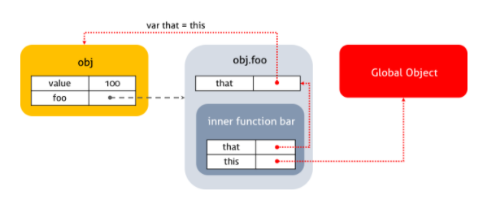
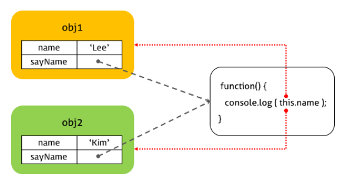
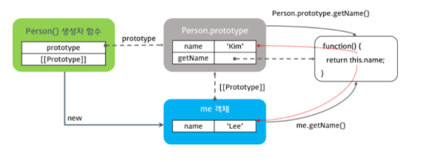

# this

> this는 현재 실행 문맥이다.
>
> `실행문맥`이란 말은 호출자가 누구냐는 것과 같다.

자바스크립트의 함수는 호출될 때, 매개변수로 전달되는 인자값 이외에 arguments 객체와 `this`를 암묵적으로 전달받는다.

```js
function square(n) {
    console.log(arguments) // Arguments [2, callee: ƒ, Symbol(Symbol.iterator): ƒ]
    console.log(this) // Window {0: global, 1: global, window: Window, self: Window, document: document, name: "", location: Location, …}
    
    return n * n;
}

square(2);
```

## 함수 호출 방식과 this 바인딩

자바스크립트의 경우 함수 호출 방식에 의해 `this`에 바인딩할 어떤 객체가 동적으로 결정된다. 

다시 말해, 함수를 선언할 때 this에 바인딩할 객체가 정적으로 결정되는 것이 아니고, `함수를 호출할 때 함수가 어떻게 호출되었는지에 따라` this에 바인딩할 객체가 동적으로 결정된다.

함수의 호출 방식은 다양하다

```js
var foo = function () {
    console.dir(this);
}

// 1.함수 호출
foo(); // window
// window.foo();

// 2.메소드 호출
var obj = {foo: foo};
obj.foo();

// 3.생성자 함수 호출
var instance = new foo(); // instance

// 4.apply/call/bind 호출
var bar = {name : 'bar'}
foo.call(bar);   // bar
foo.apply(bar);  // bar
foo.bind(bar)(); // bar
```

## 1. 함수 호출

전역 객체는 모든 객체의 유일한 최상위 객체를 의미하며 일반적으로 Browser-side 에서는 `window`, Server-side에서는 `global` 객체를 의미한다.

```js
// in browser console
this === window // true

// in Terminal
node
this === global // true
```

전역객체는 전역 스코프를 갖는 전역 변수를 프로퍼티로 소유한다. 글로벌 영역에 선언한 함수는 전역객체의 프로퍼티로 접근할 수 있는 전역 변수의 메소드이다.

```js
var ga = 'Global variable';

console.log(ga); // Global variable
console.log(window.ga); // Global variable

function foo() {
  console.log('invoked!');
}
window.foo(); // invoked!
```

기본적으로 `this`는 전역객체에 바인딩된다. 전역함수는 물론이고 심지어 내부함수의 경우도 `this`는 외부함수가 아닌 전역객체에 바인딩된다.

```js
function foo() {
  console.log("foo's this: ",  this);  // window
  function bar() {
    console.log("bar's this: ", this); // window
  }
  bar();
}
foo();
```

또한 메소드의 내부함수일 경우에도 `this`는 전역객체에 바인딩된다.

```js
var value = 1;

var obj = {
  value: 100,
  foo: function() {
    console.log("foo's this: ",  this);  // obj
    console.log("foo's this.value: ",  this.value); // 100
    function bar() {
      console.log("bar's this: ",  this); // window
      console.log("bar's this.value: ", this.value); // 1
    }
    bar();
  }
};

obj.foo();
```

콜백함수의 경우에도 `this`는 전역객체에 바인딩된다.

```js
var value = 1;

var obj = {
  value: 100,
  foo: function() {
    setTimeout(function() {
      console.log("callback's this: ",  this);  // window
      console.log("callback's this.value: ",  this.value); // 1
    }, 100);
  }
};

obj.foo();
```

**내부함수는 일반 함수, 메소드, 콜백함수 어디에서 선언되었든 관계없이 this는 전역객체를 바인딩한다.** 더글라스 크락포드는 "이것은 설계 단계의 결함으로 메소드가 내부함수를 사용하여 자신의 작업을 돕게 할 수 없다는 것을 의미한다."라고 말한다. 내부함수의 `this`가 전역객체를 참조하는 것을 회피하는 방법은 아래와 같다.

```js
var value = 1;

var obj = {
  value: 100,
  foo: function() {
    var that = this;  // Workaround : this === obj

    console.log("foo's this: ",  this);  // obj
    console.log("foo's this.value: ",  this.value); // 100
    function bar() {
      console.log("bar's this: ",  this); // window
      console.log("bar's this.value: ", this.value); // 1

      console.log("bar's that: ",  that); // obj
      console.log("bar's that.value: ", that.value); // 100
    }
    bar();
  }
};

obj.foo();
```



위 방법 이외에도 자바스크립트는 this를 명시적으로 바인딩할 수 있는 apply, call, bind 메소드를 제공한다.

```js
var value = 1;

var obj = {
    value: 100,
    foo: function() {
        console.log("foo's this", this); // obj
        console.log("foo's this.value: ",  this.value); // 100
        function bar(a, b) {
            console.log("bar's this: ",  this); // obj
            console.log("bar's this.value: ", this.value); // 100
            console.log("bar's arguments: ", arguments); // 
        }
        bar.apply(obj, [1, 2]);
        bar.call(obj, 1, 2);
        bar.bind(obj)(1, 2);
    }
}
obj.foo();
```

## 2. 메소드 호출

함수가 객체의 프로퍼티 값이면 메소드로서 호출된다. 이때 메소드 내부의 `this`는 해당 메소드를 소유한 객체, 즉 해당 메소드를 호출한 객체에 바인딩된다.

```js
var obj1 = {
  name: 'Lee',
  sayName: function() {
    console.log(this.name);
  }
}

var obj2 = {
  name: 'Kim'
}

obj2.sayName = obj1.sayName;

obj1.sayName(); // Lee
obj2.sayName(); // Kim
```



프로토타입 객체도 메소드를 가질 수 있다. 프로토타입 객체 메소드 내부에서 사용된 this도 일반 메소드 방식과 마찬가지로 해당 메소드를 호출한 객체에 바인딩된다.

```js
function Person(name) {
  this.name = name;
}

Person.prototype.getName = function() {
  return this.name;
}

var me = new Person('Lee');
console.log(me.getName()); // Lee

Person.prototype.name = 'Kim';
console.log(Person.prototype.getName()); // Kim
```



## 3. 생성자 함수 호출

자바스크립트의 생성자 함수는 말 그대로 객체를 생성하는 역할을 한다. 하지만 자바와 같은 객체지향 언어의 생성자 함수와는 다르게 그 형식이 정해져 있는 것이 아니라 **기존 함수에 new 연산자를 붙여서 호출하면 해당 함수는 생성자 함수로 동작한다.**

이는 반대로 생각하면 생성자 함수가 아닌 일반 함수에 new 연산자를 붙여 호출하면 생성자 함수처럼 동작할 수 있다. 따라서 일반적으로 생성자 함수명은 첫문자를 대문자로 기술하여 혼란을 방지하려는 노력을 한다.

```js
// 생성자 함수
function Person(name) {
  this.name = name;
}

var me = new Person('Lee');
console.log(me); // Person&nbsp;{name: "Lee"}

// new 연산자와 함께 생성자 함수를 호출하지 않으면 생성자 함수로 동작하지 않는다.
var you = Person('Kim');
console.log(you); // undefined
```

new 연산자와 함께 생성자 함수를 호출하면 this 바인딩이 메소드나 함수 호출 떄와는 다르게 동작한다.

#### 3.1 생성자 함수 동작 방식

new 연산자와 함께 생성자 함수를 호출하면 다음과 같은 수순으로 동작한다.

1. 빈 객체 생성 및 this 바인딩
   생성자 함수의 코드가 실행되기 전 빈 객체가 생성된다. 이 빈 객체가 생성자 함수가 새로 생성하는 객체이다. 이후 생성자 함수내에서 사용되는 this는 이 빈 객체를 가리킨다. 그리고 생성된 빈 객체는 생성자 함수의 prototype 프로퍼티가 가리키는 객체를 자신의 프로토타입 객체로 설정한다.
2. this를 통한 프로퍼티 생성
   생성된 빈 객체에 this를 사용하여 동적으로 프로퍼티나 메소드를 생성할 수 있다. this는 새로 생성된 객체를 가리키므로 this를 통해 생성한 프로퍼티와 메소드는 새로 생성된 객체에 추가된다.
3. 생성된 객체 반환
   반환문이 없는 경우, this에 바인딩된 새로 생성한 객체가 반환된다. 명시적으로 this를 반환해도 결과는 같다.
   반환문이 this가 아닌 다른 객체를 명시적으로 반환할 경우, 해당 객체가 반환된다. 이때 this를 반환하지 않은 함수는 생성자 함수로서의 역할을 수행하지 못한다. 따라서 생성자 함수는 반환문을 명시적으로 사용하지 않는다.

```js
function Person(name) {
  // 생성자 함수 코드 실행 전 -------- 1
  this.name = name;  // --------- 2
  // 생성된 함수 반환 -------------- 3
}

var me = new Person('Lee');
console.log(me.name);
```

### 계속...
