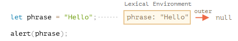
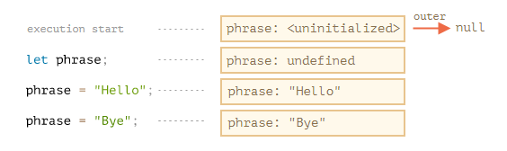
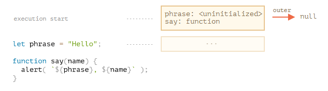
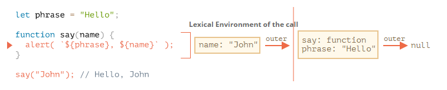
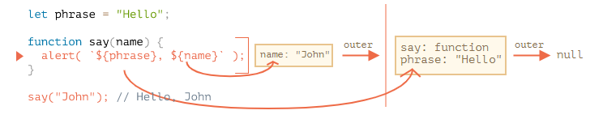
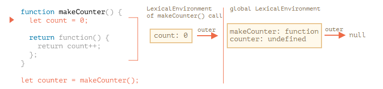
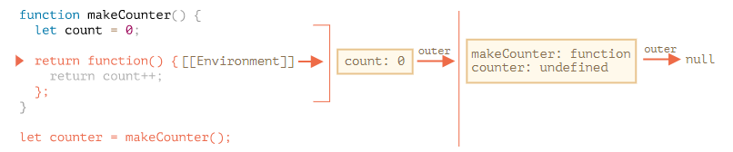
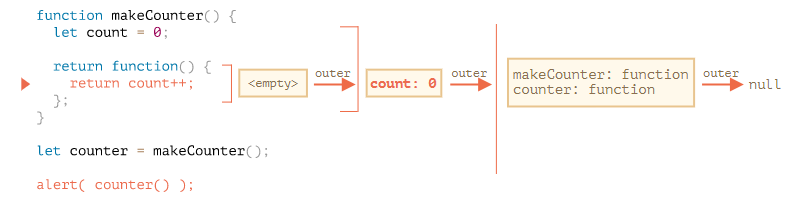
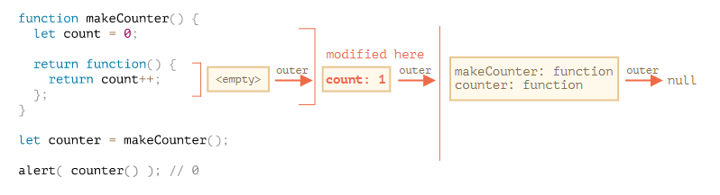

# 변수의 유효범위와 클로저

[TOC]

자바스크립트는 함수  지향 언어입니다. 이런 특징은 개발자에게 많은 자유를 줍니다. 함수를 동적으로 생성할 수 있고, 생성한 함수를 다른 함수에 인수로 넘길 수 있으며, 생성된 곳이 아닌 곳에서 함수를 호출할 수도 있기 때문입니다.

함수 내부에서 함수 외부에 있는 변수에 접근할 수 있다는 사실은 앞서 학습했습니다.

그런데 함수가 생성된 이후에 외부 변수가 변경되면 어떤 일이 발생할까요? 함수는 새로운 값을 가져올까요? 아니면 생성 시점 이전의 값을 가져올까요?

매개변수를 통해 함수를 넘기고 이 함수를 저 멀리 떨어진 코드에서 호출할 땐 어떤 일이 발생할까요? 함수는 호출되는 곳을 기준으로 외부 변수에 접근할까요?

## 코드 블록

코드 블록 `{...}` 안에서 선언한 변수는 블록 안에서만 사용할 수 있습니다.

```javascript
{
    // 지역 변수를 선언하고 몇 가지 조작을 했지만 그 결과를 밖에서 볼 수 없음
    let msg = 'hi'
    alert(msg) // hi
}
alert(msg) // ReferenceError
```

이런 블록의 특징은 특정 작업을 수행하는 코드를 한데 묶어두는 용도로 활용할 수 있습니다. 블록 안엔 작업 수행에만 필요한 변수가 들어갑니다.

```javascript
{
    // 메시지 출력
    let msg = 'hi'
    alert(msg);
}

{
    // 또 다른 메시지 출력
    let msg = 'bye'
    alert(msg)
}
```

블록이 없으면 에러가 발생합니다. let은 mutable해서 재할당은 가능하지만 재선언은 불가능하기 때문이죠!

if, for, while 등에서도 마찬가지로 `{...}` 안에서 선언한 변수는 오직 블록 안에서만 접근 가능합니다.

```javascript
if (true) {
    let phrase = 'hi'
    alert(phrase) // hi
}
alert(phrase) // ReferenceError
```

`if` 블록 밖에 있는 alert는 phrase에 접근할 수 없기 때문에 위 예시를 실행하면 에러가 발생ㅎ바니다.

이런 특징은 변수의 유효 범위를 블록, 특히 `if` 분기문 범위로 한정시킬 수 있어서 아주 유용합니다.

if 뿐만 아니라 for, while 반복문에서도 동일한 특징이 적용됩니다.

```javascript
for (let i=0; i<3; i++) {
    // 변수 i는 for 안에서만 사용할 수 있다.
    alert(i); // 0, 1 ,2
}
alert(i); // ReferenceError
```

참고로 for문에서 for 옆 괄호 안에서 선언한 변수는 `{...}` 밖에 있지만 블록에 속하는 코드로 취급됩니다.

## 중첩 함수

함수 내부에서 선언한 함수는 중첩(nested) 함수라고 부릅니다.

자바스크립트에선 손쉽게 중첩 함수를 만들 수 있습니다.

중첩 함수는 아래와 같이 코드를 정돈하는데 사용할 수 있습니다.

```javascript
function hi(a, b) {
    // helper nested function
    function sumAB() {
        return a + b
    }
    alert('hi', sumAB())
}
```

쓰다 보니 클래스와 비슷하게 느껴집니다. `makeCounter`라는 함수를 만들어 봅시다.

```javascript
function makeCounter() {
    let count = 0;
    return function() {
        return count++;
    }
}

let counter = makeCounter();
alert( counter() ); // 0
alert( counter() ); // 1
alert( counter() ); // 2
```

예시의 함수는 아주 단순하지만, 약간의 변형을 가하면 난수 생성기같은 실용성 있는 함수를 만들 수 있습니다.

```javascript
// JavaScript 난수생성기 (1 이상 ~ 100 이하)
// floor가 아니라 round를 쓰면 난수가 고르게 분포하지 않게 된다.
function makeRandom() {
    return Math.floor(Math.random()*100) + 1
}
```

그런데 이런 함수를 만들다 보면 `counter`를 여러 개 만들었을 때, 이 함수들은 서로 독립적일까? 함수와 중첩 함수 내의 `count` 변수엔 어떤 값이 할당될까? 같은 의문이 들기 마련입니다.

이런 의문을 해결할 수 있게 되면 자바스크립트 숙련도가 크게 올라갑니다. 좀 더 복잡한 시나리오도 다룰 수 있게 되죠.

## 렉시컬 환경 (Lexical Environment)

Lexical Scope는 함수를 어디서 선언하였는지에 따라 상위 스코프를 결정하는 것이다.

### 1. 변수

js에선 실행 중인 함수, 코드 블록, 스크립트 전체는 렉시컬 환경이라 불리는 내부 숨김 연관 객체 (internal hidden accociate object)를 갖숩니다.

렉시컬 환경 객체는 두 부분으로 구성됩니다.

1. 환경 레코드 (Environment Record) - 모든 지역 변수를 프로퍼티로 저장하고 있는 객체입니다. `this` 값과 같은 기타 정보도 여기에 저장됩니다.
2. 외부 렉시컬 환경에 대한 참조 - 외부 코드와 연관됨

**변수는 특수 내부 객체인 환경 레코드의 프로퍼티일 뿐입니다. 변수를 가져오거나 변경하는 것은 환경 레코드의 프로퍼티를 가져오거나 변경함을 의미합니다.**

아래 두 줄짜리 코드엔 렉시컬 환경이 하나만 존재합니다.



이렇게 스크립트 전체와 관련된 렉시컬 환경은 전역 렉시컬 환경 (global lexical environment) 이라고 합니다.

위 그림에서 네모 상자는 변수가 저장되는 환경 레코드를 나타내고 붉은 화살표는 외부 렉시컬 환경에 대한 참조를 나타냅니다. 전역 렉시컬 환경은 외부 참조를 갖지 않기 때문에 화살표가 `null`을 가리키는 걸 확인할 수 있습니다.

코드가 실행되고 실행 흐름이 이어져 나가면서 렉시컬 환경은 변화합니다.

좀 더 긴 코드를 살펴봅시다.



우측의 네모 상자들은 코드가 한 줄, 한 줄 실행될 때마다 전역 렉시컬 환경이 어떻게 변화하는지 보여줍니다.

1. 스크립트가 시작되면 스크립트 내에서 선언한 변수 전체가 렉시컬 환경에 올라갑니다. (pre-populated)
   - 이때 변수의 상태는 특수 내부 상태(special internal state)인 `uninitialized`가 됩니다. JS 엔진은 uninitialized 상태의 변수를 인지하긴 하지만, `let`을 만나기 전까진 이 변수를 참조할 수 없습니다.
2. let phrase가 나타났네요. 아직 할당된 값이 없어서 property value는 `undefined` 입니다. phrase는 이 시점 이후부터 사용할 수 있습니다.
3. phrase에 값이 할당되었습니다.
4. phrase에 값이 할당되었습니다.

아직까진 어려운게 없네요. 요약합시다.

- 변수는 특수 내부 객체인 환경 레코드의 프로퍼티입니다. 환경 레코드는 현재 실행 중인 함수와 코드 블록, 스크립트와 연관되어 있습니다.
- 변수를 변경하면 환경 레코드의 프로퍼티가 변경됩니다.

### 2. 함수 선언문

함수는 변수와 마찬가지로 값입니다.

**다만 함수 선언문 (function declaration)으로 선언한 함수는 일반 변수와는 달리 바로 초기화된다는 점에서 차이가 있습니다.**

함수 선언문으로 선언한 함수는 렉시컬 환경이 만들어지는 즉시 사용할 수 있습니다. 변수는 `let`을 만나 선언이 될 때까지 사용할 수 없지만요.

선언되기 전에도 함수를 사용할 수 있는 것은 바로 이 때문입니다.

아래 그림은 스크립트에 함수를 추가했을 때 전역 렉시컬 환경 초기 상태가 어떻게 변하는지 보여줍니다.



이런 동작 방식은 함수 선언문으로 정의한 함수에만 적용됩니다. `let say = function(name) ...`같이 함수를 변수에 할당한 함수 표현식 (function expression)은 해당하지 않습니다.

### 3. 내부와 외부 렉시컬 환경

함수를 호출해 실행하면 새로운 렉시컬 환경이 자동으로 만들어집니다. 이 렉시컬 환경엔 함수 호출 시 넘겨받은 매개변수와 함수의 지역 변수가 저장됩니다.

`say("John")`을 호출하면 아래와 같은 내부 변화가 일어납니다. (실행 흐름은 붉은색 화살표로 나타낸 줄에 멈춘 상태)



함수가 호출 중인 동안엔 호출 중인 함수를 위한 내부 렉시컬 환경과, 그게 가리키는 외부 렉시컬 환경을 갖게 됩니다.

- 예시의 내부는 현재 실행 중인 `say`에 상응합니다. 내부 렉시컬 환경엔 함수의 인자인 `name`으로부터 유래한 프로퍼티 하나만 있네요.
- 예시의 외부는 전역입니다. 전역은 `phrase`와 `say`를 프로퍼티로 갖습니다.

그리고 내부 렉시컬 환경은 외부 렉시컬 환경에 대한 참조를 갖습니다.

**코드에서 변수에 접근할 땐, 먼저 내부 렉시컬 환경을 검색 범위로 잡습니다. 내부 렉시컬 환경에서 원하는 변수를 찾지 못하면 검색 번위를 외부로 확장합니다. 이 과정은 검색 범위가 전역으로 확장될 때까지 반복됩니다.**

전역 렉시컬 환경에 도달할 때까지 변수를 찾지 못하면 엄격 모드에선 에러가 발생합니다. 참고로 비 엄격 모드에선 정의되지 않은 변수에 값을 할당하려고 하면 에러가 발생하는 대신 새로운 전역 변수가 만들어지는데, 이는 하위 호환성을 위해 남아있는 기능입니다.

**비 엄격**

```javascript
function foo() { 
  bar = true; 
} 
foo(); // no error
```

**엄격**

```javascript
function fooo() {
    'use strict'
    bar = true;
}
fooo() // ReferenceError
```

```javascript
function foo() {
  'use strict';
  var bar = true;
}
foo(); 
```


예시와 그림을 보면서 변수 검색이 어떻게 진행되는지 다시 정리해 봅시다.

- 함수 `say` 내부의 `alert`에서 변수 `name`에 접근할 땐, 먼저 내부 렉시컬 환경을 살펴봅니다. 내부에서 `name`을 찾았습니다.
- alert에서 phrase에 접근하려는데, phrase에 상응하는 프로퍼티가 내부에는 없습니다. 따라서 검색 범위는 외부로 확장됩니다.



### 4. 함수를 반환하는 함수

makeCounter 예시로 돌아가 봅시다.

```javascript
function makeCounter() {
  let count = 0;

  return function() {
    return count++;
  };
}

let counter = makeCounter();
console.log(counter());
```

makeCounter를 호출하면 호출할 때마다 새로운 렉시컬 환경 객체가 만들어지고 여기에 makeCounter를 실행하는데 필요한 변수들이 저장됩니다.

위쪽에서 살펴본 `say("john")` 예시와 마찬가지로 makeCounter를 호출할 때도 두 개의 렉시컬 환경이 만들어집니다.



그런데 위쪽에서 살펴본  John 예시와 달리 return count ++ (nested function)이 추가되었습니다.

여기서 중요한 사실이 하나 있습니다. 모든 함수는 함수가 생성된 곳의 렉시컬 환경을 기억한다는 점입니다. 함수는 `[[Environment]]` 라 불리는 숨김 프로퍼티를 갖는데, 여기에 함수가 만들어진 곳의 렉시컬 환경에 대한 참조가 저장됩니다.



따라서 `counter.[[Environment]]`엔 `{count: 0}`이 있는 렉시컬 환경에 대한 참조가 저장됩니다. 호출 장소와 상관없이 함수가 자신이 태어난 곳을 기억할 수 있는 건 바로 이 `[[Environment]]` 프로퍼티 덕분입니다. `[[Environment]]` 는 함수가 생성될 때 딱 한 번 값이 세팅되고 영원히 변치 않습니다.

`counter()`를 호출하면 각 호출마다 새로운 렉시컬 환경이 생성됩니다. 그리고 이 렉시컬 환경은 `counter.[[Environment]]`에 저장된 렉시컬 환경을 외부 렉시컬 환경으로서 참조합니다.



실행 흐름이 중첩 함수의 본문으로 넘어오면 `count` 변수가 필요한데, 자체 렉시컬 환경에는 없으니 외부로 나갑니다. 찾았습니다!

이제 count++가 실행되면서 1 증가해야 하는데, 변숫값 갱신은 변수가 저장된 렉시컬 환경에서 이루어집니다.

따라서 실행이 종료된 후의 상태는 다음과 같습니다.



이렇기 때문에 실행됐다고 해서 바로 1이 찍히는 것이 아닌 것입니다. 또한 여러 번 호출하면 2, 3으로 증가하는 이유가 바로 이것입니다.

## 클로저 (closure)

> 클로저 = 함수 + 함수를 둘러싼 환경 (Lexical Environment)
>
> 클로저는 독립적인 변수를 가리키는 함수이다. 또는, 클로저 안에 정의된 함수는 만들어진 환경을 기억한다.

클로저는 개발자라면 알고 있어야 할 프로그래밍 용어입니다.

클로저는 외부 변수를 기억하고 이 외부 변수에 접근할 수 있는 함수를 의미합니다. 몇몇 언어에서는 클로저를 구현하는게 불가능하거나 특수한 방식으로 함수를 작성해야 클로저를 만들 수 있습니다. 하지만 js에선 모든 함수가 자연스럽게 클로저가 됩니다. 예외가 하나 있긴 한데 자세한 내용은 [new Function 문법](https://ko.javascript.info/new-function)에서 다룹니다.

요점을 정리해 봅시다. 자바스크립트의 함수는 숨김 프로퍼티인 `[[Environment]]`를 이용해 자신이 어디서 만들어졌는지를 기억합니다. 함수 본문에선 `[[Environment]]`를 사용해 외부 변수에 접근합니다.

프런트엔드 개발자 채용 인터뷰에서 "클로저가 무엇입니까?"라는 질문을 받으면, 클로저의 정의를 말하고 자바스크립트에서 왜 모든 함수가 클로저인지에 관해 설명하면 될 것 같습니다. 이때 `[[Environment]]` 프로퍼티와 렉시컬 환경이 어떤 방식으로 동작하는지에 대한 설명을 덧붙이면 좋습니다.

```
클로저는 외부 변수를 기억하고 이 외부 변수에 접근할 수 있는 함수를 의미합니다.
그리고,
자바스크립트의 함수는 숨김 프로퍼티인 [[Environment]]를 이용해 자신이 어디서 만들어졌는지 기억합니다.
함수 본문에선 이를 이용해 외부 변수에 접근합니다.
```

### 클로저가 아닌 경우

```javascript
function foo() {
    var color = 'blue'
    function bar() {
        console.log(color)
    }
    bar()
}
foo()
```

여기서 `bar`는 클로저일까요?

bar는 foo 안에 속하기 때문에 foo 스코프를 외부 스코프 참조로 저장합니다. 또한 color도 참조가 가능합니다.

bar는 foo안에서 정의되고 실행되었을 뿐, foo 밖으로 나오지 않았기 때문에 클로저라고 부르지 않습니다.

### 클로저인 경우

```javascript
var color = 'red';
function foo() {
    var color = 'blue'; 
    function bar() {
        console.log(color);
    }
    return bar;
}
var baz = foo();
baz(); // blue
```

`bar`는 자신이 생성된 렉시컬 스코프 foo에서 벗어나 전역에서 baz라는 이름으로 호출되었습니다. baz()를 bar로 초기화할 때 이미 bar는 상위 스코프를 foo로 결정했기 때문에 아무리 전역에서 bar를 호출하더라도 foo의 컬러인 blue를 출력합니다.

이런 bar, baz를 클로저라고 부릅니다.

이렇게 쓰는 것도 가능하겠죠...

```javascript
var color = 'red';
function foo() {
    var color = 'blue'; 
    return function bar() {
        console.log(color);
    }
}
var baz = foo();
baz();// blue
```


### 그래서 다음과 같은 함수 사용이 가능해집니다...


```javascript
// sum(1)(2) = 3

function sum(a) {
    return function(b) {
        return a + b;
    }
}
```

```javascript
function makeAdder(x) {
    var y = 1
    return function(z) {
        y = 100
        return x + y + z
    }
}

let add5 = makeAdder(5)
let add10 = makeAdder(10)
// 클로저에 x와 y의 환경이 저장됨
// 유효범위의 어휘적 환경(lexical environment)을 유지
console.log(add5(10)) // 115 5 + 100 + 10
console.log(add10(10)) // 120 10 + 100 + 10
```

위 경우에서 return function(z)가 실행되기 전에 `makeAdder()`로부터 리턴된 값이 add5에 저장된다.

add5와 add10은 둘 다 클로저이다. 이들은 같은 함수 본문을 공유하지만 서로 다른 렉시컬 환경을 저장한다. 함수 실행 시 add5의 맥락에서 클로저 내부의 x는 5지만 add10에서는 x가 10이다. 또한 1로 초기화된 y에 접근하여 y값을 100으로 변경한 것을 볼 수 있다. 이는 클로저가 리턴된 후에도 외부함수의 변수들에 접근 가능하다는 것을 보여주는 포인트이며 클로저에 단순히 값 형태로 전달되는 것이 아니라는 것을 의미한다.

### 반복문 클로저

```javascript
var i;
for (i=0; i<10; i++) {
    setTimeout(function() {
        console.log(i);
    }, 100);
}
```

과연 이 코드는 0부터 9까지 출력될까요? 답은 아닙니다. setTimeout의 콜백 함수는 모두 0.1초뒤에 호출되고, 0.1초동안 반복문은 모두 순회되어 i의 값은 10이 된 상태에서 콜백 함수가 호출되면서 10이 돼버린 i를 참조하게 되는 것입니다.

- IIFE 사용 - 스코프를 추가하여 반복할 때마다 다른 값을 저장

```javascript
var i;
for (i=0; i<10; i++) {
    (function(e) {
        setTimeout(function() {
            console.log(e);
        }, 100)
    })(i);
}
```

- ES6 블록 스코프 사용

```javascript
for (let i = 0; i < 10; i++) {
    setTimeout(function () {
      console.log(i);
    }, 100);
}

for (let i = 0; i < 10; i++) {
  (function (j) {
    setTimeout(function () {
      console.log(j);
    }, 100);
  })(i);
}
```

위의 것 중 아래의 IIFE을 실행하면 setTimeout 자체는 저장되지 않는데, 이는 IIFE를 변수에 할당하면 IIFE 자체는 저장되지 않고, 함수가 실행된 결과만을 저장하기 때문이다.

다시 말해, 그냥 ES6 스펙에 따라 새로 추가된 let을 쓴다면 블록 스코프니까 정상적으로 잘 뜬다.

### 실용적 클로저

클로저는 어떤 데이터(렉시컬 환경)와 그 데이터를 조작하는 함수를 연관시켜주기 때문에 유용합니다. 이는 객체가 어떤 프로퍼티 하나 혹은 그 이상의 메소드들을 연관시킨다는 점에서 객체지향 프로그래밍과 분명히 같은 맥락에 있습니다.

결론적으로 오직 하나의 메소드를 가지고 있는 객체를 일반적으로 사용하는 모든 곳에 클로저를 사용할 수 있습니다. 

이렇게 할 수 있는 상황은 특히 웹에서 일반적입니다. FE JS에서 우리가 쓰는 많은 코드가 이벤트 기반입니다. 우리는 몇 가지 동작을 정의한 다음 사용자에 의한 이벤트(Click, keydown) 에 연결합니다. 우리의 코드는 일반적으로 콜백으로 첨부됩니다. 이벤트에 응답하여 실행되는 단일 함수입니다.

예를 들어 페이지의 글자 크기를 조정하는 몇 개의 버튼을 추가한다고 가정합시다. 이 작업을 수행하는 한 가지 방법은 body의 font-size 요소를 픽셀 단위로 지정하고 상대적인 em 단위를 사용하여 페이지의 다른 요소들 (예: 헤더) 크기를 설정하는 것입니다.

```css
body {
  font-family: Helvetica, Arial, sans-serif;
  font-size: 12px;
}

h1 {
  font-size: 1.5em;
}

h2 {
  font-size: 1.2em;
}
```

자바스크립트 코드로 다음과 같이 폰트 조절이 가능해집니다.

```javascript
function changeSize(size) {
    return function() {
        document.body.style.fontSize = size + 'px';
    }
}

var size12 = changeSize(12);
var size14 = changeSize(14);
var size16 = changeSize(16);
```

```html
<a href="#" id="size-12">12</a>
<a href="#" id="size-14">14</a>
<a href="#" id="size-16">16</a>
```

## Practice

```javascript
var num = 1;

function a() {
    var num = 10;
    b();
}
function b() {
    console.log(num);
}
a(); // 1
b(); // 1
```

이러한 출력의 이유는 함수의 호출로 상위 스코프가 결정된 것이 아니라, **함수의 선언**에 따라 상위 스코프가 결정되었기 때문이다. 즉, b()는 상위 스코프(전역 lexical env)를 가리키고 있음을 알 수 있다.

```javascript
function init() {
    var name = 'Mozilla';
    function displayName() {
        console.log(name);
    }
    displayName()
}
init() // Mozilla
```

