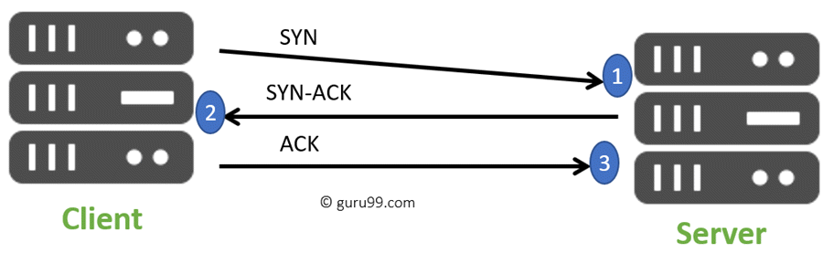
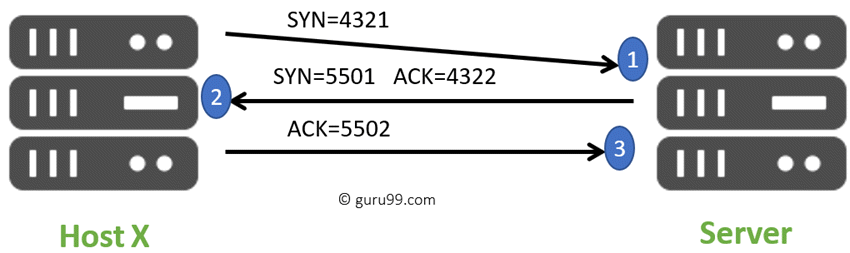

# Three Way HandShake의 이해

[이 글(영문)](https://www.guru99.com/tcp-3-way-handshake.html#2)을 정리해서 옮긴 글입니다.

## THREE WAY HANDSHAKE이란 무엇인가?

Three-Way HandShake, 혹은 TCP 3-way handshake라고 부르는 이것은 TCP/IP 네트워크에서 `client`와 `server` 간의 `연결 connection`을 만들기 위해 사용되는 `과정 process`입니다. 

실제 데이터 통신 프로세스가 시작되기 전에 클라이언트와 서버가 동기화/승인 패킷을 교환하는 3단계의 프로세스입니다.

이 프로세스는 두 단말이 동시에 TCP 소켓 연결을 `초기화/협상/분리 initiate/negotiate/separate`하는 데 도움이 되도록 설계되었습니다. 이는 또한 양방향으로 동시에 다수의 TCP 소켓 연결을 전송하는 것을 가능하게 합니다.

## TCP message types

| Message | Description                                                  |
| ------- | ------------------------------------------------------------ |
| SYN     | 연결을 시작하고 설정하는 데 사용됩니다. 또한 장치 간의 시퀀스 번호를 동기화합니다. |
| ACK     | 상대방이 SYN을 받았는지 확인합니다.                          |
| SYN-ACK | 로컬 장치의 SYN 메시지와 이전 패킷의 ACK입니다.              |
| FIN     | 연결을 종료하는 데 사용됩니다.                               |

## TCP Three-Way Handshake Process

TCP 트래픽은 3 단계 악수로 시작됩니다. 이 과정에서 클라이언트는 서버와의 통신 세션을 요청하여 대화를 시작해야 합니다.

1. 첫 번째 단계에서 클라이언트는 서버와 연결을 설정합니다. SYN과 함께 `*세그먼트 segment: TCP에서의 packet`를 보내고, 시퀀스 번호를 서버에게 알립니다. 
   이 때, 클라이언트는 `SYN_SENT` 상태가 됩니다.
2. 이 요청을 받는 서버는 `CLOSED가 아닌 LISTEN`상태로, 포트 서비스가 가능한 상태여야 합니다.
   요청을 성공적으로 받은 서버는 클라이언트에게 요청을 수락한다는 ACK와 SYN flag가 설정된 SYN-ACK 패킷을 발송하고 클라이언트가 다시 ACK로 응답하기를 기다립니다.
   이 때, 서버는 `SYN_RECEIVED` 상태가 됩니다.
3. 마지막으로 클라이언트는 서버에게 ACK를 보내고, 실제 데이터 전송 프로세스를 시작하기 위한 안정적인 연결을 생성하게 됩니다.
   이 때, 클라이언트와 서버 상태는 `ESTABLISHED`가 됩니다.

*segment: TCP에서 바이트 스트림을 그룹화한 것. 송신 TCP에서는 header를 붙여 segment를 만든 후 IP 계층으로 전달(capsulation)하고, 수신쪽은 header를 떼고 application으로 전달(decapsulation)한다. 세그먼트의 헤더 크기는 기본 20byte이고 옵션이 붙으면 최대 60byte까지 커진다.

## Real-world Example

- Host X는 TCP SYN 패킷을 보내는 것으로 연결을 시작합니다. 이 패킷은 Host X가 전송해야 하는 데이터에 대한 시작을 나타내는 랜덤한 시퀀스 번호 (예: 4321)가 포함되어 있습니다.
- 그 후 서버는 패킷을 수신하고 시퀀스 번호로 응답합니다. 응답에는 ACK, 즉 1이 증가한 Host X의 시퀀스 번호를 포함한 승인 번호가 포함됩니다.
- Host X는 서버의 시퀀스 번호에서 1이 증가한 ACK를 보내 서버에게 응답합니다.

데이터 전송 프로세스가 끝나면 TCP는 두 단말의 연결을 자동으로 종료합니다.

