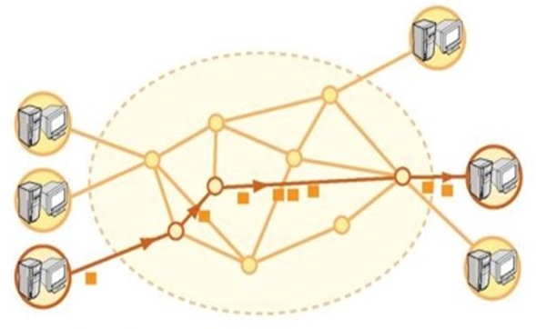
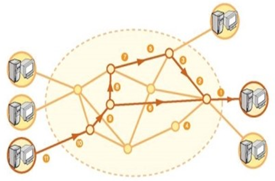

# 회선교환 vs 패킷교환

## 개요

회선교환과 패킷교환은 데이터 통신을 위한 대표적 교환기술입니다.

그렇다면 교환은 무엇일까요?

### 교환의 정의

- 교환이란 필요할 때만 단말 간의 통신로를 확보하여 통신망 전체의 효율화를 이룩하는 것입니다.
- 교환망의 종류로는 전화교환망, 패킷교환망, 회선교환망, 종합정보통신망이 있습니다.
- 데이터통신용 교환방식에는 `비저장방식인 회선 교환방식`과 `저장방식인 메시지 교환방식, 패킷 교환방식`이 있습니다.

### 회선교환 (Circuit-Switched) 방식의 정의

- 회선교환이란 송수신 단말장치 사이에서 데이터를 전송할 때마다 통신경로를 설정하여 데이터를 교환하는 방식입니다.
- 회선교환방식은 통화로 동작에 의해 공간분할방식과 시분할방식으로 구분됩니다.

### 패킷교환 (Packet-Switched) 방식의 정의

- 패킷교환이란 일정한 데이터 블록인 패킷을 교환기가 수신측 주소에 따라 적당한 통신경로를 선택하여 전송하는 교환방식입니다.
- 전송하고자 하는 정보를 일정한 크기의 데이터로 분할한 후, 송수신 주소인 헤더를 각각에 부가한 패킷단위로 전송하는 방식입니다.

## 회선교환

- `회선의 설정 -> 데이터의 이동 -> 회선의 단절` 3단계로 이루어집니다.
- 데이터가 전송되기 전에 두 단말장치 간에 회선을 설정하고, 회선이 설정되면 이 회선을 통해서 데이터를 전송하며, 일정시간이 지나면 두 단말장치 중 한 단말장치에 의해 연결이 단절됩니다.
- 통신할 때마다 매번 통신 경로를 설정하기 때문에 통신 중에 전송제어 절차, 정보의 형식 등에 제약을 받지 않아 원거리 통신에 비교적 적합합니다.
- 회선이 단절되기 전까지 데이터를 전송하지 않을 때에도 다른 단말장치들이 이 회선을 이용할 수 없으므로 회선의 이용률 측면에는 불리하지만, 독점적이기 때문에 트래픽이 몰려서 회선이 끊어지는 등의 장애는 없습니다.

### 장점

- 통신경로 접속시간이 매우 짧음. 1초 이내
- 통신 중 전송제어 절차, 정보의 형식에 구애받지 않음
- 비교적 길이가 길고 통신 밀도가 높은 데이터통신에 유리
- 전화망이 대표적인 예시

### 단점

- 통신하는 양측의 시스템이 **동시에** 데이터 교환준비가 되어있어야 함
- 접속이 되어 있는 동안은 두 시스템간의 통신 회선이 독점된 상태로, 다른 단말이 해당 회선을 이용하지 못함

## 패킷교환 방식

- 고정된 경로가 미리 설정되어 있지 않습니다.
- 전송은 패킷 단위로 독립적으로 이루어지며, 네트워크 트래픽 상태 등에 따라 각기 다른 전송경로를 가질 수 있습니다.
- 고정된 경로를 설정하지 않으므로 동일한 경로를 다른 목적지로 가는 여러 패킷들이 공유할 수 있어서 회선의 효율적인 사용이 가능합니다.
- 패킷 교환방식에는 `데이터그램, 가상 회선방식`이 있습니다.
- 패킷교환은 경로설정, 트래픽 제어, 에러제어 기능을 지닙니다.

### 장점

- 우회기능 보유로 신뢰성 매우 높음
- 에러발생시 한 패킷만 복구하면 되므로 고품질 확보 가능
- 네트워크 자원을 패킷 단위로 나눠서 시간을 공유하므로 회선 효율이 좋음
- 회선 방식에서는 네트워크 트래픽이 많으면 통신을 아예 차단하지만 패킷에서는 **Store-and-Forward**를 사용하기 때문에 각 스테이션에서 속도 조절이 가능
- **Store-and-Forward**방식을 사용하므로 전송 지연이 줄어들고 안정성이 높아짐

### 단점

- 축적 전송방식에 지연이 발생할 수 있음
- 데이터 단위의 길이 제한
- 패킷이 파일화되지 않음
- 메시지 교환방식과 비교하여 성능 면에서 뛰어난 것은 아님

| 특성                  | 회선교환                              | 패킷교환                         |
| --------------------- | ------------------------------------- | -------------------------------- |
| 대역폭사용형식        | 고정된 대역폭 전송                    | 대역폭 동적 사용                 |
| 대화식 사용면         | 대화식 사용이 가능할 정도로 빠름      | 대화식 사용이 가능할 정도로 빠름 |
| 메시지 저장 유무      | 저장 안됨                             | 배달될 때까지 저장 가능          |
| 전송경로의 형태       | 전체 전송을 위해 전송로 설립          | 패킷마다 전송로 설립             |
| 호출된 지국이 바쁠 때 | Busy 신호를 냄                        | 배달불가할 때 송신자에게 통보    |
| 교환노드 종류         | 전자 기계식 또는 컴퓨터화된 교환 노드 | 소규모 교환 노드                 |
| 속도와 코드 변환 여부 | 보통 없음                             | 속도와 코드 변환 존재            |
| 오버헤드비트          | 호출 설정 후에는 없음                 | 각 패킷마다 오버헤드비트 있음    |

*그림 출처: http://www.jidum.com/jidums/view.do?jidumId=456

## References

- http://www.jidum.com/jidums/view.do?jidumId=456
- https://wonit.tistory.com/553?category=856647

