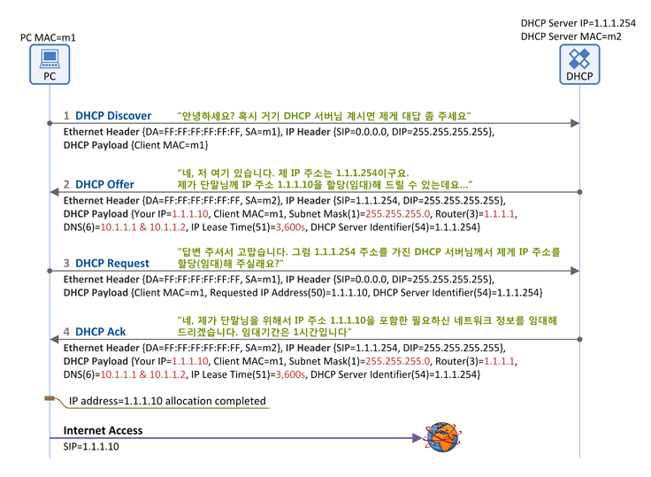

#  Dynamic Host Configuration Protocol

`동적 호스트 설정 프로토콜`

IP 라우터는 인터페이스 및 호스트에 IP 주소를 할당해 줄 수 있습니다. 예전에는 각 PC마다 고정 IP 설정을 도입하여 사용하거나, RFC 903에 정의된 것 처럼 *RARP를 도입하여 동적으로 적절한 IP 주소를 취득할 수 있게 구현하여 사용하였다. 고정 IP 설정의 단점은 무엇보다도 IP 설정에 실수가 있는 경우 네트워크 연결에 실패한다는 점입니다. 

*RARP (Reverse Address Resolution Protocol): IP 호스트가 자신의 물리 네트워크 주소 (MAC)는 알지만 IP 주소를 모르는 경우, 서버로부터 IP 주소를 요청하기 위해 사용한다.

예를 들어 실수로 오타가 날 경우, 다른 컴퓨터와 동일한 IP를 할당해서 충돌이 날 경우, 사용하지 않은 컴퓨터에도 IP가 할당되어 있어 IP가 모자라는 경우가 있습니다. RARP는 데이터 링크 계층에서 작동되어야 하므로 하드웨어로 구현이 어려웠으며, 서버가 각각의 네트워크에 존재해야만 한다는 단점이 있어 DHCP의 발표와 함께 사장되게 되었습니다.

위와 같은 문제 해결을 위해서 IP를 필요로 하는 컴퓨터에게 자동으로 할당해 주고, 사용하지 않으면 반환받는 것이 곧 `DHCP`입니다. 보통 라우터 장비에 해당 기능이 탑재되지만, 별도의 서버에 DHCP 서비스를 설정하여 사용할 수도 있습니다. 라우터는 단지 게이트웨이 역할만 하고, DHCP 서버는 별도로 두는 구성도 많이 사용됩니다.

## IP 공인중개사, DHCP

DHCP란 호스트의 IP 주소와 각종 TCP/IP 프로토콜의 기본 설정을 클라이언트에게 자동적으로 제공해주는 프로토콜을 말합니다. DHCP에 대한 표준 동작은 RFC 2131에서 정의하고 있습니다.

DHCP는 네트워크에 사용되는 IP 주소를 DHCP 서버가 중앙 집중식으로 관리하는 클라이언트/서버 모델을 사용하게 됩니다. DHCP 지원 클라이언트는 네트워크 부팅과정에서 DHCP 서버에 IP 주소를 요청하고 이를 얻을 수 있습니다.

DHCP를 통한 IP 주소 할당은 `임대`라는 개념을 가지고 있는데 이는 DHCP 서버가 IP 주소를 영구적으로 단말에 할당하는 것이 아니고 `임대 기간 IP Lease Time`을 명시하여 그 기간 동안만 단말이 IP 주소를 사용하도록 하는 것입니다. 단말이 임대기간 이후에도 계속 해당 IP 주소를 사용하고자 한다면 `IP 주소 임대기간 연장 IP Address Renewal`을 DHCP 서버에 요청해야 하고, IP주소가 더 이상 필요하지 않게 되면 `IP 주소 반납 절차 IP Address Release`를 수행하게 됩니다.

그럼 단말 (DHCP Client)이 DHCP 서버로부터 IP 주소를 할당(임대)받는 절차에 대해서 알아 보도록 합시다.

IP 주소 임대 절차에 사용되는 메시지는 아래와 같이 4개로 구성되어 있습니다. 3-way handshaking이랑 굉장히 비슷하죠?

### DHCP Discover

- 메시지 방향: 단말 -> DHCP 서버
- 브로드캐스트 메시지 (Destination MAC = FF:FF:FF:FF:FF:FF)
- 의미: 단말이 DHCP 서버를 찾기 위한 메시지입니다. LAN(동일 subnet)에 브로드캐스팅을 하여 "서버야? 혹시 내목소리 들리니?" 라고 외치는 것입니다.
- 주요 파라미터
  - Client MAC: 단말의 MAC 주소

### DHCP Offer

- 메시지 방향: DHCP 서버 -> 단말
- 브로드캐스트 메시지 (Destination MAC = FF:FF:FF:FF:FF:FF)이거나 유니캐스트일수 있습니다. 이는 단말이 보낸 DHCP Discover 메시지 내의 Broadcast Flag의 값에 따라 달라지는데, 이 Flag=1이면 DHCP 서버는 DHCP Offer 메시지를 Broadcast로, Flag=0이면 Unicast로 packet forwarding 됩니다.
  - DHCP 메시지 내에 Broadcast Flag가 존재하는 이유는 단말의 TCP/IP 구현 특성에 기인한다. 어떤 단말은 DHCP Ack 메시지를 통해 최종적으로 IP 주소를 할당받기 전까지는 해당 IP 주소를 목적지로 하는 유니캐스트 패킷을 수신할 수 없으며 이 경우 단말은 DHCP Discover/Request 메시지를 보낼 때 Flag를 1로 하는 것이고, 만약 IP 주소를 할당 받기 전에도 유니캐스트 패킷을 수신할 수 있는 단말(Windows의 경우)은 Flag를 0으로 설정하는 것이다.
- 의미: DHCP 서버가 "저 여기 있어요~"라고 응답하는 메시지입니다. 단순히 DHCP 서버의 존재만을 알리지 않고, 단말에 할당할 IP 주소 정보를 포함한 다양한 "네트워크 정보"를 함께 실어서 단말에 전달합니다.
- 주요 파라미터
  - Client MAC: 단말의 MAC 주소
  - Your IP: 단말에 할당(임대)할 IP 주소
  - Subnet Mask (Option 1)
  - Router (Option 3): 단말의 Default Gateway IP 주소
  - DNS (Option 6): DNS 서버 IP 주소
  - IP Lease Time (Option 51): 단말이 IP 주소(Your IP)를 사용(임대)할 수 있는 기간(시간)
  - DHCP Server Identifier (Option 54): 본 메시지(DHCP Offer)를 보낸 DHCP 서버의 주소. 2개 이상의 DHCP 서버가 DHCP Offer를 보낼 수 있으므로 각 DHCP 서버는 자신의 IP 주소를 본 필드에 넣어서 단말에 보냄

### DHCP Request

- 메시지 방향: 단말 -> DHCP 서버
- 브로드캐스트 메시지 (Destination MAC = FF:FF:FF:FF:FF:FF)
  - 브로드캐스트 메시지를 보내는 이유: DHCP Offer 메시지를 수신한 단말은 동일 서브넷에 DHCP 서버가 존재한다는 것을 알았고 이제 단말 IP 주소를 포함한 네트워크 정보를 요청하기 위해서 DHCP 서버에 DHCP Request 메시지를 이더넷 망에 브로드캐스팅한다. 이때 동일 서브넷 상에 2대 이상의 DHCP 서버가 존재하는 경우, 단말은 복수개의 DHCP Offer 메시지를 수신하게 될 것이고 단말은 이 중에 하나의 DHCP 서버를 선택 하여 그 서버의 IP 주소를 DHCP Request 메시지 내에 Server Identifier(Option 54)필드에 기록 후 모든 DHCP 서버에게 그 사실을 알린다(브로드캐스팅). 모든 DHCP 서버들이 DHCP Request 메시지를 받을 수 있도록 브로드캐스팅하는 이유는 각 DHCP 서버가 DHCP Offer 메시지를 보내면서 해당 단말에 할당해 줄 IP 주소와 기타 정보를 내부적으로 저장해 놓기 때문에 선택 받지 못한 DHCP 서버들이 이 IP 주소와 기타 정보들을 삭제할 수 있도록 하기 위함이다.
- 의미: 단말은 DHCP 서버(들)의 존재를 알았고, DHCP 서버가 단말에 제공할 네트워크 정보(IP 주소, subnet mask, default gateway등)를 알았습니다. 이제 단말은 DHCP Request 메시지를 통해 하나의 DHCP 서버를 선택하고 해당 서버에게 "단말이 사용할 네트워크 정보"를 요청합니다.
- 주요 파라미터
  - Client MAC: 단말의 MAC 주소
  - Requested IP Address (Option 50): 난 이 IP 주소를 사용하겠다. (DHCP Offer의 Your IP 주소가 여기에 들어감)
  - DHCP Server Identifier (Option 54): 2대 이상의 DHCP 서버가 DHCP Offer를 보낸 경우, 단말은 이 중에 마음에 드는 DHCP 서버 하나를 고르게 되고, 그 서버의 IP 주소가 여기에 들어감. 즉, DHCP Server Identifier에 명시된 DHCP 서버에게 "DHCP Request" 메시지를 보내어 단말 IP 주소를 포함한 네트워크 정보를 얻는 것임

### DHCP Ack

- 메시지 방향: DHCP 서버 -> 단말
- 브로드캐스트 메시지 (Destination MAC = FF:FF:FF:FF:FF:FF) 혹은 유니캐스트일수 있으며 이는 단말이 보낸 DHCP Request 메시지 내의 Broadcast Flag=1이면 DHCP 서버는 DHCP Ack 메시지를 Broadcast로, Flag=0이면 Unicast로 보내게 됩니다.
- 의미: DHCP 절차의 마지막 메시지로, DHCP 서버가 단말에게 "네트워크 정보"를 전달해 주는 메시지입니다. 앞서 설명드린 DHCP Offer의 '네트워크 정보"와 동일한 파라미터가 포함됩니다.
- 주요 파라미터
  - Client MAC: 단말의 MAC 주소
  - Your IP: 단말에 할당(임대)할 IP 주소
  - Subnet Mask (Option 1)
  - Router (Option 3): 단말의 Default Gateway IP 주소
  - DNS (Option 6): DNS 서버 IP 주소
  - IP Lease Time (Option 51): 단말이 본 IP 주소(Your IP)를 사용(임대)할 수 있는 기간(시간)
  - DHCP Server Identifier (Option 54): 본 메시지(DHCP Ack)를 보낸 DHCP 서버의 주소

이 과정을 거쳐 DHCP Ack를 수신한 단말은 IP 주소를 포함한 네트워크 주소 임대에 성공했고, 인터넷 사용이 가능해 졌습니다.

## References

- https://jwprogramming.tistory.com/35
- https://www.netmanias.com/ko/post/blog/5348/dhcp-ip-allocation-network-protocol/understanding-the-basic-operations-of-dhcp

