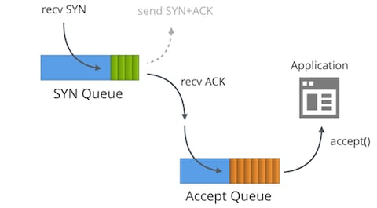
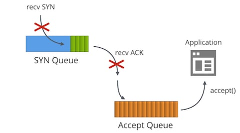
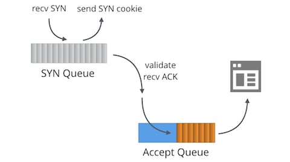
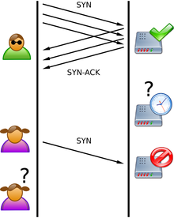
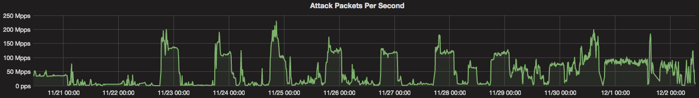

# SYN 패킷 처리 딥다이브(번역 + 추가) 🐋

3 way handshake은 정확한 전송을 보장하기 위해 단말 간에 세션을 수립하는 과정입니다. `SYN synchronization packet`과 `ACK acknowledgment packet`을 사용합니다. 클라이언트에서 SYN(a)을 보내고, 서버는 SYN(b), ACK(a+1)을 보내고, 클라이언트는 다시 ACK(b+1)을 보냅니다.

그런데 궁금한 것이 생겼습니다. 그럼 내부적으로는 SYN 패킷 관련 처리를 어떻게 하는 것일까요? SYN 패킷은 무한정으로 받을 수 있을까요?

## 이 글은 🤔

궁금증을 해결하기 위해 검색하다가 찾은 [SYN에 대한 정말 좋은 글(영문)](https://blog.cloudflare.com/syn-packet-deepdive-handling-in-the-wild/)을 보고, 부가적인 설명을 곁들이며 정리한 글입니다.

실제 서버 운영 경험이 많은 `Cloudflare`에서 이와 관련해 `깊게 파헤치는(원문: black art)` 것을 게을리하지 않아 준 것이 감사하네요. [이 글의 번역](https://blog.cloudflare.com/ko-kr/syn-packet-deepdive-handling-in-the-wild-ko-kr/)에서도 큰 도움을 받았습니다.

- 클라우드플레어는 미국 소재의 CDN 서비스와 DNS 서비스를 제공하는 기업으로, 본사는 미국 샌프란시스코에 있습니다.
- 2021년 기준 전 세계 웹사이트 5개 중 1개가 클라우드플레어의 `Reverse Proxy` 서비스와 `DNS server`를 사용할 정도인 인터넷업계의 거인입니다.

이 글을 이해하기 위한 TCP 3 way handshake에 관해서는 [제 전 포스팅](https://jdev.tistory.com/92)을 읽어 주세요.

## 들어가며

사람들이 그다지 신경쓰지 않는 주제 중 SYN floods가 있습니다. Cloudflare는 리눅스를 사용하고 있는데 리눅스에서 SYN 처리는 정말로 복잡합니다. 이 글에서 이 주제를 깊게 파헤쳐 보겠습니다.

## 두 개의 큐에 대한 이야기



`listen이나 연결을 위한 준비 상태의 소켓 (bound socket)`은 `LISTENING` TCP 상태에 두 개의 분리된 큐를 가집니다.

- SYN Queue
- Accept Queue

일반적으로 이 큐에는 reqsk_queue, ack backlog, listen backlog, TCP backlog 등 다양한 이름이 있지만 혼선을 피하기 위해 위의 이름으로 정하고 시작하겠습니다.

## SYN Queue

SYN 큐는 수신한 SYN 패킷(구체적으로는 `struct inet_request_sock`)을 저장합니다. 이는 SYN+ACK을 보내고 타임아웃시에 재시도하는 역할을 합니다. 리눅스에서 재시도 값은 다음과 같이 설정됩니다:

```shell
$ sysctl net.ipv4.tcp_synack_retries
net.ipv4.tcp_synack_retries = 5
```

Docs는 다음과 같습니다:

```
tcp_synack_retries - 정수

수동 TCP 연결 시도에 대해서 SYN+ACK를 몇번 다시 보낼지를 지정한다.
이 값은 255 이하이어야 한다. 기본값은 5이며, 1초의 초기 RTO값을 감안하면
마지막 재전송은 31초 후에 일어난다. 이는 수동 TCP 연결의 최종 타임아웃은
63초 이후에 일어난다는 것을 의미한다.
```

이를 표로 나타내면:

| Time  | Description                                    |         |
| ----- | ---------------------------------------------- | ------- |
| +0초  | SYN+ACK 전송 (timeout=RTO=1초)                 |         |
| +1초  | 새 timeout = 1 x 2 = **2초**. SYN+ACK 재전송   | retry=1 |
| +3초  | 새 timeout = 2 x 2 = **4초**. SYN+ACK 재전송   | retry=2 |
| +7초  | 새 timeout = 4 x 2 = **8초**. SYN+ACK 재전송   | retry=3 |
| +15초 | 새 timeout = 8 x 2 = **16초**. SYN+ACK 재전송  | retry=4 |
| +31초 | 새 timeout = 16 x 2 = **32초**. SYN+ACK 재전송 | retry=5 |
| +63초 | tcp_synack_retries(5). 종료                    | timeout |

계산하면 최초 SYN+ACK를 전송하고 31초 후에 마지막 재전송이 이루어지고, 32초까지 응답이 없으면 RTO 값 1초를 더한 63초 후에 세션이 종료됩니다.

즉, `net.ipv4.tcp_synack_retries` 값이 디폴트인 5로 설정되어 있다면 한 세션당 타임아웃 값은 63초가 됩니다.

SYN+ACK를 전송한 뒤에 SYN 큐는 3방향 악수의 마지막 단계인 클라이언트로부터의 ACK 패킷을 기다립니다. 수신된 ACK 패킷은 모두 완전히 수립된 연결 테이블에서 찾을 수 있어야 하며 관련된 SYN 큐에는 없어야 합니다.

SYN 큐에서 찾을 수 있다면, 커널은 해당 연결을 SYN 큐에서 제거하고 완전히 수립된 연결을 만들어 (struct inet_sock) Accept Queue에 추가합니다.

## Accept Queue

Accept 큐는 애플리케이션이 언제라도 가져갈 수 있도록 완전히 수립된 연결을 저장하고 있습니다. 프로세스가 `accept()`를 호출하면 이 큐에서 소켓을 제거하며 애플리케이션에게 전달합니다.

이는 리눅스에서의 SYN 패킷 처리를 매우 간략하게 표현한 것인데, TCP_DEFER_ACCEPT나 TCP_FASTOPEN의 경우에는 약간 다르게 동작합니다.

## 큐 크기 제한

Accept와 SYN 큐의 최대 크기는 애플리케이션이 호출하는 `listen` 시스템 콜의 `backlog` 파라미터로 전달되는 값으로 설정됩니다. 예를 들어 다음은 SYN와 Accept 큐 크기를 1024로 지정합니다.

```
listen(sfd, 1024)
```

참고로 커널 4.3 이전에는 SYN 큐 크기가 다르게 설정되었습니다.

SYN 큐의 최대 크기는 `net.ipv4.tcp_max_syn_backlog`에 의해 정해졌었지만 이제는 아닙니다. 최근에는 `net.core.somaxconn`이 두 큐의 최대 크기를 지정합니다.

```
$ sysctl net.core.somaxconn
net.core.somaxconn = 16384
```

## 완벽한 backlog 값

위 내용을 이해했다면, 이상적인 backlog 파라미터 값에 대한 궁금증이 생길 수 있습니다.

그런데 답은 `그때그때 달라요` 입니다. 대부분의 소규모 TCP 서버의 경우 이 값은 그리 중요하지 않습니다. 예를 들어 `Go언어`는 backlog 값 변경을 지원하지 않고 128로 고정해 놓았습니다. 하지만 이 값을 더 크게 지정해야 할 이유들이 있습니다.

- 초당 들어오는 연결 수가 매우 많다면 잘 동작하는 애플리케이션이라도 SYN 큐는 많은 패킷을 저장해야 할 수 있습니다.
- backlog 값은 SYN 큐 크기를 지정합니다. 즉, 이 값은 `아직 처리되지 않은 ACK 패킷의 수`이기도 합니다. 클라이언트와의 평균 왕복 시간이 크다면, 더 많은 패킷을 저장할 수 있어야 합니다. 많은 클라이언트가 서버에서 멀리 떨어져 있다면 (수백밀리초 이상) 이 값을 늘리는 편이 좋겠죠.
- TCP_DEFER_ACCEPT 옵션은 소켓을 SYN_RECV상태로 더 오래 둘 수 있고 큐 크기에 영향을 미칩니다.

물론 backlog를 지나치게 크게 해도 안 좋습니다.

- SYN 큐는 메모리를 소비합니다. SYN floods 시에는 공격 패킷을 저장하기 위해 리소스를 낭비할 필요가 없습니다. 각각의 `struct inet_request_sock` 엔트리는 커널 4.14에서 256bytes의 메모리를 차지합니다.

linux에서 SYN 큐를 들여다보기 위해서는 `ss` 커맨드를 이용해 `SYN_RECV` 소켓을 살피면 됩니다. 예를 들어 Cloudflare의 서버 중 하나에서는 다음과 같이 tcp/80 SYN 큐에 119개가, tcp/443에 78개가 쌓여 있음을 알 수 있습니다.

```
$ ss -n state syn-recv sport = :80 | wc -l
119
$ ss -n state syn-recv sport = :443 | wc -l
78
```

## 느린 애플리케이션



애플리케이션이 `accept()`를 충분히 빠르게 호출하지 못한다면 어떻게 될까요?

마법이 시작됩니다! Accept 큐가 꽉 차게 되면 (backlog+1 크기가 되면) 다음과 같은 일이 일어납니다.

- SYN 큐로 추가될 수신 SYN 패킷이 버려짐
- SYN 큐로 추가될 수신 ACK 패킷이 버려짐
- TcpExtListenOverflows / LINUX_MIB_LISTENOVERFLOWS 카운터 증가
- TcpExtListenDrops / LINUX_MIB_LISTENDROPS 카운터 증가

수신 패킷을 버려도 되는 주된 이유는 이것이 반작용 메커니즘이기 때문입니다. 달리 말하면 상대방은 느린 애플리케이션이 이미 복구되어 있기를 기대하며 SYN, ACK 패킷을 언젠가 다시 보내기 때문입니다.

이는 대부분의 서버에서 바람직한 행동입니다. 추가로 `net.ipv4.tcp_abort_on_overflow`를 지정할 수 있습니다만 권장되지 않습니다.

만약 여러분의 서버가 많은 연결을 처리해야 하고 `accept()` 성능 문제를 겪고 있다면 [Nginx tuning/ Epoll work distribution](https://blog.cloudflare.com/the-sad-state-of-linux-socket-balancing/)과 [a follow up showing useful System Tap scripts](https://blog.cloudflare.com/perfect-locality-and-three-epic-systemtap-scripts/)를 읽어 보세요.

Accept 큐 오버플로를 추적하려면 `nstat` 카운터를 보면 됩니다.

```
$ nstat -az TcpExtListenDrops
TcpExtListenDrops     49199     0.0
```

이 값은 전체 카운터입니다. 모든 애플리케이션이 별 문제 없어보이는데도 이 값이 증가하는 것이 종종 보인다면 좋은 상황은 아닐 것입니다. 가장 먼저 할 일은 `ss`로 Accept 큐 크기를 살펴보는 것입니다.

```
$ ss -plnt sport = :6443|cat
State   Recv-Q Send-Q  Local Address:Port  Peer Address:Port
LISTEN  0      1024                *:6443             *:*
```

Recv-Q 컬럼은 Accept 큐의 소켓 숫자, Send-Q는 backlog 값입니다. 이 경우에는 `accept()`가 안 된 소켓은 아직 없다는 걸 볼 수 있는데, 그래도 ListenDrops 카운터가 증가할 수 있습니다.

우리의 경우 애플리케이션이 아주 잠깐동안만 멈춘 것으로 보입니다. 아주 짧은 시간이라도 멈추기만 한다면 Accept 큐가 넘칠 충분한 이유가 될 것입니다. 순식간에 복구가 되었을 수도 있습니다. 이런 경우에 `ss`로 디버깅하는 것은 어렵습니다. 이런 경우를 대비해서 [acceptq.stp SystemTap Script](https://github.com/cloudflare/cloudflare-blog/blob/master/2018-01-syn-floods/acceptq.stp)를 작성했는데, 커널을 후킹해서 버려지는 SYN 패킷을 출력합니다.

```
$ sudo stap -v acceptq.stp
time (us)        acceptq qmax  local addr    remote_addr
1495634198449075  1025   1024  0.0.0.0:6443  10.0.1.92:28585
1495634198449253  1025   1024  0.0.0.0:6443  10.0.1.92:50500
1495634198450062  1025   1024  0.0.0.0:6443  10.0.1.92:65434
...
```

이제 ListenDrops에 영향을 미치는 SYN 패킷을 정확하게 알 수 있습니다. 이 스크립트를 통해 어떤 애플리케이션이 연결을 버리고 있는지 쉽게 알 수 있습니다. 느린 애플리케이션 컽!


## SYN Flood



Accept 큐 오버플로가 가능하다면 SYN 큐 오버플로도 가능하겠죠? 어떤 경우일까요?

바로 [SYN Flood attacks](https://en.wikipedia.org/wiki/SYN_flood)입니다. 예전에는 SYN 큐를 위조된 SYN 패킷으로 넘치게 하는 것이 큰 문제였습니다. 1996년 이전에는 SYN 큐를 채우는 것만으로 대부분의 TCP 서버를 매우 적은 대역폭만으로 서비스 불능으로 만들 수 있었습니다.



\*사진: https://en.wikipedia.org/wiki/SYN_flood
공격자는 ACK를 다시 보내지 않는 수많은 SYN 패킷을 보냅니다. 서버는 클라이언트의 연결을 받아들이기 위해 RAM 공간을 확보해서 대기하는데, ACK가 오지 않으니 RAM이 꽉 차게 되고, 정상적인 사용자의 SYN을 받지 못하게 됩니다.

이 문제의 해결책은 [SYN 쿠키](https://lwn.net/Articles/277146/)입니다. SYN 쿠키는 수신 SYN을 저장하지 않고 메모리 소비 없이 SYN+ACK를 만들 수 있는 방법입니다. SYN 쿠키는 정상적인 트래픽을 방해하지 않습니다.

## SYN 쿠키와 TCP 타임스탬프

SYN 쿠키는 좋지만 부작용이 없는 것은 아닙니다. 주된 문제는 SYN 쿠키에 저장할 수 있는 데이터 크기가 작다는 것입니다. 구체적으로는 시퀀스 번호 32bits만이 ACK에 들어 있는데 다음과 같이 나눠서 사용됩니다.

```
+----------+--------+-------------------+
|  6 bits  | 2 bits |     24 bits       |
| t mod 32 |  MSS   | hash(ip, port, t) |
+----------+--------+-------------------+
```

MSS 값을 [4가지만](https://github.com/torvalds/linux/blob/5bbcc0f595fadb4cac0eddc4401035ec0bd95b09/net/ipv4/syncookies.c#L142) 정할 수 있게 되면서 리눅스는 상대방의 다른 TCP 옵션 파라미터를 알 수 없습니다. 타임스탬프, ECN, 선택적인 ACK(SACK), 윈도우 크기 변경 정보를 잃게 되어 TCP 세션 성능을 저하하는 요인이 됩니다.

다행히 리눅스에는 대책이 있습니다. 만약 TCP 타임스탬프가 켜져 있다면 이 32비트를 다른 용도로 재사용하여 이 문제를 해결할 수 있습니다.

```
+-----------+-------+-------+--------+
|  26 bits  | 1 bit | 1 bit | 4 bits |
| Timestamp |  ECN  | SACK  | WScale |
+-----------+-------+-------+--------+
```

tcp 타임스탬프는 기본적으로 이용 가능한 상태이기 때문에, sysctl로 확인해 보겠습니다.

```
$ sysctl net.ipv4.tcp_timestamps
net.ipv4.tcp_timestamps = 1
```

타임스탬프 기능이 활성화되어 있을 경우 타임스탬프 공간의 재활용이 가능하기 때문에 통신 간 대역폭이 조금 더 사용할 수 있습니다. 다만 타임스탬프의 유용성에 대해 많은 논의가 있습니다.

- 과거에 타임스탬프가 서버 가동 시간을 유출하는 경우가 있었습니다. (이게 얼마나 중요한 사항인지는 다른 문제지만) 이는 [2016년 말에](https://github.com/torvalds/linux/commit/95a22caee396cef0bb2ca8fafdd82966a49367bb) 수정되었습니다.
- TCP 타임스탬프는 대역폭을 꽤 사용합니다 - 패킷당 12 바이트
- SYN 쿠키가 동작하는 경우 TCP 타임스탬프는 TCP 연결의 성능 향상에 도움이 됩니다.

본문에서 Cloudflare는 TCP 타임스탬프를 꺼 두었다고 하네요.

## Cloudflare 스케일의 SYN 홍수



SYN 쿠키는 위대한 발명이고 **소규모의** SYN Flood 문제를 해결해 줍니다. 하지만 Cloudflare에서는 사용하지 않습니다. 암호학적으로 확인 가능한 수천의 SYN+ACK 패킷을 보내는 것은 괜찮지만, 대형 서비스인 Cloudflare는 [초당 2억 패킷 이상의 공격](https://blog.cloudflare.com/the-daily-ddos-ten-days-of-massive-attacks/)을 받기 때문입니다. 이런 규모의 경우 SYN+ACK의 응답은 쓸모 없는 패킷만 양산할 뿐 큰 의미가 없다고 합니다.

그 대신 방화벽 단에서 악의적인 SYN 패킷을 차단하고, BPF에 컴파일된 p0f SYN 지문을 이용한다고 합니다. 또한 `Gatebot`이라는 자동화 시스템을 개발했다고 합니다. [자세한 내용은 여기에](https://blog.cloudflare.com/meet-gatebot-a-bot-that-allows-us-to-sleep/)

## 발전하는 환경

리눅스의 SYN 패킷 처리 환경은 계속 발전하고 있습니다. 최근까지만 해도 SYN 쿠키는 오래된 커널 때문에 느렸습니다. 이 문제는 4.4에서 수정되었고 이제 커널은 초당 수백만의 SYN 쿠키를 보낼 수 있어서 대부분의 경우 SYN 홍수 문제는 실질적으로 해결되었습니다. 적절한 튜닝을 통해 정상적인 연결의 성능을 방해하지 않고 아주 귀찮은 홍수를 방어할 수 있습니다.

애플리케이션 성능도 많은 관심을 끌고 있습니다. `SO_ATTACH_REUSEPORT_EBPF`와 같은 아이디어는 네트워크 스택을 프로그래밍할 수 있는 새로운 계층을 제공합니다.

운영체제의 잘 바뀌지 않던 부분인 네트워킹 스택에 혁신과 새로운 아이디어가 도입되고 있다는 것은 좋은 일입니다.

## 끝으로

SYN에 대해 딥다이브 해 보았습니다. 생소한 개념이 많아 이해하기 어려운 부분도 많습니다만 3 way handshake의 기반에 대해 조금은 자세하게 알게 된 것 같습니다.

**정리하면서 덧붙이는 과정에 잘못된 내용이 있을 수 있습니다. 제가 잘못 옮겼거나 추가한 부분이 있다면 꼭 말씀해 주세요! 열심히 찾아서 수정하겠습니다.**

## References

- https://blog.cloudflare.com/syn-packet-deepdive-handling-in-the-wild/ (영문)
- https://blog.cloudflare.com/ko-kr/syn-packet-deepdive-handling-in-the-wild-ko-kr/ (번역)
