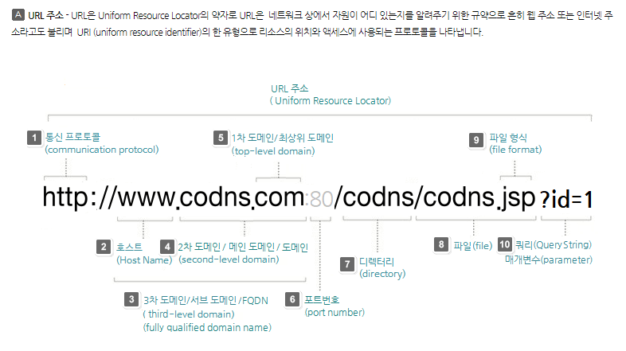
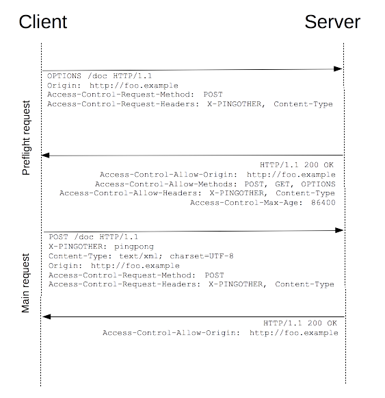

## Same-origin policy (SOP)

- 동일 출처 정책
- 특정 출처(origin)에서 불러온 문서나 스크립트가 다른 출처에서 가져온 리소스와 상호작용 하는 것을 제한하는 보안 방식
- 잠재적으로 해로울 수 있는 문서를 분리함으로써 공격받을 수 있는 경로를 줄임
- 정의
    - 두 URL의 출처(Origin)가 모두 같아야 동일한 출처라고 할 수 있음
    - Origin
      - Protocol : 인터넷의 자원에 접근하기 위해 사용되는 프로토콜을 특정하는 스키마. http(without SSL), https
      - Port : 80
      - Host : localhost, www.google.com
    
    

## Cross-Origin Resource Sharing (CORS)

- 교차 출처 리소스 자원 공유
- 추가 HTTP header를 사용하여, 특정 출처에서 실행중인 웹 앱이 다른 출처의 자원에 접근할 수 있는 권한을 부여하도록 브라우저에 알려주는 체제
- 리소스가 자신의 출처(Domain, Protocol, Port)와 다를 때 교차 출처 HTTP 요청을 실행
- 보안 상의 이유로 브라우저는 교차 출처 HTTP 요청을 제한 (SOP)
    - 예를 들어 XMLHttpRequest는 SOP을 따름
- 다른 출처의 리소스를 불러오려면 그 출처에서 올바른 CORS header를 포함한 응답을 반환해야 함
- CORS를 사용해 교차 출처 접근 허용
- CORS는 HTTP의 일부로, 어떤 호스트에서 자신의 컨텐츠를 불러갈 수 있는지 서버에 지정할 수 있는 방법
- 응답 + CORS header를 클라이언트에게 보내 주자.

## CORS 접근제어 시나리오

###  단순 요청 (Simple Request)

- GET, HEAD, POST중의 한 가지 방식을 사용해야 한다.
- POST 방식일 경우 Content-Type이 아래 셋 중의 하나여야 한다.
  - application/x-www-form-urlencoded
  - multipart/form-data
  - text/plain
- 헤더는 Accept, Accept-Language, Content-Language, Content-Type만 허용된다.

### 프리플라이트 요청 (Preflight Request)

- OPTIONS 메서드를 통해 다른 도메인의 리소스에 요청이 가능한 지 확인작업
- 본 요청을 보내기 전에 일단 서버한테 요청을 보내도 되는지 물어본다.



- 왜 preflight가 필요할까?
  - CORS를 모르는 서버를 위해서다. CORS spec이 생기기 이전에 만들어진 서버들은 브라우저의 SOP request만 가능하다는 가정 하에 만들어졌는데, cross-site request가 CORS로 인해서 가능해졌기 때문에 이런 서버들은 그에 대한 security mechanism이 없다보니 이런 서버들을 보호하기 위해 프리플라이트 리퀘스트를 포함한 것이다.

### 인증정보 포함 요청 (Credetialed Request)

- 인증 관련 헤더를 포함할 때 사용하는 요청
- 클라이언트측 
  - credentials: include
- 서버측
  - Access-Control-Allow-Credentials: true (Access-Control-Allow-Origin: *은 안된다.)

## Why CORS?

- HTTP 요청은 기본적으로 Cross-site HTTP Request가 가능하다.
    - 하지만 <script></script> 에서 생성된 
- 브라우저 & 웹 앱 보호
    - 악의적인 사이트의 데이터를 가져오지 않도록 사전 차단
    - 응답으로 받는 자원에 대한 최소한의 검증
    - 서버는 정상적으로 응답하지만 브라우저에서 차단
- 서버의 자원 관리
    - 누가 해당 리소스에 접근할 수 있는지 관리 가능

## How CORS?

- CORS 표준에 의해 추가된 HTTP header를 통해 이를 통제
- `Access-Control-Allow-Origin`
- `Access-Control-Allow-Credential`
- `Access-Control-Allow-Headers`
- `Access-Control-Allow-Methods`
- `Access-Control-Max-Age`
- `Access-Control-Expose-Headers`

## Access-Control-Allow-Origin 응답 헤더

- 이 응답이 주어진 출처로부터 요청 코드와 공유될 수 있는지를 나타냄
- 예시
    - Access-Control-Allow-Origin : * (모든 도메인에서 접근할 수 있음)
    - 브라우저 리소스에 접근하는 임의의 origin으로부터 요청을 허용한다고 알리는 응답에 포함
    - `*`외에 특정 출처(origin) 하나를 지정할 수도 있음

## CORS 해결

- 프론트 프록시 서버 설정 (개발 환경)
  - 중간에 요청을 가로채서 HTTP 응답 헤더에 Access-Control-Allow-Origin:*를 설정해서 응답해 준다.
- 직접 헤더에 설정
  - 서버에서 Access-Control-Allow-Origin 헤더를 세팅해 주는 것이 보통이다.
  - 클라이언트와 서버를 모두 제어할 수 있다면 사용할 수 있다.
- Django의 미들웨어 사용
  - `'corsheaders.middleware.CorsMiddleware'`를 추가해서 간단하게 해결했다.

## CORS 시나리오

- Vue.js에서 A 서버로 요청
- 서버는 Access-Control-Allow-Origin에 특정한 origin을 포함 시켜 응답
- 브라우저는 Access-Control-Allow-Origin를 확인 후 허용 여부를 결정
- 프레임워크 별로 이를 지원하는 라이브러리가 존재
    - django는 django-cors-headers 라이브러리를 통해 응답 헤더 및 추가
    - vue에서 장고로 요청을 보낼 때는 8080 포트인데, 장고는 8000이라 SOP에 따르면 브라우저에서 차단하게 된다.
    그래서 응답에 CORS 헤더를 붙여 주어야 한다.
    - DRF Server에서 Vue에서의 요청을 허용하기 위해, ALLLOWED_HOSTS 목록에 Vue의 주소를 등록해줘야 한다.

    ```
    INSTALLED_APPS = [
    	...
        'rest_framework',
        # django cors
        'corsheaders',
        ...
    ],
    MIDDLEWARE = [
        # django cors middleware setting
        'corsheaders.middleware.CorsMiddleware',
    ]
    
    1. 특정 Origin만 선택적으로 허용
    CORS_ALLOWED_ORIGINS = [
        "<https://example.com>",
        "<https://sub.example.com>",
        "<http://localhost:8080>",
        "<http://127.0.0.1:9000>"
    ]
    
    # 2. 모든 Origin 허용
    CORS_ALLOW_ALL_ORIGINS = True
    
    ```
