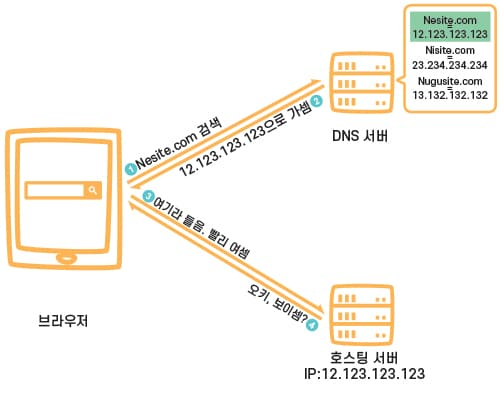
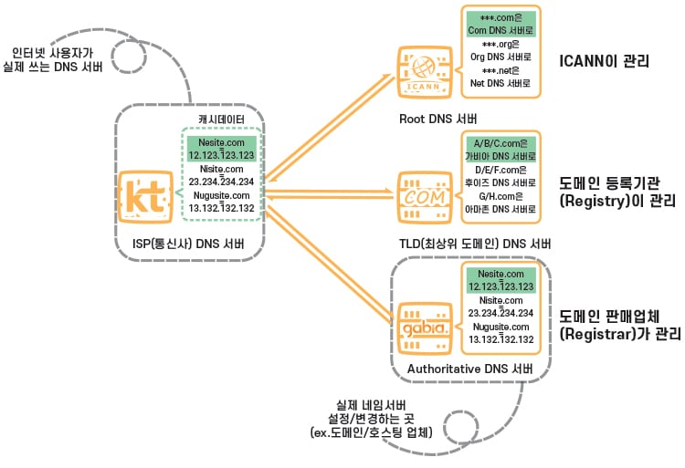
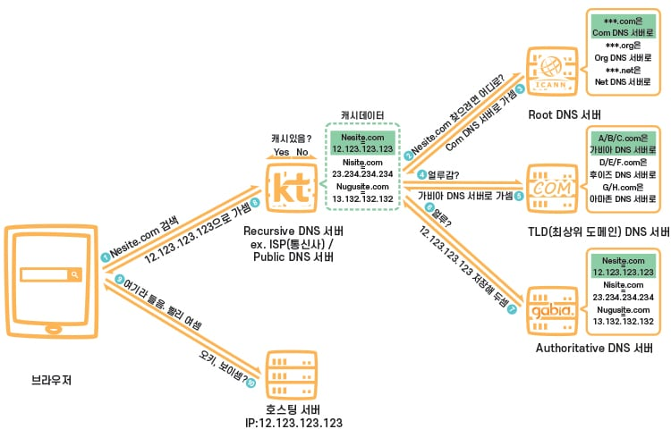
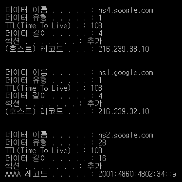
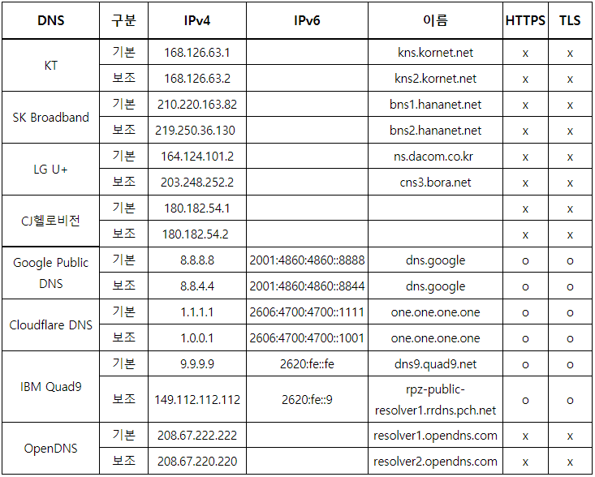
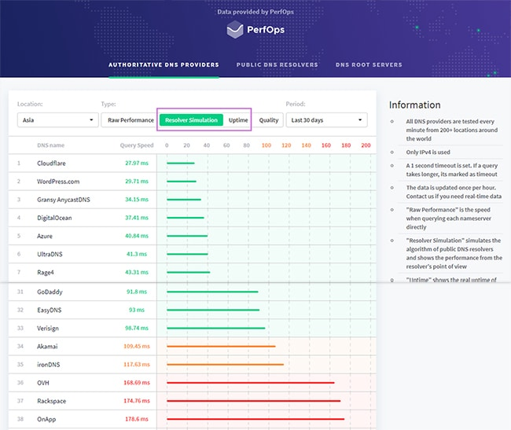

# DNS

인터넷을 편안하게 사용하는 것에 핵심적인 역할을 한 Domain Name System에 대해 공부해 보자.

## **DNS의 기본**

스마트폰, 노트북부터 대규모 소매 웹 사이트의 콘텐츠를 서비스하는 서버에 이르기까지 인터넷상의 모든 컴퓨터, 모든 단말은 숫자를 사용하여 서로를 찾고 통신한다. 이러한 숫자를 **IP 주소**라고 한다. 하지만 일반 사용자는 IP 주소가 아니라 `www.example.com`과 같은 **도메인 이름**을 입력해도 원하는 웹 사이트로 갈 수 있다.

Amazon Route 53과 같은 DNS 서비스는 전 세계에 배포된 서비스로서, `www.example.com`과 같이 사람이 읽을 수 있는 이름을 192.0.2.1과 같은 IP 주소로 변환하여 컴퓨터가 서로 통신할 수 있도록 한다. 인터넷의 DNS 시스템은 이 이름과 숫자 간의 매핑을 관리하는 전화번호부와 같다.

DNS 서버는 이름에 대한 요청을 IP 주소로 변환하여 `최종 사용자 end user`가 도메인 이름을 웹 브라우저에 입력할 때 해당 사용자를 어떤 서버에 연결할 것인지를 묻는데, 이 과정을 `쿼리 Query`라고 부른다.

DNS란 게 어찌 돌아가는지 간단하게 예를 들어 보겠다.

한 사람이 브라우저에서 Nesite.com을 검색했다면, 먼저 DNS 서버로 도메인 주소가 전달이 된다.

그리고 서버 내부에서 도메인 주소를 토대로 `Nesite.com = 12.123.123.123`라는 항목을 찾아내고 다시 브라우저에게 12.123.123.123의 IP 주소를 갖고 있는 호스팅 서버(해당 웹사이트 데이터가 저장된 곳)으로 가라고 지시한다. 그러면 브라우저가 다시 IP 주소로 접속해서 웹사이트가 보이게 된다. 브라우저가 잠깐 사이에 이런 과정을 처리하는 것이다.

## **DNS 서버 종류**

물론 DNS 서버가 초고성능으로 세상에 단 하나만 있다면 위 내용 그대로 이해하면 되겠지만, 그렇게 간단하지 않다. 일단 도메인 수가 너무 많기 때문에 **DNS 서버 종류를 계층화해서 단계적으로 처리한다는 것**을 골자로 보면 될 것 같다. 특히, **도메인의 총 관리는 ICANN**에서 하기 때문에, DNS 서버도 최상위 도메인에서 개인 도메인의 서브 도메인까지 도메인 이름의 분류와 마찬가지로 **디렉토리/계층 형태로 구분된다**는 것을 생각하면 더 쉽게 이해할 수 있을 것이다.

- **Root DNS Server:** ICANN이 직접 관리하는 절대 존엄 서버로, TLD DNS 서버 IP들을 저장해두고 안내하는 역할

- **TLD(최상위 도메인) DNS Server:**

  도메인 등록 기관(Registry)이 관리하는 서버로, Authoritative DNS 서버 주소를 저장해두고 안내하는 역할. 어떤 도메인 묶음이 어떤 Authoritative DNS Server에 속하는지 아는 이유는 도메인 판매 업체(Registrar)의 DNS 설정이 변경되면 도메인 등록 기관(Registry)으로 전달이 되기 때문

- **Authoritative DNS Server:** 실제 개인 도메인과 IP 주소의 관계가 기록/저장/변경되는 서버. 그래서 권한의 의미인 Authoritative가 붙음. 일반적으로 **도메인/호스팅 업체의 ‘네임서버’**를 말하지만, 개인 DNS 서버 구축을 한 경우에도 여기에 해당함.

- **Recursive DNS Server:** **인터넷 사용자가 가장 먼저 접근하는 DNS 서버**임. 위 3개의 DNS 서버를 매번 거친다면 효율이 구데기일 수밖에 없으니, 한 번 거친 후 얻은 데이터를 일정 기간(TTL/Time to Live) 동안 **캐시라는 형태로 저장해 두는 서버**임. 직접 도메인과 IP 주소의 관계를 기록/저장/변경하지는 않고 캐시만을 보관하기 때문에, Authoritative와 비교되는 의미로 반복의 Recursive가 붙음. 대표적인게 KT/LG/SK와 같은 **ISP(통신사) DNS 서버**가 있고, 브라우저 우회 용도로 많이 쓰는 구글 DNS, 클라우드플레어와 같은 Public DNS 서버가 있음.

## **DNS의 동작**

1. 브라우저에서 Nesite.com을 검색하고, 사용하고 있는 통신사인 KT DNS 서버에게 도메인 주소에 해당하는 IP 주소를 요청 (브라우저 기본 DNS 설정이 통신사 DNS 서버이기 때문)
2. ISP 서버에선 캐시 데이터가 없다는 걸 확인하고 루트 DNS 서버에게 어디로 가야 하는지 요청(캐시가 있다면 8.로 건너 뜀.)
3. 루트 서버는 TLD DNS 서버 주소만 관리하기 때문에, ***.com 도메인을 보고는 COM 최상위 도메인을 관리하는 TLD DNS 서버 주소를 안내.
4. ISP 서버는 COM 서버에게 어디로 가야 하는지 다시 요청.
5. COM 서버는 가비아 DNS 서버에서 해당 도메인이 관리되고 있는 걸 확인하고 안내.
6. ISP 서버는 가비아 서버에게 또 다시 요청.
7. 가비아 서버는 “[Nesite.com](http://Nesite.com) = 12.123.123.123”이라는 정보를 확인하고 이 IP를 알려주고, 동시에 ISP 서버는 해당 정보를 캐시로 기록해 둔다.
8. ISP 서버는 브라우저에게 힘들게 알아 낸 12.123.123.123 주소를 안내.
9. 브라우저는 12.123.123.123 IP 주소를 갖고 있는 호스팅 서버에게 웹사이트를 출력하라고 요청.
10. 드디어 보인다.

이렇게 크게 한 번 보고 나면 도메인/호스팅 업체의 네임서버 설정이 실제 인터넷 사용자들에게 어떻게 영향을 미치고, 네임서버 변경 시 도메인 전파 시간이란 게 왜 발생하는 건지 이해가 쉽게 될 것이다.

## 세부 DNS 개념 설명

### **Local DNS Server, Recursive DNS**

우리가 URL에 Domain Name을 입력했을 때에 해당하는 IP를 찾기 위해 가장 먼저 찾는 DNS이다.

기본적으로 컴퓨터의 LAN을 통해 인터넷이 연결되면 인터넷을 사용할 수 있게 IP를 할당해주는 각 통신사의 DNS 서버가 등록된다.

만약 당신이 `jdev.co.kr` 이라는 도메인을 입력한다면,

- 찾는 도메인 주소가 있다면
  - Local DNS Server: 해당 IP 주소는 1.1.1.1이야.
- 찾는 도메인 주소가 없다면
  - Local DNS Server: Root DNS에 물어볼게

이렇게 반응하게 된다.

대개 클라이언트는 `Authoritative DNS` 에 직접 쿼리를 수행하지 않는다. 대신에 `Resolver` 또는 `Recursive DNS` 서비스라고 알려진 다른 유형의 DNS 서비스에 연결하는 경우가 일반적이다. 재귀적 DNS 서비스는 호텔 컨시어지와 같은 역할을 한다. DNS 레코드를 소유하고 있지는 않지만 사용자를 대신해서 DNS 정보를 가져오는 중간자의 역할을 한다. 재귀적 DNS가 일정 기간 동안 캐시된, 또는 저장된 DNS 레퍼런스를 갖고 있는 경우, 소스 또는 IP 정보를 제공하여 쿼리에 대한 답을 한다.

### **Authoritative DNS**

도메인 네임에 대한 정보를 갖고 있으면서 해당 도메인 네임에 해당하는 IP 주소를 갖고 있는 서버, 즉 모두 다 알고 있는 서버를 말한다.

신뢰할 수 있는 DNS는 도메인에 대해 최종 권한이 있으며 재귀적 DNS 서버에 IP 주소 정보가 담긴 답을 제공할 책임이 있다.

### **Root DNS Server**

로컬 DNS한테 물어봤을 때 IP주소가 없으면 해당 DNS 서버는 Root DNS 서버에 물어보게 된다.

Root DNS 서버는 TLD DNS 서버로, 해당 DNS부터 시작해서 아래에 줄줄이 딸린 node DNS 서버에게로 차례차례 물어보게 된다.

트리구조를 떠올리면 된다.

요런 식이다.

모든 DNS 서버들은 이 Root DNS Server의 주소를 기본적으로 갖고 있다. 

그리고 모르는 Domain Name이 온다면 Root DNS에 묻게 된다. 하지만 Root DNS server의 목록에도 해당 Domain Name의 IP가 없을 수 있다. 그럼 Root DNS는 로컬에게 TLD 주소에 대한 정보를 주면서 `나는 그 Domain Name에 해당하는 IP 주소가 없으니 여기에 찾아가 봐라`고 답한다.

### Top-Level Domain 최상위 도메인

루트 DNS 서버는 로컬 DNS 서버에게 모른다고 응답하는 동시에, 이렇게 말한다.

'나한텐 해당 도메인 주소가 없다. 대신 `jdev.co.kr`에서 `kr`의 주소를 알고 있으니, kr DNS에 물어봐라. 그럼 로컬 DNS 서버는 kr DNS 서버에 다시 물어보게 된다. 이걸 계속 반복하게 된다.

### 재귀적으로 순환을 반복

정리하자면, 기지국에서 루트 DNS로 도메인 주소를 물으면, 루트에서 다 저장하고 잇는 것이 아니라, Root DNS Server 자신에 등록되어 있는 최상위 도메인(TLD)에서 해당 도메인에 붙어있는 TLD 주소를 찾아서 기지국에 **전달해주는 것이다.**

그러면 기지국 DNS는 Root DNS에게 받은 TLD Server에게 다시 물어본다.

이상의 내용을 찾을 때 까지 반복한다.

이 과정을 `Recursive Query`라고 한다.

### DNS Cache

위 과정을 통해 IP 주소를 성공적으로 받아왔다고 가정해 보자.

그리고 몇 분 후 다시 방문하려고 할 때 위의 내용을 반복하려면 비효율적일 것이다. 때문에 우리 PC에는 자주 쓰는 Domain Name을 Cache에 저장한다.

이를 Window에서는 cmd에 `ipconfig /displaydns`를 통해 확인할 수 있다.

### **국내 통신사(ISP) 사업자별 DNS, 해외 DNS의 종류**

국내 ISP에서 제공하는 DNS는 빠른 속도가 장점이다.

구글이나 클라우드 플레어와 같은 DNS는 보안과 프라이버시에 이점이 있다. DNS over HTTPS, DNS over TLS 등을 지원해서 느린 반응 속도에도 불구하고 국내외에 점점 사용자가 늘어나고 있다.

## 해외 DNS 성능

결국 모든 면에서 최고는 `CloudFrare`다. 띠용. SSL 인증서도 주고 공짜인데 안 쓸 이유가 없다. 그런데 시장 먹은 다음에 유료로 바꾸는 것은 아닐까 개인적인 걱정은 살짝 있다.

## **References**

- https://opentutorials.org/module/3421/20298
- https://aws.amazon.com/route53/what-is-dns/?nc1=h_ls
- https://hwan-shell.tistory.com/320
- https://gentlysallim.com/dns%EB%9E%80-%EB%AD%90%EA%B3%A0-%EB%84%A4%EC%9E%84%EC%84%9C%EB%B2%84%EB%9E%80-%EB%AD%94%EC%A7%80-%EA%B0%9C%EB%85%90%EC%A0%95%EB%A6%AC/

