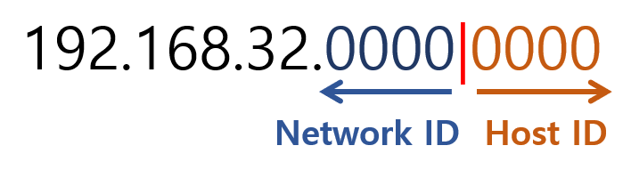
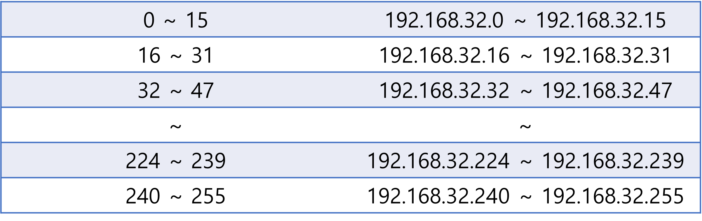
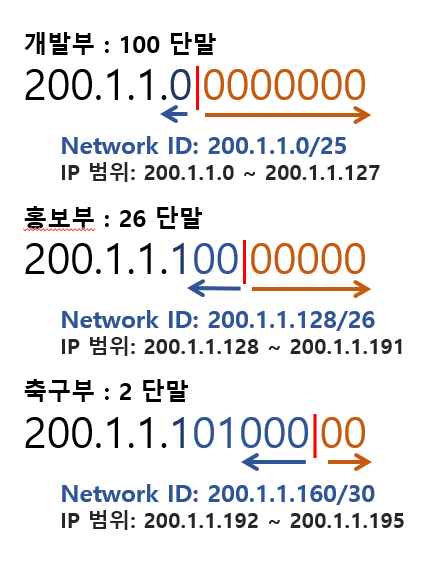
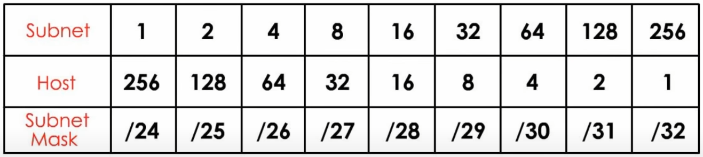
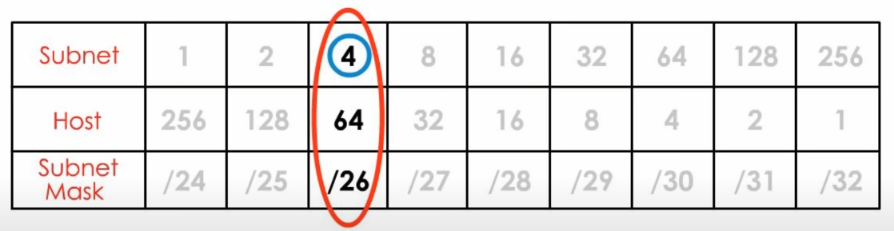
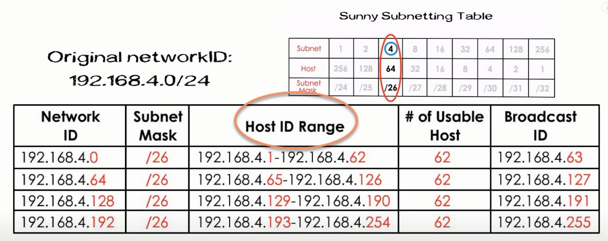
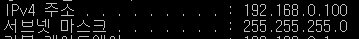

# Subnet mask, Subnetting

## 서브넷의 탄생

앞서 공부했던 네트워크 클래스에서 알 수 있듯, 클래스 단위로 네트워크를 분류하면 비효율적이었습니다.

따라서 단말 수에 맞추어 효율적으로 사용할 수 있는 `서브넷 Subnet`이라는 개념이 등장하게 되었습니다.

### 서브넷 Subnet

`서브넷 Subnet`은 말 그대로 부분망을 뜻합니다. IP 네트워크를 논리적으로 세분화한 것입니다. 그리고 이 서브넷을 만들 때 쓰이는 것이 바로 `서브넷 마스크`입니다. 이 서브넷 마스크를 이용해 IP주소 체계의 Network ID와 Host ID를 분리합니다.

IP 주소는 IP 클래스에 의해 분리되는 Network Prefix와 Host Number로 분리됩니다. 서브넷 마스크에 의해 이루어지는 서브넷팅은 이 Host Number를 Subnet Number와 서브넷 안에서 식별되는 Host Number로 다시 분리합니다.

### 서브넷팅 Subnetting

하나의 네트워크를 둘, 혹은 여러 개의 서브 네트워크로 나눠서, 외부에서 해당 네트워크를 바라볼 시에는 단일 네트워크처럼 보이지만 내부에서 보면 여러 개의 네트워크로 만드는 것입니다.

서브넷팅을 통해 네트워크의 밀집을 완화하고, 네트워크의 성능을 향상시킵니다. 보안은 덤입니다.

## FLSM (Fixed Length Subnet Mask)

고정된 크기의 Subnet-mask를 사용하는 방식으로, 각 서브넷의 크기는 동일합니다.

예를 들어 `192.128.32.0/24`라는 네트워크 주소 하나를 12개씩의 호스트가 있는 각각의 네트워크로 분할하려고 한다면, 어떻게 서브넷팅해야 할까요?

주어진 서브넷과 서브넷 마스크를 2진수로 바꿔서 AND 연산을 해 보겠습니다.

| IP Address  | 11011010.10000000.00100000.**00000000** |
| ----------- | --------------------------------------- |
| subnet-mask | 11111111.11111111.11111111.**00000000** |
| AND연산     | 11011010.10000000.00100000.**00000000** |

여기서 서브넷 마스크의 비트 중 1로 표시된 부분(24개)는 모두 Network ID로 사용되었으므로, 0으로 표시된 나머지인 Host ID 부분만 사용가능합니다.

12개의 호스트(단말)에 IP를 할당하기 위한 비트의 최소값은 4개입니다. (2^4 = 16개의 Host range)
기존의 Host-ID 부분을 필요한 만큼인 4bit만큼 자릅니다.

따라서 호스트 부분의 4bit로 표현할 수 있는 수의 범위를 표로 나타내면 아래와 같이 되겠습니다.

총 16개의 서브넷으로 나누어집니다.

범위 안의 숫자 중 맨 앞의 IP는 각 서브넷의 네트워크 주소가 되고, 맨 뒤의 IP는 브로드캐스트 주소가 됩니다.
즉, 첫 번째 서브넷에서 사용 가능한 Host IP는 1 ~ 14의 14개가 됩니다. 이 범위를 서브넷으로 나타내면 `192.168.32.0`이 되고, `subnet mask(prefix)`는 4bit를 더 사용했으니 `/24 => /28`이 되었습니다.

따라서 `192.168.32.0/28`이라는 네트워크 주소로 해당 서브넷을 나타낼 수 있습니다.

## VLSM (Variable Length Subnet Mask)

서브넷팅을 이해했다면 VLSM은 쉽습니다.

위와 같은 동일한 크기의 서브넷과 달리 큰 부서에는 더 많이, 작은 부서에는 더 적게 IP를 배분해야 하는 상황이 올 수가 있습니다.

- 네트워크 주소: `200.1.1.0/24`
- 개발부: 100개의 단말
- 홍보부: 50개의 단말
- 축구부: 2개의 단말

위와 같은 조건이라면 FLSM을 한다면 가장 큰 크기인 개발부에 맞춰서 자르게 되고, 다른 부서에는 너무 많은 IP가 남게 되어 낭비가 됩니다. 이러한 경우를 피하기 위해 각 부서 별로 필요한 만큼만 잘라서 사용해 보겠습니다.

이와 같이 다양한 길이의 서브넷 마스크가 되겠습니다.

## 실생활에서 서브넷팅을 해 봅시다 (Youtube Channel: Sunny Classroom)

어느 날 매니저가 당신에게 까페를 위해 네트워크 세 개를 만들어 달라고 부탁했습니다. 하나는 사무실, 하나는 데스크와 창고, 하나는 공공 사용을 위한 용도입니다. 당신은 각각의 `Network ID, subnet mask, Host ID Range, # of usable host IDs, Broadcast ID`를 리스트로 만들어야 합니다.

주어진 네트워크 ID는 `192.168.4.0/24`입니다.

> 모든 그림은 유튜브의 [Sunny Classroom](https://www.youtube.com/watch?v=ecCuyq-Wprc)에서 가져왔습니다. Thank you! 너무 좋은 영상이니 한 번씩 봐주세요!)

위 표를 보면 한 방에 이해할 수 있습니다.

서브넷은 1부터 시작해서 2씩 늘어나고, 호스트는 그 역입니다. 저희는 3개의 네트워크가 필요하니까...

서브넷 4개로 나눌 수 있는 `/26` 서브넷 마스크가 필요하겠네요.

서브넷 마스크 26에 의해 4개로 나뉘어진 리스트를 표로 보면 위와 같습니다.

## 제 컴퓨터로 해볼까요

제 컴퓨터의 어댑터 IP입니다.

이를 네트워크로 표현하면 `192.168.0.100/24`가 되겠네요!

IP range는 `192.168.0.0 ~ 192.168.0.255`이고, 저는 그 중에 하나를 배정받은 것을 알 수 있습니다.

아래의 명령어 순서대로 쳐서 IP 주소를 새로 받아 보아도 범위는 바뀌지 않는 것을 확인했습니다!

`ipconfig /release`: 현재 DHCP 구성 해제 및 어댑터의 IP 주소 구성 제거

`ipconfig /renew` : DHCP 클라이언트 컴퓨터로 구성된 컴퓨터에서만 사용가능하며, 서버로부터 새로운 IP 주소 및 구성값을 받아옴

단시간에 반복하니 같은 주소만 배정되는 것 또한 확인했습니다. 신기하네요 🙄

## References

- https://engkimbs.tistory.com/622
- https://m.blog.naver.com/twers/50116961114
- [BigNetwork - Subnetting](https://bignet.tistory.com/50)
- https://www.youtube.com/watch?v=ecCuyq-Wprc
