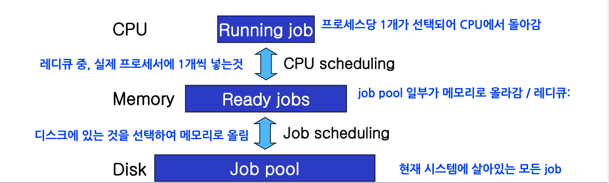

# 멀티프로그래밍, 멀티태스킹, 멀티프로세싱, 멀티스레딩

## 선수지식 키워드

- OS란 무엇인가?
- 싱글코어, 멀티코어
- 프로그램, 프로세스, 그리고 스레드

### 싱글코어, 멀티코어

- `Core`: CPU에서 기초적인 연산을 처리하고 담당하는 부분. 사람의 대뇌.
- `Multi Core`: 하나의 CPU 안에 여러개의 코어를 구현해 놓은 아키텍쳐.
  - 듀얼코어, 쿼드코어 CPU가 그 예이다.
  - 듀얼 코어의 경우 단일 코어에 비해 필요한 서버 수가 절반이며, 관리할 시스템 수도 적어 유지/보수비용이 적게 든다.
- `Hyper-Threading`: 인텔에서 개발한 기술. 하나의 코어가 논리적으로 두 개 이상의 코어처럼 동작하도록 설계한 기술.

### 프로그램, 프로세스, 그리고 스레드

- `Program`: 저장소에 존재하는 코드와 정적 데이터들의 뭉치
- `Process`: 메모리에 적재되어 실행중인 프로그램
- `Thread`: 프로세스 안의 작은 실행단위. Data, Code, Heap 영역은 공유하고 스레드 각각의 Stack을 할당받는다.

## 혼란스러운 네 가지의 개념 :scream:

`멀티프로그래밍, 멀티프로세싱, 멀티태스킹, 멀티스레딩`은 혼란을 야기한다.

현대 컴퓨팅 시스템에는 일반적으로 CPU와 같이 적은 리소스를 놓고 경쟁하는 여러 동시 응용 프로 실행 프로세스들이 있다. 운영 체제는 효과적이고 효율적인 리소스의 할당을 담당하고, 그것을 위해 스케줄러를 사용한다. OS에 따라 다른 스케줄링 정책이 실행될 수 있다.

## 멀티프로그래밍

초창기 싱글코어, 싱글 스레드 컴퓨터에서는 프로그램이 메모리에 하나만 올라가고, 해당 프로그램만 CPU가 처리할 수 있었다. 이런 과정에서 프로그램이 파일 입출력(I/O)을 하게 되면 중간에 `idle 정지` 상태가 되는데 이 때 `자원 낭비를 막기 위해` 다른 프로세스의 일부를 처리하는 것이 멀티프로그래밍이다.

따라서 멀티프로그래밍의 궁극적인 목표는 실행할 준비가 된 프로세스가 있는 한, CPU를 계속 바쁘게 굴리는 것이다.

이러한 시스템이 제대로 작동하려면 os가 여러 프로그램을 메인 메모리의 별도 영역에 로드할 수 있어야 하고 한 프로세스가 다른 프로세스에 의해 수정될 가능성을 피하기 위해 필요한 보호를 제공해야 한다.

## 멀티태스킹

다중 프로그래밍에서 파생된 단어이며, 더 일반적인 의미에서의 다중을 의미한다.

우리가 자주 사용하는 아이폰의 초기 버전에선 한 번에 하나의 앱만 실행시킬 수 있었다.

마찬가지로, 우리가 사용하는 컴퓨터에서도 한 번에 하나의 작업밖에 실행시킬 수 없었던 시절이 있었다.

컴퓨터에서 한 번에 여려 개의 어플리케이션을 실행시킬 수 있기에 우리는 컴퓨터를 더 효율적으로 사용할 수 있게 되었다.

`Task`란 os에서 처리하는 작업의 단위 또는 정해진 일을 수행하기 위한 명령어 집합을 뜻한다. (`Process`의 확장 개념)

멀티 태스킹은 이 task를 os의 스케줄링에 의해 번갈아가며 수행하는 것을 의미한다.

이를 통해 여러 작업이 빠르게 처리되어 마치 동시에 처리되는 것처럼 보이는 것이다.

### 멀티태스킹 시스템

## 멀티프로세싱

멀티프로그래밍과 헷갈릴 오해의 소지가 있지만, 사실 멀티프로세싱은 `소프트웨어(실행 중인 프로세스)`가 아니라 `하드웨어(CPU)`를 의미한다.

다수의 프로세서(CPU)가 협력적으로 일을 처리하는 것이다. 하나의 컴퓨터에 여러개의 CPU 혹은 멀티코어를 통해 하나 이상의 프로세스를 동시에 처리하는 것을 의미한다.

- 각 프로세서는 다수의 프로세스를 처리하며, 각 프로세스는 다수의 프로세서에 의해 처리된다.
- 각 프로세서가 자원을 공유하면서 프로세스를 처리하기 때문에 하나의 프로세서가 고장나더라도 작업은 정지되지 않는다.

더 넓은 의미에서는 하나 또는 그 이상의 프로세스를 여러 장치에서 병렬로 처리하는 것을 의미한다.

멀티프로세스 방식의 가장 흔한 실행은 `forking 포킹` 모델로서, 이 모델에서는 `Parent process`에 의해 `Child process`들이 만들어진다. 이 차일드 프로세스들은 자신들을 만들어낸 부모 프로세스와  똑같은 코드를 실행하지만 메모리나 주소 공간을 공유하지는 않는다.

## 멀티스레딩

프로세스 내에서 하나가 아닌 여러 개의 스레드를 사용해 명령을 처리하는 것을 의미한다.여러 개의 스레드끼리 자원을 공유한다.

하나의 코어를 여러 개의 스레드로 동시에 (Concurrent) 접근하는 것.

## 비교해보기

### 멀티프로그래밍 vs 멀티태스킹

`멀티프로그래밍`은 프로세서의 자원낭비를 막기 위함이고, 

`멀티태스킹`은 정해진 시간동안 task를 번갈아가며 수행하여 마치 동시에 실행되는 착각을 주기 위함이다.

미묘한 차이를 기억하게 쉽게 정리하면 둘 모두 `(CPU) 시분할 시스템`이다. 그러나 멀티프로그래밍(예전 OS)가 한 프로그램을 끝낼 때까지 블로킹한다면, 멀티태스킹(최신 OS)은 일정한 시간만큼 나누어서 CPU를 점유하기에 공정하게 시간이 공유된다.

### 멀티프로세싱 vs 멀티스레딩

둘 모두 `CPU의 최대 활용을 위해 프로그램의 둘 이상의 부분을 동시에 실행하는 기술`

`멀티프로세싱`은 fork를 통해 다수의 프로세스를 만들어서 여러 개의 프로그램들을 병렬로 처리하며,

`멀티스레딩`은 하나의 프로그램 안에서 작업을 병렬처리 하는 것이다.

멀티 스레딩은 멀티 프로세싱보다 적은 메모리 공간을 차지하고 `Context Switching`이 빠른 장점이 있지만, 동기화 문제와 하나의 스레드 장애로 전체 스레드가 종료 될 위험을 갖고 있다. 프로세스와 달리 스레드는 `code, heap, data`를 공유하기 때문에 다른 하나가 문제가 생기면 연쇄적인 문제가 생길 수 있기 때문이다.

멀티 프로세싱은 하나의 프로세스가 죽더라도 다른 프로세스에 영향이 가지 않아 안정성이 높지만, 더 많은 메모리 공간과 CPU 리소스를 사용하는 단점이 있다.

두 방법은 동시에 여러 작업을 수행하는 점에서 동일하지만, 각각의 장단이 있으므로 적용하는 시스템에 따라 적합한 동작 방식을 선택하고 적용해야 한다.

### 멀티스레딩 vs 멀티태스킹

일반적으로 멀티태스킹은 멀티프로그래밍의 논리적 확장이며, 멀티스레딩은 스레드 기반 멀티 태스킹이다. 멀티태스킹을 통해 CPU가 `프로그램, 플로세스, 태스크, 스레드`를 동시에 수행할 수 있는 반면 멀티스레딩은 동일한 프로세스의 여러 스레드가 동시에 실행할 수 있다.

멀티태스킹

- CPU가 동시에 여러 작업을 실행하게 함
- 프로세스 스위칭이 자주 일어난다.
- CPU가 실행중인 각 프로그램에 별도의 메모리와 리소스를 할당해야 한다.

멀티스레딩

- CPU가 프로세스의 여러 스레드를 동시에 실행할 수 있다.
- 멀티 스레딩에서 CPU는 스레드 간을 자주 전환한다.
- 멀티 스레딩 시스템에서 프로세스가 메모리를 할당해야 하는 경우 프로세스의 여러 스레드가 할당된 메모리와 리소스를 공유한다.

## 동시성과 병렬성

## 컨텍스트 스위칭 (Context Switching)

컨텍스트 전환은 작업 전환 또는 프로세스 전환이라고도 한다.

기본적으로 CPU를 프로세스 / 스레드에서 다른 프로세스 / 스레드로 전환하는 것이다.

컨텍스트 전환은 프로세스 제어 블록(PCB)에서 CPU의 `Context 상태` 를 보관하고, 나중에 같은 시점에서 프로세스 실행을 재개할 수 있는 절차이다. 대기하는 동안 다음 순서의 프로세스가 동작하면서 이전에 보관했던 프로세스의 상태를 복구하게 된다. 

이 기술을 통해 여러 프로세스가 단일 CPU를 공유할 수 있다. 다만 컨텍스트 전환에는 비용이 발생하게 된다.

컨텍스트 전환은 멀티태스킹 운영 체제의 주요 기능이다.

## Reference

- https://twpower.github.io/127-multi-processing-threading-programming
- https://gabrieletolomei.wordpress.com/miscellanea/operating-systems/multiprogramming-multiprocessing-multitasking-multithreading/