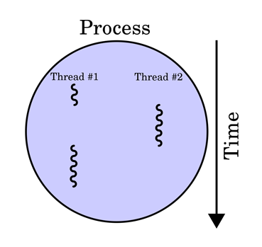
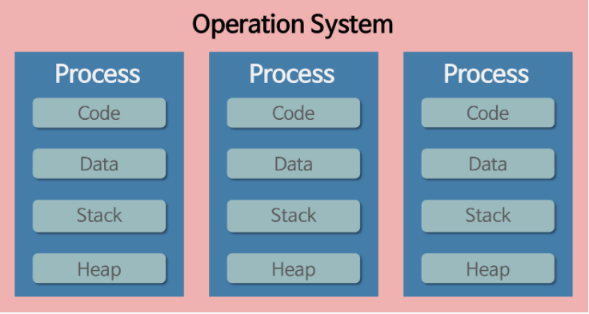
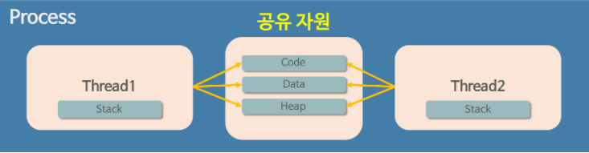

# 프로세스, 스레드

[toc]

프로세스 : 운영체제로부터 자원을 할당받은 작업의 단위

스레드 : 프로세스가 할당받은 자원을 이용하는 실행 흐름의 단위

프로그램 -> 프로세스 -> 스레드

프로그램이란, 파일이 저장 장치에 저장되어 있지만 메모리에는 올라가 있지 않은 정적인 상태를 말한다.

1. 메모리에 올라가 있지 않은 : 아직 운영체제가 프로그램에게 독립적인 메모리 공간을 할당해주지 않았다는 뜻이다. 모든 프로그램은 운영체제가 실행되기 위한 메모리 공간을 할당해 줘야 실행될 수 있다.
2. 정적인 상태: 움직이지 않는 상태. 아직 실행 전!

결론적으로 프로그램이란 단어는 아직 실행되지 않은 파일 그 자체를 가리키는 말이다. **그냥 코드 덩어리**

실행하는 순간 파일은 메모리에 올라가게 되고, 이 상태를 동적인 상태라고 하며 이 상태의 프로그램을 프로세스라 한다.

## 프로세스 -> 스레드

과거에는 프로그램을 실행할 때 실행 시작부터 실행 끝까지 프로세스 하나만을 사용해서 진행했다. 하지만 프로그램 하나가 단순히 한 가지 작업만 하기에는 프로그램이 너무 복잡해졌다.

그러면 한 프로그램을 처리하기 위한 프로세스를 여러 개 만들면 되지 않을까? 하지만 이는 불가능하다. 왜냐면 운영체제는 안전성을 위해서 프로세스마다 자신에게 할당된 메모리 내의 정보에만 접근할 수 있도록 제약을 두고 있고, 이를 벗어나는 정보에 접근하려면 오류가 발생하기 때문이다.

따라서 프로세스와는 다른 더 작은 실행 단위 개념이 필요하게 되었고, 이 개념이 바로 스레드다.

스레드는 위에서 언급한 프로세스 특성의 한계를 해결하기 위해 만들어진 개념이기 때문에 스레드의 특성을 유추하기 쉽다. 스레드는 프로세스와 다르게 스레드 간의 메모리를 공유하며 동작한다. 스레드끼리 프로세스의 자원을 공유하면서 프로세스 실행 흐름의 일부가 되는 것이다. 프로그램을 코드 덩어리라고 했는데, 스레드도 코드에 비교하자면 코드 내의 함수들이 되고 따라서 main 함수 또한 일종의 스레드라고 불 수 있게 되는 것이다.

## 프로세스와 스레드의 작동 방식에 대한 더 자세한 설명

프로세스가 메모리에 올라갈 때 운영체제로부터 시스템 자원을 할당받는다고 언급했었다. 이 때 운영체제는 프로세스마다 각각 독립된 메모리 영역을 Code/Data/Stack/Heap의 형식으로 할당해 준다. 각각 독립된 메모리 영역을 할당해 주기 때문에 프로세스는 다른 프로세스의 변수나 자료에 접근할 수 없다.

이와 다르게 스레드는 메모리를 서로 공유할 수 있다고 언급했었다. 이에 대해 더 자세히 설명하자면, 프로세스가 할당받은 메모리 영역 내에서 Stack 형식으로 할당된 메모리 영역은 따로 할당받고, 나머지 Code/Data/Heap 형식으로 할당된 메모리 영역을 공유한다.따라서 각각의 스레드는 별도의 스택을 가지고 있지만 힙 메모리는 서로 읽고 쓸 수 있게 된다.

**여기서 프로세스와 스레드의 중요한 차이를 하나 더 알 수 있게 된다.** 만약 한 프로세스를 실행하다가 오류가 발생해서 프로세스가 강제로 종료된다면, 다른 프로세스에게 어떤 영향이 있을까? 공유하고 있는 파일을 손상시키는 경우가 아니라면 아무런 영향을 주지 않는다.

그런데 스레드의 경우는 다르다. Code/Data/Heap 메모리 영역의 내용을 공유하기 때문에 어떤 스레드 하나에서 오류가 발생한다면 같은 프로세스 내의 다른 스레드 모두가 강제로 종료된다.

스레드를 코드(프로세스) 내에서의 함수(스레드)에 빗대어 표현해보면 이해하기 훨씬 쉬워진다. 코드 내 어떤 함수 하나에서 Error가 발생한다면 어떤 함수에서 발생했든 간에 다른 함수까지 모조리 종료해 버리고 프로세스 실행을 끝내버린다.

## 그렇다면 왜 이런 방식으로 메모리를 공유할까?

스레드는 본문 맨 위에서 "흐름의 단위"라고 말했는데, 정확히는 **CPU 입장에서의 최소 작업의 단위**가 된다. CPU는 작업을 처리할 때 스레드를 최소 단위로 삼고 작업을 한다. 반면 **운영체제는 프로세스가 최소 작업 단위가 된다.**

여기서 중요한 점은 하나의 프로세스는 하나 이상의 스레드를 가진다는 점이다. 따라서 운영체제 관점에서는 프로세스가 최소 작업 단위인데, 이 때문에 같은 프로세스 소속의 스레드끼리 메모리를 공유하지 않을 수 없다.

## 멀티태스킹, 멀티 스레드는 무엇일까?

멀티태스킹이란 하나의 운영체제 안에서 여러 프로세스가 실행되는 것을 의미한다. **동시에** 실행되는 것일까? ㄴㄴ.

멀티태스킹이 하나의 운영 체제 안에서 여러 프로세스가 실행되는 것이라면, 멀티스레드는 하나의 프로세스가 여러 작업을 여러 스레드를 사용하여 동시에 처리하는 것을 의미한다.

위에서 프로세스와 스레드에 대한 개념을 제대로 익혔다면, 멀티스레드의 장단점을 어느 정도 유추해낼 수 있을 것이다.

> **멀티스레드의 장점**
>
> 1. Context-Switching할 때 공유하고 있는 메모리만큼의 메모리 자원을 아낄 수 있다.
> 2. 스레드는 프로세스 내의 Stack 영역을 제외한 모든 메모리를 공유하기 때문에 통신의 부담이 적어서 응답 시간이 빠르다.
>
> **멀티스레드의 단점**
>
> 1. 스레드 하나가 프로세스 내 자원을 망쳐버린다면 모든 프로세스가 종료될 수 있다.
> 2. 자원을 공유하기 때문에 필연적으로 **동기화 문제**가 발생할 수 밖에 없다.

프로세스 간의 Context-Switchng 시에는 많은 자원 손실이 발생한다. 그러나 스레드 간의 문맥 교환에서는 메모리를 공유하고 있는 만큼 부담을 덜 수 있다. 

> **Context-Switching**
>
> 현재 진행하고 있는 Task(Process, Thread)의 상태를 저장하고 다음 진행할 Task의 상태값을 읽어 적용하는 과정

멀티스레드의 장단점에서 꼭 짚고 넘어가야 할 점이 바로 **동기화 문제**다. 주로 Synchronization Issue라고 하는데, 자세한 설명은 다음과 같다.

멀티스레드를 사용하면 각각의 스레드 중 어떤 것이 어떤 순서로 실행될지 그 순서를 알 수 없다. 만약 A 스레드가 어떤 자원을 사용하다가 B 스레드로 제어권이 넘어간 후 B 스레드가 해당 자원을 수정했을 때, 다시 제어권을 받은 A 스레드가 해당 자원에 접근하지 못하거나 바뀐 자원에 접근하게 되는 오류가 발생할 수 있다.

이처럼 여러 스레드가 함께 전역 변수를 사용할 경우 발생할 수 있는 충돌을 동기화 문제라고 한다.(Git Conflict같다) 스케줄링은 운영체제가 자동으로 해주지 않기 때문에 프로그래머가 적절한 기법을 직접 구현해야 하므로 프로그래밍할 때 멀티스레드를 사용하려면 신중해야 한다. 디버깅도 까다로워지기 때문이다.

## 정말 다른 프로세스의 정보에는 접근할 수 없나?

사실 프로세스가 다른 프로세스의 정보에 접근하는 것이 가능하다. 사실 지금 우리가 사용하는 대부분의 컴퓨터 프로그램을 생각해 보면 다른 프로그램에 있는 정보를 가져오는 경우는 심심치 않게 볼 수 있다.

프로세스 간 정보를 공유하는 방법에는 다음과 같은 방법이 있다. 다만 이경우에는 단순히 cpu 레지스터 교체뿐만 아니라 램과 cpu 사이의 캐시 메모리까지 초기화되기 때문에 앞서 말했든 자원 부담이 크다.

1. IPC(Inter-Process Communication)을 사용한다.
2. LPC(Local inter-Process Communication)을 사용한다.
3. 별도로 공유 메모리를 만들어서 정보를 주고받도록 설정해주면 된다.

## 결론

프로세스와 스레드는 개념의 범위부터 다르다. 스레드는 프로세스 안에 포함되어 있기 때문이다.

운영체제가 프로세스에게 Code/Data/Heap/Stack 메모리 영역을 할당해 주고 최소 작업 단위로 삼는 반면, 스레드는 프로세스 내에서 Stack 메모리 영역을 제외한 다른 메모리 영역을 같은 프로세스 내 다른 스레드와 공유한다.

프로세스는 다른 프로세스와 정보를 공유하려면 IPC를 사용하는 등의 번거로운 과정을 거쳐야 하지만, 스레드는 기본 구조 자체가 메모리를 공유하는 구조이기 때문에 다른 스레드와 정보 공유가 쉽다. 때문에 멀티태스킹보다 멀티스레드가 자원을 아낄 수 있게 된다. 다만 스레드의 스케줄링은 운영체제가 처리하지 않기 때문에 프로그래머가 직접 동기화 문제에 대응할 수 있어야 한다.