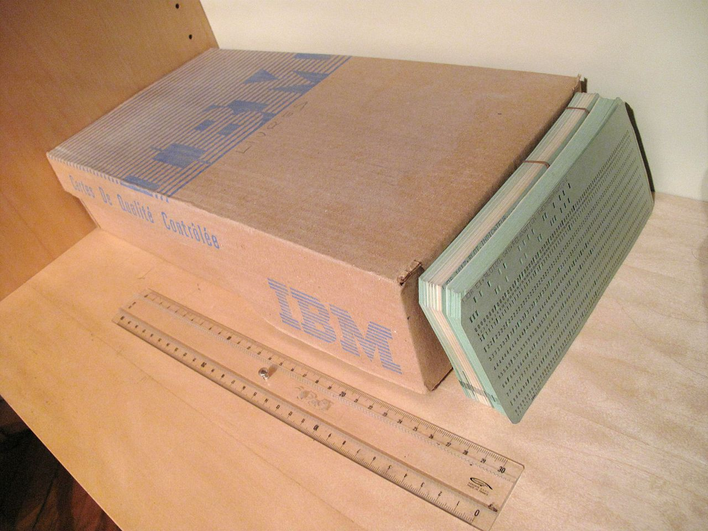
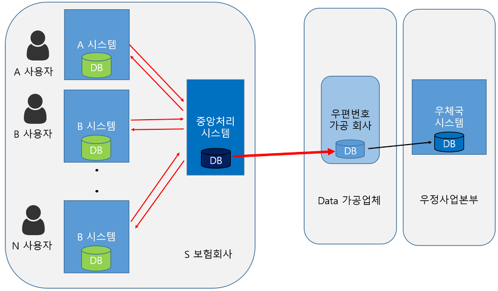
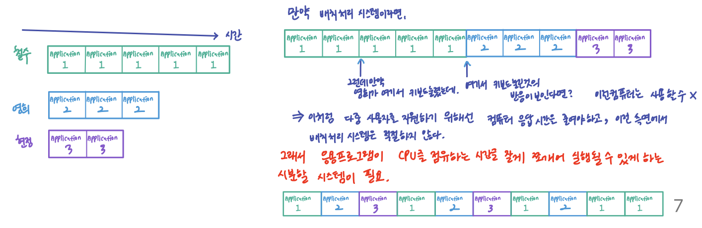
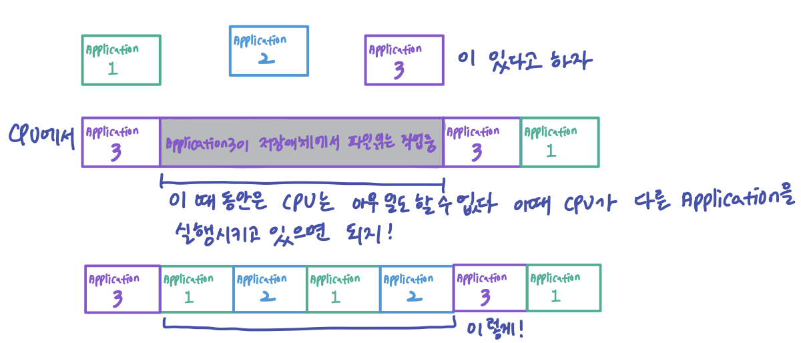
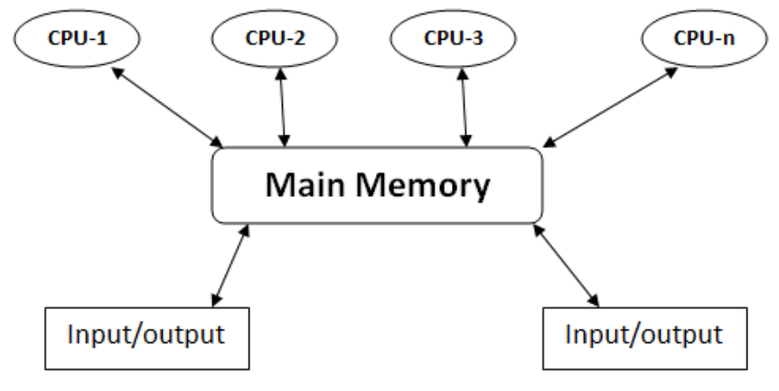

# OS 운용기법 :rocket:

## 일괄 처리 (Batch processing)

일괄 처리는 유닛 레코드 장비, 특히 1980년 미국 인구 조사에 사용된 `허먼 홀러리스`의 도표 작성기에 의해 천공 카드 데크에 저장된 데이터를 처리하던 19세기 말로 거슬러 올라간다. 이것이 데이터를 위한 기계가 읽을 수 있는 매개체의 최초의 이용이었고, 기계가 읽을 수 있는 데이터를 최초로 처리하던 방식이 일괄 처리였다.

일괄 처리란 컴퓨터 프로그램 흐름에 따라 순차적으로 자료를 처리하는 방식을 뜻한다. 초기의 일괄처리 방식은 사용자와 상호작용하는 것이 불가능했지만, 운영체제가 발전함에 따라 프로그램 입출력을 통해 상호작용하는 것이 가능해졌다.

###  장점

- 많은 사용자가 컴퓨터 자원을 공유할 수 있다.
- 작업 프로세스의 시간대를 컴퓨터 리소스가 덜 사용되는 시간대로 이동시킨다.
- 분 단위의 사용자 응답 대기와 더불어 컴퓨터 리소스의 유휴 사용을 피한다.
- 전반적인 이용률을 높임으로써 컴퓨터의 비용을 더 잘 상환하도록 도와준다.

### 단점

- 하나의 작업이 끝나기 전까지 다른 작업을 못한다는 것이 있다. (블로킹과 유사)

### 일괄 처리 시스템이 이용되는 곳

- 데이터 처리
- 인쇄
- DB
- 이미지 처리
- 변환

일정 시간마다 주기적으로 대량의 일을 처리하거나, 순차 접근법을 사용할 수 있는 업무처리에서 주로 사용한다. 

데이터 처리의 경우 급여명세서, 봉급계산, 전화요금, 수도세, 성적처리 등이 일반적인 이용 예시이다.

한번에 처리하는 것으로 시간/비용을 절감하여 효율성을 향상시킬 수 있다.

### 일괄처리 프로그래밍의 구체적인 예시

일괄처리 프로그래밍의 특징은 다음의 3가지로 요약할 수 있겠다.

1. 대량의 데이터 처리
2. 특정 시간에 실행
3. 일괄처리

좋은 블로그에서 가져온 구체적인 예시를 하나 가져왔다.

S라는 보험회사에 다양한 시스템들이 수십 수백개 존재한다고 가정하자.

이 모든 시스템들은 고객 수백만 명의 우편번호를 알아야 한다. 그런데 예를 들어 매일매일 우편번호가 조금씩 수정되고 바뀐다거나, 건물이 허물어지고 새로 지어진다고 가정해 보자. 이럴 경우 기존 우편번호를 회수하거나 없애고 새 우편번호를 발급해줘야 한다. 그리고 이런 일들이 정해진 주기로 일어나지 않기 때문에, S 보험사는 그냥 매일 최신 데이터를 가져오게 된다.

생각만 해도 오래 걸리는데 이런 작업을 업무 시간에 할 것인가? 당연히 그렇지 않다. 시스템 과부하 걸려서 터질 것이다. 아무도 시스템을 사용하지 않는 새벽에 우체국 DB를 조회해 우편번호를 가져오게 된다. `대량의 데이터를 특정 시간(이 경우, 새벽)에 가져오게 되는 일괄처리(Batch)의 특징이 나오는 것이다.`

S보험사의 중앙처리 시스템이 대표로 우편번호를 가져오면, 1차로 배치 프로그램이 작동한 것이다.

그 후에는 S 보험사의 모든 시스템들에게 필요하면 적당한 새벽 시간에 가져가라고 알림이 뜹니다. 그럼 2차적으로 배치 프로그램이 돌아가게 됩니다.

재미있는 곁다리 이야기로, 우체국 시스템은 정말 낱개의 우편번호 한자리 한자리만 저장한다. 알아서 갖다 쓰라는 것. 이게 무슨 말이냐?

S보험사, K보험사, H보험사 각각 우편번호가 필요한데 각각 우편번호의 형식을 다르게 가공해서 사용할 것이다. 000-000, 000000, 00-00-00과 같이.

이걸 우체국에서 다 커버해 줄 필요가 없다. 따라서 우편번호를 가공해주는 제3의 데이터가공 회사가 우편번호를 찾는 고객에 맞게 대신 우편번호를 가공해 줄게 하며 가공된 데이터를 제공한다. 대신 비용을 청구한다! 이렇게 먹고 사는 것이다.

## 시분할 방식 (time sharing) - 1980 즈음

배치 처리 시스템의 단점 (응답시간이 오래 걸린다, cpu 점유율이 쓸데없이 높다)를 해결하기 위한 새로운 개념이 등장했는데, 시분할 시스템과 멀티 태스킹이 그것이다.

시분할 시스템은 여러 명의 사용자가 사용하는 시스템에서 컴퓨터가 사용자들의 프로그램을 번갈아가며 처리해 줌으로써 각 사용자에게 독립된 컴퓨터를 사용하는 느낌을 주는 것으로, `라운드 로빈 Round Robin` 방식이라고도 한다.

### 멀티 태스킹

- 여러 사용자가 각자의 단말을 통해 동시에 OS와 대화하면서 각자의 프로그램을 실행한다.
- 하나의 CPU는 같은 시점에서 여러 개의 작업을 동시에 수행할 수 없기 때문에 CPU의 전체 사용시간을 작은 작업 시간량으로 쪼개어 그 시간량 동안만 번갈아가며 CPU를 할당하여 각 작업을 처리하게 된다.
- 다중프로그래밍 방식과 결합하여 모든 작업이 동시에 진행되는 것처럼 대화식 처리가 가능하게 된다.
- 시스템의 전체 효율은 좋아지나 개인별 사용자 입장에서는 반응속도가 느려질 수 있다.
- 각 작업에 대한 응답 시간을 최소한으로 줄이는 것을 목적으로 하며, 하드웨어를 보다 능률적으로 사용할 수 있다.

시분할 운영 체제는 `cpu 스케줄링`과 `다중 프로그래밍`을 이용해서 각 사용자들에게 컴퓨터 자원을 시간적으로 분할하여 사용할 수 있게 해 준다. 

출력이 사용자에게 표시되고 입력을 키보드에서 읽어들이는 대화식 인터페이스를 제공할 수 있다. 대화식 입출력 속도는 보통 사람들의 처리속도와 같으므로 종료할 때까지 오랜 시간이 걸린다. 예를 들어 사람에게는 1초에 5문자를 치는 것이 빠른 편이지만 컴퓨터 입장에서는 아주 느린 것이다. 이런 경우 운영 체제는 cpu를 그냥 쉬게 하지 않고 다른 사용자의 프로그램을 수행하도록 전환시킨다.

시분할 운영 체제는 많은 사용자들이 컴퓨터를 공유하도록 한다. 시스템은 한 사용자에서 다음 사용자로 빠르게 전환함으로써 각 사용자에게 자신만이 컴퓨터를 사용하고 있는 것과 같은 착각을 주지만, 실제로는 여러 사용자가 하나의 컴퓨터를 공유하여 사용하고 있는 것이다.

- 시분할 시스템의 아이디어는 1960년에 시연되었지만, 구축이 어렵고 비쌌기 때문에 70년대 초까지 보편화되지 않았었다. 오늘날 대부분의 시스템은 시분할 시스템이다.

## 멀티 프로그래밍 (Multi-programming)

`하나의 CPU와 주기억장치`를 이용하여 `여러 개의 프로그램을 동시에 처리`하는 방식이다. 운영체제 구조의 핵심이다.

`UNIX OS`가 1970년 등장했는데, 현대 운영체제의 기본 기술인 멀티태스킹, 시분할 시스템, 멀티 프로그래밍, 다중 사용자 지원 등을 포함한 최초의 운영체제의 등장이었다.

CPU에 비해 주변장치들은 상대적으로 매우 느리다. 만약 컴퓨터가 주변장치에 접근해야 하는 프로그램을 실행시키면 cpu는 마냥 기다려야 했다. 전산학 발전 초기단계에서 cpu 시간은 매우 귀중한 자원이었기 때문에 매우 비효율적이었다.

이러한 낭비를 막기 위해 멀티 프로그래밍이 고안되었다.이 시스템에서는 몇 개의 서로 다른 프로그램들이 컴퓨터의 메모리에 불러들여진다. 첫 번째 프로그램이 실행되다가 주변장치의 처리를 기다려야 한다면, 이 프로그램의 `문맥 Context`은 저장되고, 두 번째 프로그램이 실행될 기회를 얻게 된다. 이런 식의 처리 과정이 모든 프로그램의 작업이 완료될 때까지 반복적으로 일어난다.

이 문맥 교체를 위한 것이 바로 `CPU 스케줄링`이다. 따라서 수행할 작업이 있는 한 CPU는 유휴 상태가 되지 않는다.

요약하자면, 멀티 프로그래밍은 하나의 CPU를 이용하여 여러 개의 프로그램을 동시에 처리하는 방식이다. 주기억장치에 적재된 여러 개의 프로그램들을 CPU가 항상 수행하도록 하여 `CPU 이용률을 높여준다.`

### 단점

다만, 멀티프로그래밍은 프로그램이 적절한 시간에 완료되는 것을 보장하지는 못한다. 메모리에 여러 프로세스를 수용해야 하므로 메모리 관리가 복잡해지며, 실행 대기중인 프로세스간에 처리순서를 스케줄링해야 한다는 단점이 있다.

## 다중처리 (Multi-processing)

`여러 개의 CPU와 하나의 주기억장치`를 이용하여 `여러 개의 프로그램을 동시에 처리`하는 방식이다.

프로세서를 여러 개 사용하며, 프로세서 중 일부에 문제가 발생하더라도 다른 프로세서를 이용해 처리할 수 있으므로 신뢰성이 높다. 일반적으로 하나의 운영 체제가 모든 프로세서들을 제어한다.

## 실시간 처리 (Real Time Processing)

실시간 처리 시스템은 사용할 수 있는 자원이 한정되어 있는 상황에서 작업 수행이 요청되었을 때, 이를 제한된 시간 안에 처리해 결과를 내주는 것을 말한다.

작업의 요청에서 수행결과를 얻기까지 시간적인 제약이 존재하는 시스템으로, 그 제약의 엄격함에 따라서 경성 실시간 시스템, 연성 실시간 시스템으로 나뉜다.

### 실시간 처리 시스템이 이용되는 곳

- 우주선 운행, 교통 제어, 레이더 추적기, 핵물리학 실험 및 데이터 수집, 전화교란장치의 제어, 은행의 온라인 업무 등 시간에 제한을 두고 수행되어야 하는 작업

## 분산처리 (Distributed Processing)

여러 개의 분산된 데이터 저장소와 처리기들을 네트워크로 연결하여 서로 통신하면서 동시에 처리하는 방식

하나의 대형 컴퓨터에서 수행하던 기능을 분산된 여러 컴퓨터에 분담시킨 후, 네트워크를 통해 처리하는 방식이다.

## Reference

[운영체제 운용 기법](https://velog.io/@ckstn0777/%EC%9A%B4%EC%98%81%EC%B2%B4%EC%A0%9C-%EC%9A%B4%EC%9A%A9-%EA%B8%B0%EB%B2%95)

[배치 프로그램이란? 우체국 예시 원문](https://limkydev.tistory.com/140)

[운영체제의 발전사](https://libertegrace.tistory.com/entry/%EC%9A%B4%EC%98%81%EC%B2%B4%EC%A0%9C-%EC%9A%B4%EC%98%81%EC%B2%B4%EC%A0%9C%EC%9D%98-%EB%B0%9C%EC%A0%84%EC%82%AC%EB%B0%B0%EC%B9%98-%EC%B2%98%EB%A6%AC-%EC%8B%9C%EC%8A%A4%ED%85%9C-%EC%8B%9C%EB%B6%84%ED%95%A0-%EC%8B%9C%EC%8A%A4%ED%85%9C-%EB%A9%80%ED%8B%B0-%ED%83%9C%EC%8A%A4%ED%82%B9)

