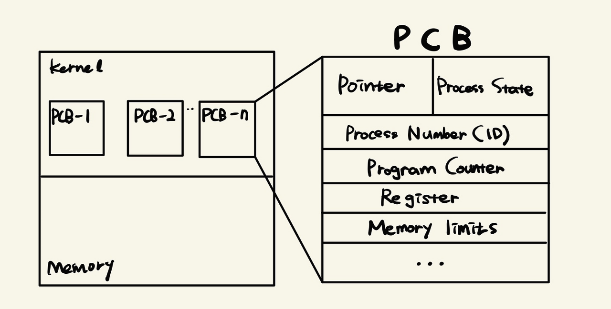
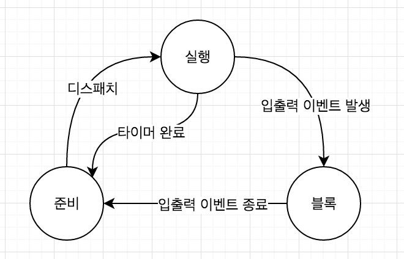

# 프로세스

## **프로세스란?**

운영체제 입장에서 하나의 작업 단위이며, `컴퓨터에서 연속적으로 실행되고 있는 프로그램`을 뜻한다.

### **프로그램과 프로세스**

프로그램 자체는 생명이 없다. 프로그램은 그저 보조 기억장치(하드디스크, SSD)에 존재하며 실행되기를 기다리는 명령어(Code)와 정적 데이터의 묶음이다. 이 프로그램의 명령어와 정적 데이터가 메모리에 적재되면 생명이 있는 프로세스가 된다.

즉, `프로세스란 실행 중인 프로그램` 이다. 예를 들어 하나의 프로그램을 여러 번 구동하면 여러 개의 프로세스가 메모리 상에서 실행되는 것이다.

프로세스는 다음과 같이 여러 형태로 정의할 수 있다.

- **PCB를 가진 프로그램**
- **실(주)기억장치에 저장된 프로그램**
- 프로세서가 할당되는 실체로서, 디스패치가 가능한 단위
- 프로시저가 활동중인 것
  - 프로시저: 한 프로그램은 여러 개의 작은 프로그램으로 분할될 수 있는데 이 때 분할된 작은 프로그램을 의미하며, 부 프로그램이라고도 한다.
- 비동기적 행위를 일으키는 주체
- 지정된 결과를 얻기 위한 일련의 계통적 동작
- 목적 또는 결과에 따라 발생되는 사건들의 과정
- **운영체제가 관리하는 실행 단위**

## 어떻게 여러 개의 프로세스가 동시에 실행될 수 있을까?

프로세스가 동시에 실행될 수 있는 이유는 운영체제가 엄청난 속도로 CPU가 실행할 프로세스를 교체하고 있기 때문이다. 만약 `디스코드와 배틀그라운드를 동시에 하면서 중간엔 밖에 나가서 카카오톡을 할 수 있게 하는 프로세스 관리 프로젝트`가 주어진다고 생각해 보자. 어질어질하다. 대체 운영체제는 어떻게 이런 일을 할 수 있는 걸까?

## 프로세스 구성

프로세스에 대한 정보는 프로세스 제어블록 (PCB) 또는 프로세스 기술자 (process descriptor)라고 부르는 자료구조에 저장된다. 대부분 `PCB`라 부른다.

- PID
  - 운영체제가 각 프로세스를 식별하기 위해 부여된 프로세스 식별번호 (Process Identification)
- Process State
  - CPU는 프로세스를 빠르게 교체하면서 실행하기 때문에 실행중인 프로세스도 있고 대기중인 프로세스도 있다. 그런 프로세스의 상태를 저장한다.
- Program Counter
  - CPU가 다음으로 실행할 명령어를 가리키는 값. CPU는 기계어를 한 단위씩 읽어서 처리하는데 프로세스를 실행하기 위해 다음으로 실행할 기계어가 저장된 메모리 주소를 가리키는 값이다.
- 스케줄링 우선순위
  - 여러 개의 프로세스를 동시에 실행하는 환상을 제공하기 위해서는 프로세스의 순서를 결정해야 한다. 우선순위가 높을 수록 먼저 실행된다.
- 권한
  - 프로세스가 접근할 수 있는 자원을 결정하는 정보이다.
- 프로세스의 부모와 자식 프로세스
  - init 프로세스를 제외하고 모든 프로세스는 부모 프로세스를 복제해서 생성되고 이 계층관계는 트리를 형성한다. 그래서 각 프로세스는 자식과 부모프로세스에 대한 정보를 갖는다.
- 프로세스의 데이터와 명령어가 있는 메모리 위치를 가리키는 포인터
  - 프로세스는 실행중인 프로그램이며, 프로그램에 대한 정보를 가지고 있어야 한다. 프로그램에 대한 정보는 프로세스가 메모리에 저장되며, 이 공간에 대한 포인터 값을 가진다.
- 프로세스에 할당된 자원들을 가리키는 포인터
- 실행문맥
  - 프로세스가 실행상태에서 마지막으로 실행한 프로세서의 레지스터 내용을 담고 있다. CPU에 의해 실행되는 프로세스는 운영체제에 의해 계속 교체되는데 교체되었다가 다시 자신의 차례가 되어서 실행될때 중단된적 없고 연속되는 것처럼 하기 위해 실행문맥을 가진다.

## 프로세스 관리

운영체제는 프로세스들의 실행 사이에 프로세스를 교체하고 재시작할 때 오류가 발생하지 않도록 관리해야 한다. 이를 위해 운영체제는 프로세스의 상태를 `실행 running`, `준비 ready`, `블록 block` 상태로 분류하고 프로세스들을 `상태전이`를 통해 체계적으로 관리한다.

사용자가 프로그램을 실행하면 프로세스가 생성되고 준비리스트에 추가된다. 프로세스는 프로세서 (CPU)가 사용가능한 상태가 되면 CPU를 할당받는다. 이를 준비상태에서 실행상태로 상태전이된다고 한다. 이 과정을 `dispatching`이라고 하고 디스패처가 이 일을 수행한다.

이제 프로세스는 실행상태에서 CPU를 이용해 연산한 후 CPU를 자발적으로 반납하고, 작업이 끝나지 않았다면 다시 `준비상태`로 들어간다. 운영체제는 다시 준비리스트의 첫번째에 있는 프로세스를 실행상태로 바꾸고 이 과정을 반복한다.

> 운영체제는 프로세스가 CPU를 자발적으로 반납하지 않고 독점하는 경우를 막기 위해 하드웨어 단에서 `인터럽팅 클록`을 주기적으로 발생시켜 프로세스가 특정 시간 간격동안만 실행할 수 있도록 한다. 인터럽팅 클록이 발생되면 강제로 실행중인 프로세스의 CPU 제어권을 운영체제에게 빼앗기고 프로세스는 준비상태로 전이된다.

만약 프로세스를 다시 사용하기 전에 입출력이 완료대기를 기다려야 하는 상황이라면 완료될때까지 자신을 `블록`한다. 입출력이 완료되면 운영체제가 프로세스를 블록상태에서 준비상태로 다시 전이시킨다.

> 많은 운영체제가 일시정지 상태를 추가로 정의한다고 한다. 이 상태 덕분에 디버깅을 편리하게 할 수 있다.

## Reference

- https://bowbowbow.tistory.com/16
- https://coding-factory.tistory.com/307