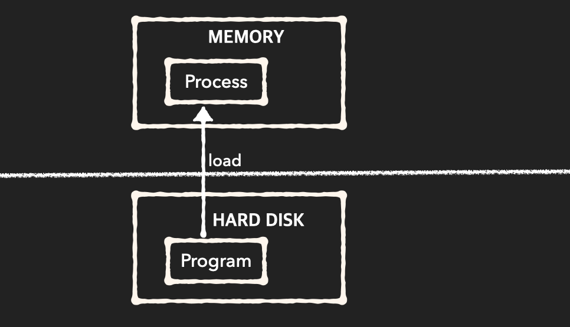

# 프로세스

## **프로세스란?**

운영체제 입장에서 하나의 작업 단위이며, `컴퓨터에서 연속적으로 실행되고 있는 프로그램`을 뜻한다.

### **프로그램과 프로세스**

프로그램 자체는 생명이 없다. 프로그램은 그저 보조 기억장치(하드디스크, SSD)에 존재하며 실행되기를 기다리는 명령어(Code)와 정적 데이터의 묶음이다. 이 프로그램의 명령어와 정적 데이터가 메모리에 적재되면 생명이 있는 프로세스가 된다.

즉, `프로세스란 실행 중인 프로그램` 이다. 예를 들어 하나의 프로그램을 여러 번 구동하면 여러 개의 프로세스가 메모리 상에서 실행되는 것이다.

### 시분할 방식 (time sharing)

시분할 시스템은 컴퓨터를 대화식으로 사용하려는 시도에서 탄생하였다.

시분할 운영 체제는 cpu 스케줄링과 다중 프로그래밍을 이용해서 각 사용자들에게 컴퓨터 자원을 시간적으로 분할하여 사용할 수 있게 해 준다. 출력이 사용자에게 표시되고 입력을 키보드에서 읽어들이는 대화식 인터페이스를 제공할 수 있다. 대화식 입출력 속도는 보통 사람들의 처리속도와 같으므로 종료할 때까지 오랜 시간이 걸린다.

예를 들어 사람에게는 1초에 5문자를 치는 것이 빠른 편이지만 컴퓨터 입장에서는 아주 느린 것이다. 이런 경우 운영 체제는 cpu를 그냥 쉬게 하지 않고 다른 사용자의 프로그램을 수행하도록 전환시킨다.

시분할 운영 체제는 많은 사용자들이 컴퓨터를 공유하도록 한다. 시스템은 한 사용자에서 다음 사용자로 빠르게 전환함으로써 각 사용자에게 자신만이 컴퓨터를 사용하고 있는 것과 같은 착각을 주지만, 실제로는 여러 사용자가 하나의 컴퓨터를 공유하여 사용하고 있는 것이다.

- 시분할 시스템의 아이디어는 1960년에 시연되었지만, 구축이 어렵고 비쌌기 때문에 70년대 초까지 보편화되지 않았었다. 오늘날 대부분의 시스템은 시분할 시스템이다.

## Reference

- https://bowbowbow.tistory.com/16