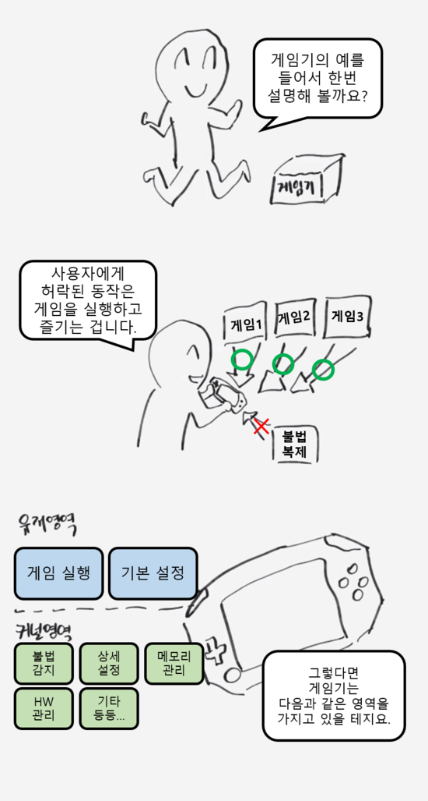
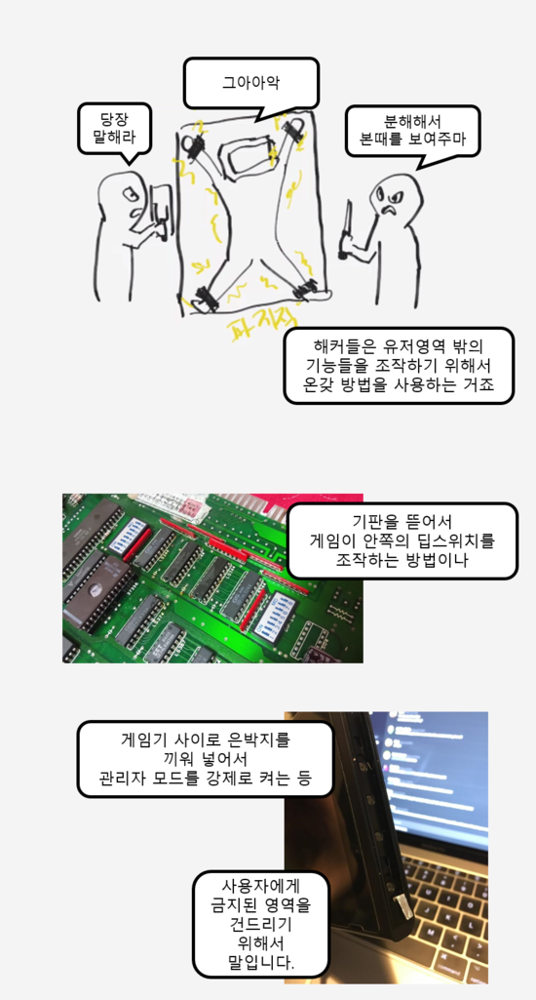
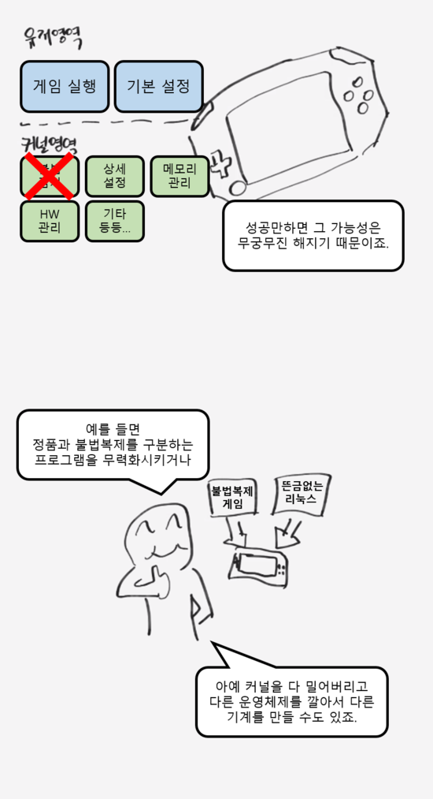
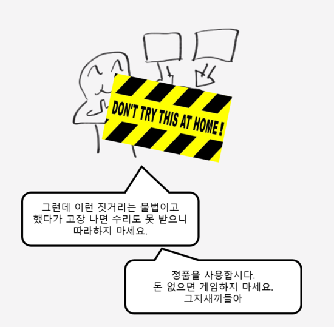
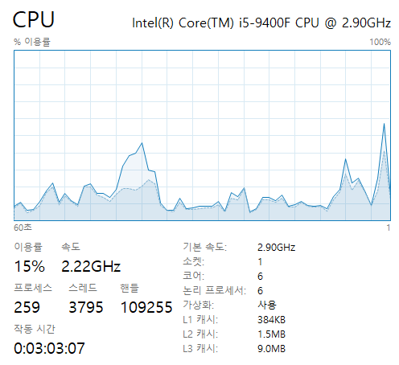
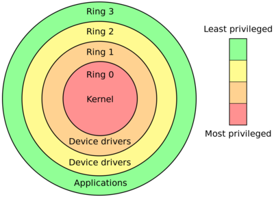
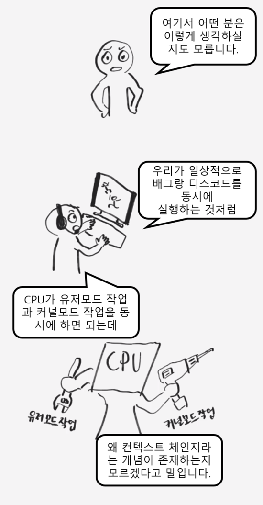
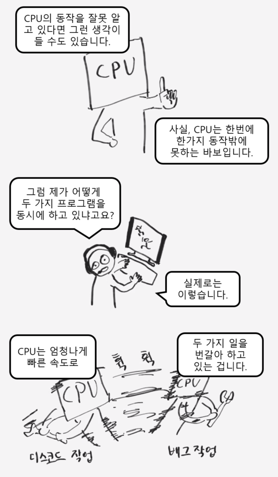
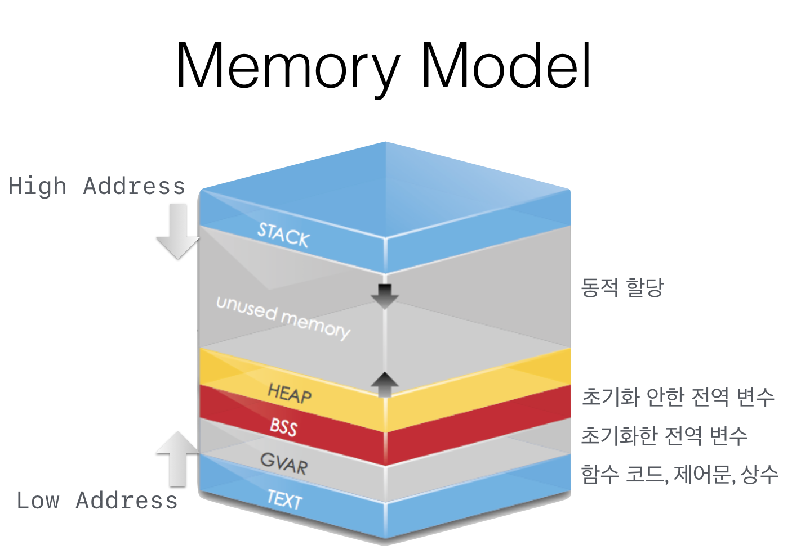

# 프로세스 메모리 구조

[TOC]

## 들어가며

운영체제가 하는 일은 여러 가지 있지만, 컴퓨터의 메모리를 관리하는 일이 가장 중요한 일 중 하나이다. 운영체제는 컴퓨터에서 실행되는 여러가지 프로그램들이 동시에, 효율적으로 실행되도록 하기 위해서 메모리를 관리한다.

운영체제는 컴퓨터를 안전하게 관리하기 위해서 유저 영역과 커널 영역으로 나눠서 관리한다. 그 이유와 각각의 영역의 특징에 대해서 알아 보자.

## 유저 영역과 커널 영역, 유저 모드와 커널 모드

UNIX 시스템은 실행 중인 프로세스에게 4GB의 가상 메모리 공간을 할당한다.

프로세스의 메모리 일부는  실행하는 과정에서 변수 선언이나 메모리의 동적 할당 등의 요소로 사용되고, 나머지는 프로그램의 코드를 올리는 데 사용된다. 여기서 프로그램이 동작하기 위해 사용되는 `메모리 공간(stack, heap, data, code)을 가리켜 유저 영역(User)`이라 하고, `나머지 공간을 커널 영역(Kernal)`이라고 한다.

상위 1GB는 커널 영역이, 하위 3GB는 유저 영역이 차지한다.

### 커널 영역

`OS만을 위한 영역`

프로세스 메모리 공간 중 유저 영역을 제외한 나머지 영역을 커널 영역이라고 한다.

운영체제가 실행되기 위해서는 운영체제 역시 메모리에 올라가야 하고, 일반 프로그램처럼 실행되는 과정에서 변수 선언도 하고 메모리를 동적 할당하기도 한다.

이렇게 운영체제라는 하나의 소프트웨어를 실행시키기 위해서 필요한 메모리 공간을 커널(Kernal)이라고 하는 것이다.

운영체제가 실행될 때의 모드로, 메모리 뿐만 아니라 하드웨어의 접근에도 제한이 따르지 않는다.

### 유저 영역

`사용자가 다룰 수 있는 영역`

응용 프로그램이 실행되는 기본 모드로, 물리적인 영역으로의 접근이 허용되지 않으며 접근할 수 있는 메모리의 영역에도 제한이 있다.

### 왜 나눠두었는가?

우리들, 즉 사용자는 운영체제를 이용해서 롤, 배그, 인터넷, 워드, 디스코드 등 다양한 프로그램을 사용한다. 하지만 그것들을 사용하기 위한 메모리 관리, 프로세스 관리등의 복잡한 잡일은 우리가 하지 않는다. 그런 복잡하고 어려운 일들은 OS가 독자적으로 처리해주기 때문이다.

os는 왜 그렇게 설계되었을까? 어려우니까 대신 해줘야 해서? 단순히 어렵다는 이유 뿐만이 아니다. os가 `메모리, 프로세스 관리`와 같은 복잡한 잡일을 알아서 처리하는 이유는 사용자가 os를 건드려서 컴퓨터에 치명적인 오류나 손상을 입히는 것을 막기 위함이기도 하다.

운영체제의 가장 핵심적인 역할 중 하나인 복잡한 잡일들은 컴퓨터에서 매우 민감한 자원들을 직접적으로 조작하는 일이다. 만일 사용자가 이러한 부분을 마음대로 건드릴 수 있다면? 컴퓨터를 무궁무진하게 사용할 수도 있을 것이다.

하지만 이런 긍정적인 경우보다는 사용자의 미숙한 조작으로 컴퓨터를 망가뜨리거나, 악의적인 의도로 남의 정보를 감청, 시스템을 불법적으로 조작하는 일이 더 많을 것이다.

그래서 대부분의 os는 유저 영역과 커널 영역을 나눠서 컴퓨터를 관리한다. 이를 통해 os는 악의적인 의도를 가진 사용자가 운영체제의 핵심 부분을 조작하지 못하도록 보호하고, 사용자가 사용하는 프로그램의 오류에 의해서 os가 치명적인 손해를 입는 것을 방지한다.

### 유저 모드와 커널 모드

어플리케이션이 반응이 없거나 오류가 날 때, 작업관리자를 켜서 강제로 프로세스를 종료하고는 한다. 보통은 이렇지만 작업관리자로 할 수 있는 일들은 생각보다 많다.

대표적인 예로 프로세스 탭 바로 옆의 성능 탭을 볼 수가 있다. 성능탭에선 컴퓨터의 여러 자원들이 얼마나 일하고 있는지 확인할 수 있는데, CPU의 그래프를 우클릭한 뒤 커널시간 표시를 체크하면 위의 그래프를 볼 수 있다.

그럼 위의 2개의 색으로 나뉜 그래프는 뭘 의미하는 것일까? 

진한 부분은 CPU가 커널영역의 일을 했다는 것, 연한부분은 유저 영역의 작업을 했음을 뜻한다.

위의 그림은 CPU가 하는 일들을 링 형태로 구분해서 표현한 그림이다. 그림의 링은 안쪽에 가까울수록 커널과 운영체제의 핵심에 가까운 일을 뜻한다. 즉, 가장 안쪽 Ring 0은 CPU가 커널 영역에서 하는 일을 뜻한다. 그래서 CPU가 해당 영역의 작업을 수행할 때, CPU는 커널모드가 된다. 반대로 CPU가 Ring 0 밖의 작업을 수행할 때는 CPU가 유저모드가 되는 것이다.

그리고 이 CPU의 모드가 커널 모드에서 유저 모드로, 유저 모드에서 커널 모드로 전환하는 것을 `컨텍스트 체인지 Context Change`라고 하는 것이다!!

## 유저 영역의 메모리 구조

### Stack 영역

`호출된 함수의 수행을 마치고 복귀할 주소 및 데이터(지역변수, 매개변수, 리턴 값)를 임시로 저장하는 공간`

프로그램이 자동으로 사용하는 임시 메모리 영역으로 함수 호출과 관계되는 지역변수와 매개변수, 리턴 값 등이 잠시 사용되었다가 사라지는 데이터를 저장하는 영역이다.

함수 호출 시 생성되며, 함수가 끝나면 반환된다. stack 사이즈는 각 프로세스마다 할당되지만 프로세스가 메모리에 로드될 때 stack 사이즈가 고정되어 있어 런타임 시 stack 사이즈를 바꿀 수 없다. 명령 실행 시 자동으로 증가 또는 감소하기 때문에 보통 메모리의 마지막 번지를 지정한다.

컴파일 시 Stack 영역의 크기가 결정되기 때문에 무한정 할당할 수 없다. 재귀함수가 반복해서 호출되거나 함수가 지역변수를 메모리를 초과할 정도로 너무 많이 가지고 있다면 `Stack overflow`가 발생한다.

### Heap 영역

`프로그래머가 필요할 때마다 사용하는 메모리 영역`

데이터 영역과 스택 영역에 할당되는 메모리의 크기는 컴파일 타임(compile time)에 미리 결정된다. 하지만 힙 영역의 크기는 프로그램이 실행되는 도중인 런타임(run time)에 사용자가 직접 결정하게 된다. 이렇게 런타임에 메모리를 할당받는 것을 메모리의 동적 할당(dynamic allocation)이라고 한다. 

즉, 힙 영역은 필요에 의해 메모리를 동적 할당하고자 할 때 사용하는 메모리 영역으로 동적 데이터 영역이라고 부른다. 메모리 주소값에 의해서만 참조되고 사용하는 영역이다.

메모리 동적 할당과 관련된 C의 함수로는 `malloc, free, calloc, realloc` 이 있다.

### Stack과 Heap

Stack과 Heap 영역은 위의 그림에서 유추할 수 있듯, 같은 공간을 공유한다. 힙은 메모리의 낮은 주소부터, 스택은 메모리의 높은 주소부터 할당되는 식이다. 그리고 각 영역이 상대 공간을 침범하는 경우를 `Stack overflow, Heap overflow` 라고 부른다.

### Data 영역 (BSS, GVAR)

`전역 변수 또는 정적 변수 등 프로그램이 사용하는 데이터를 저장하는 공간`

프로그램이 실행될 때 생성되고 프로그램이 종료되면 시스템에 반환되며 전역변수, 정적변수, 배열, 구조체 등이 저장된다. Data 영역은 `BSS` 영역과 `Data(GVAR)` 영역으로 나뉘어지는데, 초기화된 데이터는 Data 영역에 저장되고 초기화되지 않은 데이터는 BSS 영역에 저장된다.

전역변수가 변경될 수도 있어 Read-Write로 되어 있다.

- BSS와 Data의 영역 구분을 하는 이유
  - 프로그램을 짠 뒤 컴파일하고 링크하고 이미지로 만들어 시스템의 ROM에 저장했다고 가정하자. 이 때 초기화된 데이터는 초기값을 저장해야 하니 Data 영역에 저장되어 rom에 저장된다. 
  - 하지만 초기화하지 않은 데이터까지 롬에 저장하기에는 큰 사이즈의 롬이 필요해서 비효율적이고 비용이 많이 들기 때문에 RAM에 저장한다. 이를 위해 BSS와 Data를 구분한다.

### Code 영역 (Text)

`사용자가 작성한 프로그램 함수들의 코드가 cpu에서 수행할 수 있는 기계어 명령 형태로 변환되어 저장되는 공간`

코드 영역은 실행 명령을 포함하는 프로그램의 코드 본문이 저장되는 영역이다. 

프로그램을 시작할 때 컴파일한 프로그램(기계어)이 저장되어 있고, Read-Only이므로 프로세스가 함부로 변경할 수 없고 변경 시 오류를 발생시킨다.

코드 자체를 구성하는 메모리 영역으로 Hex 파일이나 Bin 파일 메모리이다. 프로그램 명령이 위치하는 곳으로 기계어로 제어되는 메모리 영역이다.

## 정리

운영체제가 

# Reference

- https://ko.wikipedia.org/wiki/%EC%8B%9C%EB%B6%84%ED%95%A0_%EC%8B%9C%EC%8A%A4%ED%85%9C
- https://kyu9341.github.io/%EC%9A%B4%EC%98%81%EC%B2%B4%EC%A0%9C/2020/10/04/OS_Process_Structure/
- https://recorda.tistory.com/entry/20160503%ED%94%84%EB%A1%9C%EC%84%B8%EC%8A%A4-%EB%A9%94%EB%AA%A8%EB%A6%AC-%EA%B5%AC%EC%A1%B0

- http://tcpschool.com/c/c_memory_structure
- https://ehpub.co.kr/54-%ED%94%84%EB%A1%9C%EC%84%B8%EC%8A%A4-%EB%A9%94%EB%AA%A8%EB%A6%AC-%EA%B5%AC%EC%A1%B0/
- https://m.blog.naver.com/ya3344/221238418657
- https://blog.naver.com/PostView.nhn?isHttpsRedirect=true&blogId=sheep_horse&logNo=221271778167
