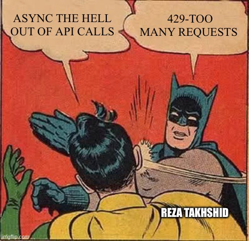

# 동기와 비동기

### 들어가며

자바스크립트는 싱글스레드 언어다. 단 하나의 실행 컨텍스트만 가질 수 있고, 하나의 실행 컨텍스트는 하나의 작업만 수행할 수 있다. 엥? 한 번에 하나만 할 수 있다고?

정말 한 번에 하나만 한다면, 우리는 옛날 타자기에서 글자가 찍히듯이 더듬더듬 페이지가 로딩되는 것을 구경하고 있어야 할 것이다. 그러나 실제로는 그렇지 않다. 웹사이트들의 로딩은 눈으로 구별할 수 없을 만큼 빠르고, 페이지 전체가 로딩되기 전에 급하게 로그인 버튼만 눌러서 로그인 페이지로 이동하는 것도 가능하다. 이것을 가능하게 해 준 것이 비동기 프로그래밍이다.


### 동기 까페, 비동기 까페

- 동기 (Synchronous)
- 비동기 (Asynchronous)

두 단어의 차이는 철자 하나뿐인데, 대체 뭐가 다른 걸까?

당신이 동기 까페와 비동기 까페를 이용해 본다고 가정하자.


a) 동기의 경우, 당신은 카운터에서 주문하고 커피가 나올 때까지 하염없이 기다려야 한다. 만약 앞의 손님이 `두유 온도 34도, 꿀, 아가베 시럽, 블루베리 토핑, 녹차가루, 헤비 크림, 거품 많이, 꿀, 엑스트라 카라멜 시럽,코코넛밀크 0.152샷 추가, 컵의 90%만 채운 바닐라빈 크림 프라푸치노 그란데 사이즈`를 시켰다면, 당신은 5분만에 나오는 아이스 아메리카노를 시킬 생각이더라도 기다려야 한다.
그리고 까페 사장은 진동벨 구매, 관리에 신경쓸 것 없이 열심히 커피만 만들면 된다. 일 처리가 늦어져서 많은 손님을 받지는 못하겠지만.

b) 비동기의 경우, 당신은 주문하고 나면 진동벨을 받는다. 앞의 사람이 어떤 주문을 넣었든 내 주문을 넣어두고 핸드폰을 보고 있을 수 있는 것이다.
그리고 까페 사장은 음료를 완성하고 나면 해당 음료에 해당하는 진동벨을 울리게 된다.

...이후 당신은 이후에 동기 까페에는 얼씬도 하지 않을 것이다. 커피 나오는 속도보다 당신 속이 터지는 것이 빠를 테니까. 반면 비동기 까페는 손님이 좋지만 사장이 생각해야 할 것(진동벨 회수, 관리 등)이 늘어나는데, 실제 비동기 프로그래밍과 동기 프로그래밍의 관계도 비슷하다. 같은 시간에 더 많은 일을 처리할 수 있는 비동기 프로그래밍은 그만큼 신경써야 할 일이 늘어난다.


### 동기 처리

```javascript
console.log(1)
console.log(2)
console.log(3)
```

위와 같은 경우, console.log(1)이 실행되면 그 작업이 완료될 때까지 다음 작업은 실행되지 않는다.블로킹이 발생하는 것이다. 비단 자바스크립트 뿐만 아니라 파이썬 코드를 봐도 결과는 같다. 만약 작업을 실행하다가 에러가 나면 전체 작업이 멈추게 된다. 이러한 방식이 동기 처리 방식이다.


### 비동기 처리

```javascript
console.log(1)
setTimeout( function () {
    console.log(2)
}, 1)
console.log(3)
```

비동기 처리에 대한 공부를 해봤다면 무조건 본 적이 있을 것이다.

위 코드의 결과는 무엇일까?

```
1
3
2
```

답은 1,2,3이 아니라  1, 3, 2이다. 

setTimeout 함수는 비동기처리를 해주는 자바스크립트 내장 함수이며, 비동기 작업이 끝날 때까지 기다리지 않고 다음 작업을 수행해 버리기 때문이다.

비동기를 알기 전에는 위에서 아래로 차근차근 내려가는 것이 당연하니 머리에 `?` 또는 `!`가  떠올랐을 것이다.


### 자바스크립트는 어떻게 일하는가?  비동기 처리는?

싱글스레드인 자바스크립트 엔진으로 어떻게 이러한 처리가 가능한 것일까? 그 이유는 브라우저와 Node.js가 이벤트 루프(Event Loop)와 태스크 큐(Task Queue)를 제공한다는 것에 있다.

키워드를 바탕으로 정리해 보자.


### JS Engine

- Call Stack
  - 코드가 실행되면 쌓이는 스택.
  - 싱글 스레드가 하나라는 것은 곧 콜 스택이 하나라는 것을 의미한다.
- Memory Heap
  - 사용자가 직접 관리하는 메모리 영역. 
  - 사용자에 의해 메모리 공간이 동적으로 할당되고 해제된다. 
  - 힙 영역은 메모리의 낮은 주소에서 높은 주소의 방향으로 할당된다.
    - 반대로 스택 영역은 메모리의 높은 주소에서 낮은 주소의 방향으로 할당된다. 즉 스택과 힙은 서로 반대 방향부터 채우기 때문에 서로의 영역을 침범할 수 있다.
    - 스택이 힙 영역을 침범하는 것이 그 유명한 `Stack Overflow` , 반대로는 `Heap Overflow`가 있다.
    - 왜 스택은 높은 주소에서 낮은 주소로 채워지는가?
      - 함수가 호출될 때 필요한 스택 메모리를 할당받는데, 이것은 함수 반환 후 사용했던 스택 메모리를 반환하여 전체적인 스택 메모리 상의 변경이 없어야 하기 때문이다.
      - 즉, 가장 중요한 Kernel 영역을 침범하지 않으면서도 전체적으로 일정한 영역을 차지하기 위함이다.

### Web API

- 그림의 우측 상단에 위치한 Web APIs는 자바스크립트 엔진이 아니라 브라우저에서 제공하는 API로, DOM, AJAX, Timeout 등이 있다. 
- 콜 스택에서 실행된 비동기 함수는 Web API를 호출하고, Web API는 콜백함수를 Callback Queue에 밀어 넣는다.

### Callback Queue

- 비동기로 실행된 콜백함수가 보관되는 영역이다.
- 예를 들어 setTimeout에서 타이머 완료 후 실행되는 함수 (첫번째 인자), addEventListener에서 click 이벤트가 발생했을 때 실행되는 함수(두 번째 인자) 등이 보관된다.

### Event Loop

- 콜 스택이 비면, 콜백 큐의 첫번째 콜백을 콜 스택으로 밀어 넣는다.
- 이러한 반복적인 행동을 틱(tick)이라 부른다.


### 정리

자바스크립트는 싱글 스레드 언어라 한번에 하나밖에 처리할 수 없다. 그러나 Web API, Callback Q, Event Loop 덕에 동시에 작업이 가능한 것이다. 일을 떠넘기는 것일지도...

비동기 처리는 웹으로 많은 일을 할 수 있게 해주는 고마운 친구인 만큼, 수많은 곳에서 쓰인다. 웹의 기능이 늘어나는 만큼 비동기 프로그래밍은 필수가 되었다.



하지만 비동기 코드를 생각없이 도배하면 안된다. 생각없이 사용한 비동기 코드는 예상치 못한 오류를 발생시키기 십상이다. 이러한 오류를 피하기 위해 Callback Function, Promise, async&await 가 있으며, 열심히 공부하고 신중하게 사용해야 한다. 비동기 처리의 오류를 피하기 위한 내용은 다음 글에 정리하자.


## Reference

- [이벤트 루프](https://velog.io/@thms200/Event-Loop-%EC%9D%B4%EB%B2%A4%ED%8A%B8-%EB%A3%A8%ED%94%84)
- http://tcpschool.com/
