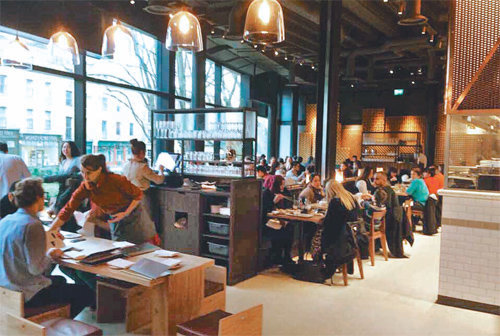

# 가상 메모리 Virtual Memory

## Virtual Dining Reservation :man_cook:



제가 일했던 동대문 근처의 한식당 얘기를 하겠습니다. 뜬금없는 얘기가 아니라 가상 메모리랑 관련된 이야기니까 들어 보세요. 여하튼 이 식당은 제법 큰 곳이라 저녁에 예약을 받는데, 예약이 되게 많이 몰립니다. 그런데 예약 하면 노쇼 문제가 있잖아요? 처음에는 그렇게 하지 않았는데, 주인이 나중엔 예약을 몇 배수를 받습니다. 테이블이 열개다 그러면 스무개를 받는 거에요. 그런데 주인아저씨가 하는 얘기가 뭐나면, 그래도 돌아 간다는 거에요. 이게 왜 가능하냐면 첫째로 노쇼가 있죠. 그렇기도 하지만 시간의 차이를 두고 손님들이 온다는 거죠. 위치 특성상 "저녁때 쯤 갈게요~" 하고 오는거라, 6시에 와서 빠르게 식사하고 나갈 수도 있고 그러면 8시에 손님을 또 받을 수가 있잖아요?

장진호 고객님 오셨습니다~ 하면 주인이 8번 테이블이야 하면서 안내해 줍니다. 그렇게 손님들을 안내하다가, 장진호 씨가 식사를 마치고 최준성 씨가 오시면 마치 준성이를 위해서 비워 뒀던 자리인 마냥 안내를 해 주는 겁니다.

만약 손님이 20팀이라면 실제로 필요한 테이블은 20개입니다. 그런데 부족하니까, 다른 손님이 와도 우선 자리를 주는겁니다. 이게 `가상 메모리`의 기본입니다. 예를 들어 20개의 메모리, 20번지가 필요한데 10개의 번지에만 할당할 수 있다고 한다면 1번지에 1번 메모리를 할당할 수도 있지만 20번의 메모리를 할당할 수도 있다는 거죠.

## CPU와 메인 메모리, 보조기억장치

CPU 2G짜리가 있습니다. 그런데 메인 메모리가 256MB밖에 없습니다. 이렇게 부족함에도 불구하고 2G의 메모리의 공간을 서비스 해주기 위해서 할 수 있는 방법은, 보조 기억장치를 이용하는 것입니다. 보조 기억장치는 커다란 메모리 용량 뿐만 아니라 파일 시스템을 구축해서 비휘발성으로 전원이 나가도 데이터를 저장할 수 있는 기능까지 제공해 줍니다. 다만 속도가 느리다는 단점이 있습니다.

`메인 메모리 공간이 부족하니까 보조기억장치까지 메인 메모리 영역을 확장시켜서 사용하자`는 것이 바로 가상 메모리입니다.


## Virtual Address 가상 주소

논리 주소 Logical Address 라고도 한다.

가상 주소로 해결할 수 있는 두 가지

- 선 할당으로 인한 부담
- 느린 속도의 개선

### 선 할당으로 인한 부담

OS에서는 프로세서를 생성할 때마다, 예를 들어서 32비트는 4G의 메모리 공간을 할당해 줍니다. 이 4G는 제가 짠 코드를 실행할 공간 2G, 커널 모드로 바뀌어서 운영체제의 코드가 실행되기 위한 공간인 2G로 나뉩니다. 만약 제가 500mb짜리 프로그램을 짰으면 제가 사용할 수 있는 공간은 2G - 500MB가 남았다는 것입니다.

만약 4G 메모리를 써야 한다고 해서 통짜로 할당해 버리면 안됩니다. 앞선 식당을 예로 들면 손님이 오지도 않았는데 테이블을 예약석으로 비워놓는 거에요. 따라서 다른 프로세스가 생성될 때를 대비해서 4GB를 필요에 맞게 적절히 나눠 써야 합니다.

### 느린 속도의 개선

그러면 RAM과 보조기억장치에 걸쳐서 메인 메모리가 구성되어 있을까요? 그러면 램에 프로세스가 올라 있을 때에는 빨랐다가 보조기억장치에 올라가면 느려졌다가 할까요? 그런 건 경험해 보신 적이 없죠. 하드디스크에도 가상주소를 할당할 수 있습니다만 실질적인 물리 주소는 메인 메모리인 램에만 할당되어 있습니다.

### 선할당 문제 해결 MMU (Memory Management Unit, 하드웨어 모듈)

CPU도 2G까지의 공간이 있다고 가정하고 0 ~ 2GB의 1번지 메모리에 접근한다고 합시다.

cpu가 2gb-1번지의 데이터를 요청하면 mmu가 그 번지의 데이터를 가져다 줍니다. 마치 메모리공간이 그 주소까지 있고, 그 번지에 데이터가 있는 것 처럼.

MMU도 데이터를 블럭단위로 처리합니다.

메인메모리가 16KB이고, CPU는 2GB까지 접근가능하다고 생각하고, MMU가 데이터를 4KB단위로 처리할 때 메인메모리는 4KB씩 네조각으로 나눌 수 있습니다.


이때 CPU가 1K부터 20바이트 할당해달라고 요청하면 MMU가 메인메모리 첫 번째 칸을 0 ~ 4K로 할당합니다.


앞으로 CPU가 0 ~ 4K번지에 메모리할당을 요구하면 이 칸에 순차적으로 할당하게 됩니다. 1번 블럭은 가상주소 0 ~ 4K번지로 용도가 결정난 겁니다.

이번에는 CPU가 36K부터 20바이트를 할당하고싶다고 요청합니다.

그러면 mmu가 2번 블럭의 용도를 36 ~ 40 K로 결정합니다.


**실제 물리적인 주소로 보면**

첫번째 블럭의 물리주소는 0~4K-1,

두번째 블럭의 물리주소는 4K~8K-1번지입니다.

CPU가 36KB번지의 데이터를 달라고 하면

메인메모리 크기는 16KB일 지라도

아, 내가 36K번지 어디다가 할당했더라?

아, 두번째 블록(=물리주소로는 4K번지의 공간)에 할당했었지!

=> 4K번지에 있는 내용을 꺼내주게 됩니다.

```
MMU의 역할: 제한된 메모리 공간을 적절히 활용하게 한다.

1.메인메모리의 각 블럭을 몇번지 가상주소로 사용할 지 결정한다.    *메모리 할당해라

2. CPU가 가상주소로 요청했을때, 이 주소를 물리주소로 바꿔서 → 데이터를 가져와서 → CPU한테 준다.    *어디에 있는 데이터 가져와라
```

### 느린속도문제 해결

캐시 관계로 해결합니다. 캐시와 RAM의 관계와 RAM과 보조기억장치의 관계가 거의 같다고 생각하시면 편합니다.

보조기억장치에 필요한 4G에 대한 전체 그림을 다 넣고 cpu가 필요로 하는 것을 RAM에 갖다놓고 실행합니다.

### 스왑파일

하드디스크는 파일시스템 기반으로 데이터를 저장합니다.

따라서 LRU캐시에 의해 하드디스크로 온 데이터블럭도 파일로 저장합니다.

`프로세스의 가상메모리 공간 확장을 위해 필요한 메모리를 관리하려고 생성한 파일`

### RAM만큼이나 중요한 하드디스크

그래서 하드디스크의 여유공간이 중요한 것입니다.

하드디스크는 데이터를 비휘발성으로 저장하는 역할만 하는 것이 아닙니다.

멀티태스킹 관점, 프로세스의 메모리공간 할당 관점에서도 중요한 역할을 합니다.

그래서 개발자들이 하드디스크의 남은 공간도 신경을 많이 쓰게 됩니다. 이제 저장으로 하드디스크가 꽉차면 안되는 이유를 저도 알겠네요!

### 둘 이상의 프로세스와 가상메모리

프로세스가 여러 개 생성되면 스왑파일도 프로세스별로 생깁니다. 예를들어 프로세스가 3개 생성되면, 프로세스 별로 4G, 12G의 메모리 공간이 필요합니다.

이는 하드디스크에 프로세스별로 스왑파일을 생성하기 때문에 가능한 일입니다.

> 프로세스 실행이 이동할때마다 RAM에 있는 데이터가 비워지고 채워집니다.

이 또한 컨텍스트 스위칭 범주에 들어갑니다. WOW!

## 가상 메모리 관리 기법

- 페이징
- 세그멘테이션