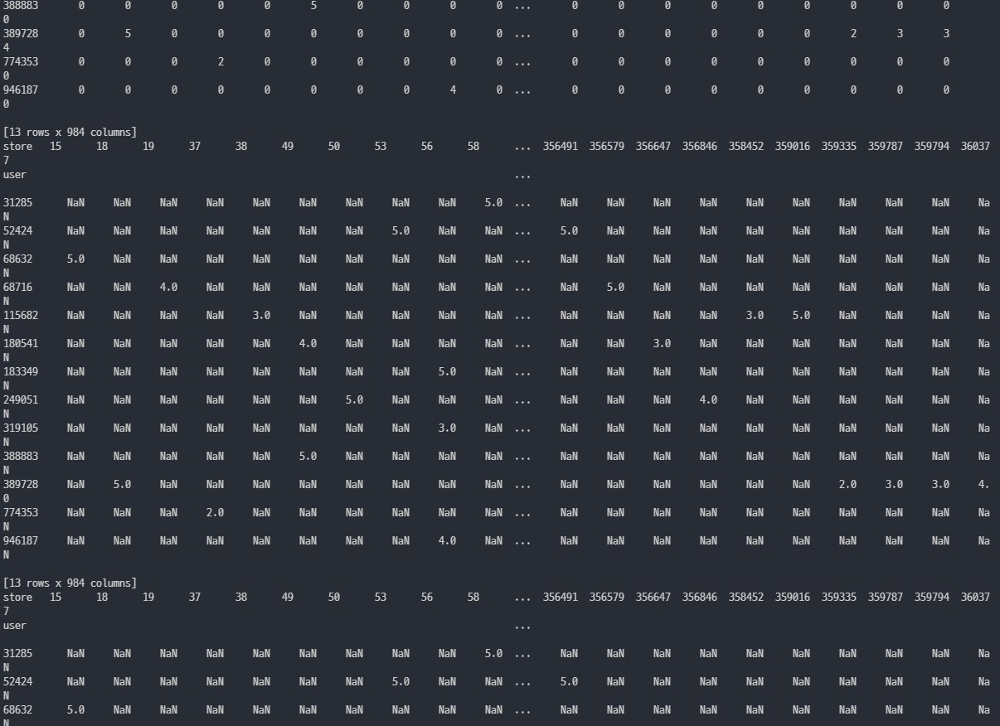

Sparse

`scipy.sparse.csr_matrix()` 를 써서 df를 Compressed Sparse Numpy Matrix로 바꾸는 작업

- 데이터 재구조화 (reshaping)
- data.pivot(index, columns, values)
- pd.pivot_table(data, index, columns, values, aggfunc)

기존의 데이터를 sparse matrix 에서 Compressed sparce array로 바꿔주기

### pivot_table의 NaN, 결측값 제거

```python
pivot_table = merge.pivot_table(index='user', columns='store', values='score', aggfunc=np.mean, fill_value=0)
print(pivot_table)

pivot_table2 = merge.pivot_table(index='user', columns='store', values='score', aggfunc=np.mean)
print(pivot_table2)

pitov_sparse = pivot_table2.astype(pd.SparseDtype('int', np.nan))
print(pitov_sparse)
```



fill_value=0 또는 fillna(0)의 경우에만 제대로 결측값 변경에 성공한다.

https://rfriend.tistory.com/551
