# Cache Deepdive

기술의 발전으로 프로세서 속도는 빠르게 증가해온 반면, 메모리의 속도는 이를 따라가지 못했습니다. 프로세서가 아무리 빨라도 메모리의 처리 속도가 느리면 결과적으로 전체 시스템 속도는 느려집니다. 이를 개선하는 장치가 바로 캐시(Cache)입니다.

캐시는 CPU 칩 안에 들어가는 작고 빠르고 비싼 메모리입니다. 프로세서가 매번 메인 메모리에 접근해 데이터를 받아오면 시간이 오래 걸리기 때문에 캐시에 `자주 사용하는 데이터를 담아두고, 해당 데이터가 필요할 때 프로세서가 메인 메모리 대신 캐시에 접근하도록 해` 처리 속도를 높입니다.

## Principle of Locality

`자주 사용하는 데이터`는 그럼 어떻게 구분할까요? 바로 지역성의 원리를 따릅니다.
지역성은 `시간 지역성 Temporal Locality`과 `공간 지역성 Spatial Locality`으로 구분합니다.

시간 지역성은 최근 접근한 데이터에 다시 접근하는 경향을 말합니다. 가령, 루프에서 인덱스 역할을 하는 변수 `i`에는 짧은 시간에 여러 번의 접근이 이뤄집니다.

```c
for (int i=0; i<10; i++) {
    arr[i] = i;
}
```

공간 지역성은 최근 접근한 데이터의 주변 공간에 다시 접근하는 경향을 말합니다. 위 루프의 경우 배열 `arr`의 각 요소를 참조하면서 가까운 메모리 공간에 연속적으로 접근합니다. 배열의 요소는 메모리 공간에 연속적으로 할당되기 때문입니다.

프로세스 실행 중 접근한 데이터의 접근 시점과 메모리 주소를 표시한 아래 그림은 시간 지역성과 공간 지역성의 특징을 잘 보여줍니다.

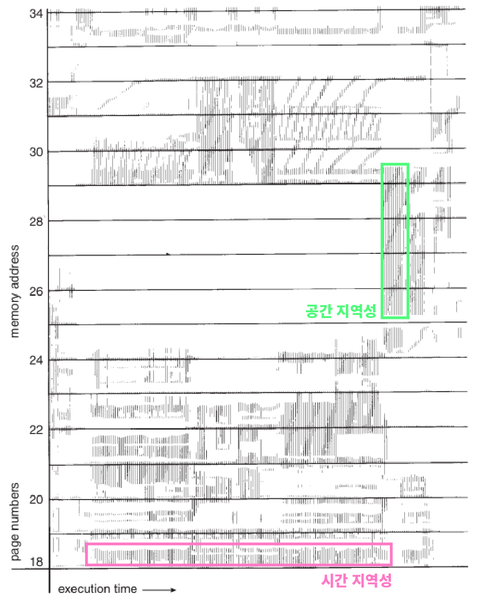

한 프로세스 안에도 자주 사용하는 부분과 그렇지 않은 부분이 있기 때문에 운영체제는 프로세스를 `페이지 Page`라는 단위로 나눠 관리하며, 위 그림은 페이지를 참조한 기록입니다. 가로 축은 실행 시간, 세로 축은 메모리 주소입니다. 즉, 수평으로 이어진 참조 기록은 긴 시간에 걸쳐 같은 메모리 주소를 참조한 것이고, 수직으로 이어진 참조 기록은 같은 시간에 밀접한 메모리 주소를 참조한 것입니다. 페이지에 접근할 때도 지역성 원리가 적용된다는 것을 알 수 있습니다.

## Caches

CPU 칩에는 여러 개의 캐시가 들어가며, 각각의 캐시는 각자의 목적과 역할을 가지고 있습니다.

```
+-------------+------+------+     +---------------+     +--------+
|             |  I$  |      | <-- |               | <-- |        |
+  Processor  +------+  L2  |     |  Main Memory  |     |  Disk  |
|             |  D$  |      | --> |               | --> |        |
+-------------+------+------+     +---------------+     +--------+
```

- L1 Cache: 프로세서와 가장 가까운 캐시. 속도를 위해 I$와 D$로 나뉜다.
  - Instruction Cache (I$): 메모리의 TEXT 영역 데이터를 다루는 캐시
  - Data Cache (D$): TEXT 영역을 제외한 모든 데이터를 다루는 캐시
- L2 Cache: 용량이 큰 캐시. 크기를 위해 L1 캐시처럼 나누지 않는다.
- L3 Cache: 멀티 코어 시스템에서 여러 코어가 공유하는 캐시

캐시에 달러 기호($)를 사용하는 이유는 말 그대로 발음이 `Cash`와 같기 때문입니다.

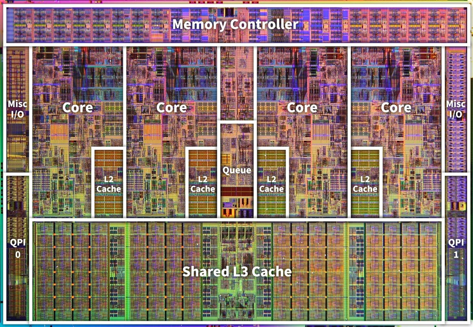

오늘날 CPU 칩의 면적 중 `30 ~ 70%`는 캐시가 차지합니다. 1989년 생산된 싱글 코어 프로세서인 i486의 경우 8KB짜리 I/D 캐시 하나만 있었습니다. 인텔 코어 i7 쿼드코어 칩의 다이 맵(Die map)을 보면 4개의 코어에 각각 256KB L2 캐시가 있고, 모든 코어가 공유하는 8MB L3 캐시가 있는 것을 볼 수 있습니다.

## Cache Metrics

캐시의 성능을 측정할 때는 히트 레이턴시(Hit latency)와 미스 레이턴시(Miss latency)가 중요한 요인으로 꼽힙니다.

CPU에서 요청한 데이터가 캐시에 존재하는 경우를 캐시 히트(Hit)라고 합니다. 히트 레이턴시는 히트가 발생해 캐싱된 데이터를 가져올 때 소요되는 시간을 의미합니다. 반변 요청한 데이터가 캐시에 존재하지 않는 경우를 캐시 미스(Miss)라고 하며, 미스 레이턴시는 미스가 발생해 상위 캐시에서 데이터를 가져오거나(L1 캐시에 데이터가 없어서 L2 캐시에서 찾는 경우) 메모리에서 데이터를 가져올 때 소요되는 시간을 말합니다.

`평균 접근 시간 Average access time` 은 다음과 같이 계산합니다.


캐시의 성능을 높이기 위해서는 캐시의 크기를 줄여 히트 레이턴시를 낮추거나, 캐시의 크기를 늘려 미스 비율을 줄이거나, 더 빠른 캐시를 이용해 레이턴시 자체를 줄이는 방법이 있습니다.

## Cache Organization

캐시는 반응 속도가 빠른 `SRAM Static Random Access Memory`으로, 주소가 키(Key)로 주어지면 해당 공간에 즉시 접근할 수 있습니다. 이러한 특성은 `DRAM Dynamic Random Access Memory`에서도 동일하지만 하드웨어 설계상 DRAM은 SRAM보다 느립니다. 통상적으로 `메인 메모리`는 DRAM을 의미합니다.

주소가 키로 주어졌을 때 그 공간에 즉시 접근할 수 있다는 것은 캐시가 하드웨어로 구현한 해시 테이블(Hash Table)과 같다는 의미입니다. 캐시가 빠른 이유는 자주 사용하는 데이터만을 담아두기 때문이기도 하지만, 해시 테이블의 검색 시간 복잡도는 O(1)이기 때문이기도 합니다.

캐시는 블록으로 구성되어 있습니다. 각각의 블록은 데이터를 담고 있으며, 주소값을 키로써 접근할 수 있습니다. 블록의 개수와 블록의 크기가 캐시의 크기를 결정합니다.

### Indexing

키에는 주소값의 일부가 사용됩니다. 가령 블록 개수가 1024개이고, 블록 사이즈가 32바이트일 때, 32비트 주소가 주어진다면 다음과 같이 인덱싱 할 수 있습니다.

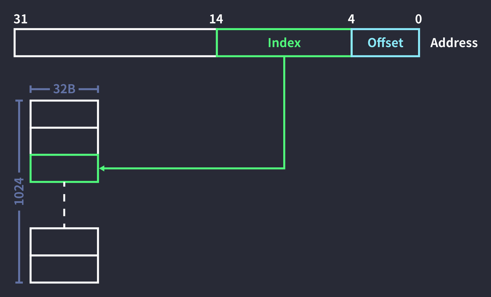

전체 주소에서 하위 0 ~ 4, 5비트를 오프셋으로 쓰고, 이후 10비트를 인덱스로 사용해서 블록에 접근합니다.

인덱스가 10비트인 이유는 2^n개 블록의 모든 인덱스를 표현하기 위해서는 log2blocks만큼의 비트가 필요하기 때문입니다. 여기에선 블록 개수가 2^10이므로, 10비트가 인덱스 비트로 사용되었습니다. 

그러나 이렇게만 하면 서로 다른 데이터의 인덱스가 중복될 위험이 너무 큽니다. 예를 들어 `0x12345678` 과 `0x52345678`은 다른 메모리 주소인데, 0~14 비트를 보면 같은 Cache 공간을 가리키게 됩니다. 이것을 충돌 났다고 표현합니다.

## Tag Matching

인덱스의 충돌을 줄이기 위해 주소값의 일부를 태그로 사용하게 됩니다. 블록 개수가 1024개이고, 블록 사이즈가 32바이트일 때 32비트 주소 `0x000c14B8`에 접근한다고 가정해 봅시다.

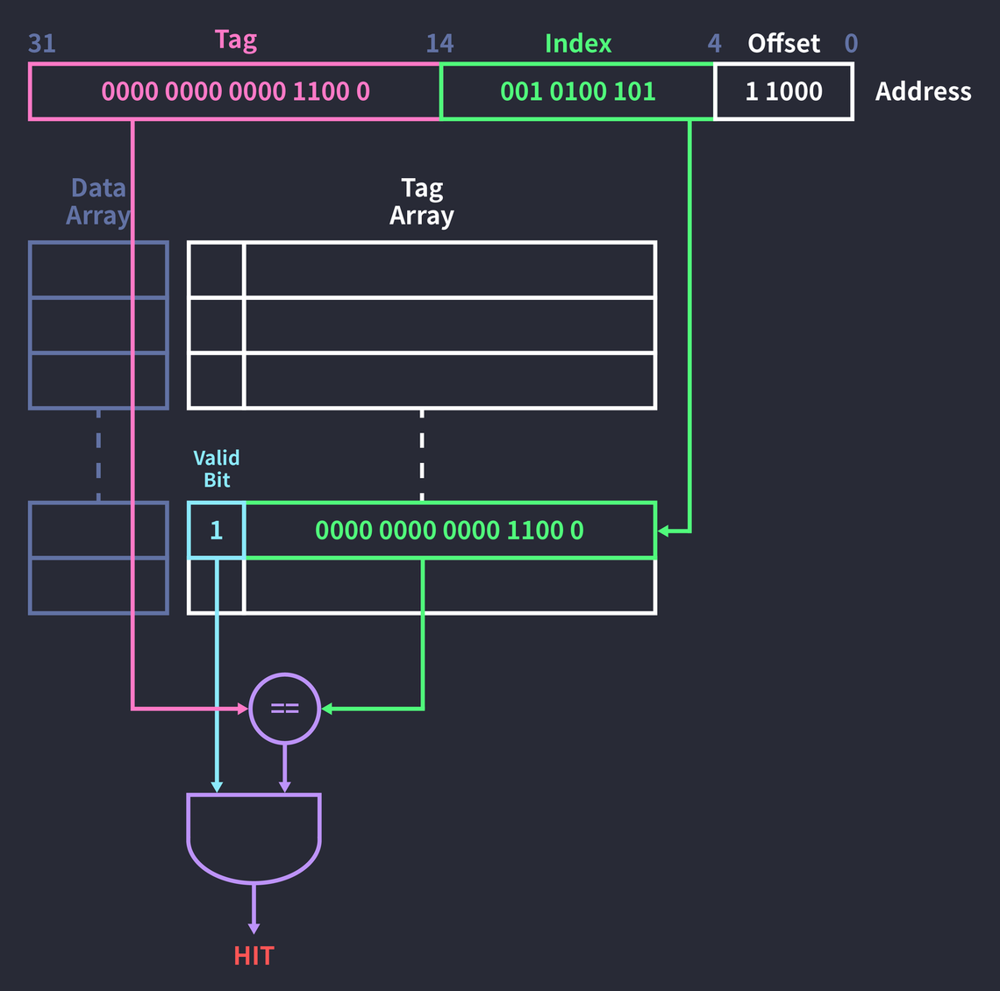

1. 인덱스(0010100101)에 대응하는 태그 배열의 필드에 접근
2. 해당 태그 필드의 유효 비트(Valid bit) 확인
3. 유효 비트가 1이라면 태그 필드와 주소의 태그가 같은지 비교
4. 비교 결과(true, 1)를  유효 비트(1)과 AND 연산

유효 비트가 1이라는 것은 해당 블록에 올바른 값이 존재한다는 의미입니다. 태그 필드의 주소가 같고, 유효 비트도 1이므로 위 예시의 결과는 `Hit`입니다. 


히트가 발생하면 데이터 배열에서 해당 인덱스의 데이터를 참조합니다. (참고로 데이터 배열과 태그 배열도 모두 하드웨어입니다.)

만약 유효 비트가 0이라면 블록에 값이 없거나 올바르지 않다는 뜻이므로 `Miss`가 발생합니다. 그러면 주소의 태그를 태그 필드에 작성하고, 데이터 필드에도 상위 캐시나 메모리에서 요청한 값을 가져와 작성한 뒤, 유효 비트를 1로 바꿔줍니다.

유효 비트가 1이라도 태그가 일치하지 않으면 미스가 발생합니다. 이 경우 `교체 정책 Replacement policy`에 따라 처리가 달라집니다. 먼저 입력된 데이터가 먼저 교체되는 FIFO 정책이라면 무조건 기존 블록이 밀려납니다. 태그 배열의 필드를 주소의 태그로 바꾸고, 데이터 필드의 값도 교체됩니다. (실제로는 요청한 데이터 뿐만 아니라 그 주변 데이터까지 가져옵니다.) 기존 데이터는 상위 캐시로 밀려납니다.

주소의 상위 17비트가 태그 비트로 사용되는 이유는 태그 비트가 `Address bits - (log2BlockSize + index bits)`로 결정되기 때문입니다. 이 경우 32 - (5 + 10) = 17 비트가 태그 비트로 사용되었고, 남은 5비트는 오프셋 비트로 사용되었습니다.

## Tag Overhead

태그 배열이 추가되면서 더 많은 공간이 필요하게 되었습니다. 하지만 여전히 32KB 캐시는 32KB 데이터를 저장할 수 있는 캐시라는 의미입니다. 태그를 위한 공간은 블록 크기와 상관없는 오버헤드로 취급하기 때문입니다.

1024개의 32B 블록으로 구성된 32KB 캐시의 태그 오버헤드를 구해 봅시다.


즉, 7%의 태그 오버헤드가 발생합니다.

공간 뿐만 아니라 시간도 낭비죠. 태그 배열에 접근해 히트를 확인하고, 그 이후에 데이터 배열에 접근해 데이터를 가져오기 때문에 히트 레이턴시가 증가합니다.

그래서 두 과정을 병렬적으로 실행합니다. 태그 배열에서 해트 여부를 확인하는 동시에 데이터 배열에 미리 접근하는 것입니다. 하지만 이렇게 하면 히트 레이턴시는 낮아지지만 미스가 발생했을 때의 리소스 낭비를 감수해야 합니다.

## Associative Cache

서로 다른 두 주소가 같은 인덱스를 가지면 충돌이 발생하고, 교체 정책에 따라 블록을 교체합니다. 하지만 충돌이 발생할 때마다 캐시 내용을 바꾸면 더 많은 미스가 일어나게 되고, 한 자리의 데이터를 끝없이 교체하는 `핑퐁 문제 Ping-pong problem` 가 일어날 수 있습니다.

이 문제는 태그 배열과 데이터 배열을 여러 개 만드는 식으로 개선할 수 있습니다. 즉, 인덱스가 가리키는 블록이 여러 개가 되는 것입니다. 인덱스가 가리키는 블록의 개수에 따라 캐시의 종류를 분류하면 아래와 같습니다.

- Direct mapped: 인덱스가 가리키는 공간이 하나인 경우. 처리가 빠르지만 충돌 발생이 잦다.
- Fully assoiciative: 인덱스가 모든 공간을 가리키는 경우. 충돌이 적지만 속도가 느리다.
- Set associative: 인덱스가 가리키는 공간이 두 개 이상인 경우. n-way set associative 캐시라고 부른다.

위의 두 개는 장단점이 극단적이기 때문에 보통은 `set associative` 캐시를 사용합니다.

### Set Associative Cache Organization

간단하게 2-way set associative 캐시의 동작을 살펴봅시다.

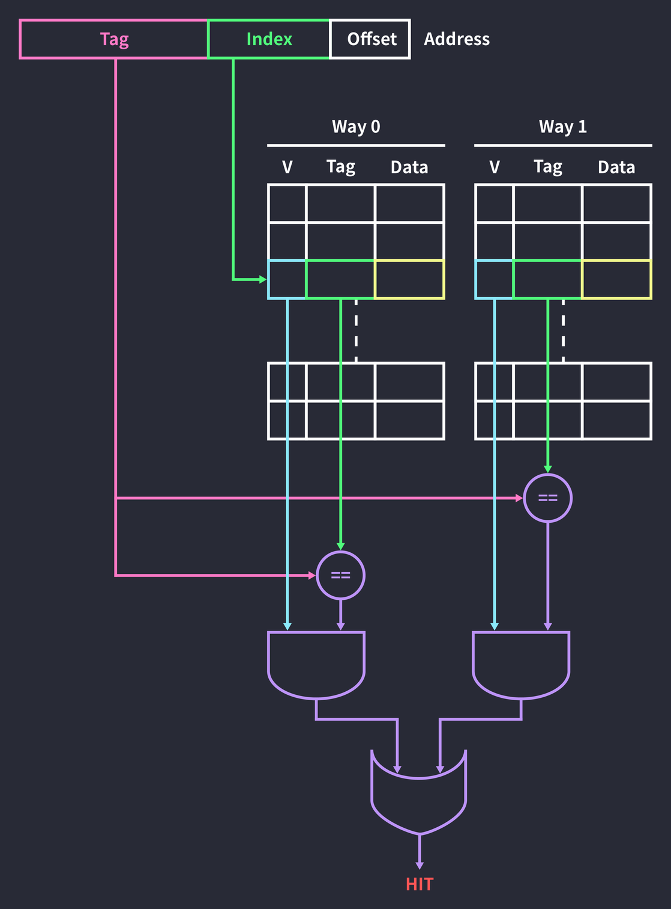

주소의 인덱스를 통해 블록에 접근하는 것은 지금까지 본 direct mapped 캐시와 동일합니다. 다만 2개의 way가 있기 때문에 데이터가 캐싱되어 있는지 확인하려면 2개의 블록을 모두 확인해야 합니다. 마지막으로 두 개의 way의 결과를 OR 연산하면 최종 결과를 낼 수 있습니다. 모든 웨이에서 미스가 발생하면 교체 정책에 따라 2개의 블록 중 한 곳에 데이터를 작성합니다.

히트 레이턴시를 높이는 것을 감수하고 충돌 가능성을 줄인 방법입니다.

### Concrete Example

2바이트 캐시 블록으로 구성된 8바이트 2-way 캐시가 있고, 4비트 주소가 주어진다고 가정해 보겠습니다.

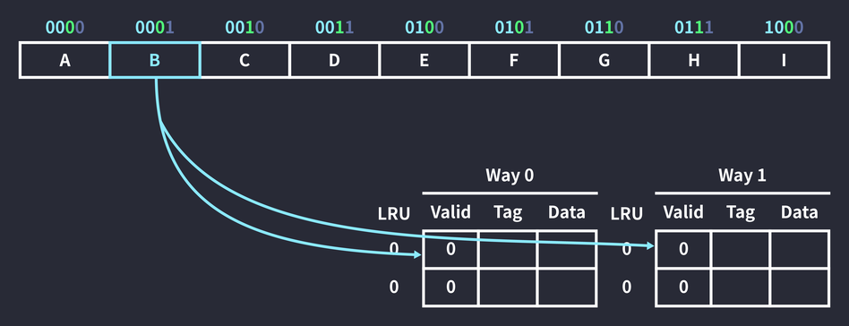

메모리 주소 `0001`을 참조하는 명령이 실행되었습니다. 인덱스 비트는 log2 = 1이고, 태그 비트는 4 - (log2 + 1) = 2입니다. 마지막으로 오프셋 비트는 1이 됩니다. 따라서 주소 `0001`의 인덱스는 0, 태그는 00입니다. 즉, 해당 메모리 공간에 위치한 데이터는 인덱스가 0인 두 공간 중 한 곳에 캐싱될 수 있습니다.

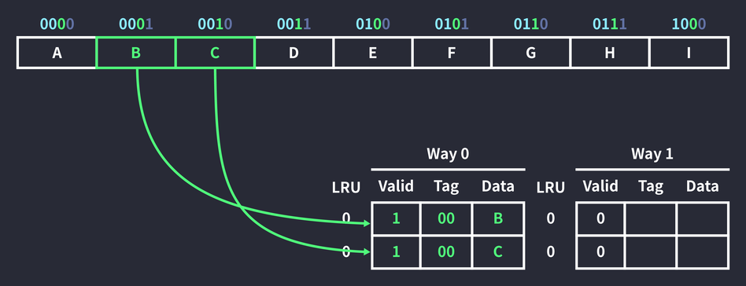

`Way 0` 블록이 비어있으므로 인덱스 0에 데이터를 저장했습니다. 이때 주소 `0010`도 같이 캐싱되었는데, 이는 캐시 히트 비율을 높이기 위해 메모리에서 한 번에 캐시 블록 크기(2B)만큼 데이터를 가져오기 때문입니다. (Spatial Locality - 공간 지역성) 여기서는 참조한 데이터(0001)의 주변 공간인 0010을 함께 캐싱한 것입니다.

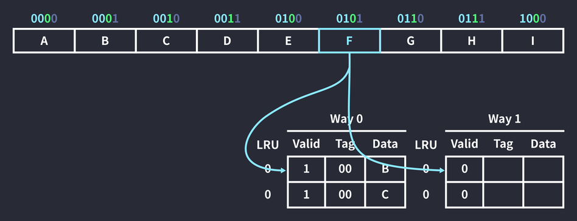

메모리 주소 `0101`을 참조하는 명령이 실행되었습니다. 이번에도 인덱스가 0인 두 공간에 들어갈 수 있습니다.

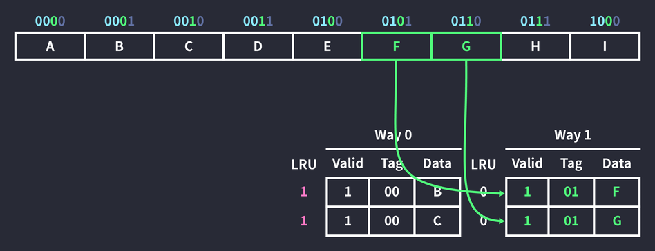

하지만 `Way 0`은 차 있기 때문에 `Way 1`에 캐싱됩니다. 이번에도 1+1 세트로 캐싱되었습니다. 또한 `Way 0`에 속한 두 블록의 `LRU Least Recently Used` 값이 증가했습니다. LRU는 사용한지 더 오래된 데이터를 우선적으로 교체합니다. 우선순위가 떨어진 것이죠. LRU 값이 증가했다는 것은 캐시 미스가 발생했을 때 우선적으로 교체될 가능성이 높아졌다는 것을 의미합니다. (운영체제의 프로세스 스케줄링이나 페이지 교체 알고리즘에도 나왔었죠?)

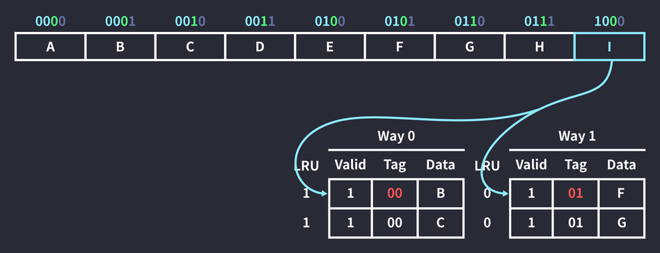

이어서 메모리 주소 `1000`을 참조하는 명령이 실행되었습니다. 인덱스가 0인 두 블록을 확인했으나, 태그가 10인 데이터가 없어 캐시 미스가 발생합니다.

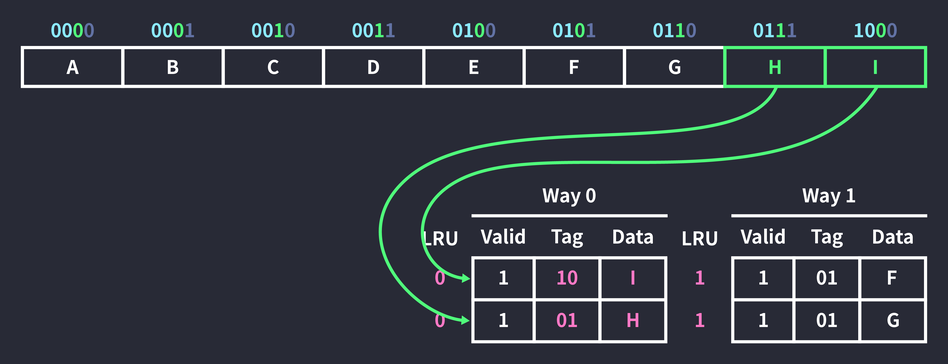

데이터 교체가 일어납니다. `Way 0` 블록의 LRU 값이 더 크기 때문에 교체되고, 참조가 일어났으므로 LRU 값은 초기화됩니다. (캐시 히트가 발생해도 초기화) 참조한 데이터의 주변 공간인 0111의 데이터도 같은 원리로 캐싱했습니다. 당연히 Way 1의 LRU 값은 증가합니다.

## Handling Cache Writes

데이터를 읽는 동작이 아니라 입력하는 동작이 발생하고, 데이터를 변경할 주소가 캐싱된 상태 (Write hit)라면 메모리의 데이터가 업데이트되는 대신 캐시 블록의 데이터가 업데이트됩니다. 이제 `캐시에서 업데이트된 데이터를 언제 메모리에 쓸 것인가?`에 대한 문제가 생깁니다. 여기에 두 가지 쓰기 정책(Write polices)이 있습니다.

- Write-back
  - data를 일단 Cache에만 쓰고 데이터가 쫓겨날 때에만 low level cache 혹은 Memory에 쓰는 방식. 현대에서 많이 쓰임
  - 데이터가 변경되었는지 확인하기 위해 캐시 블록마다 `dirty` 비트를 추가해야 하며, 데이터가 변경되었다면 1로 바꿔준다. 이후 해당 블록이 교체될 때 `dirty` 비트가 1이라면 메모리의 비트에 쓴다.
- Write-through
  - 데이터가 업데이트 될 때마다 메모리에 기록. 그래서 밀려난 데이터 관련 처리를 따로 하지 않아도 된다. 그러나 이 방식은 캐시에 쓸 때마다 메모리에 접근해야 해서 비용이 많이 들기 때문에 최근엔 많이 쓰이지 않는다.

## Software Restructuring

여기까지 로우 레벨의 캐시 구조와 동작을 살펴봤는데, 코드 레벨에서 캐시의 효율을 증가시킬 수도 있습니다.
다음의 이중 루프를 봅시다.

```c
for (int i = 0; i < columns; i++) {
  for (int j = 0; j < rows; j++) {
    arr[j][i] = pow(arr[j][i]);
  }
}
```

2차원 배열의 모든 요소를 제곱하는 루프입니다. 큰 문제가 없어보이지만 공간 지역성을 살펴보면 비효율적인 코드입니다. 배열 `arr`의 요소들은 메모리에 연속적으로 저장되는데, 접근은 순차적으로 이뤄지지 않기 때문입니다.

```
0          4          8          12         16         20         24
+----------+----------+----------+----------+----------+----------+
|  [0, 0]  |  [0, 1]  |  [0, 2]  |  [1, 0]  |  [1, 1]  |  [1, 2]  |
+----------+----------+----------+----------+----------+----------+
```

1. `i=0, j=0`: 첫 번째 공간 [0, 0] 에 접근
2. `i=0, j=1`: 네 번째 공간 [1, 0] 에 접근
3. `i=1, j=0`: 두 번째 공간 [0, 1] 에 접근

이처럼 공간을 마구 건너뛰며 접근하게 됩니다. 따라서 아래 코드처럼 해야 합니다.

```c
for (int i = 0; i < rows; i++) {
  for (int j = 0; j < columns; j++) {
    arr[i][j] = pow(arr[i][j]);
  }
}
```

비슷하지만 시간 지역성을 활용하는 예시도 있습니다.

```c
for (int i = 0; i < n; i++) {
  for (int j = 0; j < len; j++) {
    arr[j] = pow(arr[j]);
  }
}
```

배열 arr의 모든 요소를 제곱하는 동작을 n회 반복하는 코드입니다. 현재 코드는 데이터를 캐싱한 뒤, 다음 접근 때 캐싱한 데이터에 접근한다는 보장이 없습니다. 전체 데이터가 캐시 크기보다 크다면 배열을 순회하는 과정은 다음과 같을 것입니다.

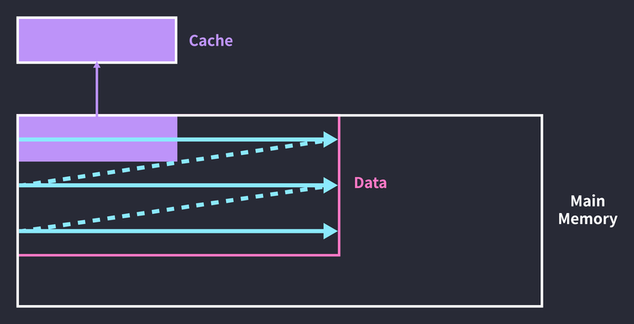

루프의 전반부에서 데이터를 캐싱하지만, 루프가 끝날 때 캐시는 후반부에 접근한 데이터로 덮어씌워진 상태가 됩니다. 그래서 두 번째 루프를 돌 때는 전반부 데이터를 다시 캐싱해야 합니다. 캐싱한 데이터에 다시 접근하기도 전에 캐시 블록 전체가 교체되어 버리는 것입니다. 배열 순회 주기를 캐시 크기만큼 끊어주면 문제를 해결할 수 있습니다.


루프를 도는 횟수는 늘었지만 캐시 히트 비율은 더 높아졌습니다. 세 번째 루프까지는 전반부 데이터만 처리하고, 그 이후로는 후반부 데이터만 처리하는 것입니다. 코드로 구현하면 삼중루프가 됩니다.

```c
for (int i = 0; i < len; i += CACHE_SIZE) {
  for (int j = 0; j < n; j++) {
    for (int k = 0; k < CACHE_SIZE; k++) {
      arr[i + k] = pow(arr[i + k]);
    }
  }
}
```

물론 요즘은 컴파일러가 모두 최적화를 해 주기 때문에 사용자 어플리케이션 개발자가 신경쓸 필요는 없습니다.

로우 레벨에서 이런 식으로 코드를 최적화할 수 있다고 알아만 두시면 되겠습니다.

## References

- https://parksb.github.io/article/29.html
- David Patterson, John Hennenssy, “Computer Organization and Design 5th Ed.”, MK, 2014.
- Abraham Silberschatz, Peter Galvin, Greg Gagne, “Operating System Concepts 9th Ed.”, Wiley, 2014.
- K. G. Smitha, “[Para Cache Simulator](https://www3.ntu.edu.sg/home/smitha/ParaCache/Paracache/start.html)”.
