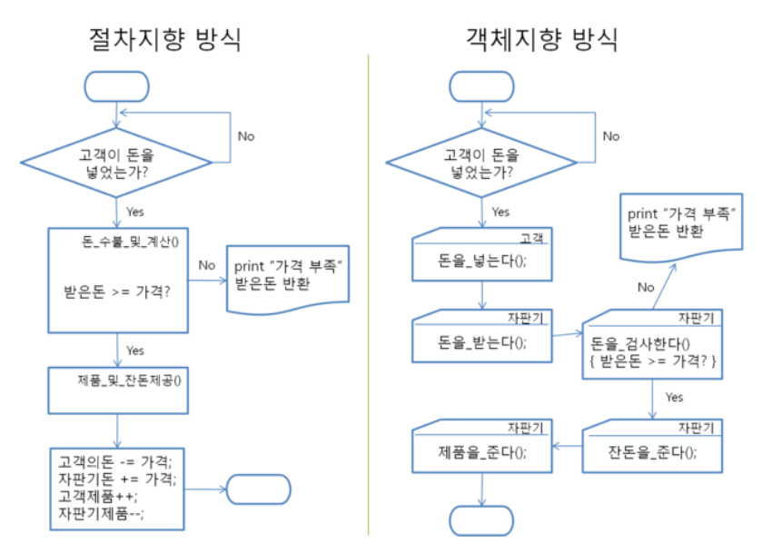
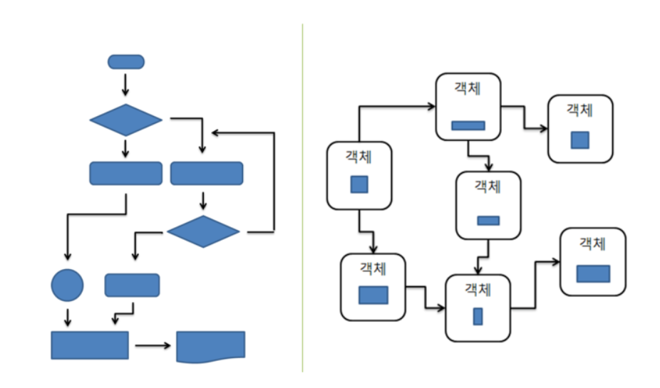

# Object Oriented Programming

## 객체지향 프로그래밍이란?

먼저 객체지향이란, 현실에 존재하는 `개체 Entity`를 `속성 Attribute`와 `메소드 Method`가 결합된 형태의 `객체 Object`로 표현하는 개념입니다. 

즉, 객체지향 프로그래밍은 프로그래밍에서 **필요한 데이터를 추상화시켜 속성과 행위를 가진 객체**를 만들고 그 **객체들 간의 유기적인 상호작용**을 통해 로직을 구성하는 프로그래밍 패러다임입니다.

이렇게만 말하면 많이 어렵죠?

대표적 객체지향 언어인 Java 언어를 예로 들어 보겠습니다. 두 수를 입력받고 다음에 a를 입력받으면 합, b를 입력받으면 차, c를 입력받으면 곱을 하여 출력하라. 라고 주어진다면 보통 다음과 같이 짤 겁니다.

```java
import java.util.Scanner;
class Main {	
	public static void main(String[] args) {
		Scanner in = new Scanner(System.in);
		
		int first = in.nextInt();
		int second = in.nextInt();
		
		char type = in.next().charAt(0);
		
		if(type == 'a') {
			System.out.print(first + second);
		}
		if(type == 'b') {
			System.out.print(first - second);
		}
		if(type == 'c') {
			System.out.print(first * second);
		}
		
	}
}
```

이런 간단한 코드에서는 객체지향의 특징을 찾을 수 없습니다. 이러한 코드에 익숙한 개발 뉴비는 객체지향이라고 하면 괜히 겁만 나게 되는 것이죠. 그렇다면 대체 객체지향은 왜 사용하는 걸까요?

과거에는 지금처럼 큰 규모의 하드웨어나 소프트웨어가 필요하지 않았습니다. 그래서 오래된 언어들인 C, 포트란, 코볼같은 절차적 언어들이 대표적이었죠. 하지만 점점 소프트웨어의 발전 속도가 빨라지면서 자연스레 코드도 복잡해지기 시작했습니다. 그러다보니 복잡한 알고리즘을 짤 때 절차적으로 프로그래밍하면 순서도(흐름도)가 꼬이게 되면서 사람이 읽으면서 동작이 이해되지 않는 스파게티 코드가 되어버린 것입니다.

이러한 문제를 극복하기 위한 대안으로 객체지향적 프로그래밍이 나온 것이고, 이 대안은 현재까지도 대세를 유지하고 있습니다. 이렇게 언어의 패러다임이 변화하면서 앞서서 말했던 절차적 프로그래밍 언어들도 객체지향의 특징들을 가져오기 시작합니다. 예를 들어 C언어 기반에 상속, 캡슐화를 지원하는 C++이 있죠.

그렇다면 절차지향과 객체지향은 정 반대되는 개념일까요?

## 절차지향과 객체지향 방식의 차이?



두 방식은 대체 도대체 뭐가 다른 걸까요? 순서대로 차근차근 진행되는 실행방식은 같아 보이는데...

이렇게 헷갈리는 원흉은 객체지향과 절차지향이 마치 반대되는 개념인 듯 설명하는 다양한 글들 때문입니다. 그러다보니 마치 객체지향 프로그래밍은 실행 절차에 영향받지 않는, 모듈으로만 이루어진 프로그램 기법이라는 착각에 빠지기 쉽습니다.

사실 객체지향의 개념과 특징을 설명함에 있어서 굳이 절차지향 방식과 비교할 필요는 없습니다. 객체란 기존의 방식인 변수 따로, 함수 따로의 분산적이고 통일성 없는 추상화과정을 통합해서 표현대상을 좀 더 모듈화하기 쉽게 도와주는 도구에 불과합니다. 오히려 이 모듈화 강화의 부산물인 정보은닉화, 상속 및 다형성을 통한 확장성과 재사용성, 이를 기반으로 한 생산성과 유지보수의 용이성이 OOP의 진정한 특징이자 정체성이라고 생각합니다.

객체지향 프로그래밍은 단지 이러한 객체의 디자인을 먼저 한 뒤에 이들의 데이터 플로우를 짜고, 진행 시나리오를 설계해나가는 방식의 `개발 방법론`입니다. 플로우차트 먼저 짜느냐, 데이터모델링을 먼저 하느냐의 차이 뿐이지 정해진 알고리즘을 따라 순서대로 실행되는 것은 마찬가지라는 것입니다. 한 번에 프로그램 한 문장씩을 읽어 들여와서 실행시키는 폰 노이만 컴퓨터 구조를 사용하는 한, OOP라고 절차성을 무시하는 프로그램을 짤 수는 없습니다. 즉, `객체지향`과 `절차식`의 개념은 애초에 비교할 것이 아니라 다른 카테고리의 개념입니다. 

### 절차지향과 객체지향에 대한 오해와 편견



위의 그림처럼 흔히 절차지향 프로그래밍의 설명에는 순서도 스타일로, 객체지향 프로그래밍의 설명에는 클래스 다이어그램 스타일로 도표를 그려서 비교하는 경우가 많은데, 이 또한 혼란을 가중시키는 원흉입니다. 애당초 순서도와 클래스 다이어그램은 서로 용도부터가 다릅니다! 객체지향 방식으로 설계한 프로그램이라도 순서도로 표현할 수 있으며, 절차식 방법으로 개발한 프로그램 역시 클래스 다이어그램으로 데이터들과 모듈간의 관계를 설명할 수 있다는 것입니다.

물론 절차지향 프로그래밍이 객체지향에 비해 실행순서를 중점으로 하는 시스템 분석과 설계를 우선하기 때문에 `절차지향 vs 객체지향`의 구도가 머리에 각인되어 잘 빠지지 않을 수도 있을 것입니다. 정 그렇다면...

`절차지향 프로그래밍은 프로그램의 순서와 흐름을 먼저 세우고 필요한 자료구조와 함수를 설계하는 방식이고, 객체지향 프로그래밍은 반대로 자료구조와 이를 중심으로 한 모듈들을 먼저 설계한 다음에 이들의 실행순서와 흐름을 짜는 방식이다.` 정도의 설명만 추가한다면 보다 개념이 보다 명확해 질 것입니다.

## OOP SOLID - 객체지향 5원칙

좋은 객체지향 설계를 한다면 코드의 재사용, 유지보수의 용이성 면에서 개발에 필요한 비용을 줄일 수 있습니다. 작은 문제를 해결해서 큰 문제를 해결해가는 `Bottom-up` 방식입니다. `Robert C. Martin`이 고안한 `SOLID 원칙`은 OOP를 잘 준수하기 위한 원칙입니다.

### 1. 단일 책임 원칙 (Single Responsibility Principle, SRP)

- 클래스(객체)는 하나의 책임/목적/역할만 지녀야 한다는 원칙
  - 새로운 기능을 기존 클래스에 `추가`하게 되면(==하나의 클래스가 여러 기능을 수행하면) 코드가 길어지고 복잡해지며 수정에 많은 시간이 소요됩니다.

### 개방-폐쇄 원칙(Open/Closed Principle)

- 클래스는 확장에는 개방되어 있지만 수정에는 폐쇄되어 있어야 한다.
  - 부모 클래스에서 자식 클래스를 만들 때 자식 클래스에서 기능을 추가/수정(`Overriding`)할 수 있지만, 자식을 위해 부모가 수정될 필요는 없습니다.

### 리스코프 치환 원칙 (Liskov's Substitution Principle, LSP)

- 자식 클래스는 언제나 자신의 부모 클래스를 교체할 수 있다는 원칙

  - 1987년 Barbara Liskov가 소개했습니다.
  - 부모 클래스의 위치에 자식 클래스로 넣어도 어떠한 issue도 없어야 한다는 원칙입니다.

  ```
  도형 클래스가 있다고 가정합니다.
  "도형은 둘레, 넓이, 각을 가진다."
  도형으로 사각형 클래스를 만들겠습니다.
  "사각형은 둘레, 넓이, 각을 가진다."
  그럼 도형으로 원 클래스를 만들겠습니다.
  "원은 둘레, 넓이, 각을 가진다."
  여기서 "각을 가진다" 부분이 어색해 집니다.
  따라서 도형 class는 LSP 원칙을 만족하지 못한 설계입니다.
  ```

### 인터페이스 분리 원칙 (Interface Segregation Principle, ISP)

- 클라이언트가 자신과 관련이 없는 인터페이스는 구현하지 않아아 한다는 원칙
  - 클래스는 자신이 사용하지 않는 메서드는 구현하지 않아야 합니다.
    - 일반 사용자 클래스에게 `게시판 폐쇄` 메서드가 있다면 권한이 없어 사용할 수 없을 것입니다. 이는 ISP를 만족하지 못합니다.

### 의존성 역전 법칙 (Dependency Inversion Principle, DIP)

- 고차원 module/class는 저차원 module/class에 의존하면 안된다는 원칙

  - 추상화는 세부사항에 의존해서는 안 되고, 세부사항은 추상화에 의존해야 합니다.

  ```
  예를 들어 자동차는 스노우타이어, 일반타이어, 광폭타이어와 같은 디테일한 개념보다,
  `타이어`라는 추상화된 개념에 의존하도록 설계되어야 합니다.
  ```

## 객체지향 언어의 특징

### 캡슐화 Encapsulation

데이터와 데이터를 처리하는 함수를 하나로 묶는 것

- 캡슐화된 객체와 세부 내용이 은폐되어, 변경이 발생할 때 오류의 파급효과가 적으며, 재사용이 용이해집니다.
- 객체들 간에 메시지를 주고받을 때 각 객체의 세부 내용은 알 필요가 없으므로 인터페이스가 단순해지고, 객체 간의 결합도가 낮아집니다.

### 정보은닉 Information Hiding

캡슐화에서 가장 중요한 개념으로, 다른 객체에게 자신의 정보를 숨기고 자신의 연산만을 통하여 접근을 허용하는 것

- 각 객체의 수정이 다른 객체에게 주는 영향을 최소화하는 기술입니다.
- 외부 객체가 특정 객체의 데이터와 함수에 직접 접근하지 못하므로 유지보수와 소프트웨어 확장 시 오류를 최소화 할 수 있습니다.

### 추상화 Abstraction

불필요한 부분을 생략하고 객체의 `속성 Attribute` 중 가장 중요한 것에만 중점을 두어 개략화하는 것, 즉 객체화하는 것

- 완전한 시스템을 구축하기 전에 그 시스템과 유사한 모델을 만들어 여러 요인들을 테스트 할 수 있습니다.

### 상속성 Inheritance

이미 정의된 상위 클래스의 모든 속성과 메서드를 하위 클래스가 물려받는 것

- 상속성을 사용하면 하위 클래스는 상위 클래스의 속성과 메서드를 재정의하지 않아도 즉시 사용할 수 있습니다.
- 하위 클래스는 상위 클래스에 없는 새로운 속성과 메서드를 추가할 수 있습니다.
- 소프트웨어 재사용성을 증대합니다.

### 다형성 Polymorphism

객체가 연산을 수행하게 될 때 하나의 메시지에 대해 각 객체가 가지고 있는 고유한 방법으로 응답할 수 있는 것

- 객체들은 동일한 메서드명을 사용하며 같은 의미의 응답을 합니다.
- 응용 프로그램 상에서 하나의 함수나 연산자가 두 개 이상의 서로 다른 클래스의 인스턴스들을 같은 클래스에 속한 인스턴스처럼 수행할 수 있도록 하는 것을 말합니다.
- 1 + 2 = 3, A + B = AB

## References

- https://st-lab.tistory.com/151
- https://blog.naver.com/atalanta16/220249264429

