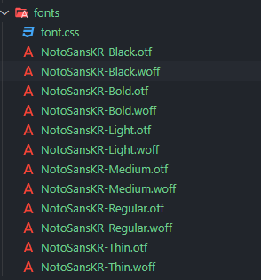

# React font 적용

리액트 프로젝트에 폰트를 적용하는 방법을 정리해 보겠습니다.

프런트엔드에 폰트를 적용하는 방법은 `import`해 오는 것과 로컬 파일을 사용하는 방법이 있습니다. 이 중 import는 말 그대로 매번 가져와야 하기 때문에 뷰를 그려주는 속도가 느립니다. 로컬 파일을 사용하는 방법을 사용하겠습니다.

브라우저 별로 otf, ttf, woff 등 다양한 형식의 폰트 파일이 필요합니다. 필요한 만큼 준비합니다.



`font.css`에는 아래와 같이 작성했습니다.

```css
/*
  src: 사용할 폰트의 위치 및 형식
     Safari, Android, iOS => ttf
     Modern Browsers => woff
     IE6-IE8 => eot
  */
@font-face {
  font-family: 'Noto Sans KR';
  font-weight: 400;
  font-style: normal;
  src: url('./NotoSansKR-Medium.otf') format('opentype'),
    url('./NotoSansKR-Bold.woff') format('woff');
}
```

`font-family`에 원하는 이름을 지정합니다.

### ⭐format('otf '가 아니라 'opentype')!!!!!!

otf 파일에는 format에 'opentype'을 지정해 줘야 합니다. 다른 블로그에 'otf'로 되어 있는 곳이 많아서 꽤나 삽질했습니다.

이후, `index.js`에서 font.css를 import했습니다. 그리고 폰트가 필요한 컴포넌트에 아래와 같이 불러옵니다.

```css
.formHeader {
    /* font-weight: bold; */
    font-family: 'Noto Sans KR';
}
```

### 적용 전


### 적용 후


잘 적용되는 모습입니다.