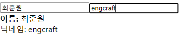

# React hook custom

`input`에 `onChange`를 연결해서 `이름, 닉네임`을 `useState`와 `useReducer`로 관리하는 컴포넌트에 커스텀 훅을 적용해 보았습니다.



### 커스텀 훅 적용 전

```react
// Info.js
import React from "react";
import { useReducer } from "react";

function reducer(state, action) {
  return {
    ...state,
    [action.name]: action.value,
  };
}

const Info = () => {
  const [state, dispatch] = useReducer(reducer, { name: "", nickname: "" });
  const { name, nickname } = state;

  const onChange = (e) => {
    dispatch(e.target);
  };

  return (
    <div>
      <div>
        <input type="text" name="name" value={name} onChange={onChange} />
        <input
          type="text"
          name="nickname"
          value={nickname}
          onChange={onChange}
        />
      </div>
      <div>
        <div>
          <b>이름: </b> {name}
        </div>
        <div>닉네임: {nickname}</div>
      </div>
    </div>
  );
};

export default Info;

```

### 커스텀 훅 적용 후

```react
// Info.js
import React from "react";
import useInputs from "./useInputs";

const Info = () => {
  const [state, onChange] = useInputs({ name: "", nickname: "" });
  const { name, nickname } = state;

  return (
    <div>
      <div>
        <input type="text" name="name" value={name} onChange={onChange} />
        <input
          type="text"
          name="nickname"
          value={nickname}
          onChange={onChange}
        />
      </div>
      <div>
        <div>
          <b>이름: </b> {name}
        </div>
        <div>닉네임: {nickname}</div>
      </div>
    </div>
  );
};

export default Info;
```

```react
// userInputs.js
import { useReducer } from "react";

function reducer(state, action) {
  return {
    ...state,
    [action.name]: action.value,
  };
}

export default function useInputs(initialForm) {
  const [state, dispatch] = useReducer(reducer, initialForm);
  const onChange = (e) => {
    dispatch(e.target);
  };
  return [state, onChange];
}
```

기존의 `Info.js`에 있던 `reducer, onChange` 메서드를 `userInputs`로 빼낸 것이 전부입니다. 커스텀 훅 컴포넌트를 사용할 경우, 기존의 코드 양이 크게 줄어드는 것을 알 수 있습니다.

범용적으로 사용될 hook 관련 로직을 모듈로 만들어서 사용하면 좋겠습니다.