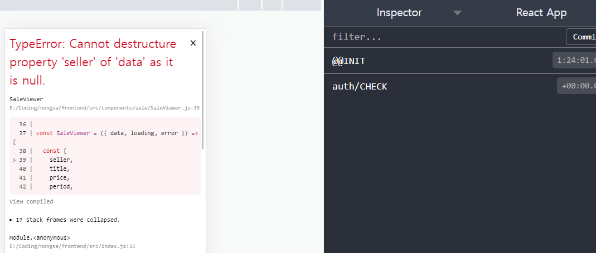

# 마운트 시 GET 방식으로 데이터를 받아와서 보여줄 때 주의할 점

마운트될 때 data를 GET 방식으로 요청한 뒤, props로 넘겨서 사용하려고 했습니다.

코드는 아래와 같습니다.

### 잘못된 코드

```jsx
const SaleViewer = ({ data, loading, error }) => {
  const { market_pk } = match.params
  const dispatch = useDispatch()
  const { data, error, loading } = useSelector(({ sale, loading }) => ({
    data: sale.data,
    error: sale.error,
    loading: loading['sale/GET'],
  }))

  useEffect(() => {
    dispatch(get({ market_pk }))
    // 언마운트될 때 리덕스에서 포스트 데이터 없애기
    return () => {
      dispatch(unloadSale())
    }
  }, [dispatch, market_pk])
  const {
    seller,
    title,
    price,
    period,
    unit,
    quantity,
    contents,
    storys,
    thumbnail_img,
    hits,
    created_at,
    updated_at,
  } = data
  return <h1>{title}</h1>
}

export default SaleViewer

```

그리고 이렇게 하면 에러가 뜹니다.



### 에러 트러블 슈팅과 원인

찾는데 꽤 걸렸지만, 알고 보니 당연한 것이었습니다. data의 GET 요청이 제대로 처리되지도 않은 null 상태일 때, 비구조화로 상수를 선언하려고 하니 요청을 보내지 않고 에러를 띄워 버린 것이죠. 

그래서 아래와 같이 데이터의 값을 보여 주기만 하는 식으로 처리해야 합니다.

```jsx
const SaleViewer = ({ data, loading, error }) => {
  return <h1>{data.title}</h1>
}

export default SaleViewer
```

### 결과


정상적으로 출력되는 것을 확인했습니다.
