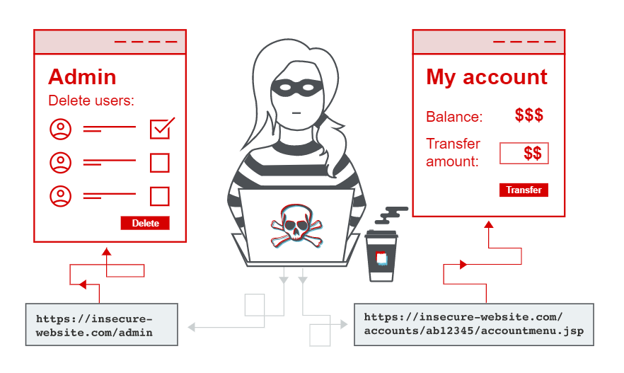

# Broken Access Control 이란?

접근 제어는 사용자로 하여금 허가되지 않은 정보에 접근할 수 없도록 서비스의 정책을 강제하는 것을 의미합니다. 일반적으로 웹 서비스에서는 접근 불가능한 정보는 애초에 존재하지 않는 것처럼 노출하지 않거나 별도의 인증을 거치도록 하면서 정보를 보호합니다. 취약한 접근 제어(Broken Access Control)란 이러한 접근 제어 정책을 우회하거나 의도치 않은 권한 상승으로 인해 기밀 정보가 노출될 수 있는 취약점을 의미합니다.

OWSAP에서 2017년 기준 A5였던 것이, 2021년 기준 A1로 올라왔습니다.

## 공격 방법

### URL 파라미터 조작 우회

허용되지 않은 권한의 페이지 URL을 직접 입력하여 접근할 수 있다면 이 유형에 해당합니다. 애플리케이션 설정을 조작하거나 개발자 도구를 통해 HTML 소스를 조작한다거나 다음 페이지를 열기 위한 API를 직접 호출하는 등이 이에 해당합니다.

**타인의 비밀글 보기**

자신이 쓴 비밀글의 수정페이지에 들어가 글 번호를 확인한 후, 수정하여 어떻게 변경되는지 추적해 봅니다.

`http://xxx.xxx.xxx/xxxxxx.xxxxxx?seq=13`

그러면 글 번호를 11로 변경하여 타인의 글을 볼 수 있는지 확인해 볼 수 있습니다.

`http://xxx.xxx.xxx/xxxxxx.xxxxxx?seq=11`

**공지사항 글 변조**

관리자만 접근할 수 있는 공지사항은 일반적으로 보기 기능만 제공하기 때문에, 주소 및 파라미터 값을 변조하여 접근을 시도할 수 있습니다.

1. 페이지에서 사용되는 cmd 파라미터의 값을 변경해 봅니다.

`http://xxx.xxx.xxx/xxxxxx.xxxxxx?cmd=view&no=13`

`view`를 `write`로 변경해 봅니다.

`http://xxx.xxx.xxx/xxxxxx.xxxxxx?cmd=write&no=13`

2. 페이지 주소에 view 키워드를 이용한 페이지가 있다면 페이지 주소를 변경해 봅니다.

`http://xxx.xxx.xxx/bbs/notice_view.asp?xxxxxxxx` ->

`http://xxx.xxx.xxx/bbs/notice_write.asp?xxxxxxxx`

### 파일 다운로드

SQL 파라미터를 조작하여 시스템파일 등에 접근하는 공격기법을 의미합니다.

**널바이트 인젝션**

C/C++에서 `널바이트 문자열 (%00, 0x00)`은 문자열의 끝을 의미하기 때문에 특정 확장자를 숨기기 위한 목적으로 사용될 수 있습니다.

test.png를 호출하는 경우,

`http://xxx.xxx.xxx/bbs.php?file=./test.png`

널바이트를 삽입하여 호출하게 되면

`http://xxx.xxx.xxx/bbs.php?file=./log.txt%00test.png`

test.png를 무시하기 때문에 같은 위치에 있는 log.txt 파일을 읽을 수 있게 됩니다.

### 파일 업로드

게시판 업로드 기능에서 파일 확장자에 대한 검수가 수행되지 않는 경우 취약점이 발생하게 됩니다.

**Content-Type 값 변조**

일반적으로 확장자 검사를 통해 파일업로드 공격을 막고 있습니다. 그러나 파일타입 변조를 통해 우회 공격을 시도해 볼 수 있습니다.

`application/octet-stream`을 `image/jpeg`로 변조하여 다시 웹 서버로 전송하면 업로드 우회 공격이 가능합니다.

## References

- [PortSwigger](https://portswigger.net/web-security/access-control)
- [비빔뉴스](https://bibimnews.com/entry/%EC%B7%A8%EC%95%BD%ED%95%9C-%EC%A0%91%EA%B7%BC-%EC%A0%9C%EC%96%B4Broken-Access-Control-%EC%B7%A8%EC%95%BD%EC%A0%90-OWASP-Top-10-2017-A5)
- [휴먼스케이프 loowin](https://medium.com/humanscape-tech/%EC%B7%A8%EC%95%BD%ED%95%9C-%EC%A0%91%EA%B7%BC-%EC%A0%9C%EC%96%B4-broken-access-control-%EB%A5%BC-%EC%95%8C%EC%95%84%EB%B3%B4%EC%9E%90-c93b13a4b4f1)

