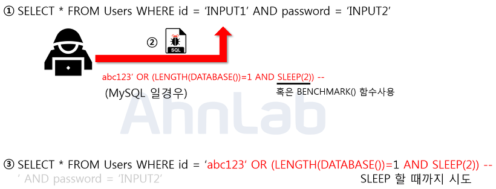

# SQL Injection

## 개요

SQL Injection이란 악의적인 사용자가 보안상의 취약점을 이용하여, 임의의 SQL 문을 주입하고 실행되게 하여 DB가 비정상적인 동작을 하도록 조작하는 행위입니다. 2021년 기준 3위에 해당하는 단골 공격입니다. 공격이 비교적 쉬운 편인 것에 비해 데미지는 큰 공격입니다.

2017년 3월에 일어난 여기어때의 대규모 개인정보 유출 사건도 SQL Injection으로 인해 발생했습니다.

## 공격 종류

### Error based

논리적 에러를 이용한 SQL Injection은 가장 많이 쓰이고, 대중적인 공격 기법입니다.

일반적으로 로그인 시에 자주 사용되는 SQL 구문입니다. 입력값에 대한 검증이 없는 것을 확인하고, 악의적인 사용자가 SQL 구문을 `주입 Inject` 하였습니다. 주입된 내용은 `' OR 1=1 --`으로, WHERE 절에 있는 싱글쿼터를 닫아버리고 OR 1=1이라는 구문으로 무조건 참으로 만든 뒤, -- 를 넣어줌으로 뒤의 구문을 모두 주석 처리 해주었습니다.

매우 간단한 구문이지만, 결론적으로 Users 테이블에 있는 모든 정보를 조회하게 됨으로써 가장 처음에 만들어진 계정으로 로그인에 성공하게 됩니다. 보통 가장 처음에 만들어진 계정은 관리자 계정이기 때문에, 피해는 더 커지기 마련입니다.

### Union based

SQL에서 Union 키워드는 두 개의 쿼리문에 대한 결과를 통합해서 하나의 테이블로 보여주게 하는 키워드입니다. 정상적인 쿼리문에 Union 키워드를 사용하여 인젝션에 성공하면, 원하는 쿼리문을 실행할 수 있게 됩니다. Union Injection을 성공하기 위해서는 두 가지의 조건이 있습니다. 하나는 Union 하는 두 테이블의 컬럼 수가 같아야 하고, 데이터 형이 같아야 합니다.

위의 사진에서 보이는 쿼리문은 Board 테이블의 게시글을 검색하는 쿼리문입니다. 여기서 입력값으로 Union 키워드와 함께 컬럼 수를 맞춰서 SELECT 구문을 넣어주게 되면 두 쿼리문이 합쳐져서 하나의 테이블로 보여지게 됩니다. 인젝션이 성공하게 되면 사용자의 개인정보가 게시글과 함께 화면에 나타납니다.

물론 패스워드를 평문으로 데이터베이스에 저장하지는 않겠지만 인젝션이 가능하다는 점에서 이미 위험합니다. 이 공격도 입력값에 대한 검증이 없기 떄문에 발생하게 되었습니다.

### Boolean based

데이터베이스로부터 특정한 값이나 데이터를 전달받지 않고, 단순히 참과 거짓의 정보만 알 수 있을 때 사용합니다.

위의 그림은 Blind Injection을 이용해 DB의 테이블 명을 알아내는 방법입니다. 임의로 가입한 id와 함께 구문을 주입합니다.

해당 구문은 MySQL에서 테이블 명을 조회하는 구문입니다. limit 키워드로 하나의 테이블만 조회하고, SUBSTR 함수로 첫 글자만, 마지막으로 ASCII를 통해서 ascii 값으로 변환합니다. 만약에 조회되는 테이블 명이 Users라면 `U` 자가 ascii값으로 조회가 될 것이고, 뒤의 100 이라는 숫자 값과 비교하게 됩니다. 참이 될 때까지 100이라는 숫자를 변경해 가면서 비교하면 됩니다. 공격자는 이 프로세스를 자동화한 스크립트로 단기간 내에 테이블 명을 알아 낼 수 있습니다.

### Time based

Blind와 마찬가지로 서버로부터 특정한 응답 대신에 참 혹은 거짓의 응답을 통해서 DB의 정보를 유추하는 기법입니다. 사용되는 함수는 MySQL 기준으로 SLEEP과 BENCHMARK 입니다.

위의 그림은 현재 사용하고 있는 DB의 길이를 알아내는 방법입니다. 로그인 폼에 주입되었으며 임의로 생성한 계정을 사용합니다. LENGTH는 문자열의 길이, DATABASE 함수는 DB의 이름을 리턴합니다.

주입된 구문에서 `LENGTH(DATABASE())`가 참이면 `SLEEP(2)`가 동작합니다. 이를 통해서 숫자 1 부분을 조작하여 DB의 길이를 알아 낼 수 있습니다. 만약 SLEEP 함수가 치환처리 되어 있다면, 또 다른 방법으로 BENCHMARK나 WAIT 함수를 사용할 수 있습니다.

`*BENCHMARK: count 만큼 반복적으로 expr을 실행하는 함수로, MySQL이 얼마나 expr을 빨리 실행하는지 시간을 재며, 결과값은 항상 0을 리턴합니다.`

BENCHMARK는 `BENCHMARK(1000000, AES_ENCRYPT('hello', 'goodbye'))` 와 같이 시간이 걸리는 동작을 여러 번 실행하게 하면서 SLEEP과 유사한 효과를 줄 수 있습니다. 이 구문을 실행하면 약 4.74초가 걸립니다.

### Stored Procedure 저장된 프로시저

저장 프로시저는 일련의 쿼리들을 모아 하나의 함수처럼 사용하기 위한 것입니다. 공격에 사용되는 대표적인 저장 프로시저는 MS-SQL에 있는 `xp_cmdshell`로 윈도우 명령어를 사용할 수 있게 됩니다. 단, 공격자가 시스템 권한을 획득해야 하므로 공격난이도가 높으나 공격에 성공한다면 서버에 직접적인 피해를 입힐 수 있습니다.

악의적인 사용자가 `xp_cmdshell`을 사용해서 권한을 탈취하려고 시도하기 때문에, 기본적으로 사용되지 않도록 설정되어 있습니다.

### Mass 다량의

2008년에 처음 발견된 공격기법으로 기존의 SQL Injection과 달리 한번의 공격으로 다량의 데이터베이스가조작되어 큰 피해를 입히는 것을 의미합니다. 보통 MS-SQL을 사용하는 ASP 기반 웹 애플리케이션에서 많이 사용되며, 쿼리문은 HEX 인코딩 방식으로 인코딩하여 공격합니다. 보통 DB 값을 변조하여 악성스크립트를 삽입하고, 사용자들이 변조된 사이트에 접속 시 좀비PC로 감염되게 합니다. 이렇게 감염된 좀비 PC들은 DDos 공격에 사용됩니다.

## 대응방안

### 입력 값에 대한 검증

SQL Injection에 사용되는 기법과 키워드는 엄청나게 많습니다. 사용자의 입력 값에 대한 검증이 필요하고, 이는 서버단에서 화이트리스트 기반으로 검증되어야 합니다. 블랙리스트 기반으로 차단하는 것이 아니라, 허용된 입력만 받도록 하는 것입니다. 공백으로 치환하는 방법도 많이 쓰이는데, 이 방법도 취약합니다. SE**SELECT**LECT라고 입력 시 중간의 SELECT가 공백으로 치환되면 결국 SELECT가 완성되게 됩니다. 공백 대신 의미 없는 단어로 치환되어야 합니다.

### Prepared Statement 구문 사용

Prepared Statement 구문을 사용하게 되면 사용자의 입력 값이 DB의 파라미터로 들어가기 전에 DBMS가 미리 컴파일하여 실행하지 않고 대기합니다. 그 후 사용자의 입력 값을 문자열로 인시갛게 하여, 공격쿼리가 들어간다고 하더라도 문자열 취급을 받기 때문에 전체 쿼리문이 공격자의 의도대로 작동하지 않게 됩니다.

### Error Message 노출 금지

공격자가 SQL Injection을 수행하기 위해서는 DB의 정보가 필요합니다. DB 에러 발생 시 따로 처리를 해주지 않았다면, 에러가 발생한 쿼리문과 함께 에러에 관한 내용을 반환해 줍니다. 여기서 테이블명, 컬럼명, 쿼리문이 노출될 수 있기 때문에 DB에 대한 오류 발생 시의 에러 메세지를 커스텀하여야 합니다.

### 웹 방화벽 사용

웹 공격 방어에 특화되어 있는 방화벽을 사용하는 것도 하나의 방법입니다. 웹 방화벽은 소프트웨어 형, 하드웨어 형, 프록시 형으로 나눌 수 있는데 소프트웨어 형은 서버 내에 직접 설치하는 것, 하드웨어 형은 네트워크 상에서 서버 앞단에 직접 하드웨어를 다는 것, 마지막으로 프록시 형은 DNS 서버 주소를 웹 방화벽으로 바꾸고 서버로 가는 트래픽이 웹 방화벽을 먼저 거치도록 하는 방법입니다.

## References

- https://noirstar.tistory.com/264?category=779215

