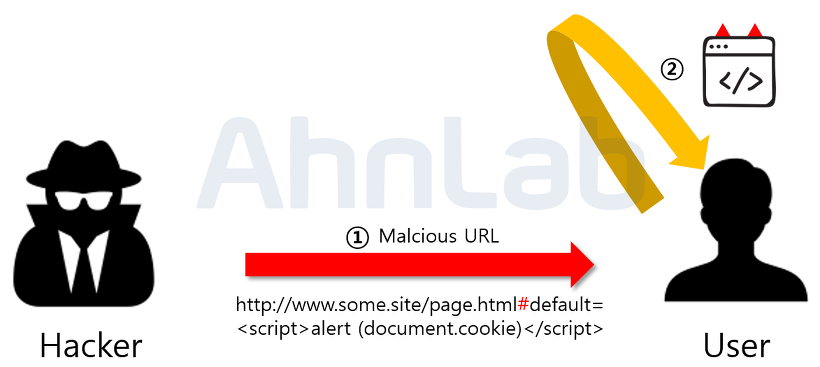

# XSS(Cross Site Scripting) 이란

## 개요


`Cross Site Scripting, XSS`는 웹 애플리케이션에서 많이 나타나는 취약점으로, 악의를 가진 해커가 웹 페이지에 악성 스크립트를 삽입할 수 있는 취약점입니다. 주로 게시판이나 사용자의 입력 값을 보여 주는 곳에서 발생합니다.

이 취약점은 사용자로부터 입력받은 값을 제대로 검사하지 않고 그대로 사용할 경우에 발생합니다. 악의적인 사용자가 C&C 서버로 리다이렉션 하기 위해 스크립트를 주입하여 중간 경유지로 활용하거나, 사용자의 쿠키를 탈취하여 세션 하이재킹(Session Hijacking) 공격을 수행하기도 합니다.

2021년 기준, `OWASP The Open Web Application Security Project` TOP 10에서 3위를 차지하는 `Injection`에 포함되었습니다.

## 공격 기법

### Reflected(Non-persistent) XSS 

### 비 지속형,  반사형 기법


Reflected XSS는 XSS 중에 가장 간단한 방법입니다.

사용자에게 입력받은 값을 서버에서 되돌려 주는 곳에서 발생합니다. 예를 들면 사용자의 검색값을 그대로 리턴하거나 사용자가 입력한 값을 에러 메세지에 포함하여 보여주는 곳에 악성스크립트가 삽입되면, 서버가 사용자의 입력 값을 포함해 응답해 줄 때 스크립트가 실행됩니다. Reflected XSS는 해커가 악의적인 스크립트와 함께 URL을 사용자에게 누르도록 유도하고, URL을 누르면 사용자가 공격당하게 됩니다.

취약점의 예를 들면 아래와 같습니다.

```
https://insecure-website.com/status?message=All+is+well.

<p>Status: All is well.</p>
```

`message` 쿼리로 받은 값을 그대로 나타낸다면, 공격자는 간단하게 공격할 수 있습니다.

```
https://insecure-website.com/status?message=<script>/*+Bad+stuff+here...+*/</script>

<p>Status: <script>/* Bad stuff here... */</script></p>
```

해커가 생성한 URL을 일반 사용자가 방문한다면 해당 사용자의 세션에서 악성 스크립트가 실행됩니다. 이렇게 된다면 악성 스크립트는 해당 유저가 접근할 수 있는 모든 액션과 데이터에 접근할 수 있게 됩니다.

### Stored(or Persistent) XSS 

### 저장형(혹은 지속형) 기법


말 그대로 지속적인 피해를 입히는 XSS 공격입니다. 위의 그림을 보면 해커는 웹 앱에서 XSS 취약점이 있는 곳을 파악하고 악성스크립트를 삽입합니다. 삽입된 스크립트는 DB에 저장되고, 저장된 악성스크립트가 있는 게시글 등을 열람한 사용자들은 쿠키를 탈취당한다던가, 혹은 다른 사이트로 리다이렉션 되는 공격을 받게 됩니다. 한 번의 공격으로 악성 스크립트를 삽입하여 지속적으로 피해를 입힐 수 있다는 특징이 있습니다.

게시판이 주요 공격 대상이며, 사용자가 입력한 값이 DB에 저장되고 그대로 프론트엔드 단에 보여주는 곳이라면 공격이 성공할 가능성이 높습니다.

### DOM based XSS



악의적인 스크립트가 포함된 URL을 사용자가 요청하게 되어 브라우저를 해석하는 단계에 발생하는 공격입니다. 이로 인해 클라이언트 측 코드가 원래 의도와는 다르게 실행됩니다.

DOM based XSS 공격은 다른 XSS 공격과 다르게 서버 측에서 탐지가 어렵습니다. 위의 그림을 보면 해커는 URL에 `#` 특수문자를 사용하고 있습니다. `#` 이후의 값은 서버로 전송되지 않습니다.

아래와 같은 코드를 짰다고 가정해 보겠습니다.

```javascript
var search = document.getElementById('search').value;
var results = document.getElementById('results');
results.innerHTML = 'You searched for: ' + search;
```

여기서 search 값에 해커가 악의적인 스크립트를 심는다면 그대로 실행되어 버리고 맙니다.

```
You searched for: 
```

## 방어 기법

### 입출력 값 검증

기본적으로 스크립트 태그가 사용되기 때문에, `< >` 등의 문자를 필터링하는 방법으로 방어할 수 있습니다. 문자 입력을 그대로 표시하지 않고, 입력 시 `문자 참조 HTML entity`로 필터링하고, 서버에서 브라우저로 전송 시 문자를 인코딩하는 것입니다.

예를 들어 `<`는 `&lt;`로, `>`는 `&gt;`로 변경합니다. 사용자에게는 정상적인 `<script>`로 보이지만, HTML 문서 상에는 `&lt;script&gt;`로 되어 있는 것입니다.

### XSS 방어 라이브러리, 브라우저 확장 앱 사용

Anti XSS 라이브러리를 사용하여 손쉽게 방어할 수 있습니다. 개발자들 뿐만 아니라 사용자들도 설치하고 방어하는 것이 좋습니다.

### 웹 방화벽 사용

XSS 뿐만 아니라 각종 Injection 공격을 효과적으로 방어합니다.

## References

- [위키백과](https://ko.wikipedia.org/wiki/%EC%82%AC%EC%9D%B4%ED%8A%B8_%EA%B0%84_%EC%8A%A4%ED%81%AC%EB%A6%BD%ED%8C%85)
- [PortSwigger](https://portswigger.net/web-security/cross-site-scripting)
- https://noirstar.tistory.com/266?category=779215
