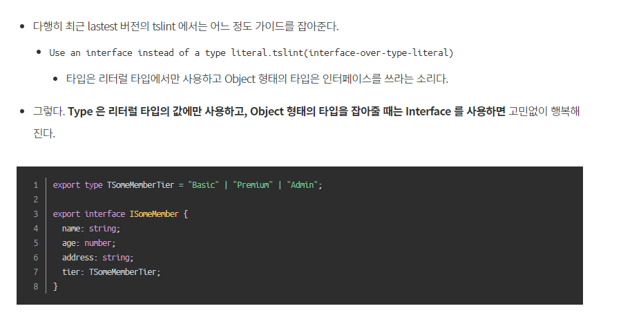

# Typescript interface

## 인터페이스 vs 타입



인터페이스에 적용된 속성, 타입의 조건만 만족한다면 객체의 속성 개수가 더 많아도 상관 없다. 또한, 인터페이스에 선언된 속성 순서를 지키지 않아도 된다는 점을 이용해 보았다.

## 인터페이스 컨벤션

UpperCamelCase

## 인터페이스 모듈화

```typescript
export interface FormDataList {
  [key: string]: FormDataListItem
}

export interface FormDataListItem {
  label: string
  type: string
  value: string
  placeholder: string
  errors: {
    [key: string]: string | undefined
  }
  validator?: (param: ValidateParam) => ValidateData
  message?: string
}

export interface ValidateParam {
  key: string
  value: string
  form: any
}

export interface ValidateData {
  key: string
  type: string
  status: boolean
  message?: string
}
```

## 인터페이스의 요소로 ?를 사용할 때의 주의점

`message?: string` 와 같이 사용할 경우, message는 string 혹은 undefined가 될 수 있다.

이 경우, Object[string] 같은 탐색이 불가능해진다. undefined 형식으로는 하지 못한다는 에러가 발생할 것이다.

따라서 if 문으로 undefined가 아닐 경우에 탐색하도록 락을 걸어줘야 정상적으로 작동한다.

