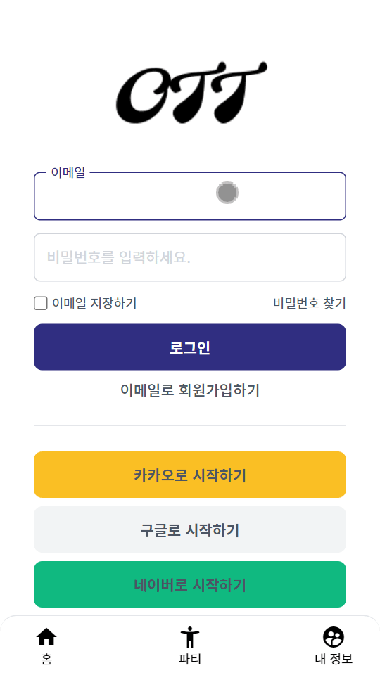

# 리터럴

### TS에서 string array를 순회하기

### 검색어

- typescript nested object type declaration

```typescript
const isValidFormData = computed(() => {
    const keys = Object.keys(formData)
    return keys.every((key) => {
        formData[key] !== ''
    })
})
```

타입스크립트에서 위와 같은 코드는 컴파일 시 에러가 난다. `Object.keys(formData)` 에서 리턴되는 값은 `string[]`이기 때문이다.

`Element implicitly has an 'any' type because expression of type 'any' can't be used to index type`

위 오류... 지겨워 죽겠다 정말.

narrowed string literal이 아니기 때문에 인덱싱을 못하니까, 그냥 string으로도 접근이 가능하게끔 만들어줘야 한다.

그렇다면 어떻게 해야 접근할 수 있을까?

### 1 

`const keys: Array<string> = Object.keys(formData)`

안됨

### 2

`const keys = Object.keys(formData) as Array<string>`

### interface 중첩선언으로 Nested object 선언하기

```typescript
interface formDataList {
  [key: string]: formDataListItem
  email: formDataListItem
  password: formDataListItem
}

interface formDataListItem {
  label: string
  type: string
  value: string
  placeholder: string
  validators: validateResult[]
  error: string
  message?: string
}

interface validateResult {
  status: boolean
  message: string
  check?: boolean
}
```

그런데 이렇게 했더니 아래와 같은 현상 발생... 환장하겠다.

왜 눈에 보이지 않게 없어지는건지??

`reactive`를 없앴었다... 내 기억력 진심....



그래도 결국 됐다. interface를 지정하고 사용하는 것이 맞았다.

### 외부에서 불러온 validator (함수) Array를 interface로 선언하기

```typescript
export const emailValidator = (key: string, value: string): validateResult => {
  if (/^\w+([.-]?\w+)*@\w+([.-]?\w+)*(\.\w{2,3})+$/.test(value)) {
    return { status: true, message: 'hi' }
  }
  return { status: true, message: 'hi' }
}

interface validateList {
  key: validateListItem[]
}

interface validateListItem {
  status: boolean
  message: string
  check?: boolean
}

interface formDataListItem {
  label: string
  type: string
  value: string
  placeholder: string
  error: string
  validators: validateList
  message?: string
}

const formData: formDataList = reactive({
      email: {
        validators: [emailValidator],
      },
    })
```

위와 같이 했더니 에러가 났다.

남은 과제는 interface의 element로 validator를 넣는 것이다.

함수 형태를 validator에 넣었더니 되었다.

```typescript
validator?: (key: string, value: string) => validateData
```

이런 형태로도 된다 ㅋㅋ


- [typescript-object-keys-return-string](https://stackoverflow.com/questions/52856496/typescript-object-keys-return-string)
- [string key로 객체 접근하기](https://velog.io/@yyeonjju/TypeScript-Index-Signature-string-key%EB%A1%9C-%EA%B0%9D%EC%B2%B4%EC%97%90-%EC%A0%91%EA%B7%BC%ED%95%98%EA%B8%B0)
- https://dev.to/mapleleaf/indexing-objects-in-typescript-1cgi
- https://stackoverflow.com/questions/38245081/nested-objects-in-typescript

