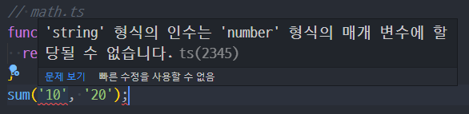
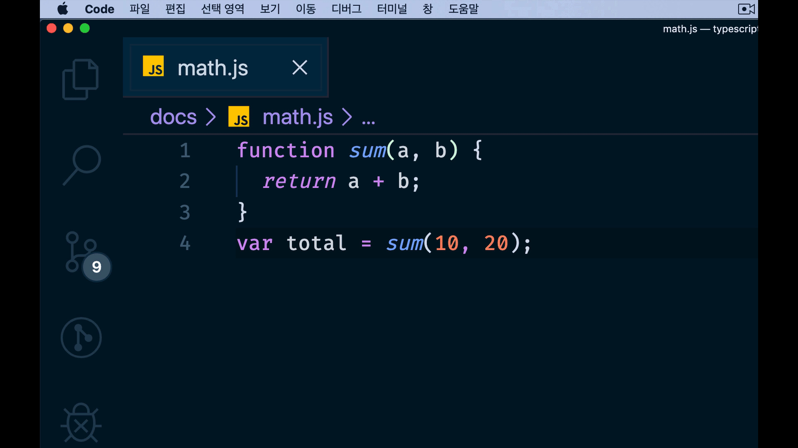
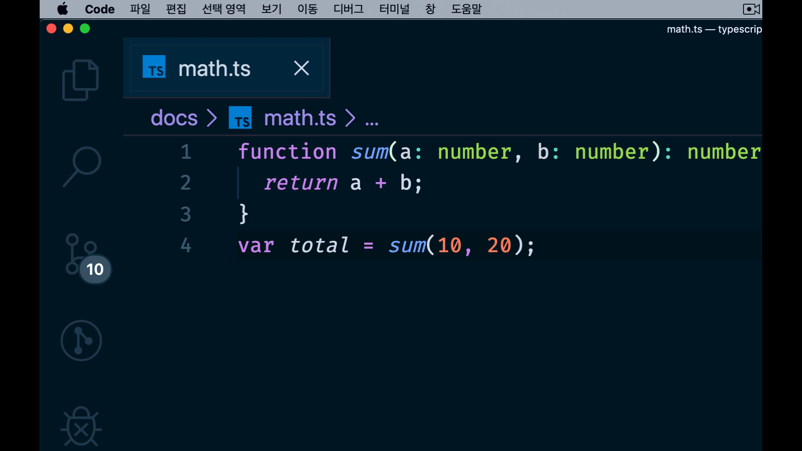
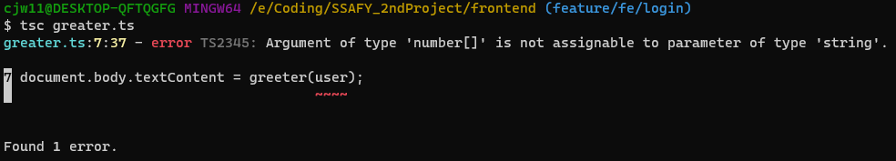

# Typescript

타입스크립트는 자바스크립트 기반에 정적 타입 문법을 추가한 프로그래밍 언어다. 2012년 MS가 발표했으며 대형 SI 프로젝트에서 흔하게 사용되고, 개발자 구인 시 우대사항으로도 자주 언급된다.

TS는 JS와 달리 컴파일을 해 주어야 한다.

## 타입스크립트의 특징

### 컴파일 언어, 정적 타입 언어

자바스크립트는 동적 타입의 인터프리터 언어로 런타임에서 오류를 발견할 수 있다. 이에 반해 타입스크립트는 정적 타입의 컴파일 언어이며 ts 컴파일로 또는 바벨을 통해 js 코드로 변환된다. 코드 작성 단계에서 타입을 체크해 오류를 확인할 수 있고 미리 타입을 결정하기 때문에 실행 속도가 매우 빠르다는 장점이 있다.

하지만 코드 작성 시 매번 타입을 결정해야 하기 때문에 번거롭고 코드량이 증가하며 컴파일 시간이 오래 걸린다는 단점이 있다.

### 자바스크립트 슈퍼셋(Superset)

ts는 js의 슈퍼셋, 즉 js 기본 문법에 ts의 문법을 추가한 언어이다. 따라서 유효한 js로 작성한 코드는 확장자을 `.js` 에서 `.ts`로 변경하고 ts로 컴파일이 가능하다.

### 객체지향 프로그래밍 지원

ts는 ES6의 문법을 포함하며 클래스, 인터페이스, 상속, 모듈 등과 같은 객체지향 프로그래밍 패턴을 제공한다.

## 타입스크립트 사용을 고려해야 하는 이유

### 높은 수준의 코드 탐색과 디버깅, 에러의 사전 방지

ts는 코드에 목적을 명시하고 목적에 맞지 않는 타입의 변수나 함수들에서 에러를 발생시켜 버그를 사전에 제거한다. 또한 코드 자동완성이나 실행 전 피드백을 제공하여 작업과 동시에 디버깅이 가능해진다. 실제로 모든 JS의 버그 중 15%가 사전에 타입스크립트로 감지할 수 있다는 연구도 있었다.

```js
// math.js
function sum(a, b) {
  return a + b;
}
```

```tsx
// math.ts
function sum(a: number, b: number) {
  return a + b;
}
```

두 코드 모두 두 숫자의 합을 구하는 코드이다. 이 함수를 사용해 보자.

```
sum(10, 20); // 30
```

잘 나온다. 그런데 이렇게 써보면 어떨까?

```
sum('10', '20'); // 1020
```

JS의 특성에 따라 1020이 나온다. 숫자 대신 문자열을 더하는 것이다.

하지만 이는 의도하지 않은 코드의 동작이다. 이러한 오류를 예방할 수 있다.

```ts
// math.ts
function sum(a: number, b: number) {
  return a + b;
}
sum('10', '20'); // Error: '10'은 number에 할당될 수 없습니다.
```

위 코드를 VScode에서 확인하면 다음과 같은 오류를 확인할 수 있다.



### 코드 자동 완성과 가이드

```js
// math.js
function sum(a, b) {
  return a + b;
}
var total = sum(10, 20);
total.toLocaleString();
```

위 코드는 앞에서 살펴봤던 `sum()` 함수를 이용하여 두 숫자의 합을 구한 다음 `toLocaleString()`(특정 언어의 표현 방식에 맞게 숫자를 표기하는 API)를 적용한 코드다. 여기서 `toLocaleString()`라는 API가 어떤 역할을 하는지가 중요한게 아니라 위와 같이 코드를 작성할 때 `total`이라는 변수의 타입이 코드를 작성하는 시점에 `number` 라는 것을 자바스크립트가 인지하지 못하고 있는게 중요하다.

달리 말하면, 개발자가 스스로 `sum()` 함수의 결과를 예상하고 타입이 `number`라고 가정한 상태에서 `number`의 API인 `toLocaleString()`를 코딩하게 되는 것. 이 과정을 보면 아래와 같다.



위에서 볼 수 있듯이 `total`이라는 값이 정해져 있지 않기 때문에 자바스크립트 Number에서 제공하는 API인 `toLocaleString()`을 일일이 작성했다. 만약에 오탈자라도 나서 `toLocalString()`이라고 했다면 이 `math.js` 파일을 브라우저에서 실행했을 때만 오류를 확인할 수 있었을 것이다.

그럼,TS라면...?

```tsx
function sum(a: number, b: number): number {
  return a + b;
}
var total = sum(10, 20);
total.toLocaleString();
```



변수 `total`에 대한 타입이 지정되어 있기 때문에 VSCode에서 해당 타입에 대한 API를 미리 보기로 띄워줄 수 있기 때문에 API를 다 일일이 치는 것이 아니라 tab으로 빠르고 정확하게 작성해나갈 수 있다.

## 타입스크립트의 사용

### 컴파일

```tsx
// greater.ts

function greeter(person) {
  return "Hello, " + person;
}

let user = "Jane User";

document.body.textContent = greeter(user);
```

ts 확장자를 사용했지만 아직 js 코드이다. 컴파일 해보자.

```sh
tsc greater.ts
```

```js
// greater.js
function greeter(person) {
    return "Hello, " + person;
}
var user = "Jane User";
document.body.textContent = greeter(user);
```

동일한 코드의 js 파일이 생성되는 것을 알 수 있다!

### 타입 표기 (Type annotations)

TS의 타입 표기는 함수나 변수의 의도된 계약을 기록하는 간단한 방법이다. 원하지 않는 타입의 매개변수가 들어왔을 때 잡아낼 수 있다.

```tsx
function greeter(person: string) {
    return "Hello, " + person;
}

let user = [0, 1, 2];

document.body.textContent = greeter(user);
```

위 코드를 컴파일하면 아래와 같은 오류를 볼 수 있다.



세상에... 오류 찾는데 백만년 걸리는 JS와 다르다.

컴파일 시 오류가 나지만, JS 파일은 생성된다. 그러나 오류임을 알 수 있기에 우리는 수정할 수 있다!!

### 인터페이스

인터페이스에 대해 알아보자. 간단한 예제부터.

```tsx
let person = { name: 'Capt', age: 28 };

function logAge(obj: { age: number }) {
  console.log(obj.age); // 28
}
logAge(person); // 28
```

위 logAge 함수의 인자의 형태는 age를 속성으로 가지는 `obj`, 객체이다. 이렇게 인자를 받을 때 단순한 타입 뿐만 아니라 객체의 속성 타입까지 정의할 수 있다.

여기에 인터페이스를 적용하면,

```tsx
interface personAge {
  age: number;
}

function logAge(obj: personAge) {
  console.log(obj.age);
}
let person = { name: 'Capt', age: 28 };
logAge(person);
```

이렇게 logAge의 인자를 조금 더 명시적으로 바꿀 수 있다.

`logAge()의 인자는 personAge라는 타입을 가져야 한다`

인터페이스를 인자로 받아 사용할 때, 인터페이스의 속성 개수와 인자로 받는 객체의 속성 개수를 일치시키지 않아도 된다. 다시 말해, 인터페이스에 적용된 속성, 타입의 조건만 만족한다면 객체의 속성 개수가 더 많아도 상관 없다. 또한, 인터페이스에 선언된 속성 순서를 지키지 않아도 된다.


## Reference

- [타입스크립트 핸드북](https://joshua1988.github.io/ts/guide/interfaces.html#%EC%9D%B8%ED%84%B0%ED%8E%98%EC%9D%B4%EC%8A%A4)
