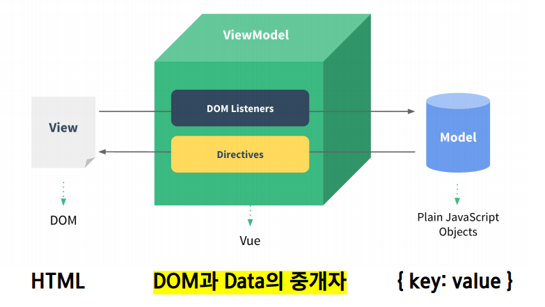
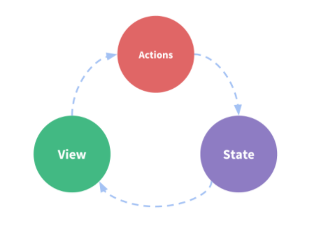
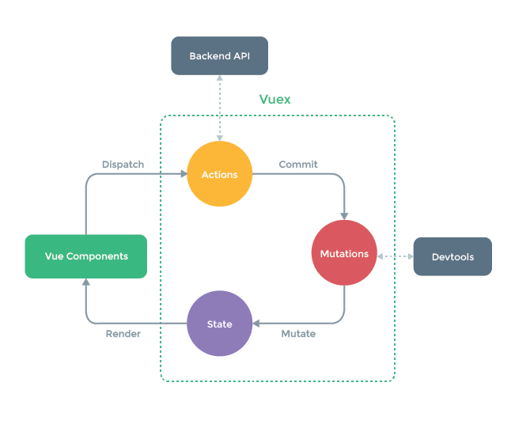
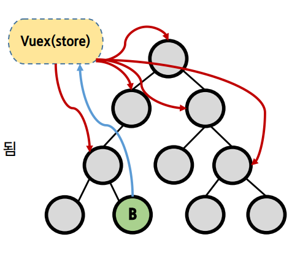

# Vue

[TOC]

# What is Vue.js

- 사용자 인터페이스를 만들기 위한 프로그레시브 프레임워크
- 현대적인 tool과 다양한 라이브러리를 통해 **SPA(Single Page Application)**를 완벽하게 지원
- Evan You에 의해 발표 (2014)
  - 구글의 Angular 개발자 출신

## SPA

- 단일 페이지 앱
- 현재 페이지를 동적으로 작성함으로써 사용자와 소통하는 웹 어플
- 단일 페이지로 구성되며 서버로부터 처음에만 페이지를 받아오고 이후에는 동적으로 DOM을 구성
  - 즉, 처음 페이지를 받은 이후에는 서버로부터 완전한 페이지를 불러오지 않고 동적으로 다시 작성
  - 연속되는 페이지 간의 사용자 경험(UX)를 향상
- 동작 원리의 일부가 CSR(Client Side Rendering) 의 구조를 따름

### SPA 등장 배경

- 과거 웹 사이트들은 매번 새로운 페이지를 응답하는 방식이었음
  - Multi Page Application (MPA)
- 스마트폰이 등장하면서 모바일 최적화에 대한 필요성이 생김
  - 모바일 네이티브 앱과 같은 형태의 웹 페이지가 필요해짐
- 이러한 문제를 해결하기 위해 Vue와 같은 FE 프레임워크 등장
  - CSR, SPA
- 1개의 웹페이지에서 여러 동작이 이루어지며 모바일 앱과 비슷한 형태의 사용자 경험을 제공

## CSR

- Client Side Rendering
- 최초 요청 시 서버에서 빈 문서를 응답하고 이후 클라이언트(브라우저)에서 데이터를 요청해 데이터를 받아 DOM을 렌더링하는 방식
- SSR보다 초기 전송되는 페이지의 속도는 빠르지만, 서비스에서 필요한 데이터를 클라이언트에서 추가로 요청하여 재구성해야 하기 때문에 전체적인 페이지 완료 시점은 SSR보다 느림 - 최초 로드 시에만
  - Server Side Rendering :: SSR
- SPA가 사용하는 렌더링 방식

### 장점

- 서버와 클라이언트 간의 트래픽 감소
  - 웹 앱에 필요한 모든 정적 리소스를 최초에 한번 다운로드
- 사용자 경험 향상
  - 전체 페이지를 다시 렌더링하지 않고 변경되는 부분만을 갱신

### 단점

- SEO(검색엔진 최적화) 문제가 발생할 수 있음

## SSR

### 장점

- 초기 로딩 속도 빠름
- SEO 가능

### 단점

- 모든 요청에 새로고침이 되기 때문에 UX가 상대적으로 별로임
  - 요청 횟수가 많아져서 서버 부담이 커짐

## SEO

- Search Engine Optimization
- 웹 페이지 검색엔진이 자료를 수집하고 순위를 매기는 방식에 맞게 웹페이지를 구성해서 검색 결과 상위에 노출될 수 있도록 하는 작업
- 인터넷 마케팅 방법 중 하나
- 구글 등장 이후 검색엔진들이 컨텐츠의 신뢰도를 파악하는 기초 지표
  - 다른 웹 사이트에서 얼마나 인용되었나를 반영
  - 결국 타 사이트에 인용되는 횟수를 늘리는 방향으로 최적화

### SEO 문제 대응

- Vue.js, React 등의 spa 프레임워크는 ssr을 지원하는 seo 대응 기술이 이미 존재
  - seo 대응이 필요한 페이지에 대해서는 선별적 seo 대응 가능
- 혹은 추가적으로 프레임워크를 사용하기도 함
  - Nuxt.js
    - Vue.js 응용 프로그램을 만들기 위한 Framework
    - SSR 지원
  - Next.js
    - React에 사용

## SPA with SSR

- CSR과 SSR을 적절히 사용
  - 예를 들어 Django에서 Axios를 활용한 좋아요/팔로우 로직의 경우 대부분은 SSR
  - 다만 특정 요소만 ajax를 활용한 비동기요청으로 필요한 데이터를 클라이언트에서 서버로 직접 요청을 보내 받아오고 JS를 사용해 DOM을 조작 CSR

# Why vue js?

- Vanilla JS
  - 한 유저가 100만개의 게시글 작성 후, 닉네임 변경
  - 100만개 게시글의 작성자 이름이 모두 수정되어야 함
  - **모든 요소를 선택해서 이벤트를 등록하고 값을 변경해야 함**
- Vue.js
  - DOM과 Data가 연결되어 있으면
  - Data를 연결하면 DOM은 알아서 변경됨
  - 즉, Data 관리만 신경쓰면 된다

# Concepts of Vue.js

## MVVM Pattern

- 앱 로직을 UI로부터 분리하기 위해 설계된 디자인 패턴
- 구성 요소
  - Model
  - View
  - View Model

## MVVM in Vue.js



## Model

- vue에서 Model은 Javascript Object다
- JavaScript의 Object 자료 구조
- 이 Object는 Vue Instance 내부에서 data로 사용되는데 이 값이 바뀌면 View(DOM)가 반응

## View

- vue에서 View는 DOM(HTML)이다
- Data의 변화에 따라서 같이 변화

# Basic syntax of Vue.js

## Vue Instance

- 모든 Vue 앱은 Vue 함수로 새 인스턴스를 만드는 것부터 시작
- Vue 인스턴스를 생성할 때는 Options 객체를 전달해야 함
  - 여러 Options들을 사용하여 원하는 동작을 구현
- Vue Instance === Vue Component

## Template Syntax

- 렌더링 된 DOM을 기본 Vue 인스턴스의 데이터에 선언적으로 바인딩 할수 있는 HTML 기반 템플릿 구문을 사용

1. Interpolation
2. Directive

## Interpolation (보간법)

- Text
  - `<span> {{ msg }} </span>`

- Raw HTML
  - `<span v-html="rawHtml"></span>`
- Attributes
  - `<div v-bind:id="dynamicId">`
- JS 표현식
  - `{{ num + 1 }}`
  - `{{ msg.split('').reverse().join('')}}`

## Directive

- v- 접두사가 있는 특수 속성
- 속성 값은 단일 JS 표현식이 됨 (v-for는 예외)
- 표현식의 값이 변경될 때 반응형으로 DOM에 적용하는 역할
- 전달인자(Arguments)
  - `:`을 통해 전달인자를 받을 수도 있음
- 수식어(Modifiers)
  - `.`으로 표현되는 특수 접미사
  
  - ```
    <form v-on:submit.prevent="onSubmit">
    ```
  
  - 디렉티브를 특별한 방법으로 바인딩 해야 함을 나타냄

## v-text

- 엘리먼트의 textContent를 업데이트
- 내부적으로 interpolation 문법이 v-text로 컴파일됨!
  - interpolation == v-text

```html
<div id="app">
    <p v-text="message"></p>
    <p> {{ message }} </p>
  </div>

  <script src="https://cdn.jsdelivr.net/npm/vue/dist/vue.js"></script>
  <script>
    const app = new Vue({
      el: '#app',
      data: {
        message: 'text'
      }
    })
  </script>
```


## v-html

- 엘리먼트의 innerHTML을 업데이트
  - XSS 공격에 취약할 수 있음
- 임의로 사용자로부터 입력받은 내용은 v-html에 **'절대 사용 금지'**

## v-show (Expansive initial load, cheap toggle)

- CSS display 속성을 hidden으로 만들어 toggle하는 방식
- 실제로 렌더링은 되지만 눈에서 보이지 않기 때문에 딱 한번만 렌더링이 되는 경우라면 v-if에 비해 상대적으로 렌더링 비용이 높음
- 하지만 자주 변경되는 요소라면 한번 렌더링 된 이후부터는 보여주는 지에 대한 여부만 판단하면 되기 때문에 토글 비용이 적음
- 조건부 렌더링 중 하나
- 엘리먼트는 **항상** 렌더링 되고 DOM에 남아있음
- 단순히 엘리먼트에 display CSS 속성을 토글

## v-if

- 전달인자가 false인 경우 렌더링 되지 않음
- 화면에서 보이지 않을 뿐만 아니라 렌더링 자체가 되지 않기 때문에 렌더링 비용이 낮음
- 하지만 자주 변경되는 요소의 경우 다시 렌더링 해야 하기 때문에 비용이 증가할 수 있음

## v-for

- 원본 데이터를 기반으로 엘리먼트 또는 템플릿 블록을 여러 번 렌더링

- item in items 구문 사용

- item 위치의 변수를 각 요소에서 사용할 수 있음
  - 객체의 경우는 key
  
- v-for 사용시 반드시 key 속성을 각 요소에 작성

  - 서브트리의 내부 컴포넌트 상태를 유지하기 위해 v-for는 항상 key와 함께 요구된다. 비록 엘리먼트이긴 하지만 애니메이션의 `객체 불변성`과 같이 예측 가능한 행동을 유지하는 것은 좋은 습관.

- v-if와 함께 사용하는 경우 v-for는 v-if보다 우선순위가 높음. 다만, 동시에 사용하는 것은 지양할 것

  - 사용 가능해 보이는 두 가지 일반적인 경우에 대체 방법

    - 리스트 목록을 필터링할 때 (e.g. `v-for="user in users" v-if="user.isActive"`) 
      이 경우 users를 새로운 computed 속성으로 필터링된 목록으로 대체할 것. (e.g `activeUsers`)

    - 숨기기 위해 리스트의 렌더링을 피할 때 (e.g.`v-for="user in users" v-if="shouldShowUsers"`).
      이 경우 `v-if`를 컨테이너 엘리먼트로 옮긴다. (e.g `ul`, `ol`)

      - bad

        ```html
        <ul>
          <li
            v-for="user in users"
            v-if="shouldShowUsers"
            :key="user.id"
          >
            {{ user.name }}
          </li>
        </ul>
        ```

      - good

        ```html
        <ul v-if="shouldShowUsers">
          <li
            v-for="user in users"
            :key="user.id"
          >
            {{ user.name }}
          </li>
        </ul>
        ```

        

## v-on

- 엘리먼트에 이벤트 리스너를 연결
- 이벤트 유형은 전달인자로 표시
- 약어
  - @
  - v-on:click -> @click

## v-bind

- HTML요소의 속성에 Vue의 상태 데이터를 값으로 할당
- Object 형태로 사용하면 value가 true인 키가 class 바인딩 값으로 할당
- 약어
  - `:`
  - `v-bind:href` -> `:href`

## v-model

- HTML form 요소의 값과 데이터를 양방향 바인딩 (two-way binding)
- 수식어
  - .lazy
    - input 대신 change 이벤트 이후에 동기화
  - .number
    - 문자열을 숫자로 변경
  - .trim
    - 입력을 trim

## this keyword in vue.js

- vue 함수 객체 내에서 vue 인스턴스를 가리킴
- 단, JavaScript 함수에서의 this 키워드는 다른 언어와 조금 다르게 동작하는 경우가 있다.
  - data 정의 , methods 정의의 경우. 이 경우 화살표 함수가 부모 컨텍스트를 바인딩하기 때문에 vue 인스턴스를 가리키지 않아. arrow function은 사용하면 안된다.

## Options/Data

###  'el'

- vue 인스턴스에 연결(mount)할 기존 DOM 엘리먼트가 필요
- CSS 선택자 문자열 혹은 HTMLElement로 작성
- new를 이용한 인스턴스 생성때만 사용

```js
const app = new Vue({
	el: '#app'
})
```

### 'data'

- vue 인스턴스의 데이터 객체
- vue 앱의 상태 데이터를 정의하는 곳
- vue template에서 interpolation(보간법)을 통해 접근 가능
- v-bind, v-on과 같은 디렉티브에서도 사용 가능
- vue 객체 내 다른 함수에서 this 키워드를 통해 접근 가능
- 주의!
  - 화살표 함수를 `data`에서 사용하면 안됨
  - 화살표 함수가 부모 컨텍스트를 바인딩하기 때문에, `this`는 예상과 달리 vue 인스턴스를 가리키지 않음

```js
const app = new Vue({
	el: '#app',
	data: {
		message: 'hi',
	}
})
```

### 'methods'

- vue 인스턴스에 추가할 메서드
- vue template에서 interpolation(보간법)을 통해 접근 가능
- v-on과 같은 디렉티브에서도 사용 가능
- vue 객체 내 다른 함수에서 this 키워드를 통해 접근 가능
- 주의!
  - 화살표 함수를 `methods`에서 사용하면 안됨
  - 화살표 함수가 부모 컨텍스트를 바인딩하기 때문. `this`는 vue 인스턴스가 아니며, 따라서 `this.a`는 정의되어있지 않음

### 'computed'

- 데이터를 기반으로 하는 계산된 속성
- 함수의 형태로 정의하지만, 함수 자체가 아니라 리턴 값이 바인딩 됨
- 종속된 대상을 따라 저장(캐싱) 됨
- **종속된 대상이 변경될 때만 함수를 실행**
- 즉, Date.now() 처럼 아무 곳에도 의존하지 않는 computed 속성의 경우 절대로 업데이트되지 않음
- 반드시 반환 값이 있어야 함

### computed & method

- 최종 결과에 대해 두 가지 접근 방식은 서로 동일하지만, 차이점은 computed 속성은 종속 대상을 따라 저장된다는 것.

- computed 
  - **종속 대상을 따라 저장됨**
    즉, 종속된 대상이 변경되지 않는 한 computed에 작성된 함수를 여러 번 호출해도 계산을 다시 하지 않고 계산되어 이전 결과를 반환
- method
  - 함수를 페이지가 렌더링 될때마다 항상 호출

### computed & watch

- computed
  - 특정 데이터를 직접적으로 사용/가공하여 다른 값으로 만들 때 사용
  - "특정 값이 변동하면 특정 값을 새로 계산해서 보여준다"
- watch
  - 특정 대상이 변경되었을 때 콜백 함수를 실행시키기 위한 트리거
  - "특정 값이 변동하면 다른 작업을 한다."
- computed가 코드 반복이 적은 등 우수하다고 평가하는 경향이 있으나, 사용 용도가 다르다.

### 'filters'

- 텍스트 형식화를 적용할 수 있는 필터
- interpolation 혹은 v-bind를 이용할 때 사용 가능
- 필터는 자바스크립트 표현식 마지막에 `|`와 함께 추가되어야 함
- 체이닝 가능

### 선언형 & 명령형

선언형 프로그래밍

- 계산해야 하는 목표 데이터를 정의 (computed)

명령형 프로그래밍

- 데이터가 바뀌면 특정 함수 실행 (watch)

## lodash

- 모듈성, 성능 및 추가 기능을 제공하는 javascript 유틸리티 라이브러리
- array, object 등 자료구조를 다룰 때 사용하는 유용하고 간편한 유틸리티 함수들을 제공
- reverse, sortBy, range, random...

## Lifecycle

https://codepen.io/small/pen/awmZRa?editors=1011

- vue 인스턴스가 어떻게 DOM과 연결되는지에 대한 Lifecyle
- 각 vue 인스턴스는 생성될 때 일련의 초기화 단계를 거침
  - 예를 들어 데이터 관찰 설정이 필요한 경우, 인스턴스를 DOM에 마운트하는 경우, 데이터가 변경되어 DOM을 업데이트하는 경우 등
- 이 과정에 사용자 정의 로직을 실행할 수 있는 라이프사이클 훅도 호출됨

## Creating : 컴포넌트 초기화 단계

- creation 단계에서 실행되는 hook들이 가장 처음 실행된다. 컴포넌트가 돔에 추가되기 전이며, 
  **서버 렌더링에서도 지원되는 훅이다**
- 따라서 클라이언트 단과 서버단 렌더링 모두에서 처리해야 할 일이 있다면 이 단계에서 하면 된다. 아직 컴포넌트가 돔에 추가되기 전이기 때문에 DOM에 추가하거나 `this.$el`을 사용할 수 없다.

### beforeCreate

모든 훅 중에 가장 먼저 실행됨. data와 events가 세팅되지 않은 시점이므로 접근하면 온갖 에러 발생

### created

- 그 인스턴스가 생성이 되었는가 안되었는가?
- Vue 인스턴스가 막 생성된 상태일 때 호출
- data, events가 활성화되어 에는 접근할 수 있지만 템플릿과 가상 DOM은 마운트 및 렌더링되지 않은 상태.
- created를 통해 앱의 초기 데이터를 API 요청을 통해 불러올 수 있음

## Mounting: DOM 삽입 단계

- Mounting 단계는 초기 렌더링 직전에 컴포넌트에 직접 접근할 수 있다. 서버 렌더링에서는 지원하지 않는다.
- 초기 렌더링 직전에 돔을 변경하고자 한다면 이 단계를 활용할 수 있다. **하지만 created 단계를 사용하는 것이 낫다.**

### beforeMount

- 템플릿과 렌더 함수들이 컴파일된 후에 첫 렌더링이 일어나기 직전에 실행된다. 대부분의 경우에 사용하지 않는 것이 좋다. SSR 시에는 호출되지 않는다.

### mounted

- 컴포넌트, 템플릿, 렌더링된 돔에 접근할 수 잇다. 모든 하위 컴포넌트가 마운트된 상태를 보장하지는 않는다. SSR 시에는 호출되지 않는다.

## Updating: Diff 및 재 렌더링 단계

- 컴포넌트에서 사용되는 반응형 속성들이 변경되거나 어떤 이유로 재 렌더링이 발생되면 실행된다. 디버깅이나 프로파일링 등을 위해 컴포넌트 rerendering 시점을 알고 싶을 때 사용하면 된다. 꽤 유용하게 활용할 수 있다.

### beforeUpdate

- 컴포넌트의 데이터가 변하여 업데이트 사이클이 시작될 때 실행된다. 정확히는 돔이 재 렌더링되고 패치되기 직전에 실행된다. 재 렌더링 전의 새 상태의 데이터를 얻을 수 있고 더 많은 변경이 가능하다. 이 변경으로 인한 재 렌더링은 트리거되지 않는다.

### update

- 이 훅은 컴포넌트의 데이터가 변하여 재 렌더링이 일어난 후에 실행된다. 돔이 업데이트 완료된 상태이므로 돔 종속적인 연산이 가능하다. 그러나 여기서 상태를 변경하면 무한루프에 빠질 수 있다. (값 변경 -> 어? update됐네? -> 값 변경...)

## Destruction: 해체 단계

### beforeDestroy

- 이 훅은 해체(뷰 인스턴스 제거)되기 직전에 호출된다. 컴포넌트는 원래 모습과 모든 기능들을 그대로 가지고 있다. 이벤트 리스너를 제거하거나 reactive subscription을 제거하고자 한다면 이 훅이 제격이다. SSR 시 호출 안됨

### destroyed

- 해체 된 후에 호출. Vue Instance의 모든 Directive가 바인딩 해제되고 모든 이벤트 리스너가 제거되며 모든 하위 vue 인스턴스도 삭제된다.

## Vue에서 중첩 데이터를 감시하는 법 - Local Storage 사용의 경우

[링크](https://ui.toast.com/weekly-pick/ko_20190307)

```js
const STORAGE_KEY = 'vue-todo-app'
const todoStorage = {
    save: function (todoList) {
        localStorage.setItem(STORAGE_KEY, JSON.stringify(todoList))
    },
    fetch: function () {
        return JSON.parse(localStorage.getItem(STORAGE_KEY))
    }
}
```

- 위와 같이 원하는 key로 데이터를 로컬에 저장할 수 있다. 그리고 브라우저의 변화를 로컬 스토리지에 실질적으로 저장하기 위해 data에 변화가 있을 때마다 save()를 실행시켜야 한다. (watch!)

### deep

```js
watch: {
	todolist(newTodoList) {
        todoStorage.save(newTodoList)
    }
}
```

- 위와 같이 하면 객체 내의 속성 내부가 변경되었을 때, 감지하지 못한다.

```js
watch: {
    todoList: {
        deep: true,
        handler: function (newTodoList) {
            todoStorage.save(newTodoList)
        }
    }
}
```

- todoList 객체의 `속성 내부가 변경되었음을 관찰하라고 알리기 위해` deep:true로 설정하고, handler 메세지를 재배치하여 Vue에게 원하는 바 (로컬 스토리지에 저장하라)를 알릴 수 있다.

### Immediate

- `watch`는 속성의 값이 변할 때 실행되지만, 종종 변경과 관계없이 처음 한 번 실행해야 하는 경우가 있다.

```js
export default {
  name: 'MovieData',
  props: {
    movie: {
      type: String,
      required: true,
    }
  },
  data() {
    return {
      movieData: {},
    }
  },

  watch: {
    // Whenever the movie prop changes, fetch new data
    movie(movie) {
      // Fetch data about the movie
      fetch(`/${movie}`).then((data) => {
        this.movieData = data;
      });
    }
  }
}
```

- 위 컴포넌트는 잘 작동한다. 문제는 페이지가 로드 될 때 `movie`가 기본값으로 설정된다는 것이다. 하지만 속성이 변경되지 않았으므로 `watch`는 실행되지 않는다. 다른 동영상을 선택할 때까지 데이터가 로드되지 않음을 의미한다.
- 그렇다면 페이지 로드 시 즉시 `watch`가 실행되도록 할 수 있을까?
- `immediate`를 `true`로 설정하고 핸들러 함수를 아래처럼 옮긴다.

```js
watch: {
  // Whenever the movie prop changes, fetch new data
  movie: {
    // Will fire as soon as the component is created
    immediate: true,
    handler(movie) {
      // Fetch data about the movie
      fetch(`/${movie}`).then((data) => {
        this.movieData = data;
      });
    }
  }
}
```

### Handler

- `hander`는 `watch`된 속성이 변경될 때 호출될 함수를 지정한다.
- 흔히 쓰는 `deep`, `immediate`를 지정할 필요가 없는 경우 사용하는 단축표현이다. 단축표현 대신 아래처럼 사용할 수 있다.

```js
watch: {
  movie: {
    handler(movie) {
      // Fetch data about the movie
      fetch(`/${movie}`).then((data) => {
        this.movieData = data;
      });
    }
  }
}
```

- 단축표현을 사용해서 이렇게 쓸 수도 있다.

```js
watch: {
  movie(movie) {
    // Fetch data about the movie
    fetch(`/${movie}`).then((data) => {
      this.movieData = data;
    });
  }
}
```

- Vue의 멋진 점은 함수를 처리하는 메서드 이름을 문자열로 지정할 수 있다는 것이다. 두 개 이상의 속성이 변경될 때의 처리에 유용하다.

```js
watch: {
  // Whenever the movie prop changes, fetch new data
  movie {
    handler: 'fetchData'
  },
  // Whenever the actor changes, we'll call the same method
  actor: {
    handler: 'fetchData',
  }
},

methods: {
  // Fetch data about the movie
  fetchData() {
    fetch(`/${this.movie}/${this.actor}`).then((data) => {
      this.movieData = data;
    });
  }
}
```


# SFC (Single File Component)

- Vue의 컴포넌트 기반 개발의 핵심
- 하나의 컴포넌트는 .vue라는 하나의 파일
- 화면의 특정 영역에 대한 html, css, js 코드를 .vue 하나에서 관리
- vue 컴포넌트 === vue 인스턴스 === .vue 파일

## Component

- 기본 HTML 엘리먼트를 확장하여 재사용 가능한 코드를 캡슐화 하는데 도움을 줌
- CS에서는 다시 사용할 수 있는 범용성을 위해 개발된 소프트웨어 구성 요소를 의미
- 즉, 컴포넌트는 개발을 함에 있어 유지보수를 쉽게 만들어 줄 뿐만 아니라, 재사용성의 측면에서도 매우 강력한 기능을 제공
- Vue 컴포넌트 === Vue 인스턴스 (new Vue ({})) === .vue

# Vue CLI

## Vue CLI

- Vue.js 개발을 위한 표준 도구
- 프로젝트의 구성을 도와주는 역할을 하며, Vue 개발 생태계에서 표준 tool 기준을 목표로 함
- 확장 플러그인, BUI, ES2015 구성 요소 제공 등 다양한 tool 제공

### Install

```
# vue-cli 설치
npm install -g @vue/cli
# 버전 확인
vue --version
# 프로젝트 생성
vue create my-first-vue-app
# runserver
npm run serve
```

## Node.js

- 자바스크립트를 브라우저가 아닌 환경에서도 구동할 수 있도록 하는 js 런타임 환경
  - 브라우저 밖을 벗어날 수 없던 js의 태생적 한계 해결
- Chrome V8 엔진을 사용하여 여러 OS에서 실행 가능
- **단순히 브라우저만 조작할 수 있었던 JS를 SS(Server Side)에서도 사용 가능하게 됨!!**
  - 일반적인 사이트 개발을 넘어 SPA, iOS와 안드로이드 앱 개발에는 React Native, 웹 서버/서버 사이드 어플리케이션에 Node.js 등 다양한 접근이 가능해짐.
  - 클라이언트만 자바스크립트를 쓰는 것이 아니라, 서버에서도 같은 언어로 구현할 수 있기 때문에 프론트엔드와 백엔드를 둘 다 같이 개발할 수 있는 풀스택 개발자들이 증가하게 됨.

## NPM (Node Package Manage)

- 자바스크립트 언어를 위한 패키지 관리자
  - Python의 pip가 있다면 Node.js에는 npm
  - 다양한 의존성 패키지 관리
- Node.js의 기본 패키지 관리자. Node.js와 함께 자동으로 설치됨.

## Environment Variables

중요한 api 키 등의 정보는 따로 환경 변수 파일을 만들어서 빼 둬야 한다.

```sh
.env                # loaded in all cases
.env.local          # loaded in all cases, ignored by git
.env.[mode]         # only loaded in specified mode
.env.[mode].local   # only loaded in specified mode, ignored by git
```

###  Using Env Variables in Client-side Code

```js
console.log(process.env.VUE_APP_NOT_SECRET_CODE)
```

# Pass Props & Emit Events

- 컴포넌트는 부모-자식 관계에서 가장 일반적으로 함께 사용하기 위함
- 부모는 자식에게 데이터를 전달 (pass props) 하며, 자식은 부모에게 알림 (Emit event)
  -  부모와 자식이 명확하게 정의된 인터페이스를 통해 격리된 상태로 유지할 수 있음
- "props는 아래로, events는 위로"
- 부모는 props를 통해 자식에게 데이터를 전달하고, 자식은 events를 통해 부모에게 메시지를 보냄

## Props

- prop은 상위 컴포넌트의 정보를 전달하기 위한 사용자 지정 특성

- 하위 컴포넌트는 props 옵션을 사용하여 수신하는 props를 명시적으로 선언해야 함

- 즉, 데이터는 props 옵션을 사용하여 하위 컴포넌트로 전달됨

- **주의**

  - 하위 컴포넌트의 템플릿에서 상위 데이터를 직접 참조할 수 없음
  - props는 read only임

- props 이름 컨벤션

  - in HTML
    - kebab-case
  - in script
    - camelCase

- ```js
  name: 'NewComponent',
    props: {
      myMsg: {
        type: String,
  	  required:true,
      },
    }
  ```

`my-msg`로 값을 넘겼다면 이렇게 받아 쓰면 된다. props를 받았다면, 아래에서 선언을 해 줘야 사용이 가능하다.

Props를 자세하게 객체 형식으로 적어 줘야 나중에 디버깅도 편하다.

props는 객체로 표시하는 게 좋다. 기본값과 타입, 데이터의 필수조건을 정할 수 있기 때문이다.

### props의 데이터

- type
  - 해당 변수의 타입을 정할 수 있다. 여러 개를 원한다면 array를 사용하면 된다. 타입이 mismatch일 경우 에러가 발생하지만, 렌더링은 된다.
- default
  - 부모에서 값을 전달해주지 않았을 경우의 기본값
- required
  - 해당 props를 부모에서 전달해 주지 않았을 때 이 속성이 true라면 에러가 발생한다. 다만 렌더링은 된다.


### 단방향 데이터 흐름

- 모든 props는 하위 속성과 상위 속성 사이의 단방향 바인딩을 형성
- 부모의 속성이 변경되면 자식 속성에게 전달되지만, 역은 불가능
  - 자식 요소가 의도치 않게 부모 요소의 상태를 변경함으로써, 
    **앱의 데이터 흐름을 이해하기 어렵게 만드는 일을 막기** 위함
- 부모 컴포넌트가 업데이트될 때 마다 자식 요소의 모든 prop들이 최신 값으로 업뎃됨

## Emit event

- $emit(event)
  - 현재 인스턴스에서 이벤트를 트리거
  - 추가 인자는 리스너의 콜백 함수로 전달
- 부모 컴포넌트는 자식 컴포넌트가 사용되는 템플릿에서 v-on을 사용하여 자식 컴포넌트가 보낸 이벤트를 청취

### event 이름

- 컴포넌트 및 props와는 달리, 이벤트는 자동 대소문자 변환을 제공하지 않음
- HTML의 대소문자 구분을 위해 DOM 템플릿의 v-on 이벤트 리스너는 항상 자동으로 소문자 변환되기 때문에
  v-on:myEvent는 자동으로 v-on:myevent로 변환
- 이러한 이유로 이벤트 이름에는 kebab-case가 권장됨

### data는 반드시 함수여야 한다!!

컴포넌트 인스턴스가 모두 같은 data 객체를 공유하므로, 인스턴스의 값이 중복되지 않도록 함수의 리턴 형태를 사용해야 한다. **component의 데이터는 함수여야 한다!!**

# Vue Router

- Vue.js의 공식 라우터
- 중첩된 라우트/뷰 매핑 모듈화 된, 컴포넌트 기반의 라우터 설정 등 SPA 상에서 라우팅을 쉽게 개발할 수 있는 기능 제공

```
vue add router
```

내용이 날아가므로, 백업을 하고 진행해야 한다.

## router-link

- index.js 파일에 정의한 경로에 등록한 특정 컴포넌트와 매핑
- html5 히스토리 모드에서, router-link는 **클릭 이벤트를 차단**하여 브라우저가 페이지를 다시 로드하지 않게 함
- 즉, GET 요청을 보내는 이벤트를 제거한 a태그

### dynamic-matching

```js
route 안의 path를  '/about/:number'와 같이 bind해서 넣을 수 있다.
접근은 $route.params.number로 하고, <router-link :to="{name: a, path:{}}"
```

## router-view

- 실제 컴포넌트가 DOM에 부착되어 보이는 자리를 의미
- router-link를 클릭하면 해당 경로와 연결되어 있는 index.js에 정의한 컴포넌트가 위치

## History mode

- HTML history API를 사용해서 router를 구현한 것
- 브라우저의 히스토리는 남기지만 실제 페이지는 이동하지 않는 기능을 지원
  - 뒤로 가기, 앞으로 가기가 가능한 이유
  - mdn history api 참고

## Vue Router가 필요한 이유

### 1. SPA 등장 이전

- 서버가 모든 라우팅을 통제
- 요청 경로에 맞는 HTML을 제공

### 2. SPA 등장 이후

- 서버는 index.html 하나만 제공
- 이후 모든 처리는 HTML 위에서 JS 코드를 활용해 진행
- 즉, 요청에 대한 처리를 더 이상 서버가 하지 않음 (할 필요가 없어짐)

### 3. 라우팅 처리 차이

- SSR
  - 라우팅에 대한 결정권을 서버가 가짐
- CSR
  - 클라이언트는 **더 이상 서버로 요청을 보내지 않고** 응답받은 HTML 문서 안에서 주소가 변경되면 특정 주소에 맞는 컴포넌트를 렌더링
  - 라우팅에 대한 결정권을 클라이언트가 가짐
- Vue Router는 라우팅의 결정권을 가진 Vue.js에서 라우팅을 편리하게 할 수 있는 Tool을 제공해주는 라이브러리

## Components vs views

- 컴포넌트를 만들어 갈 때 정해진 구조가 있는 것은 아님
- 주로 아래와 같이 구조화
- App.vue
  - 최상위 컴포넌트
- views/
  - router(index.js)에 매핑되는 컴포넌트를 모아두는 폴더
  - ex) App 컴포넌트 내부에 About & Home 컴포넌트 등록
- components
  - router에 매핑된 컴포넌트 내부에 작성하는 컴포넌트를 모아두는 폴더
  - ex) Home 컴포넌트 내부에 HelloWorld 컴포넌트 등록

# Vuex

```sh
vue add vuex
```

- statement management patter + library for vue.js
  - 상태 관리 패턴 + 라이브러리
- 상태를 전역 저장소로 관리할 수 있도록 지원하는 라이브러리
  - state가 예측 가능한 방식으로만 변경될 수 있도록 보장하는 규칙 설정
  - 애플리케이션의 모든 컴포넌트에 대한 **중앙 집중식 저장소** 역할. 다른 컴포넌트들을 컨트롤
- Vue의 공식 devtools와 통합되어 기타 고급 기능을 제공

## State

- state는 data이며, 해당 앱의 핵심이 되는 요소
- 각 컴포넌트에서 관리 (html의 경우 new Vue({}), SFC에서는 .vue에 해당)
- DOM은 data(state)에 반응하여 DOM을 렌더링

## Pass Props & Emit event

- 각 컴포넌트는 독립적으로 데이터를 관리
- 데이터는 단방향 흐름으로 부모 -> 자식 간의 전달만 가능하며 반대의 경우 이벤트를 통해 전달
- 장점
  - 데이터의 흐름이 직관적
- 단점
  - 컴포넌트 중첩이 깊어지는 경우 동위 관계의 컴포넌트로의 데이터 전달이 불편해짐

## in Vuex

- 중앙 저장소에서 state를 모아놓고 관리
- 규모가 큰 (컴포넌트 중첩이 깊은) 프로젝트에 매우 편리
- 각 컴포넌트에서는 중앙 집중 저장소의 state만 신경쓰면 됨
- 이를 공유하는 다른 컴포넌트는 알아서 동기화

# Vuex Core Concept



## 단방향 데이터 흐름

- 상태(state)는 앱을 작동하는 원본 소스 (data)
- 뷰(view)는 상태의 선언적 매핑
- 액션(action)은 뷰에서 사용자 입력에 대해 반응적으로 상태를 바꾸는 방법 (methods)

## 단방향 데이터 흐름의 단점

- 공통의 상태를 공유하는 여러 컴포넌트가 있는 경우 빠르게 복잡해짐
- 예를 들면, 지나치게 중첩된 컴포넌트를 통과하는 prop



## 상태 관리 패턴

- 컴포넌트의 공유된 상태를 추출하고 이를 전역에서 관리하도록 함
- 컴포넌트는 커다란 뷰가 되며 모든 컴포넌트는 트리에 상관없이 상태에 엑세스 하거나 동작을 트리거 할 수 있음
- 상태 관리 및 특정 규칙 적용과 관련된 개념을 정의하고 분리함으로서 코드의 구조와 유지관리 기능 향상



## Vuex 구성요소

1. State
2. Actions
3. Mutations
   - 뭔가 값을 바꾸는 친구
4. Getters

## 구성요소 1 - State

- 중앙에서 관리하는 모든 상태 정보 (data)
- Mutations에 정의된 메서드에 의해 변경
- 여러 컴포넌트 내부에 있는 특정 state를 중앙에서 관리
  - 이전의 방식은 state를 찾기 위해 각 컴포넌트를 직접 확인
  - Vuex를 활용하는 방식은 Vuex Store에서 컴포넌트에서 사용하는 state를 한눈에 파악 가능
- state가 변화하면 해당 state를 공유하는 컴포넌트의 DOM은 (알아서) 렌더링
- 컴포넌트는 이제 Vuex Store에서 state 정보를 가져와 사용
- **dispatch()**를 사용하여 Actions 내부의 메서드를 호출

## 구성요소 2 - Actions

- Component에서 dispatch() 메서드에 의해 호출됨
- Backend API와 통신하여 Data Fetching 등의 작업을 수행
  - 동기적인 작업 뿐만 아니라 비동기적인 작업을 포함 가능
- 항상 **context**가 인자로 넘어옴
  - store.js 파일 내에 있는 모든 요소에 접근해서 속성 접근 & 메서드 호출이 가능
  - 단, state를 직접 변경하지 않음 (가능하지만)
- mutations에 정의된 메서드를 **commit** 메서드로 호출
- state는 오로지 mutations 메서드를 통해서만 조작
  - 명확한 역할 분담을 통해 서비스 규모가 커져도 state를 올바르게 관리하기 위함

## 구성요소 3 - Mutations

- Actions에서 commit() 메서드에 의해 호출
- 비동기적으로 동작하면 state가 변화하는 시점이 달라질 수 있기 때문에 동기적인 코드만 작성
- mutations에 정의하는 메서드의 첫 번째 인자로 state가 넘어옴

## 구성요소 4 - Getters

- state를 변경하지 않고 활용하여 계산을 수행 (computed와 유사)
  - 실제 계산된 값을 사용하는 것처럼 getters는 저장소의 상태를 기준으로 계싼
  - 예를 들어 state의 todo list의 해야 할 일 목록의 경우 todo가 완료된 목록만 필터링해서 보여줘야 하는 경우가 있음
  - getters에서 completed의 값이 true인 요소만 필터링해서 계산된 값을 담아 놓을 수 있음
- getters 자체가 state 자체를 변경하지는 않음
  - state를 특정한 조건에 따라 구분만 함
  - 즉, 계산된 값을 가져옴

## method helper

### mapState

- Computed와 state를 매핑
- $state로 쓰던걸 그냥 쓸 수 있음

### mapGetters

- computed와 getters 매핑

### mapActions

- 그냥 메서드가 아니라 값을 넣어서 메서드를 호출하게 된다. 따라서 인자를 추가해야 하니 주의!

```javascript
deleteTodo: function () {
      // console.log('Delete Todo')
      this.$store.dispatch('deleteTodo', this.todo)
    },

=>

...mapActions([
      'deleteTodo',
      'updateTodo'
    ])

@click="updateTodo(todo)" 
// this.todo로 넘기던 것을 이렇게 인자로 넘겨준다.
```

## vuex persistedstate

[link](https://www.npmjs.com/package/vuex-persistedstate)

```
npm i --save vuex-persistedstate
```

