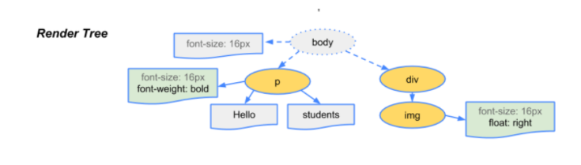
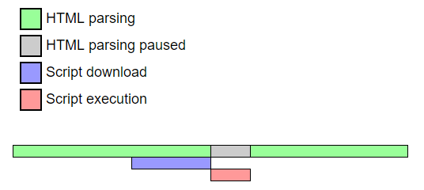

# 브라우저 렌더링

[toc]

## 브라우저 주요 기능

www.google.com을 주소 창에 입력하고 엔터를 누르면 브라우저는 입력된 url의 서버에게 사이트 정보를 받아와 이를 화면에 표시한다.


브라우저는 HTML과 CSS 명세에 따라 HTML 파일을 해석해서 표시하는데 이 명세는 웹 표준화 기구인 W3C에서 정한다. 과거에 브라우저 일부만 이 명세에 따라 구현하고 독자적인 방법으로 확장함으로써 웹 제작자가 심각한 호환성 문제를 겪었지만 최근에는 대부분의 브라우저가 표준 명세를 따른다.

### 브라우저의 사용자 인터페이스

- URL을 입력할 수 있는 주소 표시줄
- 이전 버튼과 다음 버튼
- 북마크
- 새로 고침 버튼, 현재 문서의 로드를 중단하는 정지 버튼
- 홈 버튼

브라우저의 UI는 표준 명세가 없음에도 서로의 장점을 수년간 모방하면서 현재에 이르게 되었다.

## 브라우저의 기본 구조


브라우저의 주요 구성 요소는 위와 같다.

1. UI
2. 브라우저 엔진 : 사용자 인터페이스와 렌더링 엔진 사이의 동작 제어
3. 렌더링 엔진 : 요청한 컨텐츠 표시. HTML을 요청하면 HTML과 CSS를 파싱하여 화면에 표시
4. 통신 : HTTP 요청과 같은 네트워크 호출에 사용됨. 이는 플랫폼 독립적인 인터페이스이고 각 플랫폼 하부에서 실행됨.
5. UI 백엔드 : 콤보 박스와 창 같은 기본적인 장치를 그림. 플랫폼에서 명시하지 않은 일반적인 인터페이스로서, OS UI 체계를 사용
6. JS 해석기 : 자바스크립트 코드를 해석하고 실행
7. 자료 저장소 : 자료 저장 계층. 쿠키를 저장하는 것과 같이 모든 종류의 자원을 저장할 필요가 있다.

크롬은 대부분의 브라우저와 달리 각 탭마다 별도의 렌더링 엔진 인스턴스를 유지하는 것이 주목할만 하다. 각 탭은 독립된 프로세스로 처리된다.

## 렌더링 엔진

렌더링 엔진의 역할은 요청받은 내용을 브라우저 화면에 표시하는 일이다.

렌더링 엔진은 HTML 및 XML 문서와 이미지를 표시할 수 있다. 물론 플러그인 / 브라우저 확장 기능을 이용해 PDF와 같은 다른 유형도 표시할 수 있다.

### 렌더링 엔진들

파이어폭스와 크롬, 사파리는 두 종류의 렌더링 엔진으로 제작되었다. 파이어폭스는 모질라에서 직접 만든 게코(Gecko) 엔진을 사용하고 사파리와 크롬은 웹킷(Webkit) 엔진을 사용한다.

웹킷은 최초 리눅스 플랫폼에서 동작하기 위해 제작된 오픈소스 엔진인데 애플이 맥과 윈도우즈에서 사파리 브라우저를 지원하기 위해 수정을 가했다.

### 동작 과정

렌더링 엔진은 통신으로부터 요청한 문서의 내용을 얻는 것으로 시작하는데 문서의 내용은 보통 8KB 단위로 전송된다.


#### 1. 불러오기(Loading)

HTTP 모듈 또는 파일 시스템으로 전달받은 리소스 스트림을 읽는 과정으로 로더가 이 역할을 맡는다. 로더는 단순히 읽을 뿐만 아니라 이미 데이터를 읽었는지도 확인하고, 팝업창을 열지 말지, 파일 다운로드 받을지 여부를 결정한다.

#### 2. 다운받은 HTML, CSS를 Object Model로 만든다.

> DOM이란?
>
> HTML 태그를 JS에서 이용할 수 있는 객체로 만든다. 즉, HTML 문서의 객체 기반 표현 방식이다.

- HTML -> DOM

HTML 파일은 파싱되어 DOM 트리로 변환된다.


- CSS -> CSSOM(`<link>`, `<style>`을 통하여 생성)

CSS 파일은 CSS 파서에 의해 파싱되어 CSSOM 트리로 변환된다.


> 파싱?
>
> 문서를 파싱한다는 것은 브라우저가 코드를 이해하고 사용할 수 있는 구조로 변환하는 것이다.
>
> 파싱 결과는 보통 문서 구조를 나타내는 노드 트리인데 파싱 트리 또는 문법 트리라고 부른다.

#### 3. DOM과 CSSOM을 합친다.

- Render Tree



#### 4. Layout

렌더트리가 만들어 졌으면 이것을 토대로 그려질 노드와 그의 스타일값, 그리고 치수까지 계산한다.

#### 5. Paint

이 정보들을 페인팅 단계로 전달해서 렌더트리의 각 노드를 화면상의 실제 픽셀로 변환한다.

## HTML 파서가 <script> 태그를 만나면

렌더링 중 파싱하다가 script 태그를 만나면 자바스크립트 코드를 실행하기 위해 DOM 생성 프로세스를 중지하고 자바스크립트 엔진으로 제어 권한을 넘긴다. HTML5는 스크립트를 비동기로 처리하는 속성을 추가했다.

제어권을 넘겨받은 자바스크립트 엔진은 `<script> ` 태그 내의 코드 혹은 정의된 js 파일을 로드하고 파싱하고 실행한다.

자바스크립트 실행이 완료되면 다시 HTML 파서로 권한을 넘겨서 중지했던 시점부터 다시 DOM 생성을 재개한다.

브라우저는 동기적으로 static files, javascript를 처리하는데 이는 script 태그의 위치에 따라 DOM 생성이 지연될 수 있다는 뜻이다.

보통 body 요소의 가장 아래에 script 태그를 위치하는게 좋은 방법이다. `첫째`로 HTML 요소들의 렌더링이 지연되는 일이 없기 때문에 화면 로딩이 줄고 사용자에게 더 좋은 경험을 줄 수 있기 때문이고, `둘째`로는 DOM이 완성되지 않은 상태에서 자바스크립트가 DOM을 조작한다면 에러가 발생하기 때문이다.

### 스크립트 로드 시점 - async, defer

지금까지 알아본 바에 의하면 스크립트를 문서의 마지막 `</body>` 이전에 삽입하는 방식이 오래된 브라우저에서도 동일한 효과를 얻을 수 있으며 사용자 경험 개선은 물론이고 이벤트를 이용한 프로그래밍을 처리할 필요도 줄어들게 된다.

다만 문서의 헤드 영역에 스크립트가 삽입되거나 외부의 파일에 정의되어 있다면 이벤트 연결을 문서의 로드시점에 맞게 처리해야 한다.

이렇게 헤드에 삽입해야 할 경우 모던 브라우저에서는 defer, async 속성을 사용할 수 있다.

#### 스크립트의 일반적인 실행

기본적으로 script는 인라인 코드의 경우 즉시 해석되고 실행될 수 있지만 위에서 언급했듯이 그렇지 않은 경우 해당 파일을 가져올 때까지 HTML 문서의 구문 분석(파싱)을 중단한다.


위의 그림에서 보여주듯이 스크립트를 가져와서 실행하기 위해 HTML 구문 분석이 일시 중지되므로 HTML이 화면에 출력되는 시간이 길어진다.

#### async 속성이 추가된 경우의 실행



async 속성은 브라우저에 스크립트 파일이 비동기적으로 실행될 수 있음을 나타내기 위해 사용할 수 있다. 그러므로 실행의 순서가 다운로드 완료 시점으로 결정되므로 실행 순서가 중요한 스크립트들에 async를 사용할 때는 유의해야 한다.

#### defer 속성이 추가된 경우의 실행

async(기본값 true)인 경우와 다르게 defer 속성은 HTML 구문 분석이 완전히 완료되면 스크립트 파일을 실행하도록 브라우저에 지시하게 된다.

```html
<script defer src="index.js"></script>
```

비동기적으로 로드된 스크립트와 마찬가지고, HTML 구문분석이 실행되는 동안 스크립트 파일을 다운로드 할 수 있다.


### 언제 사용해야 할까?

- `<script>` 요소는 어디에 있는가?
  - script 요소가 문서 맨 끝에 있지 않으면 스크립트의 비동기 및 지연 실행이 더 중요하다. HTML 문서는 첫 번째 여는 html 요소부터 닫히는 순서로 파싱된다. 외부 소스 js 파일이 닫는 body 태그 바로 앞에 있다면 async, defer가 그리 필요 없을 것이다.
- 스크립트 파일의 의존성 여부에 따라
  - 다른 파일들에 종속적이지 않거나 종속성 자체가 없는 스크립트 파일의 경우 `async` 속성이 특히 유용하다. 파일이 어느 지점에서 실행되는지 정확히 알 필요가 없기 때문에 비동기 로드가 가장 적합할 수 있다.
  - 그리고 의존성을 가지고 있는 스크립트 파일이거나 어떤 이유로든 문제의 파일을 다른 위치에 배치해야 하는 상황에는 defer를 사용하면 된다.