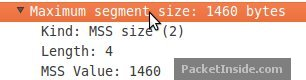
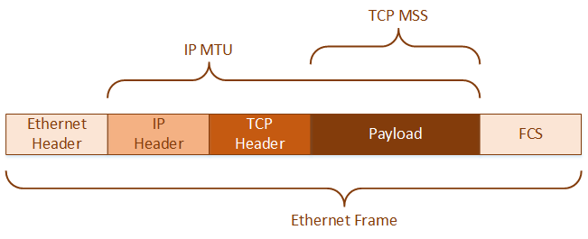
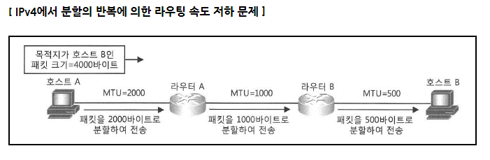
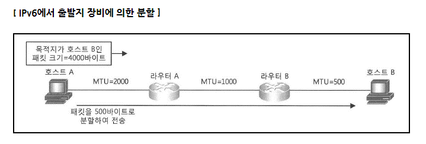
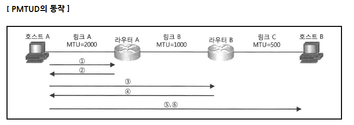
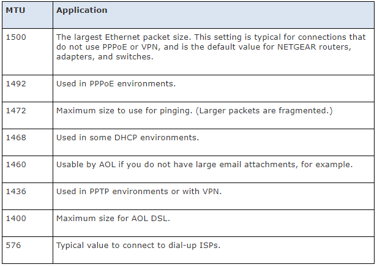
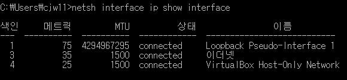
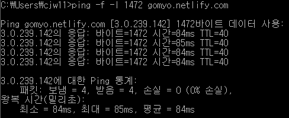
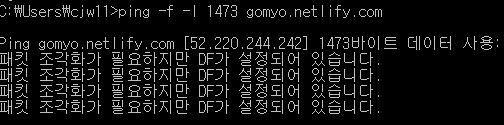
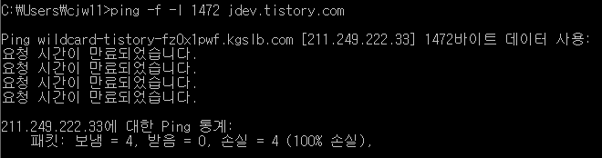

# MTU와 MSS

## MTU (Maximum Transmission Unit)

MTU란 `OSI model`의 3계층, `Network Layer`에서 처리할 수 있는 가장 큰 데이터 블록입니다. 네트워크 인터페이스에서 세그멘트 없이 보낼 수 있는 최대 데이터그램 크기 값입니다.

우리가 주로 사용하는 이더넷의 MTU 값은 일반적으로 1500 바이트이며, 옛날에 모뎀을 통해 접속하던 PPPoE 연결은 1492 바이트였다고 합니다. `Gigabit MTU `와 같은 `Jumbo Frames`은 1500바이트 이상의 페이로드를 지닌 이더넷 프레임으로, 최대 9000바이트의 페이로드까지 지원합니다.

## MSS (Maximum Segment Size)

MSS는 TCP 상에서의 전송할 수 있는 사용자 데이터의 최대 크기를 의미합니다. MSS는 기본적으로 MTU 값에 기인합니다. 예를 들어 `Ethernet`일 경우, MTU 1500에 IP 헤더크기 (최소 20byte), TCP 헤더 크기 (최소 20byte)를 제외한 1460이 MSS 값이 됩니다. RFC1323에서 정의한 타임스탬프 옵션이 확장되어 사용되면 12바이트가 늘어 1448 바이트가 됩니다.

TCP 프로토콜 연결 시 SYN 패킷을 보낼 때 MSS를 포함하게 됩니다. SYN 패킷을 들여다 보면

`0x0204 0x05B4`

값을  볼 수 있습니다. `02`는 MSS 옵션의 시작점을 뜻하고 `04`는 옵션의 크기(4바이트), `0x05B4`는 크기를 뜻합니다. `05b4` 값이 1460바이트입니다. 이렇게 MSS 크기를 전송하면 받는 측에서도 어떤 크기로 전송해야 할지 알고 준비하게 됩니다.

## Where does this limit come from?

3계층의 한계는 2계층에서 비롯됩니다. 2계층은 frame을 사용하는 `Data Link Layer`로, 각 프레임은 최대 크기에 한계가 있습니다. 이더넷 표준을 예로 들면, 최대 프레임 사이즈가 1518 bytes입니다. 이더넷의 헤더는 18 bytes 이므로, 나머지 1500를 패킷으로 사용할 수 있게 됩니다. 그러므로 이더넷 패킷 MTU는 1500 바이트가 됩니다.

## Fragmentation (IP 단편화, 분할)

호스트는 자체 네트워크의 MTU는 확실히 알고 있습니다. 그러나 더 높은 경로에 있는 링크의 MTU를 알 수 있는 방법은 없습니다.

예를 들어 컴퓨터의 `NIC Network Interface Controller`의 MTU는 1500인데, WAN에 연결하는 MTU는 1400인 경우가 있습니다. 컴퓨터의 MTU가 더 커서 전송하지 못하는 상황이 됩니다.

해결책은 단편화입니다. 패킷이 MTU보다 크면 장치(주로 라우터)가 패킷을 작은 fragments들로 나눕니다. 

각각의 fragments들은 여전히 패킷이지만, 원래의 것보다 크기만 약간 작을 뿐입니다. 패킷들은 목적지로 잘 움직입니다. 목적지의 기기는 조각들을 다시 모아서 원래의 패킷으로 재조립하고 정상적으로 처리합니다.

듣기만 하면 기가 막힌 솔루션인데 하나 단점이 있습니다. 먼저 각 조각에 중복된 IP 헤더 때문에 원래의 크기보다 더 많은 트래픽이 전송되게 됩니다. 즉, 효율성이 낮습니다.

또한 패킷을 나누는 라우터와 재조립하는 기기에 처리를 위한 오버헤드를 추가합니다. 만약 한 조각이라도 누락되거나 손상되면? 다시 전체 패킷을 보내야 합니다.

방화벽 또한 조각들과 관련해 문제를 일으킬 수 있습니다. 단편화는 가급적 피해야 하겠습니다.

## 단편화 방지

- TCP MSS
  - TCP의 MSS 크기를 낮춥니다. 즉, 페이로드를 조절합니다.
- PMTUD

## PMTUD

PMTUD란 목적지로 가는 경로상에 존재하는 링크들 중 MTU값이 가장 작은 링크의 MTU 값을 확인하는 과정을 말합니다. IPv6에서 패킷의 분할을 위해 사용합니다.

IPv6에서는 오직 출발지 장비만이 패킷을 분할할 수 있도록 규정해 놓았습니다. 그 이유는 IPv4에서 목적지로 가는 경로상의 중간 라우터들이 무분별한 분할을 수행하며 발생했던 라우팅 속도 저하와 관련된 문제 때문입니다.

IPv6에서는 위 문제를 해결하기 위해 출발지에서만 분할이 가능하도록 해 두었습니다.

### PMTUD의 동작

위와 같이 출발지 장비가 패킷을 알맞게 분해하기 위해서는 PMTUD 과정을 반드시 거쳐야 합니다.

1. 호스트 A가 먼저 패킷을 분할해서 전송
2. 라우터 A가 패킷을 받고 나서 링크 B의 MTU 크기를 확인. 받은 패킷의 크기가 링크 B의 MTU보다 크면 호스트 A에 패킷 크기 초과 메시지를 재전송
3. 반복
4. 3~6: 더 이상 패킷 크기 초과 메시지를 받지 않게 되면 가장 작은 MTU인 500바이트로 분할하여 전송한다. 이후 호스트 A는 주기적으로 다시 자신의 링크 MTU 크기에 맞게 패킷을 분할하여 전송하며, 경로상의 최소 MTU 값의 변동을 확인한다.

## Each Application's MTU

## 윈도우 MTU 확인

netsh 명령어로 인터페이스 정보를 확인할 수 있습니다.

그리고 ping 명령어로도 알아 볼 수 있습니다. -ㅣ로 데이터 크기를 지정할 수 있는데, MTU 크기 값 이상이 되면 Fragment(단편) 메시지를 볼 수 있게 되어 이걸로 MTU를 알아볼 수 있게 됩니다.

1472 크기를 지정하니 잘 보내고 응답도 잘 받습니다.

- 왜 1472바이트를 보냈나요?
  - 위에서 보았듯 인터페이스에 설정된 값은 1500바이트 입니다. 여기서 `IP 헤더`가 20바이트이고 `ICMP(ping에 사용되는 프로토콜) 헤더 ` 가 8바이트 `(TYPE, CODE, CHECKSUM, DATA)`입니다. 즉 1500 - 28 = 1472 바이트가 최대가 되는 것입니다.
  - ICMP는 IP 데이터그램을 사용합니다.

그럼 이번엔 1472보다 1 큰 1473 바이트를 보내 보겠습니다.

Fragment가 필요하다고 나타납니다. 한번에 전송할 수 있는 값이 1472 바이트가 맞네요.

### 방화벽으로 Ping의 허용, 블록 (ICMP Echo Requests)

개인적으로 배포한 블로그가 아닌, `Tistory, Naver`같은 상용 서비스에 핑을 보내 보았습니다.

오, 역시 막히네요. 쓸데없는 핑을 다 받아 주면 리소스가 낭비될 테니 당연한 일입니다.

방화벽으로 핑을 허용하고 막는 방법에 대한 글은 [링크](https://www.howtogeek.com/howto/windows-vista/allow-pings-icmp-echo-request-through-your-windows-vista-firewall/)에 있습니다.

긴 글 읽어 주셔서 감사합니다. 잘못된 내용, 오타는 댓글로 알려주세요. 적극적으로 수정하겠습니다.

## References

- https://ipwithease.com/ip-mtu-and-mss/
- https://lyb1495.tistory.com/68
- https://networkdirection.net/articles/network-theory/mtu-and-mss/
- https://garimoo.github.io/study/2018/03/26/MSS_MTU.html
- [패킷 전송 크기를 지정하는 MTU](http://www.packetinside.com/2013/02/mtumaximum-transmission-unit.html)
- https://www.cisco.com/c/ko_kr/support/docs/ip/generic-routing-encapsulation-gre/25885-pmtud-ipfrag.html
- [How to Allow Pings (ICMP Echo Requests) Through Your Windows Firewall](https://www.howtogeek.com/howto/windows-vista/allow-pings-icmp-echo-request-through-your-windows-vista-firewall/)
- [How do I change the MTU size on my Nighthawk router?](https://kb.netgear.com/24015/How-do-I-change-the-MTU-size-on-my-Nighthawk-router)
- [PMTUD](https://hoonheui.tistory.com/entry/PMTUD)
