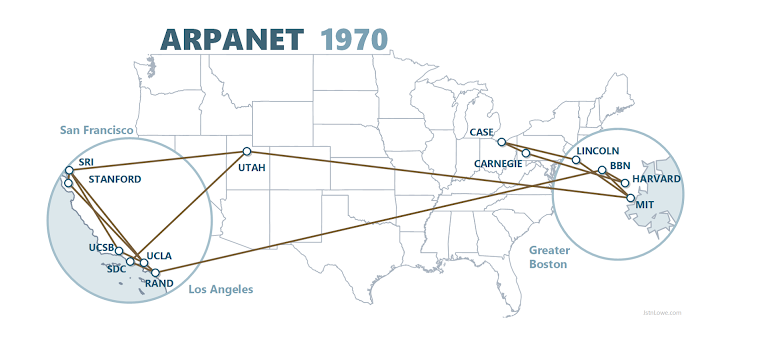
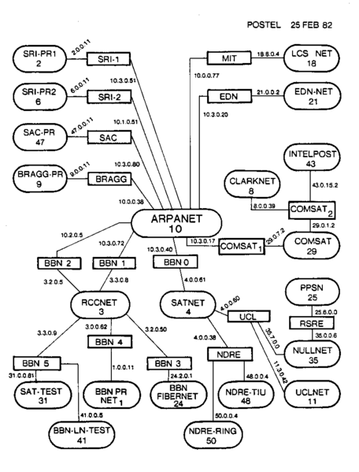
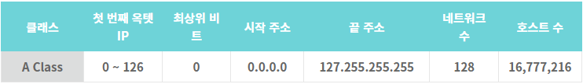
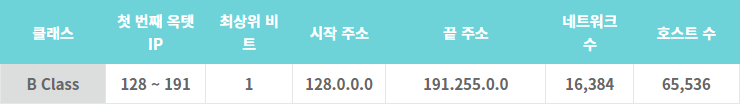
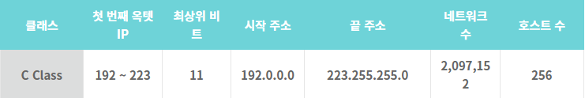
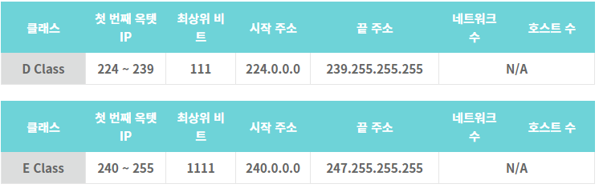

# Network Class

# 네트워크 클래스

## 클래스 도입 이전

원래 32Bit IPv4 주소는 호스트가 연결되어 있는 특정 네트워크를 가리키는 단순한 8비트의 네트워크 영역과 해당 네트워크 내에서 호스트의 주소를 가리키는 나머지 영역으로 단순하게 구분되어 있었습니다. 참고로 이 형태는 랜 도입 이전에 정해졌는데, 이는 `미 국방성의 ARPANET - 최초의 네트워크`과 같은 적은 수의 대규모 네트워크밖에 없었습니다.

`ARPANET`은 대규모 연구소나 군, 대학에서만 사용하던 패킷 스위칭 기반 통신 방식입니다.

1982년 프로토타입 인터넷 지도입니다.

## 클래스의 등장

IP 주소의 총 개수: 4,294,967,296

계산 방법: 256 _ 256 _ 256 \* 256

**클래스는 IP 주소를 네트워크 영역과 호스트 영역으로 나누는 방법이자 약속입니다.**

클래스는 크게 5가지 (A, B, C, D, E) 클래스로 나뉩니다. 네트워크 크기에 따른 구분을 위해 클래스를 나눴습니다. 하나의 네트워크에서 몇 개의 호스트 IP를 가질 수 있냐는 차이가 있습니다.

A,B,C를 알면 됩니다. D,E는 멀티캐스트용, 연구용으로 사용합니다.

### A 클래스

Network: 8bit

Host: 24bit

A Class는 하나의 네트워크가 가질 수 있는 호스트 수가 제일 많기 때문에 대규모 네트워크 집단에서 사용했습니다.

A클래스에서 `첫 번째 옥텟 - 8bit`은 네트워크 부분을 나타내고 `나머지 부분 - 24 bit`은 호스트 부분입니다. 초기의 미국 대형 기업들이 선점해갔습니다.

IP주소를 32자리 2진수로 표현했을 때, 맨 앞자리 수가 항상 0인 경우가 바로 A클래스입니다.
즉 `0xxx xxxx.xxxx xxxx. xxxx xxxx. xxxx xxxx`과 같은 형태입니다. 가질 수 있는 범위로는
`0000 0000. 0000. 0000. 0000 0000. 0000 0000 ~ 0111 1111. 1111 1111. 1111 1111. 1111 1111`이고 이를 십진수로 표현하면 `0.0.0.0 ~ 127.255.255.255`입니다.

A클래스에서 네트워크 주소는 가장 작은 네트워크인 1.0.0.0과 가장 큰 네트워크인 126.0.0.0까지로 규정되어 있으며(0xxx xxxx에서 x가 가질 수 있는 경우의 수가 네트워크 범위입니다. 여기서 127은 제외되는 것이 약속입니다), 참고로 네트워크에서 0은 호스트 부분을 뜻합니다.
따라서 호스트 주소가 가질 수 있는 개수는 2^24 -2(모든 자리 값이 0일 경우 네트워크 주소, 모두 1일경우 브로드캐스트 주소로 사용하기 때문에)개가 됩니다.

예를 들어 13.0.0.0 네트워크 주소를 할당 받았다고 치겠습니다. 여기서 13은 네트워크 부분이고, 나머지 0.0.0에 호스트 IP를 할당할 수 있습니다. 십진수 0.0.0은 2진수로 표현하면 총 24개의 2진수로 표현이 가능하고 이는 곧 2^24개의 호스트 IP를 가질 수 있음을 의미합니다.

십진수로 나타내면 `13.0.0.0 ~ 13.255.255.255`입니다. 여기서 `13.0.0.0`은 네트워크 주소, `13.255.255.255`는 브로드캐스트 주소로 사용되고 그 사잇값이 호스트 IP로 사용할 수 있는 주소가 되겠습니다.

### B 클래스

Network: 16bit

Host: 16bit

중규모의 네트워크 집단에서 사용했습니다.

B클래스는 반드시 10으로 시작합니다. 2진수로 표현하면 `10xx xxxx. xxxx xxxx. xxxx xxxx. xxxx xxxx`입니다.
B클래스의 IP 범위는 `128.0.0.0 ~ 191.255.255.255`이고 네트워크 범위는 `10xx xxxx. xxxx xxxx`에서 x들이 가질 수 있는 경우의 수인 2^14개입니다. 다르게 계산해 보면 첫 번째 옥텟의 범위는 `128 ~ 191`이고, 두 번째 옥텟은 8bit (256) 이므로 2^6 \* 2^8 = 2^14(16384)개가 되겠습니다. 호스트 주소 범위는 16bit로 2^16 - 2개입니다.

### C클래스

Network: 24bit

Host: 8bit

소규모의 네트워크 집단에서 사용했습니다.

C클래스는 반드시 110으로 시작합니다. 첫 번째 옥텟은 `192 ~ 223`으로 2^5, 나머지 2개의 옥텟은 8bit이므로 32 _ 256 _ 256 = 2,097,152개가 C클래스의 총 네트워크 수입니다.

### D, E클래스

특수한 목적(실험, 연구, 개발)으로 이미 예약되어 있는 구간입니다.

### 추가) 클래스 계산 간단하게 하는 방법

클래스 별로 첫 번째 옥텟의 범위가 정해져 있습니다. A ~ E로 이동할수록 앞에서부터 1비트씩 채워진다고 기억하면 편합니다.

A클래스는 0000 0000 ~ 0111 1111 (0 ~ 127)
B클래스는 1000 0000 ~ 1011 1111 (128 ~ 191)
C클래스는 1100 0000 ~ 1101 1111 (192 ~ 223)
D클래스는 1110 0000 ~ 1110 1111 (224 ~ 239)
E클래스는 1111 0000 ~ 1111 0111 (240 ~ 255)

각 클래스별 최상위 비트 ~ 다음 클래스 최상위 비트 까지의 숫자로 나타내면 아래와 같습니다.

A클래스는 00000000.00000000.00000000.00000000
B클래스는 10000000.00000000.00000000.00000000 (128)
C클래스는 11000000.00000000.00000000.00000000 (192)
D클래스는 11100000.00000000.00000000.00000000 (224)
E클래스는 11110000.00000000.00000000.00000000 (240)

즉 A클래스가 움직일 수 있는 범위는 이진수로 보면 00000000 ~ 10000000 입니다. 00000001 ~ 01111111 까지라고 표현할 수도 있습니다. 즉 0 ~ 127로 클래스(네트워크)의 수는 128개입니다.

## A와 B 사이의 127은 그럼 왜 사용하지 못하나요?

자기 자신을 가리키기 위한 목적으로 쓰기 위해 예약된 IP 주소이기 때문입니다.
IPv4의 경우 `127.0.0.0 ~ 127.255.255.255`이며, 보통 `127.0.0.1`을 사용합니다.

루프백용으로 넓은 대역을 할당하기에는 아까웠는지 IPv6는 ::1/128, 딱 한 개의 주소만 사용합니다. 보통 시스템에서는 `/etc/hosts` 파일 등에 localhost를 127.0.0.1로 연결시켜 두어서, 호스트 이름에 localhost를 입력하면 DNS를 타지 않고 바로 로컬로 연결됩니다.

## IP 클래스의 비효율성

대부분의 사이트는 C 클래스를 사용하기엔 너무 커서 B클래스를 할당받았지만 인터넷의 빠른 발전으로 클래스 B의 주소는 급속도로 소진되었습니다.

처음 만들었을 때에는 40억개면 충분하겠다고 생각했지만 지금 기준에는 너무나도 모자라기 때문에 한정된 자원을 체계적으로 잘 나눠 쓰기 위해 고안된 것이 서브넷 마스크(subnet mask)입니다. 1993년, 이 서브넷 마스크를 사용한 CIDR의 등장과 함께 네트워크 클래스는 폐기되었습니다.

## 연습문제 풀어보기

다음 IP를 보고 클래스, 네트워크 부분, 호스트 부분을 말하시오.

10.3.4.3

클래스: A 
네트워크 부분: 10.0.0.0 
호스트 부분:3.4.3

132.12.11.4

클래스: B 
네트워크 부분: 132.12.0.0 
호스트 부분:11.4

203.10.1.1

클래스: C 
네트워크 부분: 203.10.1.0 
호스트 부분:1

192.12.100.2

클래스: C 
네트워크 부분: 192.12.100.0 
호스트 부분:2

261.124.4.6

존재할 수 없는 IP 주소입니다.

## References

- https://kim-dragon.tistory.com/9
- https://ko.wikipedia.org/wiki/%EB%84%A4%ED%8A%B8%EC%9B%8C%ED%81%AC_%ED%81%B4%EB%9E%98%EC%8A%A4
- https://limkydev.tistory.com/168
- https://raisonde.tistory.com/entry/IP%EC%A3%BC%EC%86%8C-ABC%ED%81%B4%EB%9E%98%EC%8A%A4-%EB%B0%8F-%EC%84%9C%EB%B8%8C%EB%84%B7%EC%97%90-%EB%8C%80%ED%95%9C-%EC%9D%B4%ED%95%B4
