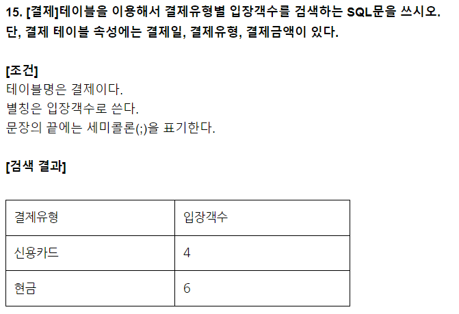
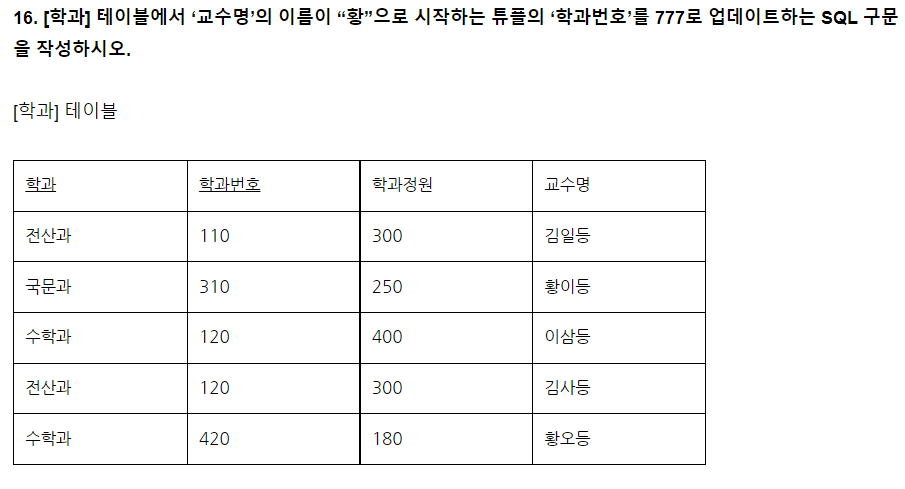
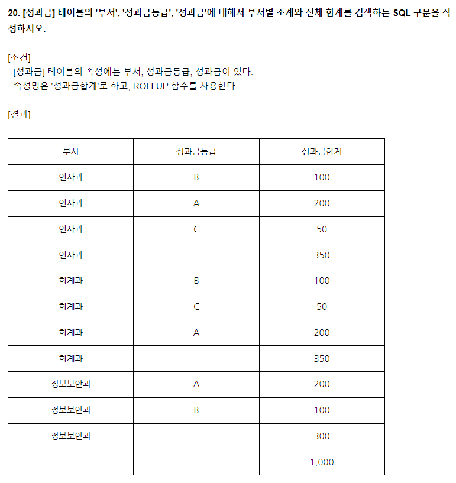

[TOC]

# 화면 설계

## 기능성 Functionality

## 신뢰성 Reliability

시스템이 일정한 시간 또는 작동되는 시간 동안 의도하는 기능을 수행함을 보증하는 품질 기준으로 부특성으로는 Maturity, Fault tolerance, Recoverability가 있다.

## 사용성 Usability

## 효율성 Efficiency

## 유지보수성 Maintainability

## 이식성 Portability

# 인터페이스 구현

### 어플리케이션 모니터링 툴(APM: Application Performance Management)

인터페이스의 동작이 잘 진행되는지 지속적으로 확인하기 위해서 사용하는 감시 도구로 데이터베이스, 웹 어플리케이션의 트랜잭션과 변숫값, 호출 함수, 로그 및 시스템 부하 등 종합적인 정보를 조회하고, 커넥션 풀 등 지속적인 모니터링이 필요한 자원을 효과적으로 관리하는 도구이다.

# SQL응용

### 권한 부여 (그온투)

- GRANT 권한 ON 테이블명 TO 사용자; 
  - WITH GRANT OPTION: 사용자가 다른 사용자에게 권한 위임이 가능해 짐

### 권한 회수 (리온프)

- REVOKE 권한 ON 테이블명 FROM 사용자;
  - CASCADE CONSTRAINTS: 연관되는 다른 사용자의 권한까지 함께 회수

SELECT 결제유형, COUNT(*) AS 입장객수 FROM 결제 GROUP BY 결제유형;

UPDATE 학과 SET 학과번호 = 777 WHERE 교수명 LIKE '황%';

SELECT 부서, 성과금등급, SUM(성과금) AS 성과급합계 FROM 성과금 GROUP BY ROLLUP(부서, 성과금등급)

# 소프트웨어 개발 보안 구축

### Buffer Overflow

메모리에 할당된 버퍼 크기를 초과하는 양의 데이터를 입력하여 프로세스의 흐름을 변경시켜 악성 코드를 실행시키는 공격 기법이다

### Stack Buffer Overflow

Local Value나 Return Address가 저장되는 스택 영역에서 할당된 버퍼 크기를 초과하는 데이터를 입력하여 공격자가 원하는 임의의 코드를 실행하는 공격이다.

### Heap Buffer Overflow

프로그램 실행시 동적으로 할당되는 힙 영역에서 할당된 버퍼 크기를 초과하는 데이터를 입력하여 공격자가 원하는 임의의 코드를 실행하는 공격이다.

### Buffer overflow 대응방안

- Stackguard

  카나리값을 체크하는 방법

- Stack Shield

  Global RET을 이용하는 방법

- ASLR

### 사회공학 (Social Engineering)

- 사회공학이란 컴퓨터 보안에 있어서, 인간 상호 작용의 깊은 신뢰를 바탕으로 사람들을 속여서 정상 보안 절차를 깨트리기 위한 비기술적 시스템 침입 수단이다. 사례로는 상대방의 자만심이나 권한을 이용하는 공격 및 도청 등이 있다.

### Grayware

- 바이러스나 명백한 악성 코드를 포함하지 않는 합법적 프로그램이면서도 사용자를 귀찮게 하거나 위험한 상황에 빠뜨릴 수 있는 프로그램이다. 즉, 평범한 소프트웨어인지 바이러스인지 구분하기 어려운 중간 영역에 존재하는 프로그램으로 스파이웨어, 애드웨어, 원격 액세스 도구 등 사용자가 원하지 않는 프로그램을 총칭하는 이름이다.

## 재해복구 시스템

### 비즈니스 연속성 계획 (BCP; Business Contiutiy Plan)

각종 재해, 장애, 재난으로부터 위기관리를 기반으로 재해복구, 업무복구 및 재개, 비상계획 등을 통해 비즈니스 연속성을 보장하는 체계이다.

### BIA (Business Impact Analysis)

장애나 재해로 인해 운영상의 주요 손실을 볼 것을 가정하여 시간 흐름에 따른 영향도 및 손실평가를 조사하는 BCP를 구축하기 위한 **비즈니스 영향 분석**이다.

### RTO (Recovery Time Objective)

업무중단 시점부터 업무가 복구되어 다시 가동될 때까지의 시간이다.

### RPO (Recovery Point Objective)

업무중단 시점부터 데이터가 복구되어 다시 정상가동될 때 데이터의 **손실허용시점**이다.

### DRS (Disaster Recovery System)

재해복구계획의 원활한 수행을 지원하기 위하여 평상시에 확보하여 두는 인적, 물적 자원 및 이들에 대한 지속적인 관리체계가 통합된 재해복구센터이다.

### DRS의 유형

- Mirror Site
  - 즉시
  - 주센터와 동일한 수준의 정보기술 자원을 원격지에 구축, Active-Active 상태로 실시간 동시 서비스 제공
- Hot Site
  - 수시간 이내
  - Active - Standby 상태로 유지
- Warm Site
  - 수일 ~ 수주
- Cold Site
  - 수주 ~ 수개월

### DoS

### DDoS (Distributed Denial of Service)

분산 서비스 거부 공격

마스터를 두고 에이전트를 만들어 수많은 요청을 보내어 자원을 소모하게 하여 서버가 터지게 하는 공격

### DRDoS (Distributed Reflection Denial of Service)

분산 반사 서비스 거부 공격

DDos와 차이점이 있다면, 실제로 공격을 가하는 에이전트는 가지고 있지만 TCP/IP의 취약점 또는 정상적인 UDP 서비스의 특성 등을 이용하여 공격을 유도하기 때문에 봇넷 (좀비 PC 군단)이 필요 없다.

공격자는 출발지 IP를 공격대상 IP로 위조하여 다수의 반사 서버로 요청 정보를 전송, 공격 대상자는 반사 서버로부터 다량의 응답을 받아서 서비스 거부(DoS)가 되는 공격이다.

# 애플리케이션 테스트 관리

### 브룩스의 법칙 Brooks' Law

"지체되는 소프트웨어 개발 프로젝트에 인력을 추가하는 것은 개발을 늦출 뿐이다" 라는 법칙으로 인력이 추가돼서 개발 생산성이 향상되지 않고, 오히려 그 인력 때문에 방해된다는 의미를 내포하고 있다.

`인력이 많아서 속이 더부룩스`

### 파레토 법칙 Pareto Principle

전체 결과의 80%가 전체 원인의 20%에서 일어나는 현상을 가리키는 말. 소프트웨어 중 20%의 모듈에서 80%의 결함이 발견된다는 '결함 집중'의 원리를 내포하고 있다.

`파레토 - 팔에토 - 80퍼`

### 인스펙션 Inspection

시스템의 문제점을 조기에 발견하기 위해서 소프트웨어 요구, 설계, 원시 코드 등의 저작자 외의 다른 전문가 또는 팀이 검사하여 문제를 식별하고 문제에 대한 올바른 해결을 찾아내는 형식적인 검토 기법

### 조건 커버리지 Condition Coverage

단위 테스트로 결정 포인트 내의 개별 조건식이 적어도 한 번은 참과 거짓의 결과가 되도록 수행하는 테스트

### 상태 전이 State Transition

개발이 완료된 이후, 시스템 테스트를 위해서 테스트 대상 or 시스템이나 객체의 상태를 구분하고, 이벤트에 의해 어느 한 상태에서 다른 상태로 전이되는 경우의 수를 수행하는 테스트

### 스파게티코드

컴퓨터 프로그램의 소스 코드가 복잡하게 얽힌 모습을 비유한 표현. 작동은 정상적으로 하지만, 사람이 코드를 읽으면서 그 코드의 작동을 파악하기는 어려운 코드이다.

## 테스트

단통시인

단통법을 시인하는 휴대폰 판매업자들

### 단위 테스트

사용자 요구사항에 대한 단위 모듈, 서브루틴 등을 테스트하는 단계

### 통합 테스트

단위 테스트를 통과한 모듈 사이의 인터페이스, 통합된 컴포넌트 간의 상호작용을 검증하는 테스트 단계

### 시스템 테스트

통합된 단위 시스템의 기능이 시스템에서 정상적으로 수행되는지를 검증하는 테스트 단계

### 인수 테스트

계약상의 요구사항이 만족되었는지 확인하기 위한 테스트 단계

### 테스트 오라클

- 참 오라클
- 샘플링 오라클
- 휴리스틱 오라클
- 일관성 검사 오라클

# 응용SW 기초기술 활용

## 네트워크

### 프로토콜

IP: 패킷 단위로 데이터를 교환하는 네트워크에서 정보를 주고받는 데 사용하는 통신 프로토콜

아논, 알물.

Arp - 논리적 주소에서 물리적, Rarp- 물리적 주소에서 논리적

ARP는 IP 네트워크 상에서 IP 주소를 MAC주소(물리 주소)로 변환하는 프로토콜이다.

RARP는 IP 호스트가 자신의 물리 네트워크 주소(MAC)는 알지만 IP 주소를 모르는 경우, 서버로부터 IP 주소를 요청하기 위해 사용하는 프로토콜이다.

메세지에 오류가 발생하면 알려준다 -> 통제센터 -> ICMP

멀티캐스트 그룹(Group) 관리 -> IGMP

ICMP는 IP 패킷을 처리할 때 발생되는 문제를 알려주는 프로토콜로 메시지 형식은 8바이트의 헤더와 가변 길이의 데이터 영역으로 분리한다.

IGMP는 호스트 컴퓨터와 인접 라우터가 멀티캐스트 그룹 멤버십을 구성하는 데 사용하는 통신 프로토콜이다.

RIP는 AS(Autonomous System; 자치 시스템; 자율 시스템) 내에서 사용하는 거리 벡터(Distance-Vector) 알고리즘에 기초하여 개발된 내부 라우팅 프로토콜이다. 15홉 제한이 있다.

OSPF는 규모가 크고 복잡한 TCP/IP 네트워크에서 자신을 기준으로 링크 상태(Link-State) 알고리즘을 적용하여 최단 경로를 찾는 라우팅 프로토콜이다.

TCP는 전송 계층에 위치하면서 근거리 통신망이나 인트라넷, 인터넷에 연결된 컴퓨터에서 실행되는 프로그램 간에 일련의 옥텟을 안정적으로, 순서대로, 에러 없이 교환할 수 있게 해주는 프로토콜이다.

UDP는 비연결성이고, 신뢰성이 없으며, 순서화되지 않은 데이터그램 서비스를 제공하는 전송(Transport, 4계층) 계층의 통신 프로토콜이다.

## IP

IPv4는 32 Bit 주소길이를 가지며 전송방식은 유니캐스트, 멀티캐스트, 브로드캐스트이다

IPv6는 128 Bit 주소길이를 가지며 전송방식은 유니캐스트, 멀티캐스트, 애니캐스트이다

IPv4를 IPv6로 변환하는 방법에는 듀얼스택, 터널링, 주소변환이 있다.

### 프로세스 5가지 상태

- Create 상태: 사용자에 의해 프로세스가 생성된 상태
- ready 상태: cpu 할당을 받을 수 있는 상태
- running 상태: 프로세스가 cpu를 할당받아 동작중인 상태
- waiting 상태: 프로세스 처리 중 io 등으로 인해 cpu를 양도하고 io 처리가 완료될 때까지 대기 리스트에서 기다리는 상태
- complete 상태: 프로세스가 cpu를 할당받아 주어진 시간 내에 완전히 수행을 종료한 상태

## 상태전이

- Dispatch: 프로세스는 준비 상태에서 실행 상태로 전이
- Timer run out: 프로세스는 실행 상태에서 준비 상태로 전이
- Block: 실행 상태에서 대기 상태로 전이
- wake-up: 대기 상태에서 준비 상태로 전이

## Linux/Unix Command

`uname -a`: 시스템의 모든 정보를 확인
`uname -r`: 운영체제의 배포버전 출력
`pwd`: 현재 작업 중인 디렉토리의 절대 경로 출력
`kill` : 특정 PID 프로세스 종료
`grep` : 입력으로 전달된 파일의 내용에서 특정 문자열을 찾고자할 때 사용하는 명령어

## uname Option

a: 시스템의 모든 정보 출력

i: 시스템의 하드웨어 플랫폼 정보 출력 (--hardware-platform)

m: 시스템의 하드웨어 타입 정보 출력 (--machine)

n: 네트워크 노드 호스트 이름에 대한 정보 출력 (--nodename)

o: 운영체제 정보를 출력 (--operating-system)

p: 프로세스 정보를 출력 (--processor)

r: 운영체제의 배포 버전을 출력

s: 커널 이름을 출력 (--kernal-name)

v: 커널 버전 정보를 출력 (--kernal-version)

